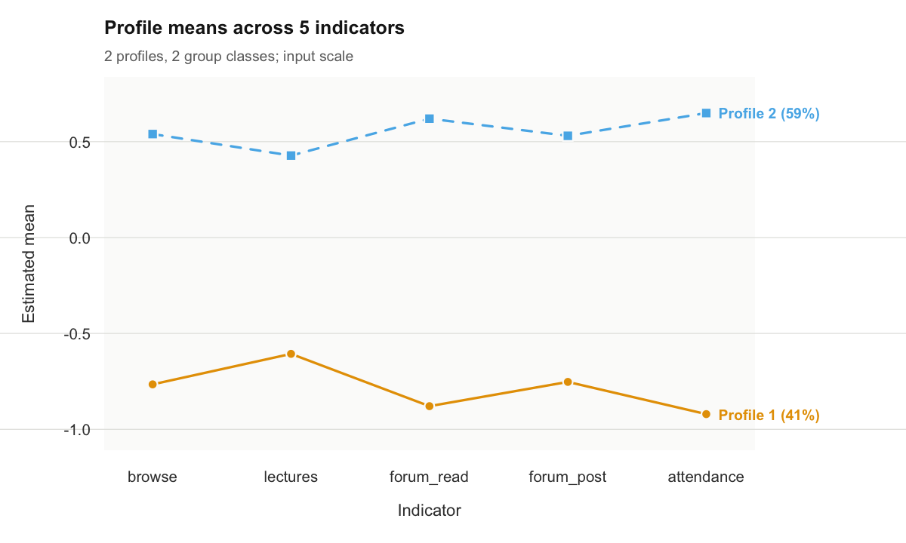
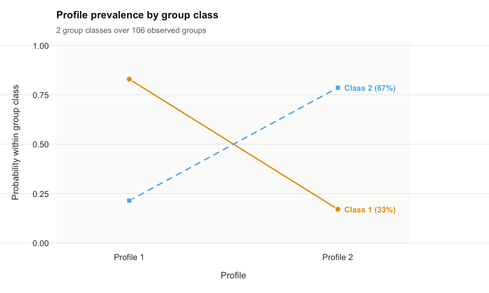
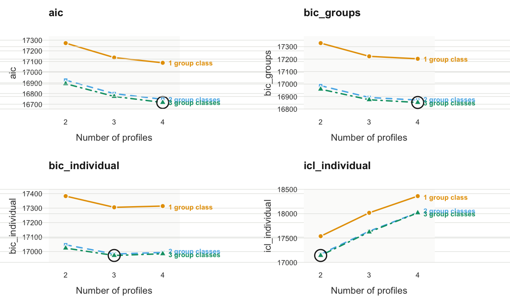
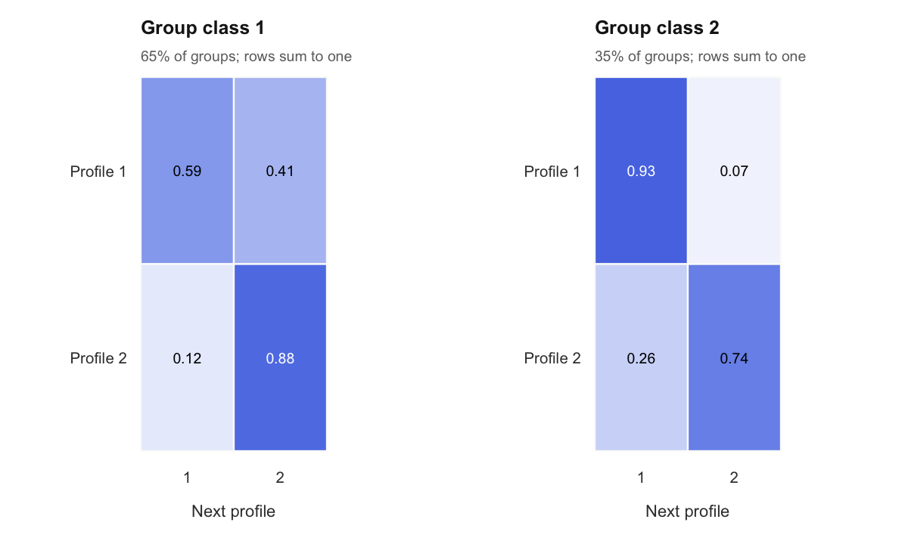
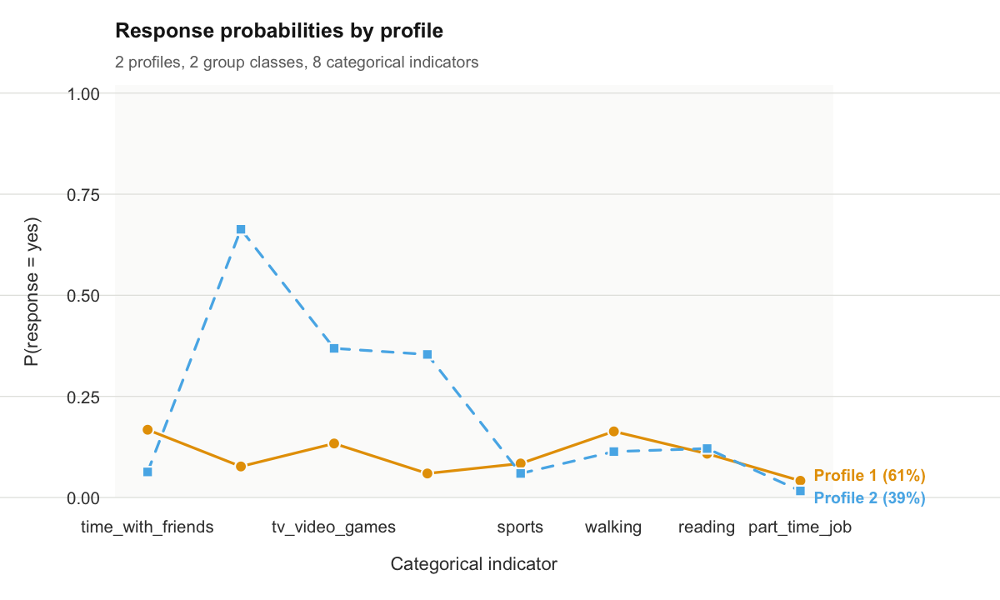

<!-- README.md is generated from README.Rmd. Please edit that file and rebuild
     from the repository root with:
     Rscript -e 'pkgload::load_all(".", quiet = TRUE); knitr::knit("README.Rmd", "README.md")' -->


# multilpa 

Multilevel latent profile analysis (MLPA) is a model-based method for identifying unobserved subgroups in continuous multivariate data when observations are nested within higher-level units. It is applicable to designs such as repeated measurements within individuals, students within schools, and patients within clinics. In these settings, observations from the same unit may be dependent, and the distribution of latent profiles may vary systematically between units.

Ordinary latent profile analysis represents heterogeneity among observations through a finite mixture of distributions. Each component, or latent profile, is characterized by a set of indicator means and variances. The two-level formulation implemented in `multilpa` extends this representation by introducing latent classes at the group level. Observation-level profiles describe patterns in the indicators; group-level classes describe differences in the probabilities of those profiles. This allows the analysis to distinguish variation among observations from variation in profile composition across groups.

For example, in repeated measurements of student engagement, an observation-level profile may represent a pattern of relatively high activity across several indicators. A student-level class may then represent students whose observations frequently belong to that profile. Membership in this student class does not require every observation from a student to have the same engagement profile. The distinction is useful whenever within-person variation is itself part of the research question.

The `multilpa` package provides estimation, result extraction, visualization, and diagnostic procedures for this two-level mixture. Its extensions include categorical and mixed indicators, membership covariates, missing-indicator likelihoods, staged estimation, and latent transition analysis. This tutorial develops the continuous two-level model first, then examines these extensions in relation to their analytical purposes.

## Model formulation and scope

### Observation-level profiles and group-level classes

Let $\mathbf{y}_{ij}$ denote the vector of $D$ continuous indicators for observation $i$ in group $j$. Let $C_{ij}$ denote its latent profile, with $K$ possible values, and let $G_j$ denote the latent class of the group, with $H$ possible values. In the Gaussian measurement model,

$$
\mathbf{Y}_{ij} \mid C_{ij}=k \sim
\mathcal{N}_D(\boldsymbol{\mu}_k,\boldsymbol{\Sigma}_k).
$$

The mean vector $\boldsymbol{\mu}_k$ describes the location of profile $k$ across indicators, and $\boldsymbol{\Sigma}_k$ describes variation within that profile. At the group level, the parameters

$$
\pi_{hk}=P(C_{ij}=k\mid G_j=h),
\qquad \eta_h=P(G_j=h)
$$

describe the conditional profile probabilities and group-class proportions, respectively. The profile probabilities sum to one within each group class, and the group-class proportions sum to one across classes.

Under the model's conditional independence assumptions, the contribution of group $j$ to the likelihood is

$$
L_j = \sum_{h=1}^{H}\eta_h
\prod_{i=1}^{n_j}
\left\{\sum_{k=1}^{K}\pi_{hk}
\phi_D(\mathbf{y}_{ij};\boldsymbol{\mu}_k,\boldsymbol{\Sigma}_k)\right\}.
$$

This expression makes the two levels explicit. The inner mixture combines the observation-level profiles. The outer mixture combines the group classes, each with its own distribution over those profiles. Observations in a group share the same latent group class; integrating over that class induces dependence among them.

### Measurement assumptions

The measurement parameters are shared across group classes. Thus, profile $k$ has the same indicator means and covariance matrix in every class. This measurement-invariance assumption gives the conditional profile probabilities a common interpretation: differences between group classes concern the prevalence of the same profiles.

By default, the covariance matrices are diagonal. For Gaussian indicators, this implies that indicators are independent conditional on profile membership, an assumption commonly called local independence. A full covariance specification permits residual associations within profiles. The choice affects both the interpretation of the profiles and the number of profiles that may be needed to describe the data.

The basic MLPA model also assumes independence of observations within a group conditional on its latent group class, after marginalizing over the observation profiles. It describes a group's composition without estimating a direct dependence on the preceding observation. A latent transition model introduces this temporal dependence explicitly.

### When the model is appropriate

MLPA is relevant when the research objective concerns both multivariate profiles at the lower level and systematic differences in profile composition at the higher level. The choice of levels follows the study design: an observation might be a measurement occasion, a student, or a clinical encounter, while its group might be a person, a school, or a clinic.

The model implemented here represents higher-level heterogeneity through discrete latent classes. It therefore entails a substantive assumption about how group differences can be represented. The presence of clustering alone does not establish that a particular number of latent group classes is warranted. That specification must be evaluated together with the measurement model and the observed data.

## Installation and data preparation

The development version can be installed from the package repository. This installation command is provided for reference and is not evaluated when the tutorial is rendered.


``` r
install.packages("remotes")
remotes::install_github("mohsaqr/multilpa")
```

### Example data and variables

The tutorial uses `course_engagement`, a simulated dataset containing 1,422 course enrolments from 106 students across 32 courses. Each row represents one student's enrolment in one course, with up to fifteen enrolments per student. Enrolments form Level 1 and students form Level 2.


``` r
library(multilpa)
vars <- c("browse", "lectures", "forum_read", "forum_post", "attendance")
```

``` r
head(course_engagement)
#>   student course sequence browse lectures forum_read forum_post attendance previous_grade
#> 1       1     23        1   0.73    -0.08       0.30       0.67       0.72           0.54
#> 2       1     19        2   0.68     0.53      -0.02      -0.55       0.70          -0.71
#> 3       1      4        3  -1.51    -0.51      -0.91      -0.80      -0.97           1.98
#> 4       1     18        4   0.64    -1.02      -1.62      -1.20      -1.26          -1.42
#> 5       1     16        5  -0.94    -0.37      -0.71      -0.28      -1.52          -0.67
#> 6       1     29        6  -0.36    -0.46      -0.77      -0.43      -1.34          -0.40
#>   engagement student_type
#> 1    engaged     wavering
#> 2    engaged     wavering
#> 3 disengaged     wavering
#> 4 disengaged     wavering
#> 5 disengaged     wavering
#> 6 disengaged     wavering
```

Five indicators describe browsing, lecture activity, forum reading, forum posting, and attendance. The indicators were simulated as continuous values, with parameters intended to represent activity on a log-count scale, and then standardized within course and rounded to two decimal places. The simulation does not generate raw event counts or apply a `log1p()` transformation. An indicator value of zero therefore corresponds to the course average; a value of one corresponds to one standard deviation above that average. The estimated profiles describe engagement relative to other enrolments in the same course.

The `student` variable identifies the groups used in the likelihood. The `sequence` variable records the ordering of enrolments within each student and will be used for the longitudinal extension. The variable `previous_grade` records achievement before the enrolment and will be introduced as an external variable in subsequent analyses.

The generating labels, `engagement` and `student_type`, are also available because the dataset is simulated. They are excluded from estimation and used only to examine recovery of the known structure. In empirical applications, the latent classifications generally have no directly observed equivalent.

### Data structure and initial inspection

Data should be arranged with one row per Level-1 observation, indicator variables in columns, and an identifier linking observations to their Level-2 units. Indicator selection determines the dimensions along which profiles can differ. The choice should follow the construct being studied, with inspection of distributions, transformations, missingness, and potentially redundant indicators before estimation.

The `descriptives()` function provides indicator summaries and intraclass correlations when a group identifier is supplied.


``` r
descriptives(course_engagement, vars = vars, id = "student")
#>     variable    n n_missing      mean    sd   min  max n_distinct n_groups    icc
#> 1     browse 1422         0 -2.81e-05 0.989 -3.14 2.49        398      106 0.1923
#> 2   lectures 1422         0 -4.22e-05 0.989 -2.91 3.22        399      106 0.0878
#> 3 forum_read 1422         0  7.03e-05 0.989 -2.73 2.81        400      106 0.2240
#> 4 forum_post 1422         0 -2.11e-05 0.989 -2.61 3.10        397      106 0.1503
#> 5 attendance 1422         0  7.74e-05 0.989 -2.45 2.41        401      106 0.2215
```

The ICC summarizes the proportion of variation in an indicator attributable to between-group differences. The nonzero ICCs in this example indicate variation between students in their indicator levels. This is useful descriptive evidence of clustering, although it does not identify the number or nature of latent student classes. Limited between-group variation in individual indicator means also does not exclude differences in more complex multivariate patterns.

Course enrolments additionally share course membership. The model below uses student as its grouping variable and does not estimate a crossed student-by-course structure. Standardization within course defines the indicator scale but does not in general account for every source of course-related dependence.

## Specifying and estimating a two-level model

The initial specification contains two observation-level profiles and two group-level classes. The purpose of this fit is to establish an interpretable reference model before comparing alternative specifications.


``` r
fit <- multilpa(
  data = course_engagement,
  vars = vars,
  id = "student",
  n_profiles = 2,
  n_group_classes = 2,
  variance_model = "varying",
  n_starts = 10,
  seed = 1
)
get_results(fit)
#>    profile  indicator   mean variance standard_deviation
#> 1        1     browse -0.766    0.528              0.727
#> 2        1   lectures -0.606    0.538              0.734
#> 3        1 forum_read -0.879    0.363              0.603
#> 4        1 forum_post -0.753    0.421              0.649
#> 5        1 attendance -0.921    0.374              0.611
#> 6        2     browse  0.540    0.590              0.768
#> 7        2   lectures  0.427    0.845              0.919
#> 8        2 forum_read  0.620    0.481              0.694
#> 9        2 forum_post  0.531    0.689              0.830
#> 10       2 attendance  0.649    0.384              0.620
```

The arguments `n_profiles` and `n_group_classes` specify $K$ and $H$, respectively. Setting `n_group_classes = 1` reduces the model to a single-level profile analysis: there is then one common distribution over profiles, and no latent group-class heterogeneity.

With `variance_model = "varying"`, each profile has its own indicator variances. With `variance_model = "equal"`, the variance of a given indicator is constrained to be equal across profiles, while different indicators can retain different variances. In the default diagonal model, both specifications set within-profile covariances to zero.

Estimation uses the expectation-maximization algorithm. Its expectation step evaluates latent membership probabilities under the current parameters, and its maximization step updates parameters using those probabilities. Iteration continues until the convergence criterion is met or the iteration limit is reached.

Because mixture likelihoods can have local maxima, estimation is repeated from multiple starting values. Here, `n_starts = 10` specifies ten starts and `seed = 1` makes the starting procedure reproducible for the same input and row order. Convergence and replication across starts are inspected below; a converged fit alone does not establish that the best attainable likelihood has been found.

## Inspecting and interpreting the estimated structure

### Measurement profiles

`get_results(fit)` returns the measurement parameters, with one row for each profile and indicator. Means describe the location of a profile, while variances describe dispersion within it. The default plot displays the profile means across indicators.


``` r
plot(fit)
```

<div class="figure" style="text-align: center">

<p class="caption">plot of chunk profile-plot</p>
</div>

In this solution, profile 2 has the higher engagement pattern and profile 1 the lower engagement pattern. Because the indicators were standardized within course, the separation concerns relative activity within courses. The interpretation should be based on the configuration of means across all indicators, together with within-profile dispersion, rather than on a single indicator or the numerical profile label.

Profile numbers are arbitrary identifiers. A different initialization or model specification can reverse their numbering without changing the substantive solution. Comparisons between fits therefore require matching the measurement patterns before comparing class-specific parameters.

### Conditional profile probabilities

The higher-level structure is inspected through the probabilities of the observation profiles within each group class.


``` r
get_results(fit, "profile_probabilities")
#>   group_class profile probability group_class_probability
#> 1           1       1       0.829                   0.325
#> 2           1       2       0.171                   0.325
#> 3           2       1       0.214                   0.675
#> 4           2       2       0.786                   0.675
plot(fit, what = "probabilities")
```

<div class="figure" style="text-align: center">

<p class="caption">plot of chunk probabilities</p>
</div>

The `probability` column contains the estimates of $\pi_{hk}$. Student class 1 assigns approximately 83% probability to the less engaged profile, whereas student class 2 assigns approximately 79% probability to the more engaged profile. These classes describe different engagement compositions among students while retaining a shared definition of engagement at the enrolment level.

The `group_class_probability` column contains the estimates of $\eta_h$, or the proportion of students in each class. These are group-level proportions. They should be distinguished from enrolment-level profile proportions, particularly when students contribute different numbers of observations.

### Posterior membership and classification

The fitted model yields posterior probabilities at both levels. Observation-level probabilities quantify membership in each profile using the fitted multilevel structure; group-level probabilities quantify membership in each student class using the observations belonging to that student. Observation-level probabilities incorporate uncertainty in the group's class.


``` r
head(get_results(fit, "posteriors", format = "wide"))
#>   row group profile posterior_profile_1 posterior_profile_2
#> 1   1     1       2            0.000444            1.00e+00
#> 2   2     1       2            0.014858            9.85e-01
#> 3   3     1       1            0.999998            2.42e-06
#> 4   4     1       1            0.999996            3.86e-06
#> 5   5     1       1            0.999994            5.75e-06
#> 6   6     1       1            0.999977            2.28e-05
head(get_results(fit, "assignments", data = course_engagement))
#>   student course sequence browse lectures forum_read forum_post attendance previous_grade
#> 1       1     23        1   0.73    -0.08       0.30       0.67       0.72           0.54
#> 2       1     19        2   0.68     0.53      -0.02      -0.55       0.70          -0.71
#> 3       1      4        3  -1.51    -0.51      -0.91      -0.80      -0.97           1.98
#> 4       1     18        4   0.64    -1.02      -1.62      -1.20      -1.26          -1.42
#> 5       1     16        5  -0.94    -0.37      -0.71      -0.28      -1.52          -0.67
#> 6       1     29        6  -0.36    -0.46      -0.77      -0.43      -1.34          -0.40
#>   engagement student_type profile group_class uncertainty posterior_profile_1
#> 1    engaged     wavering       2           1    4.44e-04            0.000444
#> 2    engaged     wavering       2           1    1.49e-02            0.014858
#> 3 disengaged     wavering       1           1    2.42e-06            0.999998
#> 4 disengaged     wavering       1           1    3.86e-06            0.999996
#> 5 disengaged     wavering       1           1    5.75e-06            0.999994
#> 6 disengaged     wavering       1           1    2.28e-05            0.999977
#>   posterior_profile_2
#> 1            1.00e+00
#> 2            9.85e-01
#> 3            2.42e-06
#> 4            3.86e-06
#> 5            5.75e-06
#> 6            2.28e-05
get_results(fit, "entropy")
#>         level n_classes n_units entropy_sum relative_entropy
#> 1 individuals         2    1422       60.94            0.938
#> 2      groups         2     106        4.44            0.940
```

The assignments table records the most probable profile and group class. Such modal assignments simplify presentation but discard part of the posterior information. An observation with profile probabilities 0.51 and 0.49 has substantially more classification uncertainty than one with probabilities 0.99 and 0.01, although both receive a single assigned profile.

Relative entropy summarizes separation at each level. Values approaching one indicate more concentrated posterior membership probabilities. In this example, relative entropy is approximately 0.94 at both levels. Entropy characterizes classification precision under the fitted model; it does not establish the adequacy of the measurement assumptions or select the correct class count.


``` r
get_results(fit, "counts")
#>         level class effective_count effective_proportion
#> 1 individuals     1           587.9                0.413
#> 2 individuals     2           834.1                0.587
#> 3      groups     1            34.5                0.325
#> 4      groups     2            71.5                0.675
```

Effective class counts are obtained by summing posterior membership probabilities. They need not be integers and differ conceptually from counts based on modal assignments. Small effective classes may provide limited information for estimating means, variances, and membership parameters, and should be evaluated for stability and substantive plausibility.

### Recovery of the generating structure

For simulated data, classification can additionally be compared with the known generating labels.


``` r
get_results(fit, "assignments", data = course_engagement,
            truth = c("engagement", "student_type"))
#>    assignment class        truth      value   n proportion
#> 1     profile     1   engagement disengaged 569     0.9726
#> 2     profile     2   engagement disengaged  16     0.0274
#> 3     profile     1   engagement    engaged  17     0.0203
#> 4     profile     2   engagement    engaged 820     0.9797
#> 5 group_class     1 student_type  committed   1     0.0161
#> 6 group_class     2 student_type  committed  61     0.9839
#> 7 group_class     1 student_type   wavering  34     0.7727
#> 8 group_class     2 student_type   wavering  10     0.2273
```

The enrolment-level comparison uses `engagement`, and the student-level comparison uses `student_type`, counting each student once. Agreement is interpreted after allowing for arbitrary label permutations. This analysis describes recovery under the specific simulation conditions; in empirical data, validation instead relies on the fitted structure, diagnostics, substantive evidence, and, where available, replication.

## Evaluating the model

### Convergence and stability across initializations

The starts table records the optimization results for the fitted model.


``` r
get_results(fit, "starts")
#>    start log_likelihood converged iterations error boundary
#> 1      1          -8440      TRUE         10  <NA>    FALSE
#> 2      2          -8440      TRUE         10  <NA>    FALSE
#> 3      3          -8440      TRUE         10  <NA>    FALSE
#> 4      4          -8440      TRUE         13  <NA>    FALSE
#> 5      5          -8440      TRUE         10  <NA>    FALSE
#> 6      6          -8440      TRUE         12  <NA>    FALSE
#> 7      7          -8440      TRUE         10  <NA>    FALSE
#> 8      8          -8440      TRUE          8  <NA>    FALSE
#> 9      9          -8440      TRUE         10  <NA>    FALSE
#> 10    10          -8440      TRUE          9  <NA>    FALSE
```

The relevant evidence includes whether the selected solution converged, how often the best log likelihood was attained, and whether competing solutions have materially different likelihoods or classifications. Repeated attainment of the best value supports numerical stability. A solution attained only once may require additional starts or a closer examination of the fitted parameters.

The `sensitivity()` function extends this inspection by refitting under different seeds and comparing the resulting solutions.


``` r
sensitivity(fit, seeds = 1:3)
#>   seed log_likelihood converged iterations optimum best agreement
#> 1    1          -8440      TRUE          8       1 TRUE         1
#> 2    2          -8440      TRUE         14       1 TRUE         1
#> 3    3          -8440      TRUE         13       1 TRUE         1
```

Replication across seeds strengthens confidence in the numerical solution without proving a global maximum. The number of starts should be increased when the candidate model is difficult to estimate or the best likelihood is poorly replicated.

### Local dependence and covariance specification

Under a diagonal measurement model, the latent profiles account for all modeled associations between indicators. Residual associations assess the dependence that remains after fitting the profiles.


``` r
get_results(fit, "residuals", by = "overall")
#>    profile indicator_1 indicator_2     kind observed expected residual effective_n statistic
#> 1  overall  forum_read  attendance gaussian  0.21588        0  0.21588        1422    8.2620
#> 2  overall    lectures  attendance gaussian  0.19234        0  0.19234        1422    7.3367
#> 3  overall      browse  attendance gaussian  0.18077        0  0.18077        1422    6.8851
#> 4  overall  forum_post  attendance gaussian  0.17239        0  0.17239        1422    6.5592
#> 5  overall      browse  forum_read gaussian  0.06266        0  0.06266        1422    2.3634
#> 6  overall      browse  forum_post gaussian -0.02511        0 -0.02511        1422   -0.9462
#> 7  overall      browse    lectures gaussian -0.02126        0 -0.02126        1422   -0.8010
#> 8  overall  forum_read  forum_post gaussian  0.01986        0  0.01986        1422    0.7482
#> 9  overall    lectures  forum_post gaussian  0.01709        0  0.01709        1422    0.6438
#> 10 overall    lectures  forum_read gaussian  0.00192        0  0.00192        1422    0.0724
#>    df  p_value p_adjusted
#> 1  NA 1.43e-16   1.43e-16
#> 2  NA 2.19e-13   2.19e-13
#> 3  NA 5.78e-12   5.78e-12
#> 4  NA 5.41e-11   5.41e-11
#> 5  NA 1.81e-02   1.81e-02
#> 6  NA 3.44e-01   3.44e-01
#> 7  NA 4.23e-01   4.23e-01
#> 8  NA 4.54e-01   4.54e-01
#> 9  NA 5.20e-01   5.20e-01
#> 10 NA 9.42e-01   9.42e-01
```

In this simulation, attendance was constructed from activity measures, making residual association substantively plausible. Residuals should be interpreted by their magnitude and pattern as well as their inferential summaries. Persistent association involving particular indicators can motivate reconsideration of the measurement specification.

A full covariance model estimates within-profile associations explicitly while retaining the same number of profiles and group classes.


``` r
dependent <- multilpa(
  course_engagement, vars, "student",
  n_profiles = 2, n_group_classes = 2,
  variance_model = "varying", covariance_model = "full",
  n_starts = 10, seed = 1
)
rbind(
  diagonal = get_results(fit, "information_criteria"),
  full = get_results(dependent, "information_criteria")
)
#>          log_likelihood n_parameters   aic   kic bic_groups bic_individual sabic_groups
#> diagonal          -8440           23 16926 16952      16987          17047        16914
#> full              -8313           43 16712 16758      16827          16938        16691
#>          sabic_individual caic_groups caic_individual awe_groups awe_individual icl_groups
#> diagonal            16974       17010           17070      17172          17404      16996
#> full                16802       16870           16981      17165          17564      16835
#>          icl_individual clc_groups clc_individual
#> diagonal          17168      16889          17002
#> full              17123      16635          16811
get_results(dependent, "residuals", by = "overall")
#>    profile indicator_1 indicator_2     kind observed expected  residual effective_n statistic
#> 1  overall  forum_read  forum_post gaussian  0.02438  0.02439 -1.32e-05        1422 -4.97e-04
#> 2  overall    lectures  forum_post gaussian  0.02010  0.02011 -1.20e-05        1422 -4.50e-04
#> 3  overall  forum_post  attendance gaussian  0.18793  0.18794 -1.09e-05        1422 -4.25e-04
#> 4  overall    lectures  forum_read gaussian  0.00887  0.00888 -8.96e-06        1422 -3.38e-04
#> 5  overall    lectures  attendance gaussian  0.20504  0.20505 -7.49e-06        1422 -2.94e-04
#> 6  overall      browse  forum_post gaussian -0.01866 -0.01865 -6.84e-06        1422 -2.58e-04
#> 7  overall  forum_read  attendance gaussian  0.24180  0.24180 -4.19e-06        1422 -1.68e-04
#> 8  overall      browse    lectures gaussian -0.01380 -0.01379 -4.10e-06        1422 -1.55e-04
#> 9  overall      browse  forum_read gaussian  0.07442  0.07441  1.16e-06        1422  4.40e-05
#> 10 overall      browse  attendance gaussian  0.20382  0.20382  6.60e-07        1422  2.59e-05
#>    df p_value p_adjusted
#> 1  NA       1          1
#> 2  NA       1          1
#> 3  NA       1          1
#> 4  NA       1          1
#> 5  NA       1          1
#> 6  NA       1          1
#> 7  NA       1          1
#> 8  NA       1          1
#> 9  NA       1          1
#> 10 NA       1          1
```

The information criteria compare improvement in likelihood with the additional parameters required by the full covariance model. The residual table indicates how much of the observed association the revised specification accounts for. Near-zero residuals are expected when those associations are directly fitted and do not independently establish overall model adequacy.

Covariance specification and class enumeration are related. Additional diagonal profiles can approximate associations that a more flexible covariance structure represents within profiles. Consequently, the number of profiles should be interpreted in the context of the measurement assumptions under which it was selected.

### Selecting the numbers of profiles and group classes

Class enumeration evaluates candidate values of both $K$ and $H$. The following analysis fits two to four observation profiles and one to three group classes under the diagonal specification.


``` r
candidates <- enumerate_classes(
  course_engagement, vars, "student",
  n_profiles = 2:4, n_group_classes = 1:3,
  n_starts = 10, seed = 1
)
candidates
#> Class enumeration: 9 candidate models
#>  n_profiles n_group_classes model log_likelihood n_parameters   aic bic_groups bic_individual
#>           2               1   VVI          -8615           21 17272      17328          17383
#>           3               1   VVI          -8537           32 17137      17222          17306
#>           4               1   VVI          -8501           43 17088      17203          17314
#>           2               2   VVI          -8440           23 16926      16987          17047
#>           3               2   VVI          -8365           35 16799      16892          16983
#>           4               2   VVI          -8326           47 16746      16872          16994
#>           2               3   VVI          -8421           25 16892      16959          17024
#>           3               3   VVI          -8348           38 16773      16874          16973
#>           4               3   VVI          -8307           51 16716      16852          16985
#>  icl_individual profile_entropy group_entropy converged boundary n_best_replicated
#>           17537           0.922            NA      TRUE    FALSE                10
#>           18018           0.772            NA      TRUE    FALSE                10
#>           18361           0.735            NA      TRUE    FALSE                 8
#>           17168           0.938         0.940      TRUE    FALSE                10
#>           17640           0.790         0.943      TRUE    FALSE                10
#>           18023           0.739         0.937      TRUE    FALSE                10
#>           17142           0.940         0.816      TRUE    FALSE                10
#>           17623           0.792         0.797      TRUE    FALSE                10
#>           18017           0.738         0.823      TRUE    FALSE                10
#> No candidate is selected automatically. Compare one convention consistently.
get_results(candidates, "criteria")
#>    criterion  convention n_profiles n_group_classes model value
#> 1        aic        <NA>          4               3   VVI 16716
#> 2        kic        <NA>          4               3   VVI 16770
#> 3        bic      groups          4               3   VVI 16852
#> 4        bic individuals          3               3   VVI 16973
#> 5      sabic      groups          4               3   VVI 16691
#> 6      sabic individuals          4               3   VVI 16823
#> 7       caic      groups          4               3   VVI 16903
#> 8       caic individuals          3               3   VVI 17011
#> 9        awe      groups          3               2   VVI 17169
#> 10       awe individuals          2               3   VVI 17398
#> 11       icl      groups          4               2   VVI 16881
#> 12       icl individuals          2               3   VVI 17142
#> 13       clc      groups          4               3   VVI 16656
#> 14       clc individuals          2               3   VVI 16960
plot(candidates)
```

<div class="figure" style="text-align: center">

<p class="caption">plot of chunk enumeration</p>
</div>

Information criteria balance the fitted likelihood against model complexity; smaller values are preferred within a given criterion. For example, BIC takes the form $-2\ell + p\log(n)$, where $\ell$ is the maximized log likelihood and $p$ is the number of estimated parameters. In a multilevel mixture, the choice of sample size in the penalty requires attention. The package reports criteria under both group-count and observation-count conventions. For the single-level LPA specification, the individual-count BIC is the relevant version.

Candidate models should be assessed jointly for information criteria, convergence, replication of the likelihood, effective class sizes, residual dependence, and substantive interpretability. A criterion that continues to improve at the boundary of the grid indicates that the examined grid has not located an interior optimum for that criterion. It does not by itself justify adopting the largest fitted model.

An individual candidate can be retrieved for the same inspection applied to the initial fit.


``` r
candidate <- candidate_fit(candidates, n_profiles = 2, n_group_classes = 2)
get_results(candidate)
#>    profile  indicator   mean variance standard_deviation
#> 1        1     browse -0.766    0.528              0.727
#> 2        1   lectures -0.606    0.538              0.734
#> 3        1 forum_read -0.879    0.363              0.603
#> 4        1 forum_post -0.753    0.421              0.649
#> 5        1 attendance -0.921    0.374              0.611
#> 6        2     browse  0.540    0.590              0.768
#> 7        2   lectures  0.427    0.845              0.919
#> 8        2 forum_read  0.620    0.481              0.694
#> 9        2 forum_post  0.531    0.689              0.830
#> 10       2 attendance  0.649    0.384              0.620
```

For supported nested models differing by one class at one level, `bootstrap_lrt()` provides a parametric bootstrap likelihood-ratio comparison. It simulates data from the smaller model and estimates both models for each replicate, constructing an empirical reference distribution for the likelihood-ratio statistic. The following optional example is not evaluated during rendering because it requires hundreds of additional fits.


``` r
smaller <- multilpa(course_engagement, vars, "student",
                    n_profiles = 2, n_group_classes = 2, seed = 1)
larger <- multilpa(course_engagement, vars, "student",
                   n_profiles = 3, n_group_classes = 2, seed = 1)
bootstrap_lrt(smaller, larger, iter = 199, seed = 42)
```

Both models must be fitted to complete data. The package withholds the bootstrap p-value if any replicate fails to converge, making optimization of the replicate fits part of the validity of the comparison.

## Parameter uncertainty

Parameter uncertainty is assessed after specifying the model. `parameter_inference()` provides standard errors and Wald intervals using the observed information matrix by default.


``` r
inference <- parameter_inference(fit)
head(inference)
#>         level   outcome       term parameter estimate standard_error statistic   p_value
#> 1 measurement profile_1     browse      mean   -0.766         0.0312     -24.5 7.50e-133
#> 2 measurement profile_1   lectures      mean   -0.606         0.0309     -19.6  1.33e-85
#> 3 measurement profile_1 forum_read      mean   -0.879         0.0262     -33.5 1.48e-246
#> 4 measurement profile_1 forum_post      mean   -0.753         0.0277     -27.2 8.47e-163
#> 5 measurement profile_1 attendance      mean   -0.921         0.0264     -34.8 6.92e-266
#> 6 measurement profile_2     browse      mean    0.540         0.0271      19.9  3.33e-88
#>   p_adjusted conf_low conf_high
#> 1  7.50e-133   -0.827    -0.704
#> 2   1.33e-85   -0.667    -0.546
#> 3  1.48e-246   -0.931    -0.828
#> 4  8.47e-163   -0.807    -0.698
#> 5  6.92e-266   -0.972    -0.869
#> 6   3.33e-88    0.486     0.593
```

`confint(fit)` provides confidence intervals, while `parameter_inference(fit, vcov_type = "robust")` requests a sandwich covariance estimator clustered by the observed groups. These procedures quantify uncertainty conditional on the fitted class count and measurement specification. They do not incorporate uncertainty from choosing among candidate models.

Inference requires an adequately identified solution. A variance estimate at its lower bound or a non-positive-definite information matrix can prevent the package from reporting intervals. Such results should prompt examination of class sizes, parameter constraints, and solution stability. Standard errors are not available for the latent transition models described below.

## Covariates and external variables

External variables can be incorporated during estimation or related to an established classification afterward. The distinction concerns whether those variables contribute to estimation of the profile definitions.

### Joint estimation of membership regressions

Membership covariates enter through multinomial logistic regressions. In this example, `previous_grade` varies across enrolments and is specified as a predictor of observation-profile membership.


``` r
with_predictors <- multilpa(
  course_engagement, vars, "student",
  n_profiles = 2, n_group_classes = 2,
  profile_covariates = "previous_grade",
  n_starts = 10, seed = 1
)
get_results(with_predictors, "coefficients")
#>     level       outcome           term parameter estimate
#> 1 profile     profile_1  group_class_1     logit    1.539
#> 2 profile     profile_1  group_class_2     logit   -1.267
#> 3 profile     profile_1 previous_grade     logit   -0.422
#> 4   group group_class_1    (Intercept)     logit   -0.763
```

A membership coefficient represents the change in log odds of a profile relative to the reference profile for a one-unit increase in the covariate. Its exponentiation gives the corresponding odds ratio. Interpretation requires identifying the reference category and the measurement pattern associated with each profile. Since previous grade is standardized, a one-unit difference represents one standard deviation on that covariate's scale.

The joint model estimates membership regression and measurement parameters simultaneously, allowing profile definitions to change when covariates are introduced. For covariates measured at the group level and constant within groups, `group_covariates` specifies the corresponding regression for group-class membership. The temporal ordering of previous grade supports its use as a prior predictor, but these coefficients remain model-based associations.

### Classification-error-corrected three-step analysis

Three-step procedures retain an established measurement solution and account for classification error when relating classes to external variables. `three_step()` applies the BCH approach to estimating class-specific means; `r3step()` estimates a corrected membership regression.


``` r
three_step(fit, data = course_engagement, outcome = "previous_grade")
#>         level method class estimate standard_error conf_low conf_high effective_n
#> 1 individuals    bch     1   -0.315         0.0359   -0.385    -0.244         564
#> 2 individuals    bch     2    0.222         0.0347    0.154     0.290         810
r3step(fit, data = course_engagement, covariates = "previous_grade")
#>         level outcome           term estimate standard_error statistic  p_value
#> 1 individuals class_1    (Intercept)   -0.376         0.0582     -6.46 1.05e-10
#> 2 individuals class_1 previous_grade   -0.575         0.0622     -9.25 2.34e-20
#>   p_value_adjusted conf_low conf_high
#> 1               NA   -0.490    -0.262
#> 2         2.34e-20   -0.697    -0.453
```

The first call compares previous-grade means between enrolment profiles. The argument name `outcome` identifies the variable whose means are estimated; it does not imply that engagement precedes or causes previous grade. The second call estimates the association of previous grade with profile membership while preserving the original profile definitions.

Differences from the jointly estimated regression are therefore expected: the two procedures use different constraints on the measurement solution. `three_step()` clusters its variance estimates by group by default, while `r3step()` uses the observed information by default and offers clustered sandwich inference through `vcov_type = "robust"`.

The supplied data must preserve the original observation order and include the external variables. The package uses shared fitted columns to check alignment between the data and the stored fit.

## Missing indicators

Observed-data likelihood estimation is available through `missing = "fiml"`. The example below removes attendance measurements after each student's twelfth enrolment and fits a full covariance model to the remaining observed information.


``` r
engagement_with_na <- transform(
  course_engagement,
  attendance = ifelse(sequence > 12, NA, attendance)
)
descriptives(engagement_with_na, vars = vars, id = "student")
#>     variable    n n_missing      mean    sd   min  max n_distinct n_groups    icc
#> 1     browse 1422         0 -2.81e-05 0.989 -3.14 2.49        398      106 0.1923
#> 2   lectures 1422         0 -4.22e-05 0.989 -2.91 3.22        399      106 0.0878
#> 3 forum_read 1422         0  7.03e-05 0.989 -2.73 2.81        400      106 0.2240
#> 4 forum_post 1422         0 -2.11e-05 0.989 -2.61 3.10        397      106 0.1503
#> 5 attendance 1261       161  5.17e-03 0.992 -2.45 2.41        395      106 0.2233
missing_fit <- multilpa(
  engagement_with_na, vars, "student",
  n_profiles = 2, n_group_classes = 2,
  covariance_model = "full", missing = "fiml",
  n_starts = 10, seed = 1
)
get_results(missing_fit)
#>    profile  indicator   mean variance standard_deviation
#> 1        1     browse  0.531    0.600              0.775
#> 2        1   lectures  0.419    0.847              0.921
#> 3        1 forum_read  0.611    0.493              0.702
#> 4        1 forum_post  0.522    0.698              0.836
#> 5        1 attendance  0.634    0.406              0.637
#> 6        2     browse -0.769    0.524              0.724
#> 7        2   lectures -0.607    0.544              0.737
#> 8        2 forum_read -0.885    0.357              0.597
#> 9        2 forum_post -0.757    0.413              0.643
#> 10       2 attendance -0.926    0.398              0.631
```

Each observation contributes the density of its observed indicators, obtained by marginalizing over its missing components. Estimation therefore uses partially observed indicator vectors without imputing values. The resulting inference assumes that the missingness mechanism is ignorable for the fitted analysis; the likelihood option itself does not establish that assumption.

Missing-data handling should be described together with the pattern and extent of missingness and the information available to explain it. Without `missing = "fiml"`, missing indicators produce an error. Membership-covariate models and parametric bootstrap procedures require complete data in this implementation.

## Ordered observations and latent transitions

Repeated measurements support distinct questions about profile composition and temporal dynamics. MLPA describes differences between groups in the prevalence of profiles. Latent transition analysis additionally estimates dependence between successive latent profiles.

### Inspecting profile sequences

Providing `time` to `multilpa()` allows ordered profile assignments to be extracted.


``` r
over_time <- multilpa(
  course_engagement, vars, "student",
  n_profiles = 2, n_group_classes = 2,
  time = "sequence", n_starts = 10, seed = 1
)
head(get_results(over_time, "sequences", format = "wide"))
#>   group group_class sequence_1 sequence_2 sequence_3 sequence_4 sequence_5 sequence_6
#> 1     1           1          2          2          1          1          1          1
#> 2     2           1          1          1          1          1          1          1
#> 3     3           2          2          2          2          2          2          2
#> 4     4           2          2          2          2          2          2          2
#> 5     5           1          1          1          1          1          1          1
#> 6     6           2          2          1          1          1          2          2
#>   sequence_7 sequence_8 sequence_9 sequence_10 sequence_11 sequence_12 sequence_13 sequence_14
#> 1          1          1          1           1           1           1           1        <NA>
#> 2          1          1          1           1           1           1           1        <NA>
#> 3          2          2          2           2           2           2           2           2
#> 4          2          2          2           2           2           2           2        <NA>
#> 5          1          2          1           1           1           1           1           1
#> 6          2          1          1           2           2           2        <NA>        <NA>
#>   sequence_15
#> 1        <NA>
#> 2        <NA>
#> 3        <NA>
#> 4        <NA>
#> 5        <NA>
#> 6        <NA>
```

These sequences are descriptive summaries based on modal assignments. They facilitate inspection of individual histories but do not estimate a transition process or preserve the complete posterior uncertainty about each sequence.

### Estimating a latent transition model

`lta()` estimates initial profile probabilities and transition probabilities across ordered observations. With multiple group classes, both sets of probabilities may differ between classes.


``` r
moves <- lta(
  course_engagement, vars, "student",
  n_profiles = 2, n_group_classes = 2,
  time = "sequence", seed = 1
)
get_results(moves, "initial")
#>   group_class profile probability prevalence group_class_probability
#> 1           1       1       0.184      0.220                   0.647
#> 2           1       2       0.816      0.780                   0.647
#> 3           2       1       0.724      0.769                   0.353
#> 4           2       2       0.276      0.231                   0.353
get_results(moves, "transitions")
#>   group_class from to probability expected_count stable estimated group_class_probability
#> 1           1    1  1      0.5868          108.2   TRUE      TRUE                   0.647
#> 2           1    1  2      0.4132           76.2  FALSE      TRUE                   0.647
#> 3           1    2  1      0.1222           81.6  FALSE      TRUE                   0.647
#> 4           1    2  2      0.8778          586.3   TRUE      TRUE                   0.647
#> 5           2    1  1      0.9306          330.5   TRUE      TRUE                   0.353
#> 6           2    1  2      0.0694           24.6  FALSE      TRUE                   0.353
#> 7           2    2  1      0.2572           27.9  FALSE      TRUE                   0.353
#> 8           2    2  2      0.7428           80.6   TRUE      TRUE                   0.353
plot(moves, what = "transitions")
```

<div class="figure" style="text-align: center">

<p class="caption">plot of chunk transitions</p>
</div>

For group class $h$, a transition probability can be expressed as $P(C_{j,t}=l\mid C_{j,t-1}=k,G_j=h)$. Each row of a transition matrix conditions on the preceding profile and sums to one across possible destination profiles. Diagonal entries quantify persistence; off-diagonal entries quantify transitions to other profiles.

The implemented model is first order and time homogeneous: the next profile depends on the preceding profile, with transition probabilities held constant across sequence positions within each group class. Measurement parameters are invariant across occasions, ensuring that a transition refers to movement between profiles with stable definitions.

In this dataset, consecutive observations are successive course enrolments. A transition therefore concerns adjacent observed enrolments, which need not be separated by equal calendar intervals. This distinction is part of the substantive interpretation of the estimated transition probabilities.

The fitted transitions can be exported through `get_tna()` and `get_group_tna()` for further analysis with `tna`. Standard errors, likelihood-ratio testing, and class enumeration are not available for these transition models.

## Categorical and mixed measurement models

For categorical indicators, the measurement model estimates category-response probabilities within profiles. Specifying all indicators as categorical yields two-level latent class analysis. Specifying a subset yields a mixture of Gaussian and categorical measurement components.

The `student_esm` dataset provides repeated reports of leisure activities nested within students. The following example uses prompts from the first week, selected by `day <= 6`, and treats each activity indicator as categorical.


``` r
activities <- c("time_with_friends", "on_social_media", "tv_video_games",
                "listened_music", "sports", "walking", "reading",
                "part_time_job")
first_week <- subset(student_esm, day <= 6)
lca <- multilpa(
  first_week, activities, "student",
  n_profiles = 2, n_group_classes = 2,
  categorical = activities, n_starts = 10, seed = 1
)
get_results(lca, "responses")
#>    profile         indicator category probability threshold
#> 1        1 time_with_friends       no      0.8325     1.603
#> 2        2 time_with_friends       no      0.9368     2.696
#> 3        1 time_with_friends      yes      0.1675        NA
#> 4        2 time_with_friends      yes      0.0632        NA
#> 5        1   on_social_media       no      0.9233     2.488
#> 6        2   on_social_media       no      0.3368    -0.678
#> 7        1   on_social_media      yes      0.0767        NA
#> 8        2   on_social_media      yes      0.6632        NA
#> 9        1    tv_video_games       no      0.8665     1.870
#> 10       2    tv_video_games       no      0.6312     0.538
#> 11       1    tv_video_games      yes      0.1335        NA
#> 12       2    tv_video_games      yes      0.3688        NA
#> 13       1    listened_music       no      0.9406     2.763
#> 14       2    listened_music       no      0.6463     0.603
#> 15       1    listened_music      yes      0.0594        NA
#> 16       2    listened_music      yes      0.3537        NA
#> 17       1            sports       no      0.9159     2.388
#> 18       2            sports       no      0.9406     2.762
#> 19       1            sports      yes      0.0841        NA
#> 20       2            sports      yes      0.0594        NA
#> 21       1           walking       no      0.8366     1.633
#> 22       2           walking       no      0.8865     2.056
#> 23       1           walking      yes      0.1634        NA
#> 24       2           walking      yes      0.1135        NA
#> 25       1           reading       no      0.8917     2.108
#> 26       2           reading       no      0.8790     1.983
#> 27       1           reading      yes      0.1083        NA
#> 28       2           reading      yes      0.1210        NA
#> 29       1     part_time_job       no      0.9587     3.144
#> 30       2     part_time_job       no      0.9838     4.104
#> 31       1     part_time_job      yes      0.0413        NA
#> 32       2     part_time_job      yes      0.0162        NA
plot(lca, what = "responses")
```

<div class="figure" style="text-align: center">

<p class="caption">plot of chunk categorical</p>
</div>

The response table describes the probability of each answer conditional on profile membership. These probabilities define the activity profiles. As in the continuous model, `get_results(lca, "profile_probabilities")` describes how the distribution of those profiles varies between student classes.

A mixed model adds affect ratings as continuous indicators while retaining categorical measurement for the activities.


``` r
mixed <- multilpa(
  first_week, c("happy", "relaxed", "exhausted", activities), "student",
  n_profiles = 2, n_group_classes = 2,
  categorical = activities, n_starts = 10, seed = 1
)
get_results(mixed)
#>   profile indicator mean variance standard_deviation
#> 1       1     happy 5.98    0.659              0.812
#> 2       1   relaxed 5.77    1.017              1.008
#> 3       1 exhausted 2.33    1.977              1.406
#> 4       2     happy 3.90    1.963              1.401
#> 5       2   relaxed 3.66    1.946              1.395
#> 6       2 exhausted 4.10    2.842              1.686
```

This specification treats the affect ratings as approximately Gaussian within profiles. The measurement table describes their means and variances, while `get_results(mixed, "responses")` provides the activity-response probabilities. Including affect changes the dimensions represented by the model and can consequently change the substantive meaning of its profiles.

Categorical measurement uses freely estimated category probabilities. Ordered categories do not impose an ordinal regression structure. The choice between continuous and categorical treatment of a rating scale should therefore reflect both its distribution and the measurement assumptions appropriate to the analysis.

## Staged estimation

Joint estimation allows the higher-level structure to contribute to estimation of the observation profiles. Staged estimation instead establishes the measurement profiles first and then estimates group classes with those measurement parameters held fixed.


``` r
staged <- fit_staged(
  course_engagement, vars, "student",
  n_profiles = 2, n_group_classes = 2, seed = 1
)
get_results(staged, "stages")
#>         stage group_classes            fixed log_likelihood parameters
#> 1 measurement             1             <NA>          -8615         21
#> 2  membership             2 means, variances          -8440          3
#>   parameters_with_measurement converged
#> 1                          21      TRUE
#> 2                          23      TRUE
```

This separation is useful when a common observation-level representation is to be retained while examining heterogeneity in its distribution across groups. It also connects to the distinction between state diversity and person heterogeneity discussed in the VaSSTra approach. The `fit_staged()` procedure specifically implements staged estimation of the package's multilevel mixture; its output should be interpreted within that model.

Standard errors and information criteria from the staged fit are conditional on the fixed measurement parameters. Uncertainty from estimating those parameters in the first stage is not propagated, which should be stated when reporting inferential results.

## Retrieving results and reporting an analysis

The package provides a consistent result interface across supported model families. `get_results(fit)` retrieves the primary measurement table, and the `what` argument selects other available tables. The names of those tables can be inspected directly.


``` r
names(get_results(fit, "all"))
#>  [1] "profiles"              "responses"             "covariances"          
#>  [4] "profile_probabilities" "counts"                "posteriors"           
#>  [7] "group_posteriors"      "assignments"           "classification"       
#> [10] "average_posteriors"    "classification_errors" "bch_weights"          
#> [13] "entropy"               "residuals"             "information_criteria" 
#> [16] "model"                 "stages"                "starts"               
#> [19] "data"
```

Result tables are returned as base R data frames. `get_results(fit, "all")` returns them as a named list, `summary(fit)` provides a printed overview, and `report(fit)` combines summaries, diagnostics, and plots. These interfaces support both detailed inspection and preparation of tables for reporting.

A methodological report should identify the Level-1 observations and Level-2 units, describe indicator selection and scaling, state the measurement and covariance constraints, and explain treatment of missingness. The estimation account should specify candidate class counts, starting values, convergence criteria, and evidence that the selected likelihood was replicated.

Interpretation should then distinguish the measurement profiles from the higher-level composition classes. Profile means or response probabilities establish the meaning of the observation-level classes; conditional profile probabilities establish the meaning of the group-level classes. Effective class sizes, posterior classification uncertainty, residual diagnostics, and the rationale for selecting the final model provide the evidence needed to assess that interpretation.

Additional package vignettes develop the individual parts of this workflow in greater detail.


``` r
vignette("multilpa")
vignette("multilpa-evaluation")
vignette("multilpa-covariates")
vignette("multilpa-categorical")
vignette("lta")
citation("multilpa")
```

## Authors and citation

`multilpa` is written by [Mohammed Saqr](https://saqr.me) and [Sonsoles López-Pernas](https://sonsoles.me/). Mohammed Saqr maintains the package. Questions and bug reports can be submitted through the [repository issue tracker](https://github.com/mohsaqr/multilpa/issues).

The source repository contains further worked examples and software comparison studies. The package citation is available through `citation("multilpa")`.


