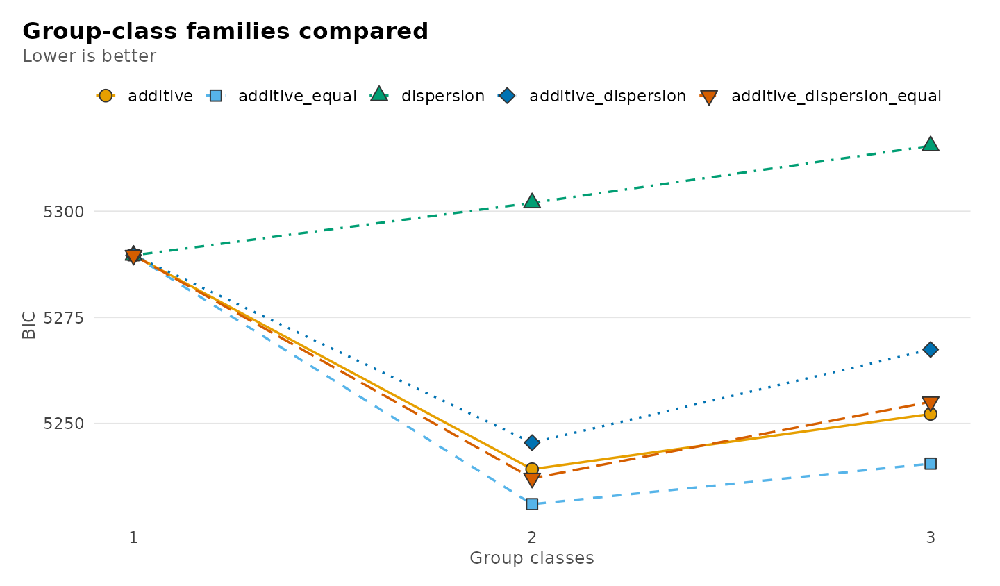
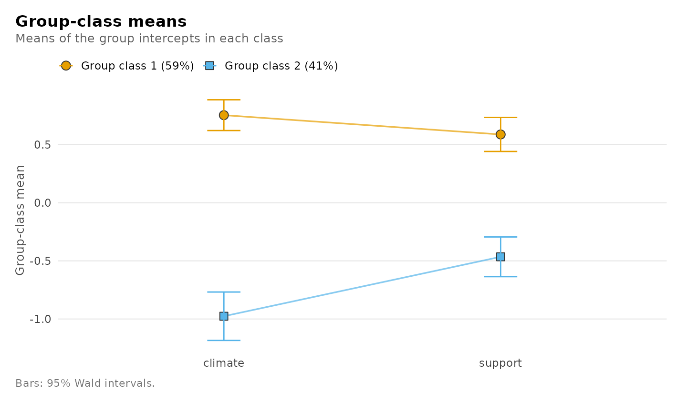
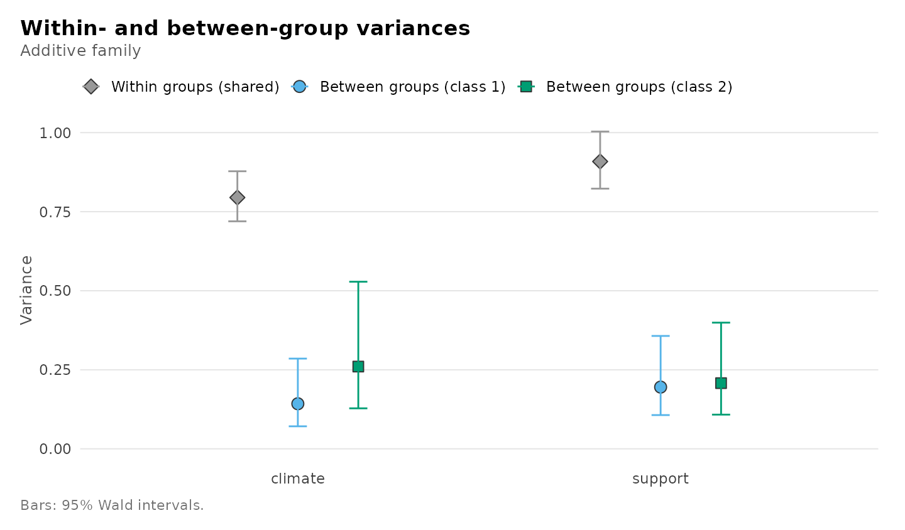
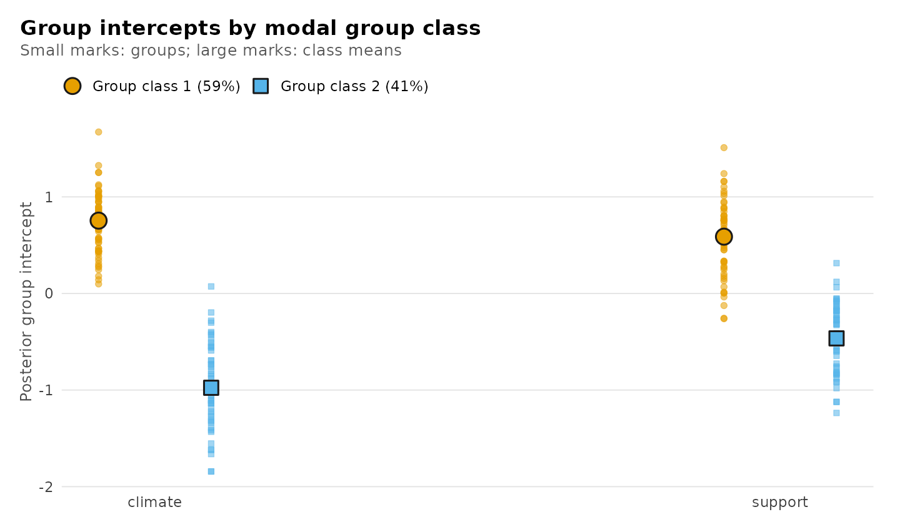
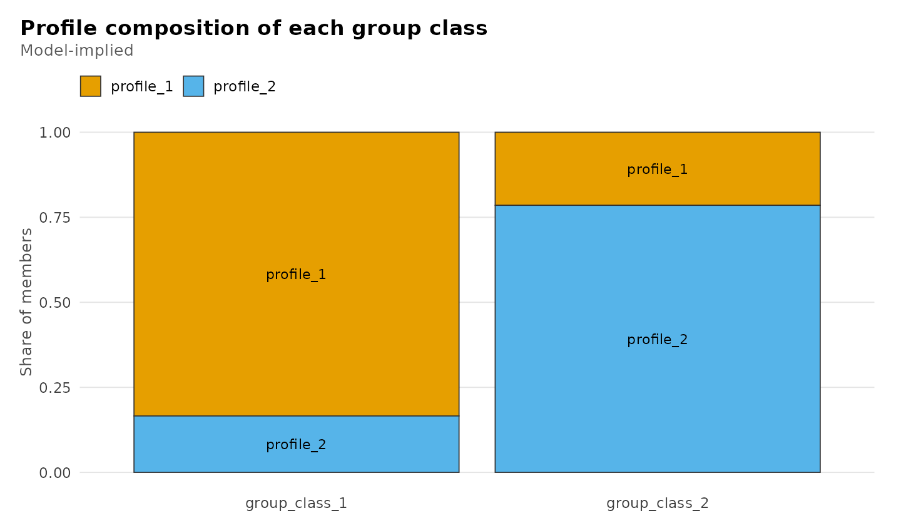

# Group-class and cross-level models: classes of groups from raw ratings

Members of the same team, pupils of the same class or sessions of the
same student give ratings that share something: the unit they belong to.
The *additive* model of Houle, Morin and Harvey (2026) asks whether
those units fall into a small number of latent **group classes** that
differ in where their members’ ratings sit. It has no individual
profiles: every member of a group belongs to the group’s class, and
varies around the group’s own level.

The same machinery fits the other families of that framework: the
*dispersion* family, whose group classes differ in how much members vary
around their group, the *additive-dispersion* family, which allows both,
and two *cross-level* families that estimate individual profiles and
group classes together.

> These families are **experimental**. Estimation, standard errors,
> tables, plots, enumeration and the bootstrap likelihood-ratio test are
> available; missing data and covariates are not yet.

## The model

For group $`j`$ with $`n_j`$ members rating $`d`$ indicators, and group
class $`h`$:

``` math
C_j \sim \text{Categorical}(\omega_1, \dots, \omega_H), \qquad
B_{jr} \mid C_j = h \sim N(\mu_{hr}, T_{hr}), \qquad
Y_{ijr} \mid B_{jr} \sim N(B_{jr}, W_r).
```

Each group has its own intercept $`B_{jr}`$ per indicator, drawn from
its class’s distribution. The group classes differ in their means
$`\mu_h`$ and, optionally, in the between-group spread $`T_h`$; the
**within-group** variance $`W_r`$ is the same in every class. That
shared within-group variance is what makes the model additive. The
likelihood is exact: it is computed from each group’s size, mean and
within-group scatter, with no numerical integration.

## Data

The ratings below are simulated so that the truth is known: 120 teams of
4 to 12 members rate the team’s climate and the support they receive.
Teams are of two types, supportive and strained, which differ in their
average ratings and, for climate, in how much teams of the type vary.

``` r

library(latents)
set.seed(2026)
n_teams <- 120
team_type <- rep(c("supportive", "strained"), times = c(66, 54))
team_size <- rep(c(4, 6, 8, 12), length.out = n_teams)
team_climate <- rnorm(n_teams, ifelse(team_type == "supportive", 0.8, -0.8),
                      ifelse(team_type == "supportive", 0.35, 0.6))
team_support <- rnorm(n_teams, ifelse(team_type == "supportive", 0.6, -0.5), 0.45)
ratings <- data.frame(
  team = rep(seq_len(n_teams), team_size),
  type = rep(team_type, team_size),
  climate = rep(team_climate, team_size) + rnorm(sum(team_size), 0, 0.9),
  support = rep(team_support, team_size) + rnorm(sum(team_size), 0, 1))
str(ratings)
#> 'data.frame':    900 obs. of  4 variables:
#>  $ team   : int  1 1 1 1 2 2 2 2 2 2 ...
#>  $ type   : chr  "supportive" "supportive" "supportive" "supportive" ...
#>  $ climate: num  1.219 1.082 2.058 1.642 0.418 ...
#>  $ support: num  -0.623 1.729 0.945 0.236 1.262 ...
```

The model never sees `type`; it is kept to check the classification
later.

## Fitting

The additive model is a `family` of
[`multilpa()`](https://pak.dynasite.org/latents/reference/multilpa.md).
It takes the ratings, the group column and the number of group classes;
there is no `n_profiles`, because there are no individual profiles.

``` r

fit <- multilpa(ratings, c("climate", "support"), "team",
                n_group_classes = 2, family = "additive", seed = 1)
fit
#> Additive group-class model (varying between variances)
#> 2 group classes, 120 groups, 900 observations, 2 indicators
#> log-likelihood -2593.282, 11 parameters, BIC (groups) 5239.226
#> converged: yes; best start replicated 8 of 10
#> Tables: get_results(x, what = ), e.g. "parameters", "group_classes", "groups", "intercepts"; summary(x); plot(x).
```

## How many group classes?

Fit one, two and three classes and compare them by BIC, which for this
family is penalized by the number of groups (`nobs(fit)` is the number
of teams).

``` r

fit_one <- multilpa(ratings, c("climate", "support"), "team",
                    n_group_classes = 1, family = "additive", seed = 1)
fit_three <- multilpa(ratings, c("climate", "support"), "team",
                      n_group_classes = 3, family = "additive", seed = 1)
#> Warning: A between-group variance is estimated at zero or a within-group variance reached
#> min_variance; this is a boundary fit and Wald inference does not apply.
BIC(fit_one, fit, fit_three)
#>           df  BIC
#> fit_one    6 5290
#> fit       11 5239
#> fit_three 16 5252
```

Two classes have the lowest BIC. The three-class fit also warns that a
between-group variance went to zero: with a third class there is no
between-team spread left for some class to explain. A likelihood-ratio
test of two against three classes would need a bootstrap reference
distribution, not the chi-square, and that is not yet available for this
family.

## Do the classes differ in spread?

`between_variance = "equal"` constrains the between-group variances to
be equal across classes, which leaves the classes differing in location
only.

``` r

fit_equal <- multilpa(ratings, c("climate", "support"), "team",
                      n_group_classes = 2, family = "additive",
                      between_variance = "equal", seed = 1)
BIC(fit, fit_equal)
#>           df  BIC
#> fit       11 5239
#> fit_equal  9 5231
AIC(fit, fit_equal)
#>           df  AIC
#> fit       11 5209
#> fit_equal  9 5206
```

Both criteria prefer the equal-spread model, although the data were
simulated with more spread in climate among strained teams. With 120
teams that difference is too small to be told apart from sampling noise,
which is what the criteria report. The rest of this vignette uses the
varying model to show every parameter.

## Comparing the group-class families

[`enumerate_classes()`](https://pak.dynasite.org/latents/reference/enumerate_classes.md)
fits every combination of family, between-variance restriction and
number of group classes in one call. The `model` column names each
candidate for
[`candidate_fit()`](https://pak.dynasite.org/latents/reference/candidate_fit.md).

``` r

grid <- enumerate_classes(ratings, c("climate", "support"), "team",
                          family = c("additive", "dispersion",
                                     "additive_dispersion"),
                          n_group_classes = 1:3, seed = 1)
get_results(grid, "best")
#>            model   family between_variance n_group_classes log_likelihood n_parameters
#> 7 additive_equal additive            equal               2          -2594            9
#>    aic  bic bic_individual entropy smallest_class min_effective_groups converged boundary
#> 7 5206 5231           5249    0.87          0.395                 39.6      TRUE    FALSE
#>   n_best_replicated warnings error
#> 7                10           <NA>
```

The lowest BIC belongs to two additive classes with equal between-group
spread, the model chosen above. Adding class-specific within-group
variances (additive-dispersion) does not improve the fit enough to pay
for them, and the dispersion family, whose classes differ only in
spread, fits much worse: these teams differ in level, not in how much
their members disagree.

``` r

plot(grid)
```



Whether two classes are needed at all is a test of one class against
two. The likelihood-ratio statistic has no chi-square reference
distribution there, so
[`bootstrap_lrt()`](https://pak.dynasite.org/latents/reference/bootstrap_lrt.md)
simulates it from the one-class fit:

``` r

one_class <- candidate_fit(grid, n_group_classes = 1, model = "additive_equal")
two_classes <- candidate_fit(grid, n_group_classes = 2, model = "additive_equal")
bootstrap_lrt(one_class, two_classes, iter = 19, n_starts = 3, seed = 1)
#> Parametric bootstrap likelihood-ratio comparison
#> Null: additive_equal, 1 group class; alternative: additive_equal, 2 group classes
#> Observed statistic: 73.015578
#> p-value: 0.05 (Monte Carlo SE 0.0487) from 19 of 19 valid replicates
```

With 19 replicates the smallest attainable p-value is 0.05; use several
hundred replicates for a report.

## Parameters

Every parameter, with Wald standard errors from the observed
information:

``` r

get_results(fit)
#> Warning: Group classes supported by fewer than 50 effective groups (group_class_2: 38.3
#> effective of 49.3 expected groups, 78% of the information kept). A small information
#> share means poor separation; a small expected count means few groups. Wald intervals for
#> class means and weights can be miscalibrated; see get_results(x, "group_classes").
#>          level   group_class indicator parameter estimate standard_error statistic
#> 1      between group_class_1   climate      mean    0.754         0.0675     11.16
#> 2      between group_class_1   support      mean    0.588         0.0747      7.87
#> 3      between group_class_2   climate      mean   -0.976         0.1063     -9.19
#> 4      between group_class_2   support      mean   -0.465         0.0872     -5.33
#> 5       within        shared   climate  variance    0.795         0.0403        NA
#> 6       within        shared   support  variance    0.909         0.0460        NA
#> 7      between group_class_1   climate  variance    0.143         0.0505        NA
#> 8      between group_class_1   support  variance    0.195         0.0601        NA
#> 9      between group_class_2   climate  variance    0.260         0.0941        NA
#> 10     between group_class_2   support  variance    0.208         0.0692        NA
#> 11 group_class group_class_1      <NA>    weight    0.589         0.0509        NA
#> 12 group_class group_class_2      <NA>    weight    0.411         0.0509        NA
#>     p_value p_adjusted conf_low conf_high
#> 1  6.17e-29   6.17e-29   0.6216     0.886
#> 2  3.41e-15   3.41e-15   0.4416     0.734
#> 3  4.10e-20   4.10e-20  -1.1847    -0.768
#> 4  9.59e-08   9.59e-08  -0.6358    -0.294
#> 5        NA         NA   0.7195     0.878
#> 6        NA         NA   0.8229     1.003
#> 7        NA         NA   0.0712     0.285
#> 8        NA         NA   0.1067     0.357
#> 9        NA         NA   0.1281     0.528
#> 10       NA         NA   0.1082     0.399
#> 11       NA         NA   0.4873     0.684
#> 12       NA         NA   0.3156     0.513
```

The warning comes from a check on each class’s *effective groups*: the
number of perfectly classified groups that would pin down the class
weight as precisely as this fit does. It is shown in the `group_classes`
table below. Here the strained class has about 38 effective groups of
the 49 it is expected to hold, so most of the information survives the
classification; the class is simply not large. With fewer than 50
effective groups, the simulation study found interval coverage for class
parameters starting to fall below 95%, and far below it when a class is
also poorly separated.

`level` separates the three kinds of parameter: `"between"` rows are the
class means and between-group variances, `"within"` rows the
within-group variances shared by the classes (`group_class = "shared"`),
and `"group_class"` rows the class weights. Intervals for variances are
formed on the log scale and for weights on the logit scale, so they stay
in range. Cluster-robust (sandwich) standard errors over teams take one
argument:

``` r

get_results(fit, "parameters", vcov_type = "robust")
#> Warning: Group classes supported by fewer than 50 effective groups (group_class_2: 38.5
#> effective of 49.3 expected groups, 78% of the information kept). A small information
#> share means poor separation; a small expected count means few groups. Wald intervals for
#> class means and weights can be miscalibrated; see get_results(x, "group_classes").
#>          level   group_class indicator parameter estimate standard_error statistic
#> 1      between group_class_1   climate      mean    0.754         0.0627     12.03
#> 2      between group_class_1   support      mean    0.588         0.0778      7.56
#> 3      between group_class_2   climate      mean   -0.976         0.1063     -9.18
#> 4      between group_class_2   support      mean   -0.465         0.0863     -5.39
#> 5       within        shared   climate  variance    0.795         0.0437        NA
#> 6       within        shared   support  variance    0.909         0.0488        NA
#> 7      between group_class_1   climate  variance    0.143         0.0602        NA
#> 8      between group_class_1   support  variance    0.195         0.0652        NA
#> 9      between group_class_2   climate  variance    0.260         0.0744        NA
#> 10     between group_class_2   support  variance    0.208         0.0532        NA
#> 11 group_class group_class_1      <NA>    weight    0.589         0.0508        NA
#> 12 group_class group_class_2      <NA>    weight    0.411         0.0508        NA
#>     p_value p_adjusted conf_low conf_high
#> 1  2.48e-33   2.48e-33   0.6312     0.877
#> 2  4.08e-14   4.08e-14   0.4355     0.740
#> 3  4.19e-20   4.19e-20  -1.1847    -0.768
#> 4  7.20e-08   7.20e-08  -0.6342    -0.296
#> 5        NA         NA   0.7135     0.885
#> 6        NA         NA   0.8179     1.010
#> 7        NA         NA   0.0623     0.326
#> 8        NA         NA   0.1014     0.376
#> 9        NA         NA   0.1486     0.456
#> 10       NA         NA   0.1257     0.343
#> 11       NA         NA   0.4876     0.684
#> 12       NA         NA   0.3158     0.512
```

## Groups and their intercepts

Each team’s class probabilities, and its modal class:

``` r

head(get_results(fit, "groups"))
#>   team  n   group_class posterior probability_group_class_1 probability_group_class_2
#> 1    1  4 group_class_1     1.000                     1.000                  0.000487
#> 2    2  6 group_class_1     0.999                     0.999                  0.000534
#> 3    3  8 group_class_1     1.000                     1.000                  0.000414
#> 4    4 12 group_class_1     0.999                     0.999                  0.000555
#> 5    5  4 group_class_1     0.976                     0.976                  0.024356
#> 6    6  6 group_class_1     0.988                     0.988                  0.012196
get_results(fit, "group_classes")
#>     group_class weight count n_assigned mean_posterior effective_groups
#> 1 group_class_1  0.589  70.7         71          0.968             55.0
#> 2 group_class_2  0.411  49.3         49          0.960             38.3
```

The posterior mean of each team’s intercept shrinks its observed average
towards its class mean, more so for small teams; its variance includes
the uncertainty about which class the team belongs to.

``` r

head(get_results(fit, "intercepts"))
#>   team indicator  n average intercept_mean intercept_variance
#> 1    1   climate  4   1.500          1.065             0.0832
#> 2    2   climate  6   0.383          0.561             0.0689
#> 3    3   climate  8   1.080          0.946             0.0586
#> 4    4   climate 12   0.768          0.763             0.0453
#> 5    5   climate  4   0.750          0.734             0.0971
#> 6    6   climate  6  -0.159          0.272             0.0751
```

Because the teams were simulated, the classification can be checked
against the true type:

``` r

get_results(fit, "recovery", data = ratings, truth = "type")
#>        assigned      truth  n  share
#> 1 group_class_1   strained  5 0.0704
#> 2 group_class_1 supportive 66 0.9296
#> 3 group_class_2   strained 49 1.0000
#> 4 group_class_2 supportive  0 0.0000
```

Every supportive team is in one class; most strained teams are in the
other, and the few placed with the supportive teams are those whose
ratings happened to fall close to that class.

## Plots

``` r

plot(fit)
#> Warning: Group classes supported by fewer than 50 effective groups (group_class_2: 38.3
#> effective of 49.3 expected groups, 78% of the information kept). A small information
#> share means poor separation; a small expected count means few groups. Wald intervals for
#> class means and weights can be miscalibrated; see get_results(x, "group_classes").
```



``` r

plot(fit, what = "variances")
#> Warning: Group classes supported by fewer than 50 effective groups (group_class_2: 38.3
#> effective of 49.3 expected groups, 78% of the information kept). A small information
#> share means poor separation; a small expected count means few groups. Wald intervals for
#> class means and weights can be miscalibrated; see get_results(x, "group_classes").
```



``` r

plot(fit, what = "intercepts")
#> Warning: Group classes supported by fewer than 50 effective groups (group_class_2: 38.3
#> effective of 49.3 expected groups, 78% of the information kept). A small information
#> share means poor separation; a small expected count means few groups. Wald intervals for
#> class means and weights can be miscalibrated; see get_results(x, "group_classes").
```



## Cross-level families

When the same ratings define both individual profiles and group classes,
the cross-level families follow the manifest specification of Houle et
al. (2026): each group’s means of the indicators are the group-level
indicators of its class. In the *full* family, the group classes also
differ in how their members are distributed over the individual
profiles; in the *restricted* family they do not, and the two levels are
estimated separately. Here, sessions of `course_engagement` form
engagement profiles and students form group classes.

``` r

activity <- c("browse", "lectures", "forum_read", "forum_post", "attendance")
full <- multilpa(course_engagement, activity, "student", n_profiles = 2,
                 n_group_classes = 2, family = "full_cross_level", seed = 1)
restricted <- multilpa(course_engagement, activity, "student", n_profiles = 2,
                       n_group_classes = 2, family = "restricted_cross_level",
                       seed = 1)
get_results(full, "composition")
#>     group_class   profile share
#> 1 group_class_1 profile_1 0.834
#> 2 group_class_2 profile_1 0.215
#> 3 group_class_1 profile_2 0.166
#> 4 group_class_2 profile_2 0.785
rbind(get_results(full, "fit"), get_results(restricted, "fit"))
#>                   family n_profiles n_group_classes log_likelihood n_parameters   aic
#> 1       full_cross_level          2               2          -8512           43 17111
#> 2 restricted_cross_level          2               2          -8752           42 17588
#>     bic bic_individual n_groups n_obs converged boundary
#> 1 17225          17337      106  1422      TRUE    FALSE
#> 2 17700          17809      106  1422      TRUE    FALSE
```

In the full model one class of students has most of its sessions in one
profile and the other class mostly in the other, and letting the
composition differ by class raises the likelihood far more than its one
extra parameter costs. Because the group means are computed from the
same ratings, these likelihoods compare cross-level fits of the same
data only, not the group-class families above, and standard errors are
not reported.

``` r

plot(full, what = "composition")
```



## When the between-group variance is zero

In `course_engagement` the student types are discrete by construction,
so students of the same class do not differ in their average activity:
the between-group variance is zero. The fit says so, and the tables
report no standard errors, because a variance on the edge of its space
breaks the approximation Wald inference relies on.

``` r

activity <- c("browse", "lectures", "forum_read", "forum_post", "attendance")
fit_boundary <- multilpa(course_engagement, activity, "student",
                         n_group_classes = 3, family = "additive",
                         between_variance = "equal", seed = 1)
#> Warning: A between-group variance is estimated at zero or a within-group variance reached
#> min_variance; this is a boundary fit and Wald inference does not apply.
get_results(fit_boundary, "fit")
#>     family between_variance n_group_classes log_likelihood n_parameters   aic   bic
#> 1 additive            equal               3          -9392           27 18839 18911
#>   bic_individual n_groups n_obs entropy smallest_class min_effective_groups converged
#> 1          18981      106  1422   0.907            0.3                   NA      TRUE
#>   boundary  kkt n_starts n_best_replicated
#> 1     TRUE TRUE       10                10
```

## Known limitations

A predeclared simulation study (1000 datasets per condition; the report
is in the package repository under `validation/ADDITIVE_SIMULATION.md`)
found:

- With a few hundred groups and well-separated classes, means, weights
  and variances are recovered and 95% intervals cover close to 95%.
- Between-group variances are estimated slightly low, the usual
  small-sample bias of maximum likelihood for a variance component; it
  shrinks as the number of groups grows.
- With heavy-tailed ratings, the observed-information standard errors of
  the within-group variances are too small; `vcov_type = "robust"`
  corrects them. With few groups (about 50), prefer the
  observed-information standard errors.
- When one class is small and poorly separated from another, intervals
  can be badly miscalibrated. The `latents_weak_class` warning (fewer
  than 50 effective groups in a class) flagged every such simulated
  dataset and under 1% of the well-separated ones with about 100 groups
  per class; it also flags designs with fewer than about 50 groups per
  class, where coverage was mildly low.
- When a between-group variance may truly be zero, its Wald interval is
  not meaningful: either the fit is on the boundary and standard errors
  are withheld, or the interval excludes zero by construction.

## References

Houle, S. A., Morin, A. J. S., & Harvey, J.-F. (2026). Multilevel latent
profile analyses: A comprehensive guide. *Organizational Research
Methods*. <doi:10.1177/10944281261469432>.
