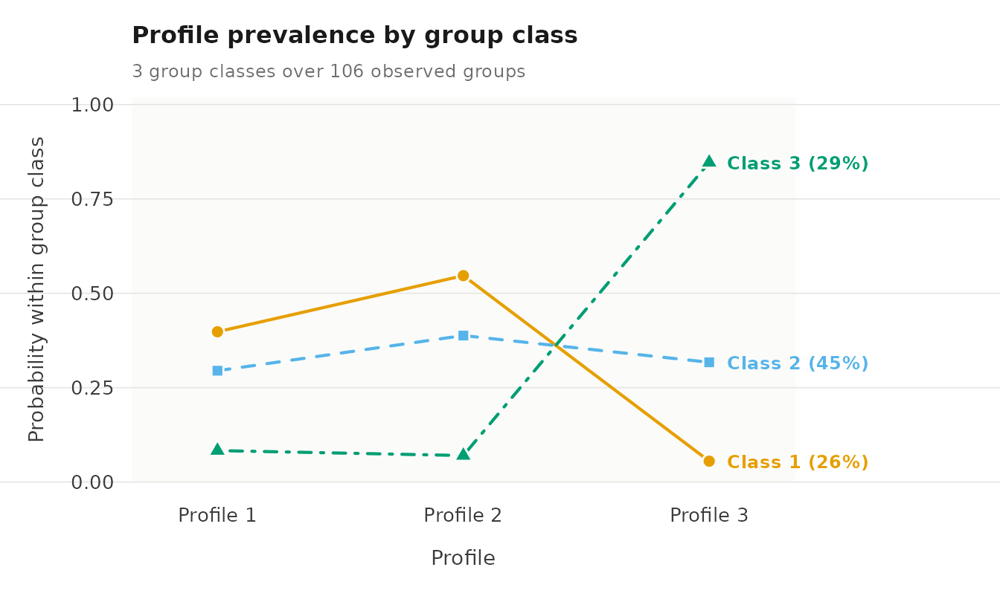
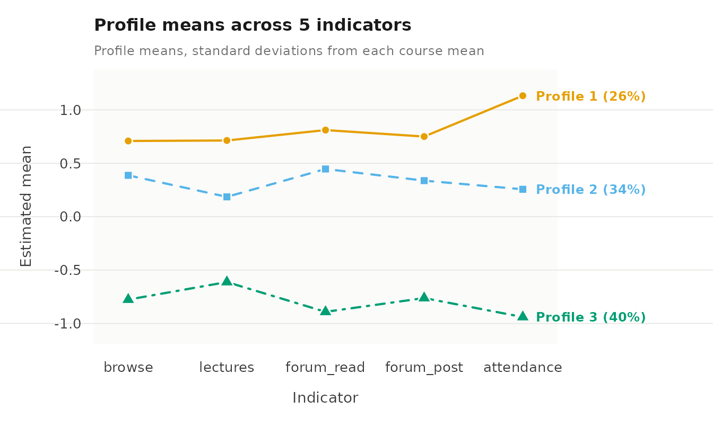

# Case study: Multilevel latent profile analysis of course engagement

Multilevel latent profile analysis (MLPA) is used when observations are
nested within higher-level units and the aim is to identify latent
profiles at the observation level while also describing how the
prevalence of those profiles varies across units. Examples include
repeated measurements nested within persons, students nested within
schools, patients nested within clinics, or employees nested within
organizations. Because observations from the same higher-level unit may
be dependent, MLPA extends standard latent profile analysis by modeling
the data at two levels. Latent profiles are defined at Level 1, whereas
latent classes at Level 2 describe differences between higher-level
units in the composition of those profiles.

Consider a repeated-measures application. A person may occupy different
profiles on different occasions. Let $`C_{it}`$ denote the profile of
person $`i`$ at occasion $`t`$, and let $`G_i`$ denote the person’s
Level-2 latent class. The model estimates the conditional probability
$`P(C_{it}=k\mid G_i=m)`$ that an observation belongs to profile $`k`$
given that the person belongs to class $`m`$. In this way, MLPA
separates variation across repeated observations from variation between
persons in the profiles they tend to occupy.

This distinction is also central to VaSSTra (López-Pernas & Saqr, 2023),
which separates **state diversity** from **person heterogeneity** using
a sequential estimation strategy. VaSSTra first establishes a common
state space across all observations and then summarizes each person’s
repeated observations within that space. MLPA takes a different
approach: the observation-level profiles and person-level classes are
estimated jointly within a single model. Both approaches allow the same
person to occupy several states across repeated observations, but they
differ in how the states and the person-level representation are
constructed.

The `latents` package fits MLPA models using maximum likelihood with
multiple expectation-maximization starting values. In this vignette, we
work through a three-profile, three-student-class example using
longitudinal data on course engagement. The focus is on specifying,
estimating, and interpreting the model. The companion guides cover
[model
evaluation](https://pak.dynasite.org/latents/articles/case-engagement-evaluation.md),
[covariates and staged
estimation](https://pak.dynasite.org/latents/articles/case-engagement-covariates.md),
and [latent
transitions](https://pak.dynasite.org/latents/articles/case-engagement-transitions.md).

``` r

library(latents)
```

## Longitudinal course engagement

The engagement example revisits the setting studied by [Saqr and
López-Pernas (2021)](https://doi.org/10.1016/j.compedu.2021.104325),
*The longitudinal trajectories of online engagement over a full
program*. The study distinguished three engagement states within courses
and three longer-term student trajectories. Here, we use the bundled
synthetic `course_engagement` data to reproduce the same type of nested
longitudinal design. The purpose of the example is to illustrate the
analytical questions and workflow; the estimates reported below apply
only to the synthetic package data.

Each row represents one student’s enrolment in one course. Enrolments
are therefore the Level-1 observations, while students are the Level-2
units within which those observations are nested. A student who takes
several courses appears on several rows. The variable `student`
identifies the Level-2 unit, `course` identifies the course associated
with each enrolment, and `sequence` records the position of that course
in the student’s observed history. Students need not contribute the same
number of enrolments. The MLPA model accounts for the grouping of
enrolments within students; it does not include a separate course-level
random effect or latent structure.

Five activity indicators describe the student’s engagement during each
enrolment. The indicators are simulated on the `log1p(count)` scale and
standardized within course. Each value can therefore be interpreted as
the enrolment’s distance from the mean of that particular course,
expressed in course-specific standard deviations. A value above zero
indicates more activity than the course average, whereas a value below
zero indicates less activity than the course average.

This within-course standardization is important for the interpretation
of the profiles. Raw activity volumes can differ substantially across
courses because of differences in course design, duration, or expected
workload. The indicators therefore describe a student’s engagement
relative to other students taking the same course rather than relative
to the cohort as a whole. The profiles identified below are therefore
recurring patterns of **relative engagement within courses**.

| Variable | Definition |
|----|----|
| `browse` | Course page views. |
| `lectures` | Lecture videos viewed. |
| `forum_read` | Forum posts read. |
| `forum_post` | Forum posts written. |
| `attendance` | Days active in the course. |
| `previous_grade` | Standardized grade from the preceding course, with an entry grade at the first course. |

The indicator vector `vars` selects the five measures used to define
engagement profiles. Identifiers and `previous_grade` stay outside the
measurement model. The package accepts a character vector of column
names.

``` r

vars <- c("browse", "lectures", "forum_read", "forum_post", "attendance")
```

## Descriptive statistics and clustering within students

The
[`descriptives()`](https://pak.dynasite.org/latents/reference/descriptives.md)
function summarizes the distributions of the activity indicators and
estimates their intraclass correlations (ICCs), using `student` as the
grouping variable. The ICC describes how much of the variation in an
indicator is attributable to differences between students rather than
variation across enrolments within the same student. It is defined as

``` math
\mathrm{ICC}
=
\frac{\sigma^2_{\mathrm{between}}}
{\sigma^2_{\mathrm{between}}+\sigma^2_{\mathrm{within}}}.
```

Here, $`\sigma^2_{\mathrm{between}}`$ is the variance between students
and $`\sigma^2_{\mathrm{within}}`$ is the variance across enrolments
within students.

An ICC near zero indicates little between-student variation in an
indicator’s average level, whereas an ICC near one indicates little
variation across enrolments within students. With the one-way
random-effects estimator used here, an estimated ICC can occasionally be
negative because of sampling variation; such estimates are generally
interpreted as indicating little or no detectable between-student
clustering for that indicator.

ICCs describe the clustering of each activity indicator separately. They
do not determine how many Level-1 profiles or Level-2 student classes
should be fitted. In particular, students may differ in the
**composition of their engagement profiles** even when their average
levels on the individual indicators are similar. The ICCs are therefore
descriptive measures of the multilevel structure in the observed
indicators.

The descriptive table reports means, standard deviations, ranges, and
ICCs for the activity indicators, together with sample sizes and
missingness.

``` r

descriptives(course_engagement, vars = vars, id = "student")
```

    #>     variable    n n_missing       mean     sd   min  max n_distinct n_groups     icc
    #> 1     browse 1422         0 -2.813e-05 0.9891 -3.14 2.49        398      106 0.19229
    #> 2   lectures 1422         0 -4.219e-05 0.9889 -2.91 3.22        399      106 0.08779
    #> 3 forum_read 1422         0  7.032e-05 0.9890 -2.73 2.81        400      106 0.22403
    #> 4 forum_post 1422         0 -2.110e-05 0.9890 -2.61 3.10        397      106 0.15035
    #> 5 attendance 1422         0  7.736e-05 0.9889 -2.45 2.41        401      106 0.22145

The data comprise 1,422 enrolments from 106 students, with complete
observations on all activity indicators. Because the indicators were
standardized within course, their pooled means are approximately zero
and their standard deviations are close to one. The estimated ICCs range
from 0.088 for `lectures` to 0.224 for `forum_read`: about 9% to 22% of
the variance in the individual indicators is attributable to differences
between students. Most variation therefore occurs across enrolments
within students, while a meaningful share reflects between-student
differences. This combination of within- and between-student variation
is the structure that the multilevel model is designed to represent.

## Three engagement profiles and three student classes

The
[`multilpa()`](https://pak.dynasite.org/latents/reference/multilpa.md)
function estimates engagement profiles from the five activity indicators
and student classes from the distribution of those profiles across each
student’s enrolments. A **3 × 3 model** contains three Level-1 enrolment
profiles and three Level-2 student classes. Each student class is
characterized by a different set of probabilities for the three
enrolment profiles, while an individual student may contribute
enrolments to more than one profile.

Each engagement profile is defined by a mean and variance for every
activity indicator. These profile-specific parameters are shared across
student classes. Thus, a given profile represents the same pattern of
engagement regardless of which student class it occurs in. What differs
across student classes is the relative frequency with which their
enrolments occupy the profiles.

The conditional profile probabilities introduced above can be written as

``` math
\pi_{k\mid m}=P(C_{it}=k\mid G_i=m),
```

where $`\pi_{k\mid m}`$ is the probability that an enrolment belongs to
profile $`k`$ when the student belongs to class $`m`$. For each student
class, these probabilities range from zero to one and sum to one across
the three profiles. The Level-2 class probability

``` math
\omega_m=P(G_i=m)
```

gives the proportion of students represented by class $`m`$.

The model relies on several distributional and independence assumptions.
Within each profile, the activity indicators are modeled as Gaussian,
and the same profile definitions apply to all students. Students are
treated as independent Level-2 units, and enrolments within a student
are conditionally independent given the student’s latent class. With the
default diagonal covariance structure, the activity indicators are
additionally assumed to be independent within each profile. Substantial
residual associations between indicators after accounting for profile
membership may indicate that this assumption is too restrictive and can
affect the resulting profile solution.

The **3 × 3 model** considered here is one candidate representation of
the latent structure. The [evaluation
vignette](https://pak.dynasite.org/latents/articles/case-engagement-evaluation.md)
shows how this model can be compared with alternatives containing
different numbers of Level-1 profiles and Level-2 student classes.

The model is estimated from ten random starts to check whether different
initial values lead to the same likelihood solution. Setting `seed = 1`
makes these starts reproducible while restoring the caller’s random
state after estimation. A tighter convergence criterion, specified
through `tol`, is used to support the subsequent calculation of standard
errors. The argument `time = "sequence"` retains the order of each
student’s courses so that enrolment histories can be displayed in
sequence. Course order does not enter the present model, however: the
model describes the **composition of profiles** across a student’s
enrolments. Transitions between successive profiles are addressed by the
separate longitudinal model.

``` r

fit <- multilpa(course_engagement, vars, id = "student", time = "sequence",
                n_profiles = 3, n_group_classes = 3, n_starts = 10,
                max_iter = 2000, tol = 1e-10, seed = 1)
```

### Profile means

Printing the fitted model gives a compact summary of the Level-1 profile
solution. Each row represents one engagement profile and reports its
estimated mean on each activity indicator, together with its estimated
enrolment membership.

``` r

fit
```

    #> Two-level latent profile analysis: 3 profiles, 3 group classes
    #> 1422 individuals in 106 groups; varying diagonal residual covariance (VVI)
    #> Log likelihood: -8348.428714 | AIC: 16772.857 | BIC (groups): 16874.068
    #> Converged: TRUE | iterations: 164 | best start: 4/10
    #> 
    #>  profile  browse lectures forum_read forum_post attendance count proportion
    #>        1  0.7088   0.7134     0.8109     0.7502     1.1326 369.2     0.2596
    #>        2  0.3870   0.1855     0.4463     0.3375     0.2562 477.9     0.3361
    #>        3 -0.7768  -0.6123    -0.8914    -0.7623    -0.9400 575.0     0.4043
    #> 
    #> Variances and standard errors: get_results(x, "profiles"). 
    #> Every other table: get_results(x, what = ), or get_results(x, "all").

Profile 1 has the highest estimated mean on all five activity
indicators, profile 2 has intermediate means, and profile 3 has the
lowest means. For `attendance`, the profile means are 1.133, 0.256, and
-0.940 standard deviations from the corresponding course mean. For
`browse`, they are 0.709, 0.387, and -0.777. The profiles therefore
primarily distinguish different levels of recorded activity, although
the separation varies across indicators. For example, the difference
between profiles 1 and 2 is substantially larger for `attendance` than
for `browse`.

Profile numbers are arbitrary labels assigned during estimation and have
no inherent substantive meaning. In this fitted model, we refer to
profiles 1, 2, and 3 as **higher activity**, **intermediate activity**,
and **lower activity**, respectively. The numbering may change when the
model is fitted again or when a different specification is estimated.
Profile labels should therefore be based on the estimated indicator
means rather than on the profile numbers themselves.

### Profile and class sizes

The
[`get_results()`](https://pak.dynasite.org/latents/reference/get_results.md)
function extracts result tables from the fitted model. The `"counts"`
table reports **effective membership** at both levels: the estimated
number of enrolments in each Level-1 profile and the estimated number of
students in each Level-2 class. Effective membership is obtained by
summing posterior membership probabilities rather than assigning each
case to its single most likely profile or class. For example, a student
with a posterior probability of 0.80 of belonging to class 2 contributes
0.80 to the effective size of that class. Because these probabilities
are summed across enrolments or students, the resulting counts need not
be whole numbers. Counts based on assigning each case to its most likely
profile or class, by contrast, would always be integers.

``` r

get_results(fit, "counts")
```

    #>         level class effective_count effective_proportion
    #> 1 individuals     1          369.17               0.2596
    #> 2 individuals     2          477.88               0.3361
    #> 3 individuals     3          574.95               0.4043
    #> 4      groups     1           27.65               0.2609
    #> 5      groups     2           47.32               0.4464
    #> 6      groups     3           31.03               0.2927

The **lower-activity** profile has the largest effective membership,
accounting for 575.0 enrolments, or 40.4% of the total. The
**higher-activity** profile accounts for 369.2 enrolments, or 26.0%. At
Level 2, student class 2 is the largest, with an effective membership of
47.3 students, corresponding to 44.6% of the sample. Classes 1 and 3
have effective memberships of 27.7 and 31.0 students, respectively.

### How students differ in their profile composition

The `"profile_probabilities"` table shows how the three enrolment
profiles are distributed within each student class. For each class, it
reports the probability of an enrolment belonging to each Level-1
profile, together with the prevalence of that Level-2 class among
students. Each row therefore answers two related questions: **which
profiles characterize students in this class, and how common is the
class in the student population?**

``` r

get_results(fit, "profile_probabilities")
```

    #>   group_class profile probability group_class_probability
    #> 1           1       1     0.39806                  0.2609
    #> 2           1       2     0.54671                  0.2609
    #> 3           1       3     0.05523                  0.2609
    #> 4           2       1     0.29483                  0.4464
    #> 5           2       2     0.38802                  0.4464
    #> 6           2       3     0.31715                  0.4464
    #> 7           3       1     0.08322                  0.2927
    #> 8           3       2     0.07012                  0.2927
    #> 9           3       3     0.84666                  0.2927

Student class 1 is characterized mainly by the **higher-activity** and
**intermediate-activity** profiles. Conditional on membership in class
1, the probabilities of an enrolment occupying profiles 1, 2, and 3 are
0.398, 0.547, and 0.055, respectively. Student class 2 has a more
balanced profile composition, with corresponding probabilities of 0.295,
0.388, and 0.317. Student class 3 is strongly characterized by the
**lower-activity** profile: an enrolment from a student in this class
has a probability of 0.847 of occupying profile 3. The estimated
prevalences of student classes 1, 2, and 3 are 0.261, 0.446, and 0.293,
respectively.

The probability plot provides a visual comparison of these
class-specific profile compositions on a common scale from zero to one.
Each line represents a student class, and each point shows the
conditional probability of an enrolment occupying a particular profile
within that class. Differences in the shape of the lines therefore show
how the distribution of engagement profiles varies across student
classes.

``` r

plot(fit, what = "probabilities")
```



Class 2 has an almost level profile because its probabilities are
similar across the three engagement profiles. In contrast, class 3 rises
sharply to 0.847 for the **lower-activity** profile, whereas class 1
falls to 0.055 for that same profile. These differences illustrate how
student classes can have distinct profile compositions even though
students within each class may still occupy more than one engagement
profile across their enrolments.

## Checking the estimation

The `"starts"` table reports the final log likelihood, convergence
status, and variance-boundary status for each random start. Agreement
across starts provides evidence that the estimation is repeatedly
reaching the same solution, although it does not establish that this
solution is the global maximum.

``` r

get_results(fit, "starts")
```

    #>    start log_likelihood converged iterations error boundary
    #> 1      1          -8348      TRUE        168  <NA>    FALSE
    #> 2      2          -8348      TRUE        155  <NA>    FALSE
    #> 3      3          -8348      TRUE        169  <NA>    FALSE
    #> 4      4          -8348      TRUE        164  <NA>    FALSE
    #> 5      5          -8348      TRUE        165  <NA>    FALSE
    #> 6      6          -8348      TRUE        160  <NA>    FALSE
    #> 7      7          -8348      TRUE        165  <NA>    FALSE
    #> 8      8          -8348      TRUE        158  <NA>    FALSE
    #> 9      9          -8348      TRUE        169  <NA>    FALSE
    #> 10    10          -8348      TRUE        138  <NA>    FALSE

All ten starts converge to a log likelihood of approximately -8348.4,
and none has an active variance bound. The identical likelihoods across
starts indicate that the fitted solution is stable with respect to the
starting values used in this analysis.

## Profile means as a plot

[`plot()`](https://rdrr.io/r/graphics/plot.default.html) displays the
estimated profile means across the five activity indicators. Because the
indicators were standardized within course, the vertical axis is
expressed in standard deviations from the corresponding course mean.
Line types and point symbols distinguish the profiles in addition to
colour.

``` r

plot(fit, subtitle = "Profile means, standard deviations from each course mean")
```



The three profiles retain the same ordering across all five indicators,
with profile 1 highest, profile 2 intermediate, and profile 3 lowest.
The distance between profiles 1 and 2 varies across indicators: they are
relatively close on page browsing but more clearly separated on
attendance, consistent with the estimated means reported above. Because
the profiles differ mainly in overall elevation rather than in the shape
of their indicator patterns, the principal contrast is the overall
amount of recorded activity.

## Reading each student’s course history

The `"sequences"` table arranges each student’s enrolments in course
order and shows the profile assigned to each enrolment. Assignment is
based on the profile with the highest posterior probability, so these
sequences provide a simplified summary of the fitted model and do not
represent classification uncertainty. In the wide format, each row
corresponds to a student and successive observed courses appear in
columns.

``` r

get_results(fit, "sequences", format = "wide") |> head(4)
```

    #>   group group_class sequence_1 sequence_2 sequence_3 sequence_4 sequence_5 sequence_6
    #> 1     1           3          2          2          3          3          3          3
    #> 2     2           3          3          3          3          3          3          3
    #> 3     3           1          1          2          2          2          2          2
    #> 4     4           1          1          2          1          1          2          2
    #>   sequence_7 sequence_8 sequence_9 sequence_10 sequence_11 sequence_12 sequence_13
    #> 1          3          3          3           3           3           3           3
    #> 2          3          3          3           3           3           3           3
    #> 3          2          1          2           2           2           2           1
    #> 4          2          1          2           1           2           2           2
    #>   sequence_14 sequence_15
    #> 1        <NA>        <NA>
    #> 2        <NA>        <NA>
    #> 3           1        <NA>
    #> 4        <NA>        <NA>

Students 1 and 2 are assigned to student class 3. Student 1 is assigned
to the **intermediate-activity** profile for the first two observed
courses and to the **lower-activity** profile for the courses that
follow, whereas student 2 is assigned to the **lower-activity** profile
throughout the observed sequence. Students 3 and 4 are assigned to class
1 and have enrolments classified as both **higher activity** and
**intermediate activity**. These patterns illustrate the class-specific
profile compositions described above, but they should not be interpreted
as estimated transition processes. Trailing `NA` values indicate courses
that were not observed for that student rather than missing profile
assignments within the observed history.

The `"sequence_summary"` table summarizes the modal student-class
assignments and the amount of longitudinal information available within
each class. It reports the number of students, enrolments, and observed
courses in each assigned class. The `gaps` column counts students with
an unobserved occasion between observed occasions in their sequence;
simply having a shorter observed history does not constitute a gap.

``` r

get_results(fit, "sequence_summary")
```

    #>   group_class groups observations mean_length median_length shortest longest complete gaps
    #> 1           1     25          330       13.20          13.0       11      15        4    0
    #> 2           2     51          689       13.51          14.0       10      15       13    0
    #> 3           3     30          403       13.43          13.5       10      15        7    0

The modal assignments place 25, 51, and 30 students in classes 1, 2, and
3, respectively. Their mean sequence lengths are 13.20, 13.51, and 13.43
observed courses. Thus, the classes have similar amounts of longitudinal
information, even though their profile compositions differ
substantially. None of the observed sequences contains an internal gap.

## Interpretation

Profile composition and profile order describe different aspects of the
data. Two students may spend similar proportions of their enrolments in
the same profiles while encountering those profiles in a different
sequence. The MLPA estimated here captures the former by modeling
class-specific profile probabilities, but it does not model the ordering
of profiles over time. The [transition
vignette](https://pak.dynasite.org/latents/articles/case-engagement-transitions.md)
extends the analysis to that question by estimating probabilities of
moving from one profile to another across successive observations.

## Limitations

The bundled data are designed to reproduce the structure of the
published case for instructional purposes; they do not provide a
numerical replication of the original study. The published analysis used
latent class analysis followed by hidden Markov modeling, whereas the
present example fits a joint MLPA model. The resulting three student
classes therefore summarize differences in profile composition across
enrolments rather than reproducing the longitudinal trajectories
estimated in the original study.

The **3 × 3 specification** should also be treated as a candidate model
rather than a definitive representation of the latent structure. Its
adequacy depends on comparisons with alternative numbers of Level-1
profiles and Level-2 classes, as well as on the model’s distributional
assumptions. In particular, the default diagonal covariance structure
assumes that the activity indicators are conditionally independent
within each profile. Residual associations among the indicators may
violate this assumption and alter the estimated profile solution. In
addition, modal profile and class assignments simplify the fitted model
by ignoring classification uncertainty. The [evaluation
vignette](https://pak.dynasite.org/latents/articles/case-engagement-evaluation.md)
examines these issues using the same data and candidate specification.

## References

López-Pernas, S., & Saqr, M. (2023). From variables to states to
trajectories (VaSSTra): A method for modelling the longitudinal dynamics
of learning and behaviour. In *Proceedings TEEM 2022: Tenth
International Conference on Technological Ecosystems for Enhancing
Multiculturality* (pp. 1169-1178). Springer Nature Singapore.
[doi:10.1007/978-981-99-0942-1_123](https://doi.org/10.1007/978-981-99-0942-1_123).

Saqr, M., & López-Pernas, S. (2021). The longitudinal trajectories of
online engagement over a full program. *Computers & Education, 175*,
104325.
[doi:10.1016/j.compedu.2021.104325](https://doi.org/10.1016/j.compedu.2021.104325).
