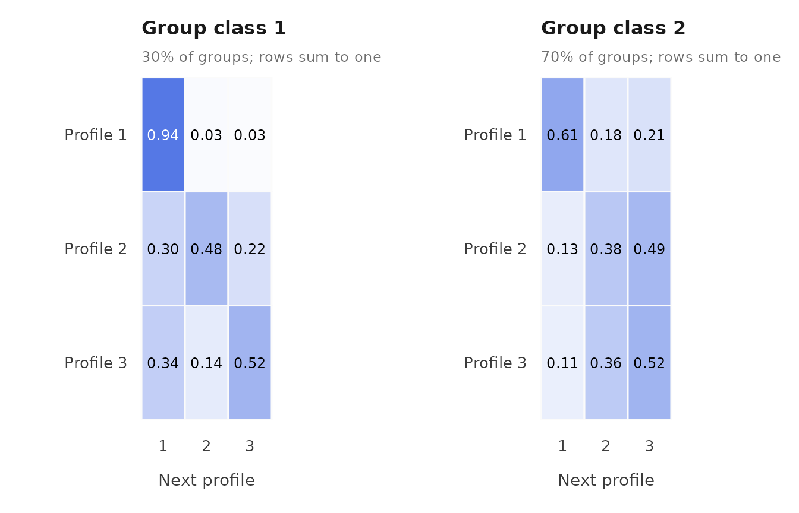
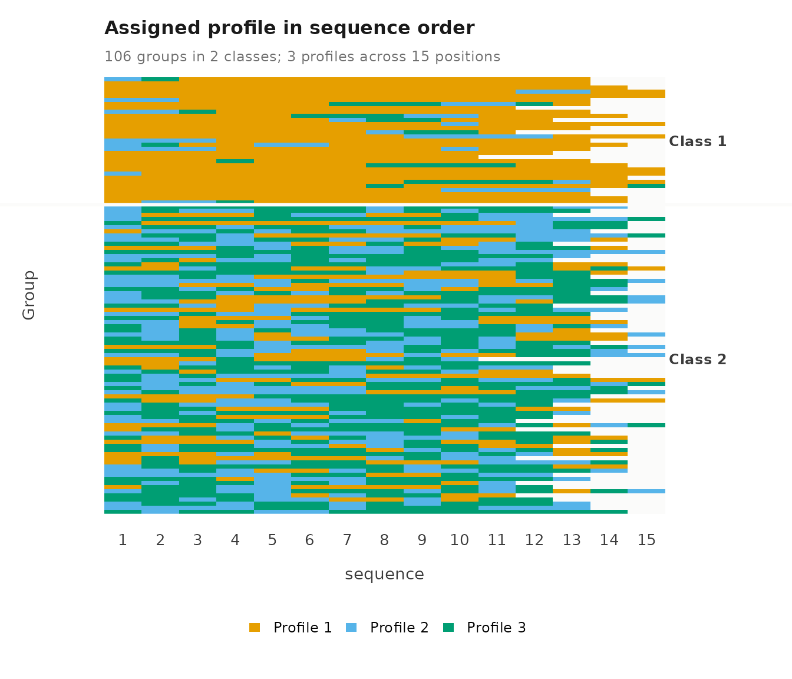
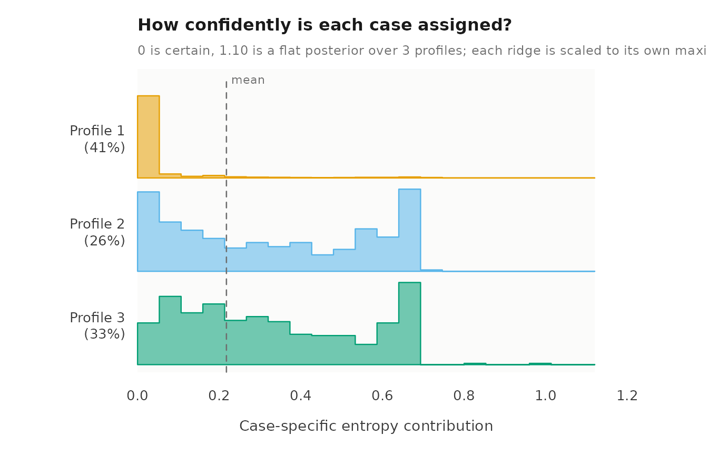
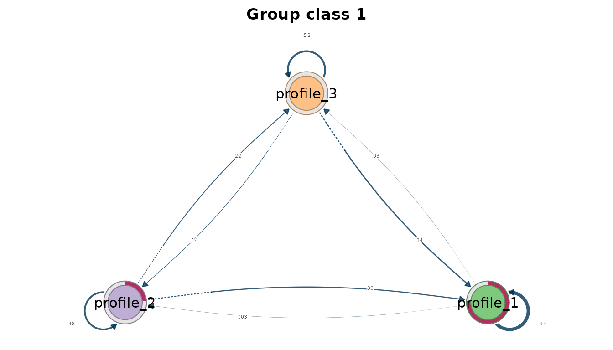
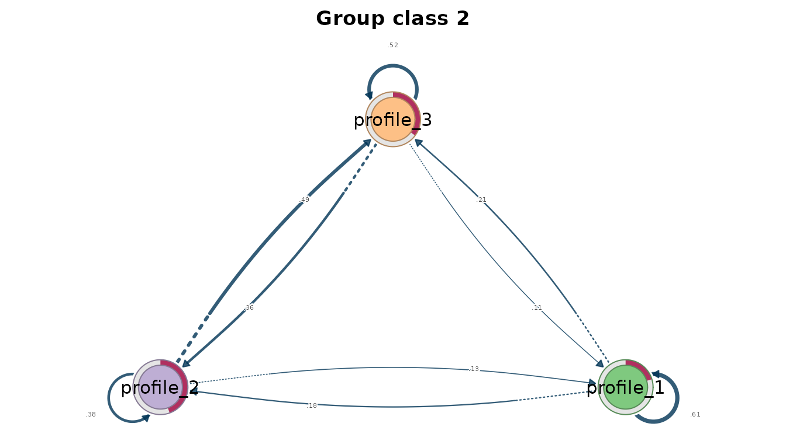

# Case study: Latent transition analysis of course engagement

Latent transition analysis (LTA) estimates the probability of moving
from one latent profile to another between consecutive occasions
(Collins & Lanza, 2010). With group classes, each class has its own
starting distribution and its own transition matrix, so the classes
separate students who differ in how their engagement changes from
students who differ only in where it starts.

## Data and model

`course_engagement` holds 1,422 course enrolments of 106 students,
ordered within each student by `sequence`. The five indicators are
simulated on the `log1p` scale of activity counts and standardized
within course. The data are synthetic and revisit the design of Saqr and
López-Pernas (2021), who asked how students’ online engagement develops
across a program. That study identified course-level engagement states
and longer-term trajectories with latent class analysis and hidden
Markov models. Here, three profiles and two student classes are working
choices for illustrating the transition model; they do not establish the
number of profiles or reproduce the published estimates.

For student $`i`$ at course position $`t`$, $`C_{it}`$ is the latent
profile and $`G_i`$ the student’s class. The model estimates

- the initial probabilities $`\delta_{k\mid m}=P(C_{i1}=k\mid G_i=m)`$,
- the transition probabilities
  $`a_{kl\mid m}=P(C_{i,t+1}=l\mid C_{it}=k,G_i=m)`$, which sum to one
  across destinations $`l`$,
- and a Gaussian mean and variance for each profile and indicator.

The transitions are first order and homogeneous: the next profile
depends only on the current profile and the student’s class, and the
probabilities are the same at every position. Profile means and
variances are shared across positions and classes, so a change of
profile is a change of state. Indicators are independent within a
profile under the default diagonal covariance. The fit can fail to reach
the global maximum from a single start, and a transition that is rare
within a class is estimated from little information; the expected count
of each transition shows how much.

``` r

library(latents)
vars <- c("browse", "lectures", "forum_read", "forum_post", "attendance")

moves <- lta(course_engagement, vars, "student", n_profiles = 3,
             n_group_classes = 2, time = "sequence", n_starts = 10, seed = 1)
get_results(moves, "starts")
#>    start log_likelihood converged iterations error
#> 1      1          -8243      TRUE         91  <NA>
#> 2      2          -8243      TRUE         84  <NA>
#> 3      3          -8243      TRUE         99  <NA>
#> 4      4          -8243      TRUE        121  <NA>
#> 5      5          -8243      TRUE         99  <NA>
#> 6      6          -8243      TRUE         90  <NA>
#> 7      7          -8243      TRUE        100  <NA>
#> 8      8          -8243      TRUE        189  <NA>
#> 9      9          -8243      TRUE         83  <NA>
#> 10    10          -8243      TRUE         83  <NA>
```

All ten starts converge to the same log likelihood, so the solution is
replicated within this seed’s starts.

## The profiles

[`plot()`](https://rdrr.io/r/graphics/plot.default.html) draws the
profile means across the indicators, with point size showing profile
prevalence.

``` r

plot(moves)
```


``` r

get_results(moves)
#>    profile  indicator    mean variance standard_deviation
#> 1        1     browse -0.7760   0.5149             0.7175
#> 2        1   lectures -0.6117   0.5417             0.7360
#> 3        1 forum_read -0.8882   0.3540             0.5950
#> 4        1 forum_post -0.7607   0.4149             0.6441
#> 5        1 attendance -0.9293   0.3727             0.6105
#> 6        2     browse  0.7051   0.5295             0.7277
#> 7        2   lectures  0.7107   0.7967             0.8926
#> 8        2 forum_read  0.8064   0.4652             0.6821
#> 9        2 forum_post  0.7463   0.5773             0.7598
#> 10       2 attendance  1.1223   0.2072             0.4551
#> 11       3     browse  0.3955   0.6100             0.7810
#> 12       3   lectures  0.1882   0.7589             0.8712
#> 13       3 forum_read  0.4534   0.4578             0.6766
#> 14       3 forum_post  0.3437   0.7144             0.8452
#> 15       3 attendance  0.2524   0.2041             0.4517
```

Profile 1 is the lowest on every indicator, profile 2 the highest, and
profile 3 lies between them; their attendance means are -0.929, 1.122
and 0.252. The profiles are therefore lower, higher and intermediate
activity. The heatmap shows the same means as standard deviations from
each indicator’s grand mean.

``` r

plot(moves, what = "heatmap")
```


The contrast between profiles is present on all five indicators, so the
profiles differ in overall activity more than in its composition.

## Where students start

In the `"initial"` table, `probability` is $`\delta_{k\mid m}`$, the
chance of starting in each profile. `prevalence` is the expected share
of all of a class’s enrolments in that profile, across the whole
history, and `group_class_probability` is the share of students in the
class.

``` r

get_results(moves, "initial")
#>   group_class profile probability prevalence group_class_probability
#> 1           1       1   7.621e-01    0.81891                  0.3007
#> 2           1       2   2.379e-01    0.09691                  0.3007
#> 3           1       3   3.452e-10    0.08418                  0.3007
#> 4           2       1   2.035e-01    0.22962                  0.6993
#> 5           2       2   4.453e-01    0.33446                  0.6993
#> 6           2       3   3.512e-01    0.43592                  0.6993
```

Student class 1, with 30.1% of students, starts in the lower-activity
profile with probability 0.762 and in the higher-activity profile with
probability 0.238; its probability of starting in the intermediate
profile is effectively zero. Class 2, with 69.9% of students, starts
across all three profiles, with probabilities 0.204, 0.445 and 0.351.
Starting and overall shares differ: class 1 starts in the lower profile
with probability 0.762, but 0.819 of its enrolments are expected there
over the whole history, while class 2 starts in the higher profile with
probability 0.445 and spends 0.334 of its enrolments there.

## How engagement changes

The `"transitions"` table gives $`a_{kl\mid m}`$ for every class and
pair of profiles. `stable` marks staying in the same profile.
`expected_count` is the posterior expected number of such transitions in
the data, so it can be fractional, and it shows how much information
supports each estimate. `estimated = FALSE` would mark a row the data
cannot inform, because the profile is never occupied before a student’s
last course; such a row holds uniform placeholder values. Every row is
estimated in this fit.

``` r

get_results(moves, "transitions")
#>    group_class from to probability expected_count stable estimated group_class_probability
#> 1            1    1  1     0.93849        303.367   TRUE      TRUE                  0.3007
#> 2            1    1  2     0.03132         10.123  FALSE      TRUE                  0.3007
#> 3            1    1  3     0.03019          9.757  FALSE      TRUE                  0.3007
#> 4            1    2  1     0.29654         11.687  FALSE      TRUE                  0.3007
#> 5            1    2  2     0.48238         19.012   TRUE      TRUE                  0.3007
#> 6            1    2  3     0.22108          8.716  FALSE      TRUE                  0.3007
#> 7            1    3  1     0.33738         11.396  FALSE      TRUE                  0.3007
#> 8            1    3  2     0.14194          4.790  FALSE      TRUE                  0.3007
#> 9            1    3  3     0.52068         17.579   TRUE      TRUE                  0.3007
#> 10           2    1  1     0.61440        127.787   TRUE      TRUE                  0.6993
#> 11           2    1  2     0.17636         36.672  FALSE      TRUE                  0.6993
#> 12           2    1  3     0.20923         43.523  FALSE      TRUE                  0.6993
#> 13           2    2  1     0.12761         38.973  FALSE      TRUE                  0.6993
#> 14           2    2  2     0.37861        115.606   TRUE      TRUE                  0.6993
#> 15           2    2  3     0.49378        150.816  FALSE      TRUE                  0.6993
#> 16           2    3  1     0.11405         46.328  FALSE      TRUE                  0.6993
#> 17           2    3  2     0.36217        147.074  FALSE      TRUE                  0.6993
#> 18           2    3  3     0.52378        212.792   TRUE      TRUE                  0.6993
```

The transition plot draws each class’s matrix as a heatmap, with the
origin profile in rows and the destination in columns.

``` r

plot(moves, what = "transitions")
```



In class 1, lower activity persists with probability 0.938, estimated
from 303 expected transitions. Each of its other transitions rests on
fewer than 20 expected transitions, because class-1 students rarely
leave the lower profile. Class 2 moves between profiles. Its students
remain in the lower profile with probability 0.614, move from higher to
intermediate activity with probability 0.494, and from intermediate to
higher with probability 0.362. Class 1 is therefore a persistently
low-engagement class, and class 2 a class whose engagement changes from
course to course.

## Sparse and boundary estimates

Some estimates rest on very little information. Class 1’s probability of
starting in the intermediate profile is at its lower bound, because no
class-1 student is expected to start there. Class 1’s transitions out of
the higher and intermediate profiles rest on between 4.8 and 19.0
expected transitions each, because its students rarely leave the lower
profile. A probability near zero shows that the data carry little
information about that movement, not that the movement is impossible.
Estimates like these can also mean that the chosen number of classes
divides the available transitions too finely.

## Assigned sequences

The sequence plot shows each student’s modal profile at each course
position, one row per student. Modal assignment discards classification
uncertainty.

``` r

plot(moves, what = "sequences")
```



``` r

get_results(moves, "sequence_summary")
#>   group_class groups observations mean_length median_length shortest longest complete gaps
#> 1           1     31          417       13.45            13       10      15        8    0
#> 2           2     75         1005       13.40            14       10      15       16    0
```

The summary gives the number of students and courses in each assigned
class. Sequence lengths differ between students, so the rows of the plot
end at different positions.

## Classification uncertainty

``` r

get_results(moves, "entropy")
#>         level n_classes n_units entropy_sum relative_entropy
#> 1 individuals         3    1422      309.78           0.8017
#> 2      groups         2     106       16.35           0.7774
```

Relative entropy is 0.802 for enrolments and 0.777 for students. The
entropy plot shows, within each profile, how the per-case entropy
contributions are distributed, and the posterior plot shows the
posterior probability of each case’s assigned profile.

``` r

plot(moves, what = "entropy")
```



``` r

plot(moves, what = "posteriors")
```


Both levels retain uncertainty, so an analysis that replaces the
posteriors by modal assignments treats some enrolments and students as
more certain than the model estimates them to be.

## Transition networks

[`get_tna()`](https://pak.dynasite.org/latents/reference/get_tna.md)
returns the marginal transition matrix as a model of the tna package
(Tikka et al., 2025). It pools the posterior expected transition counts
across classes and normalizes them, so it uses the estimated
transitions, not transitions counted from modal assignments.
[`get_group_tna()`](https://pak.dynasite.org/latents/reference/get_group_tna.md)
returns one network per class.

``` r

network <- get_tna(moves)
plot(network)
```


``` r

per_class <- get_group_tna(moves)
plot(per_class)
```



The class networks show the two patterns of the transition table: a
dominant self-loop on the lower profile in class 1, and movement among
all three profiles in class 2.

## Limitations

The model assumes constant transition probabilities across course
positions, so change specific to one stage of the program is averaged
over positions. Transitions are between successive observed courses,
which can differ in duration, content and assessment. Class differences
describe patterns in engagement histories and do not identify their
causes. Standard errors, likelihood-ratio tests and class enumeration
are not available for transition models, so the number of profiles and
classes here is a working choice. The diagonal covariance ignores the
association between `attendance` and the click measures, which the
evaluation vignette shows is present in these data; unmodelled
dependence can be absorbed by extra profiles and change the apparent
transitions. Transitions supported by few expected counts, such as those
out of the higher and intermediate profiles in class 1, should not be
interpreted.

## References

Collins, L. M., & Lanza, S. T. (2010). *Latent class and latent
transition analysis*. Wiley.

Saqr, M., & López-Pernas, S. (2021). The longitudinal trajectories of
online engagement over a full program. *Computers & Education, 175*,
104325. <https://doi.org/10.1016/j.compedu.2021.104325>

Tikka, S., López-Pernas, S., & Saqr, M. (2025). tna: An R package for
transition network analysis. *Applied Psychological Measurement*.
<https://doi.org/10.1177/01466216251348840>
