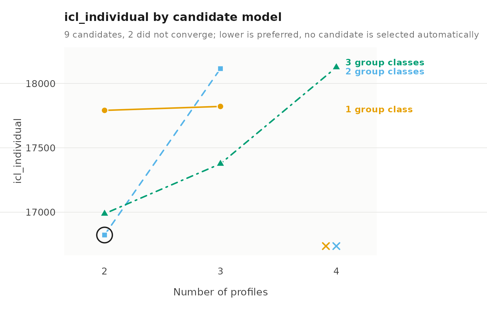
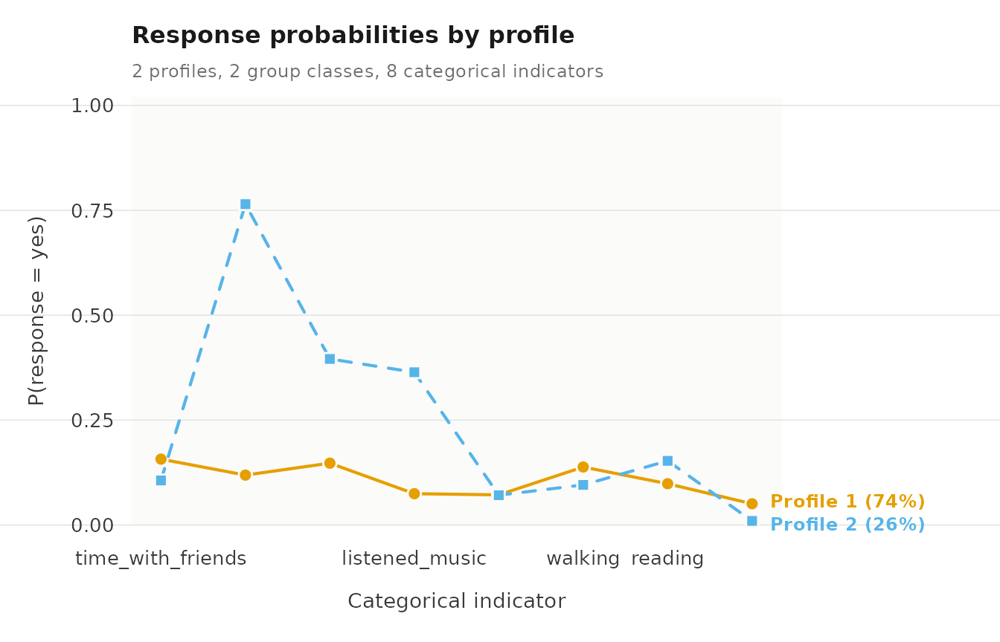
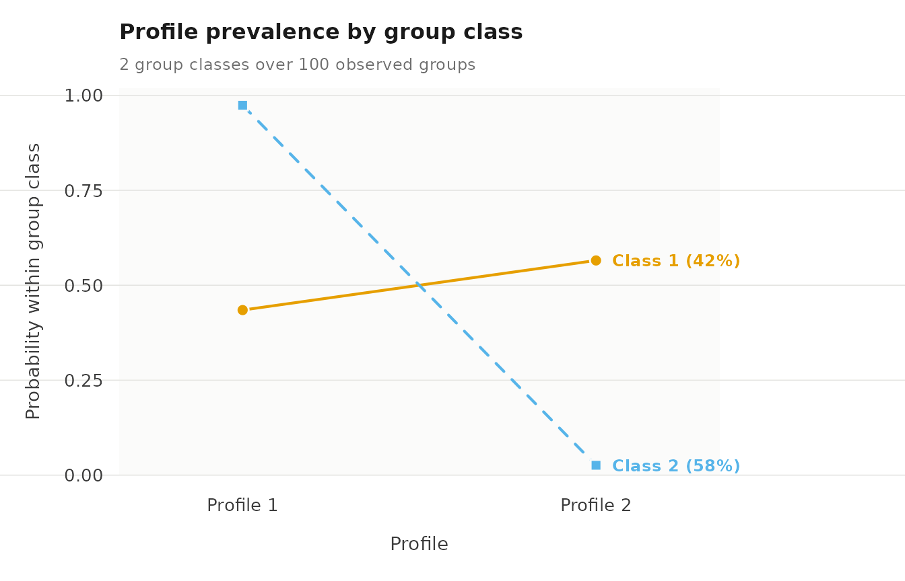

# Case study: Two-level latent class analysis of leisure activities

Two-level latent class analysis estimates latent classes of categorical
responses at the level of single observations and, above them, latent
group classes that differ in how probable each class is for their
observations. In the output the observation-level classes are called
profiles. Each profile is described by the probability of every answer
to every item; the group classes differ only in how often their
observations fall in each profile.

The question here is whether the leisure activities that university
students report in daily life form a small number of recurring patterns,
and whether students differ in how often they are in each pattern.

## Data

`student_esm` holds experience-sampling data from a study of university
students (Neubauer & Schmiedek, 2024). The students answered six prompts
a day for fourteen days. At each prompt when they had not studied since
the previous one, they reported which of eight leisure activities they
had done. The dataset holds these prompts for 100 students: 2,582
prompts, between 15 and 51 per student. Prompts are the observations and
students the groups, so a student contributes many rows.

The eight activities are yes/no items, and they are named once so that
each model can refer to them.

``` r

library(latents)
activities <- c("time_with_friends", "on_social_media", "tv_video_games",
                "listened_music", "sports", "walking", "reading",
                "part_time_job")
```

[`summary()`](https://rdrr.io/r/base/summary.html) counts the answers to
each activity item and summarizes the other variables.

``` r

summary(student_esm)
#>     student           day             beep      time_with_friends on_social_media tv_video_games
#>  Min.   :  1.0   Min.   : 0.00   Min.   :1.00   no :2211          no :1837        no :2033      
#>  1st Qu.: 27.0   1st Qu.: 3.00   1st Qu.:2.00   yes: 371          yes: 745        yes: 549      
#>  Median : 53.0   Median : 6.00   Median :3.00                                                   
#>  Mean   : 52.3   Mean   : 6.48   Mean   :3.06                                                   
#>  3rd Qu.: 79.0   3rd Qu.:10.00   3rd Qu.:4.00                                                   
#>  Max.   :100.0   Max.   :13.00   Max.   :5.00                                                   
#>  listened_music sports     walking    reading    part_time_job     happy         relaxed    
#>  no :2193       no :2397   no :2254   no :2291   no :2479      Min.   :1.00   Min.   :1.00  
#>  yes: 389       yes: 185   yes: 328   yes: 291   yes: 103      1st Qu.:4.00   1st Qu.:4.00  
#>                                                                Median :5.00   Median :5.00  
#>                                                                Mean   :4.88   Mean   :4.63  
#>                                                                3rd Qu.:6.00   3rd Qu.:6.00  
#>                                                                Max.   :7.00   Max.   :7.00  
#>     worried       exhausted   
#>  Min.   :1.00   Min.   :1.00  
#>  1st Qu.:1.00   1st Qu.:2.00  
#>  Median :2.00   Median :3.00  
#>  Mean   :2.29   Mean   :3.31  
#>  3rd Qu.:3.00   3rd Qu.:5.00  
#>  Max.   :7.00   Max.   :7.00
```

Social media is the most frequent activity, reported at 745 of the 2,582
prompts, followed by TV or video games at 549. A part-time job is the
rarest, at 103 prompts. Every item is answered “no” at most prompts, so
a profile is described by how much more often than average its prompts
say “yes”.

## The model

For prompt $`t`$ of student $`i`$, let $`C_{it}`$ be the profile and
$`G_i`$ the student’s class. The model estimates three sets of
probabilities:

- the response probabilities $`\theta_{kjc}=P(Y_{itj}=c\mid C_{it}=k)`$
  of each answer $`c`$ to item $`j`$ in profile $`k`$, the same in every
  student class;
- the profile probabilities $`\pi_{k\mid m}=P(C_{it}=k\mid G_i=m)`$ of
  each student class $`m`$, which sum to one across profiles;
- the class probabilities $`\omega_m=P(G_i=m)`$.

The items are assumed independent given the profile, the prompts of a
student independent given the student’s class, and the students
independent of one another. The likelihood can have several local
maxima, so each model is started from several random values. A rare
answer can drive a response probability to its lower bound, and too many
profiles or classes for the data show up as starts that fail to reach
the same maximum.

## How many profiles and classes

[`enumerate_classes()`](https://pak.dynasite.org/latents/reference/enumerate_classes.md)
fits every combination of two to four profiles and one to three student
classes, each from five random starts, and reports the information
criteria and the diagnostics of each fit. It does not choose a model.

``` r

candidates <- enumerate_classes(student_esm, vars = activities,
                                categorical = activities, id = "student",
                                n_profiles = 2:4, n_group_classes = 1:3,
                                n_starts = 5, seed = 1)
#> Warning: The best start did not converge; increase max_iter and see get_results(fit, "starts").
#> Warning: The best start did not converge; increase max_iter and see get_results(fit, "starts").
as.data.frame(candidates)
#>   n_profiles n_group_classes model log_likelihood n_parameters   aic   kic bic_groups
#> 1          2               1   VVI          -7892           17 15819 15839      15863
#> 2          3               1   VVI          -7848           26 15749 15778      15817
#> 3          4               1   VVI          -7811           35 15692 15730      15783
#> 4          2               2   VVI          -7740           19 15518 15540      15567
#> 5          3               2   VVI          -7686           29 15429 15461      15505
#> 6          4               2   VVI          -7642           39 15363 15405      15464
#> 7          2               3   VVI          -7710           21 15462 15486      15517
#> 8          3               3   VVI          -7594           32 15253 15288      15336
#> 9          4               3   VVI          -7535           43 15157 15203      15269
#>   bic_individual sabic_groups sabic_individual caic_groups caic_individual awe_groups
#> 1          15918        15809            15864       15880           15935      15992
#> 2          15901        15735            15819       15843           15927      16014
#> 3          15897        15673            15786       15818           15932      16049
#> 4          15629        15507            15569       15586           15648      15729
#> 5          15599        15413            15507       15534           15628      15739
#> 6          15591        15341            15467       15503           15630      15774
#> 7          15585        15450            15518       15538           15606      15717
#> 8          15440        15235            15338       15368           15472      15597
#> 9          15409        15133            15272       15312           15452      15616
#>   awe_individual icl_groups icl_individual clc_groups clc_individual profile_entropy group_entropy
#> 1          17975      15863          17791      15785          17657           0.477            NA
#> 2          18104      15817          17821      15697          17617           0.662            NA
#> 3          18504      15783          18124      15622          17849           0.689            NA
#> 4          17029      15584          16823      15497          16674           0.666         0.877
#> 5          18430      15519          18115      15385          17887           0.557         0.901
#> 6          18491      15477          18067      15297          17761           0.654         0.909
#> 7          17216      15557          16988      15461          16823           0.608         0.815
#> 8          17723      15354          17376      15207          17125           0.659         0.918
#> 9          18592      15289          18125      15091          17788           0.620         0.910
#>   converged boundary n_best_replicated
#> 1      TRUE    FALSE                 2
#> 2      TRUE    FALSE                 2
#> 3     FALSE    FALSE                 1
#> 4      TRUE    FALSE                 5
#> 5      TRUE    FALSE                 1
#> 6     FALSE    FALSE                 1
#> 7      TRUE    FALSE                 5
#> 8      TRUE    FALSE                 1
#> 9      TRUE    FALSE                 1
#>                                                                                 warnings error
#> 1                                                                                         <NA>
#> 2                                                                                         <NA>
#> 3 The best start did not converge; increase max_iter and see get_results(fit, "starts").  <NA>
#> 4                                                                                         <NA>
#> 5                                                                                         <NA>
#> 6 The best start did not converge; increase max_iter and see get_results(fit, "starts").  <NA>
#> 7                                                                                         <NA>
#> 8                                                                                         <NA>
#> 9                                                                                         <NA>
get_results(candidates, "criteria")
#>    criterion  convention n_profiles n_group_classes model value
#> 1        aic        <NA>          4               3   VVI 15157
#> 2        kic        <NA>          4               3   VVI 15203
#> 3        bic      groups          4               3   VVI 15269
#> 4        bic individuals          4               3   VVI 15409
#> 5      sabic      groups          4               3   VVI 15133
#> 6      sabic individuals          4               3   VVI 15272
#> 7       caic      groups          4               3   VVI 15312
#> 8       caic individuals          4               3   VVI 15452
#> 9        awe      groups          3               3   VVI 15597
#> 10       awe individuals          2               2   VVI 17029
#> 11       icl      groups          4               3   VVI 15289
#> 12       icl individuals          2               2   VVI 16823
#> 13       clc      groups          4               3   VVI 15091
#> 14       clc individuals          2               2   VVI 16674
```

The criteria disagree, and the diagnostics explain why. BIC with the
number of students keeps falling up to the largest model in the grid,
four profiles and three classes. Most of the larger models reach their
best solution from only one of the five starts, and two of the
four-profile models do not converge, which the two warnings above
report, so their low BIC rests on unstable solutions. The criteria that
also penalize classification uncertainty (ICL, AWE and CLC counted over
prompts) choose two profiles and two classes, the model whose best
solution recurs in all five starts.

The ICL plot shows the same choice across the grid.

``` r

plot(candidates, criterion = "icl_individual")
```



The plot marks the minimum at two profiles and two classes, and the
analysis continues with that model.

## The chosen model

[`multilca()`](https://pak.dynasite.org/latents/reference/multilca.md)
fits it, treating every item as categorical, with ten random starts and
a tight convergence tolerance, which the standard errors below need.

``` r

lca <- multilca(student_esm, vars = activities, id = "student",
                n_profiles = 2, n_group_classes = 2, n_starts = 10,
                tol = 1e-10, seed = 1)
get_results(lca, "model")
#>   n_observations n_informative n_groups n_profiles n_group_classes centering covariance_structure
#> 1           2582          2582      100          2               2      none                  VVI
#>   n_parameters n_parameters_with_measurement log_likelihood   aic bic_groups bic_individual
#> 1           19                            19          -7740 15518      15567          15629
#>   converged iterations boundary small_classes best_start n_best_replicated
#> 1      TRUE        171    FALSE         FALSE          5                 6
```

The fit converges, and six of the ten starts reach the best log
likelihood of -7740.

## Two activity profiles

The `"responses"` table gives the probability of each answer in each
profile, with a “no” and a “yes” row for every item. The “yes” rows
carry the information, since the two probabilities of an item sum to
one.

``` r

get_results(lca, "responses")
#>    profile         indicator category probability threshold
#> 1        1 time_with_friends       no     0.84297     1.680
#> 2        2 time_with_friends       no     0.89379     2.130
#> 3        1 time_with_friends      yes     0.15703        NA
#> 4        2 time_with_friends      yes     0.10621        NA
#> 5        1   on_social_media       no     0.88107     2.003
#> 6        2   on_social_media       no     0.23528    -1.179
#> 7        1   on_social_media      yes     0.11893        NA
#> 8        2   on_social_media      yes     0.76472        NA
#> 9        1    tv_video_games       no     0.85262     1.755
#> 10       2    tv_video_games       no     0.60419     0.423
#> 11       1    tv_video_games      yes     0.14738        NA
#> 12       2    tv_video_games      yes     0.39581        NA
#> 13       1    listened_music       no     0.92537     2.518
#> 14       2    listened_music       no     0.63587     0.557
#> 15       1    listened_music      yes     0.07463        NA
#> 16       2    listened_music      yes     0.36413        NA
#> 17       1            sports       no     0.92813     2.558
#> 18       2            sports       no     0.92897     2.571
#> 19       1            sports      yes     0.07187        NA
#> 20       2            sports      yes     0.07103        NA
#> 21       1           walking       no     0.86178     1.830
#> 22       2           walking       no     0.90438     2.247
#> 23       1           walking      yes     0.13822        NA
#> 24       2           walking      yes     0.09562        NA
#> 25       1           reading       no     0.90161     2.215
#> 26       2           reading       no     0.84712     1.712
#> 27       1           reading      yes     0.09839        NA
#> 28       2           reading      yes     0.15288        NA
#> 29       1     part_time_job       no     0.94938     2.931
#> 30       2     part_time_job       no     0.99024     4.619
#> 31       1     part_time_job      yes     0.05062        NA
#> 32       2     part_time_job      yes     0.00976        NA
```

The two profiles differ mainly in media use. At prompts in profile 2,
students used social media with probability 0.765, watched TV or played
video games with probability 0.396, and listened to music with
probability 0.364. In profile 1 the same probabilities are 0.119, 0.147
and 0.075. Profile 1 is slightly more likely to include time with
friends (0.157 against 0.106), walking (0.138 against 0.096) and a
part-time job (0.051 against 0.010), and both profiles report sports at
0.07. Profile 2 is therefore a media-heavy pattern, and profile 1 a
pattern of little media use with the remaining activities at their usual
low rates.

The response plot draws the same probabilities, one line per profile
across the items.

``` r

plot(lca, what = "responses")
```



The lines separate on the three media items and nearly coincide on
sports, so the media items carry almost all of the difference between
the profiles.

## Two student classes

The `"counts"` table gives the size of each profile and class, and the
`"profile_probabilities"` table the profile mix of each student class.

``` r

get_results(lca, "counts")
#>         level class effective_count effective_proportion
#> 1 individuals     1          1903.9                0.737
#> 2 individuals     2           678.1                0.263
#> 3      groups     1            41.6                0.416
#> 4      groups     2            58.4                0.584
get_results(lca, "profile_probabilities")
#>   group_class profile probability group_class_probability
#> 1           1       1       0.435                   0.416
#> 2           1       2       0.565                   0.416
#> 3           2       1       0.974                   0.584
#> 4           2       2       0.026                   0.584
```

The low-media profile holds 73.7% of prompts and the media-heavy profile
26.3%. The student classes differ sharply in their mix. In class 2,
which holds 58.4% of students, 0.974 of prompts fall in the low-media
profile. In class 1, with 41.6% of students, the media-heavy profile is
the more common, at 0.565. Media-heavy leisure is therefore concentrated
in a minority of students, and for them it is the usual pattern, while
most students almost never report it.

The probability plot compares the two mixes.

``` r

plot(lca, what = "probabilities")
```



Class 2 runs close to one on the low-media profile and close to zero on
the media-heavy one; class 1 divides its prompts more evenly, with the
larger share on the media-heavy profile.

## Classification certainty

Profiles and classes are estimated as posterior probabilities. Relative
entropy summarizes how concentrated those probabilities are, from 0 for
no separation to 1 for certain assignment, and the `"classification"`
table reports the average posterior probability of each assigned class.

``` r

get_results(lca, "entropy")
#>         level n_classes n_units entropy_sum relative_entropy
#> 1 individuals         2    2582      594.46            0.668
#> 2      groups         2     100        8.49            0.877
get_results(lca, "classification")
#>         level class n_modal proportion_modal estimated_n estimated_proportion average_posterior
#> 1 individuals     1    1961            0.759      1903.9                0.737             0.926
#> 2 individuals     2     621            0.241       678.1                0.263             0.859
#> 3      groups     1      40            0.400        41.6                0.416             0.980
#> 4      groups     2      60            0.600        58.4                0.584             0.960
#>   odds_correct_classification
#> 1                        4.47
#> 2                       17.07
#> 3                       68.28
#> 4                       17.09
```

Relative entropy is 0.668 for prompts and 0.877 for students. A single
prompt answers eight yes/no questions, which leaves its profile
uncertain; a student contributes many prompts, which pins down the
class. The average posterior probability is 0.926 for prompts assigned
to the low-media profile and 0.859 for the media-heavy one, and 0.980
and 0.960 for the two student classes. Conclusions about students are
therefore well supported, while an analysis of individual prompts should
carry the posterior probabilities forward.

## Local independence

The model assumes the items are independent within a profile. The
`"residuals"` table measures the association that each pair of items
keeps within a profile, with a chi-square test for each pair; the ten
largest are shown.

``` r

get_results(lca, "residuals") |> head(10)
#>      profile       indicator_1   indicator_2        kind observed expected residual effective_n
#> 1  profile_2            sports       walking categorical   0.1707 1.05e-16   0.1707         678
#> 2  profile_2 time_with_friends       walking categorical   0.1404 3.58e-17   0.1404         678
#> 3  profile_2    listened_music       walking categorical   0.1334 1.11e-16   0.1334         678
#> 4  profile_2    listened_music       reading categorical   0.1063 4.44e-17   0.1063         678
#> 5  profile_2    listened_music        sports categorical   0.1045 1.31e-16   0.1045         678
#> 6  profile_1    tv_video_games       walking categorical   0.0940 4.35e-17   0.0940        1904
#> 7  profile_1    tv_video_games part_time_job categorical   0.0925 3.59e-17   0.0925        1904
#> 8  profile_1 time_with_friends part_time_job categorical   0.0865 0.00e+00   0.0865        1904
#> 9  profile_1 time_with_friends       reading categorical   0.0727 8.48e-17   0.0727        1904
#> 10 profile_1           reading part_time_job categorical   0.0682 2.64e-17   0.0682        1904
#>    statistic df  p_value p_adjusted
#> 1      19.75  1 8.82e-06   8.82e-06
#> 2      13.37  1 2.55e-04   2.55e-04
#> 3      12.07  1 5.13e-04   5.13e-04
#> 4       7.67  1 5.63e-03   5.63e-03
#> 5       7.41  1 6.50e-03   6.50e-03
#> 6      16.83  1 4.08e-05   4.08e-05
#> 7      16.28  1 5.47e-05   5.47e-05
#> 8      14.25  1 1.60e-04   1.60e-04
#> 9      10.07  1 1.51e-03   1.51e-03
#> 10      8.87  1 2.90e-03   2.90e-03
```

The largest residual is 0.171, between sports and walking in the
media-heavy profile, followed by friends and walking (0.140) and music
and walking (0.133) in the same profile. Physical and social activities
occur together more often than two profiles allow, which is a limit of a
two-profile model and one reason BIC rewards larger models: extra
profiles can absorb this association.

## Uncertainty in the response probabilities

[`parameter_inference()`](https://pak.dynasite.org/latents/reference/parameter_inference.md)
gives standard errors and 95% Wald intervals for every parameter. The
intervals of the “yes” probabilities, in the rows whose `term` ends in
`:yes`, show how firmly the profiles are distinguished.

``` r

parameter_inference(lca)
#>          level       outcome                  term   parameter estimate standard_error statistic
#> 1  measurement     profile_1  time_with_friends:no    response  0.84297        0.00925        NA
#> 2  measurement     profile_1 time_with_friends:yes    response  0.15703        0.00925        NA
#> 3  measurement     profile_2  time_with_friends:no    response  0.89379        0.01497        NA
#> 4  measurement     profile_2 time_with_friends:yes    response  0.10621        0.01497        NA
#> 5  measurement     profile_1    on_social_media:no    response  0.88107        0.01902        NA
#> 6  measurement     profile_1   on_social_media:yes    response  0.11893        0.01902        NA
#> 7  measurement     profile_2    on_social_media:no    response  0.23528        0.03509        NA
#> 8  measurement     profile_2   on_social_media:yes    response  0.76472        0.03509        NA
#> 9  measurement     profile_1     tv_video_games:no    response  0.85262        0.01013        NA
#> 10 measurement     profile_1    tv_video_games:yes    response  0.14738        0.01013        NA
#> 11 measurement     profile_2     tv_video_games:no    response  0.60419        0.02466        NA
#> 12 measurement     profile_2    tv_video_games:yes    response  0.39581        0.02466        NA
#> 13 measurement     profile_1     listened_music:no    response  0.92537        0.00780        NA
#> 14 measurement     profile_1    listened_music:yes    response  0.07463        0.00780        NA
#> 15 measurement     profile_2     listened_music:no    response  0.63587        0.03056        NA
#> 16 measurement     profile_2    listened_music:yes    response  0.36413        0.03056        NA
#> 17 measurement     profile_1             sports:no    response  0.92813        0.00660        NA
#> 18 measurement     profile_1            sports:yes    response  0.07187        0.00660        NA
#> 19 measurement     profile_2             sports:no    response  0.92897        0.01283        NA
#> 20 measurement     profile_2            sports:yes    response  0.07103        0.01283        NA
#> 21 measurement     profile_1            walking:no    response  0.86178        0.00885        NA
#> 22 measurement     profile_1           walking:yes    response  0.13822        0.00885        NA
#> 23 measurement     profile_2            walking:no    response  0.90438        0.01475        NA
#> 24 measurement     profile_2           walking:yes    response  0.09562        0.01475        NA
#> 25 measurement     profile_1            reading:no    response  0.90161        0.00768        NA
#> 26 measurement     profile_1           reading:yes    response  0.09839        0.00768        NA
#> 27 measurement     profile_2            reading:no    response  0.84712        0.01847        NA
#> 28 measurement     profile_2           reading:yes    response  0.15288        0.01847        NA
#> 29 measurement     profile_1      part_time_job:no    response  0.94938        0.00532        NA
#> 30 measurement     profile_1     part_time_job:yes    response  0.05062        0.00532        NA
#> 31 measurement     profile_2      part_time_job:no    response  0.99024        0.00494        NA
#> 32 measurement     profile_2     part_time_job:yes    response  0.00976        0.00494        NA
#> 33     profile     profile_1         group_class_1 probability  0.43468        0.03608        NA
#> 34     profile     profile_2         group_class_1 probability  0.56532        0.03608        NA
#> 35     profile     profile_1         group_class_2 probability  0.97404        0.01743        NA
#> 36     profile     profile_2         group_class_2 probability  0.02596        0.01743        NA
#> 37       group group_class_1                  <NA> probability  0.41595        0.06007        NA
#> 38       group group_class_2                  <NA> probability  0.58405        0.06007        NA
#>    p_value p_adjusted  conf_low conf_high
#> 1       NA         NA  8.25e-01    0.8611
#> 2       NA         NA  1.39e-01    0.1752
#> 3       NA         NA  8.64e-01    0.9231
#> 4       NA         NA  7.69e-02    0.1356
#> 5       NA         NA  8.44e-01    0.9184
#> 6       NA         NA  8.16e-02    0.1562
#> 7       NA         NA  1.67e-01    0.3040
#> 8       NA         NA  6.96e-01    0.8335
#> 9       NA         NA  8.33e-01    0.8725
#> 10      NA         NA  1.28e-01    0.1672
#> 11      NA         NA  5.56e-01    0.6525
#> 12      NA         NA  3.47e-01    0.4442
#> 13      NA         NA  9.10e-01    0.9407
#> 14      NA         NA  5.93e-02    0.0899
#> 15      NA         NA  5.76e-01    0.6958
#> 16      NA         NA  3.04e-01    0.4240
#> 17      NA         NA  9.15e-01    0.9411
#> 18      NA         NA  5.89e-02    0.0848
#> 19      NA         NA  9.04e-01    0.9541
#> 20      NA         NA  4.59e-02    0.0962
#> 21      NA         NA  8.44e-01    0.8791
#> 22      NA         NA  1.21e-01    0.1556
#> 23      NA         NA  8.75e-01    0.9333
#> 24      NA         NA  6.67e-02    0.1245
#> 25      NA         NA  8.87e-01    0.9167
#> 26      NA         NA  8.33e-02    0.1134
#> 27      NA         NA  8.11e-01    0.8833
#> 28      NA         NA  1.17e-01    0.1891
#> 29      NA         NA  9.39e-01    0.9598
#> 30      NA         NA  4.02e-02    0.0610
#> 31      NA         NA  9.81e-01    0.9999
#> 32      NA         NA  7.44e-05    0.0194
#> 33      NA         NA  3.64e-01    0.5054
#> 34      NA         NA  4.95e-01    0.6360
#> 35      NA         NA  9.40e-01    1.0082
#> 36      NA         NA -8.20e-03    0.0601
#> 37      NA         NA  2.98e-01    0.5337
#> 38      NA         NA  4.66e-01    0.7018
```

The profiles are clearly separated on the media items: the interval for
social media is 0.696 to 0.834 in the media-heavy profile and 0.082 to
0.156 in the low-media profile. On sports the two intervals overlap
almost entirely. The part-time-job probability in the media-heavy
profile has an interval starting at 0.0001, close to the bound, because
very few of its prompts report a job.

## Adding affect

A mixed model adds three affect ratings (happy, relaxed, exhausted, each
from 1 to 7) as continuous indicators. `worried` is left out because
about half of its ratings are 1, which can push a profile’s variance to
its lower bound.

``` r

mixed <- multilpa(student_esm,
                  vars = c("happy", "relaxed", "exhausted", activities),
                  categorical = activities, id = "student", n_profiles = 2,
                  n_group_classes = 2, n_starts = 10, seed = 1)
get_results(mixed)
#>   profile indicator mean variance standard_deviation
#> 1       1     happy 5.85     0.75              0.866
#> 2       1   relaxed 5.59     1.19              1.090
#> 3       1 exhausted 2.55     2.25              1.499
#> 4       2     happy 3.58     1.95              1.395
#> 5       2   relaxed 3.33     1.85              1.362
#> 6       2 exhausted 4.33     2.82              1.679
get_results(mixed, "responses")
#>    profile         indicator category probability threshold
#> 1        1 time_with_friends       no      0.8119     1.462
#> 2        2 time_with_friends       no      0.9158     2.387
#> 3        1 time_with_friends      yes      0.1881        NA
#> 4        2 time_with_friends      yes      0.0842        NA
#> 5        1   on_social_media       no      0.7313     1.001
#> 6        2   on_social_media       no      0.6848     0.776
#> 7        1   on_social_media      yes      0.2687        NA
#> 8        2   on_social_media      yes      0.3152        NA
#> 9        1    tv_video_games       no      0.7928     1.342
#> 10       2    tv_video_games       no      0.7801     1.266
#> 11       1    tv_video_games      yes      0.2072        NA
#> 12       2    tv_video_games      yes      0.2199        NA
#> 13       1    listened_music       no      0.8353     1.624
#> 14       2    listened_music       no      0.8681     1.884
#> 15       1    listened_music      yes      0.1647        NA
#> 16       2    listened_music      yes      0.1319        NA
#> 17       1            sports       no      0.9094     2.306
#> 18       2            sports       no      0.9538     3.027
#> 19       1            sports      yes      0.0906        NA
#> 20       2            sports      yes      0.0462        NA
#> 21       1           walking       no      0.8497     1.732
#> 22       2           walking       no      0.9042     2.244
#> 23       1           walking      yes      0.1503        NA
#> 24       2           walking      yes      0.0958        NA
#> 25       1           reading       no      0.8911     2.102
#> 26       2           reading       no      0.8822     2.014
#> 27       1           reading      yes      0.1089        NA
#> 28       2           reading      yes      0.1178        NA
#> 29       1     part_time_job       no      0.9684     3.423
#> 30       2     part_time_job       no      0.9490     2.923
#> 31       1     part_time_job      yes      0.0316        NA
#> 32       2     part_time_job      yes      0.0510        NA
get_results(mixed, "profile_probabilities")
#>   group_class profile probability group_class_probability
#> 1           1       1       0.833                   0.631
#> 2           1       2       0.167                   0.631
#> 3           2       1       0.127                   0.369
#> 4           2       2       0.873                   0.369
```

With affect included, the profiles become profiles of mood. Profile 1
has mean ratings of 5.85 for happy, 5.59 for relaxed and 2.55 for
exhausted; profile 2 has 3.58, 3.33 and 4.33. The activities now differ
less and in a different way: time with friends is reported at 0.188 of
profile-1 prompts and 0.084 of profile-2 prompts, social media at 0.269
and 0.315. Good mood goes with social time more than with media use. The
student classes remain distinct: 0.833 of the prompts of class 1 fall in
the good-mood profile, and 0.873 of those of class 2 in the low-mood
profile. The profiles a model finds are set by the indicators it is
given, so the choice of indicators is part of the question.

## Interpretation

Students’ leisure at non-study prompts falls into two patterns, one
defined by social media, TV and music and one with little media use. The
distinction that matters most is between students: a majority almost
never reports the media-heavy pattern, and a minority reports it at more
than half of their prompts. That student-level result is well supported
by the classification diagnostics, while the assignment of any single
prompt is uncertain.

## Limitations

The data contain only prompts at which the student had not studied, so
the patterns describe leisure time, not the whole day. The two-profile
model leaves association between physical and social activities within
its profiles, and larger models fit better by BIC but are not stable
across starts on these data. Prompts are treated as independent given
the student’s class, so the model ignores the order of prompts within a
day. The associations are observational and say nothing about causes.

## Reference

Neubauer, A. B., & Schmiedek, F. (2024). Approaching academic adjustment
on multiple time scales. *Zeitschrift für Erziehungswissenschaft,
27*(1), 147-168. <https://doi.org/10.1007/s11618-023-01182-8>
