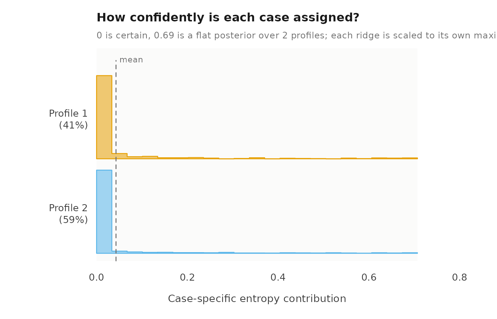
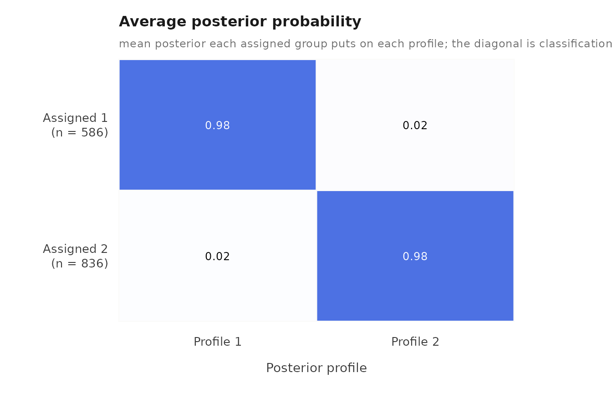
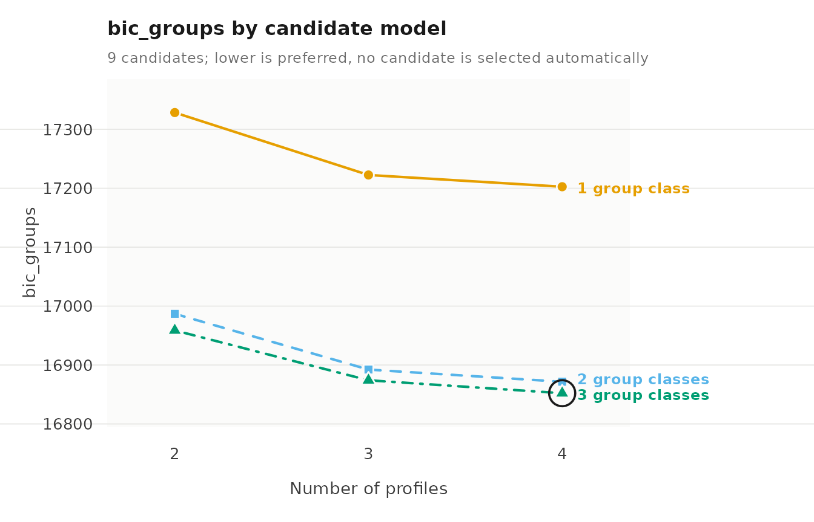

# Evaluating a multilevel latent profile model

A fitted mixture model is evaluated on four questions: whether the
estimation found a stable solution, how clearly observations and groups
are classified, whether the indicators are independent within profiles
as the model assumes, and whether a different number of profiles or
group classes fits better.

## Data

`course_engagement` has one row per course enrolment: 1,422 enrolments
from 106 students. `student` identifies the group, and five activity
measures (`browse`, `lectures`, `forum_read`, `forum_post`,
`attendance`) are the indicators, each standardized within course.

``` r

library(latents)
```

## The model to evaluate

To fit the model, we call
[`multilpa()`](https://pak.dynasite.org/latents/reference/multilpa.md)
with `vars` for the indicators, `id` for the group, `n_profiles` for the
number of profiles, `n_group_classes` for the number of group classes,
`n_starts` for the number of random EM starts, and `seed` for
reproducible starts.

``` r

fit <- multilpa(course_engagement,
                vars = c("browse", "lectures", "forum_read", "forum_post",
                         "attendance"),
                id = "student", n_profiles = 2, n_group_classes = 2,
                n_starts = 10, seed = 1)
```

## Estimation

To check convergence, we call
[`get_results()`](https://pak.dynasite.org/latents/reference/get_results.md)
with `"model"`. `converged` reports convergence of the best start,
`boundary` whether a variance reached its lower bound, and
`n_best_replicated` how many starts reached the best log likelihood.

``` r

get_results(fit, "model")
#>   n_observations n_informative n_groups n_profiles n_group_classes centering covariance_structure
#> 1           1422          1422      106          2               2      none                  VVI
#>   n_parameters n_parameters_with_measurement log_likelihood   aic bic_groups bic_individual
#> 1           23                            23          -8440 16926      16987          17047
#>   converged iterations boundary small_classes best_start n_best_replicated
#> 1      TRUE          8    FALSE         FALSE          8                10
```

To check the individual starts, we call
[`get_results()`](https://pak.dynasite.org/latents/reference/get_results.md)
with `"starts"`.

``` r

get_results(fit, "starts")
#>    start log_likelihood converged iterations error boundary
#> 1      1          -8440      TRUE         10  <NA>    FALSE
#> 2      2          -8440      TRUE         10  <NA>    FALSE
#> 3      3          -8440      TRUE         10  <NA>    FALSE
#> 4      4          -8440      TRUE         13  <NA>    FALSE
#> 5      5          -8440      TRUE         10  <NA>    FALSE
#> 6      6          -8440      TRUE         12  <NA>    FALSE
#> 7      7          -8440      TRUE         10  <NA>    FALSE
#> 8      8          -8440      TRUE          8  <NA>    FALSE
#> 9      9          -8440      TRUE         10  <NA>    FALSE
#> 10    10          -8440      TRUE          9  <NA>    FALSE
```

To check whether other random seeds reach the same solution, we call
[`sensitivity()`](https://pak.dynasite.org/latents/reference/sensitivity.md)
with `seeds` for the seeds to try. `optimum` numbers the distinct maxima
found, and `agreement` is the share of observations assigned as in the
original fit, after matching the arbitrary profile labels.

``` r

sensitivity(fit, seeds = 1:5)
#>   seed log_likelihood converged iterations optimum best agreement
#> 1    1          -8440      TRUE          8       1 TRUE         1
#> 2    2          -8440      TRUE         14       1 TRUE         1
#> 3    3          -8440      TRUE         13       1 TRUE         1
#> 4    4          -8440      TRUE          9       1 TRUE         1
#> 5    5          -8440      TRUE         12       1 TRUE         1
```

## Classification

To obtain relative entropy, we call
[`get_results()`](https://pak.dynasite.org/latents/reference/get_results.md)
with `"entropy"`. It is reported for observations and for groups: 1
means every case is assigned with certainty, 0 means no separation.

``` r

get_results(fit, "entropy")
#>         level n_classes n_units entropy_sum relative_entropy
#> 1 individuals         2    1422       60.94            0.938
#> 2      groups         2     106        4.44            0.940
```

To obtain classification quality by class, we call
[`get_results()`](https://pak.dynasite.org/latents/reference/get_results.md)
with `"classification"`. `n_modal` is the number of cases assigned to
the class, `average_posterior` the mean posterior probability of those
cases, and `odds_correct_classification` compares that certainty with
the class’s size.

``` r

get_results(fit, "classification")
#>         level class n_modal proportion_modal estimated_n estimated_proportion average_posterior
#> 1 individuals     1     586            0.412       587.9                0.413             0.982
#> 2 individuals     2     836            0.588       834.1                0.587             0.985
#> 3      groups     1      35            0.330        34.5                0.325             0.969
#> 4      groups     2      71            0.670        71.5                0.675             0.992
#>   odds_correct_classification
#> 1                        76.4
#> 2                        46.1
#> 3                        64.9
#> 4                        59.8
```

To see the uncertainty, we call
[`plot()`](https://rdrr.io/r/graphics/plot.default.html) with
`what = "entropy"` for the per-case uncertainty within each profile, and
with `what = "avepp"` for the average posterior of each assigned class
across all classes.

``` r

plot(fit, what = "entropy")
```



``` r

plot(fit, what = "avepp")
```



## Local independence

The default model assumes the indicators are independent within a
profile. To test this, we call
[`get_results()`](https://pak.dynasite.org/latents/reference/get_results.md)
with `"residuals"`. `residual` is the correlation between two indicators
that the profiles leave unexplained; `by = "overall"` pools the
profiles. The p-values are approximate.

``` r

get_results(fit, "residuals", by = "overall")
#>    profile indicator_1 indicator_2     kind observed expected residual effective_n statistic df
#> 1  overall  forum_read  attendance gaussian  0.21588        0  0.21588        1422    8.2620 NA
#> 2  overall    lectures  attendance gaussian  0.19234        0  0.19234        1422    7.3367 NA
#> 3  overall      browse  attendance gaussian  0.18077        0  0.18077        1422    6.8851 NA
#> 4  overall  forum_post  attendance gaussian  0.17239        0  0.17239        1422    6.5592 NA
#> 5  overall      browse  forum_read gaussian  0.06266        0  0.06266        1422    2.3634 NA
#> 6  overall      browse  forum_post gaussian -0.02511        0 -0.02511        1422   -0.9462 NA
#> 7  overall      browse    lectures gaussian -0.02126        0 -0.02126        1422   -0.8010 NA
#> 8  overall  forum_read  forum_post gaussian  0.01986        0  0.01986        1422    0.7482 NA
#> 9  overall    lectures  forum_post gaussian  0.01709        0  0.01709        1422    0.6438 NA
#> 10 overall    lectures  forum_read gaussian  0.00192        0  0.00192        1422    0.0724 NA
#>     p_value p_adjusted
#> 1  1.43e-16   1.43e-16
#> 2  2.19e-13   2.19e-13
#> 3  5.78e-12   5.78e-12
#> 4  5.41e-11   5.41e-11
#> 5  1.81e-02   1.81e-02
#> 6  3.44e-01   3.44e-01
#> 7  4.23e-01   4.23e-01
#> 8  4.54e-01   4.54e-01
#> 9  5.20e-01   5.20e-01
#> 10 9.42e-01   9.42e-01
```

To relax the assumption, we call
[`multilpa()`](https://pak.dynasite.org/latents/reference/multilpa.md)
with `covariance_model = "full"`, which estimates the covariances
between indicators within each profile. To compare the two models, we
call
[`get_results()`](https://pak.dynasite.org/latents/reference/get_results.md)
with `"information_criteria"` on each; lower values are better.

``` r

full <- multilpa(course_engagement,
                 vars = c("browse", "lectures", "forum_read", "forum_post",
                          "attendance"),
                 id = "student", n_profiles = 2, n_group_classes = 2,
                 covariance_model = "full", n_starts = 10, seed = 1)
get_results(fit, "information_criteria")
#>   log_likelihood n_parameters   aic   kic bic_groups bic_individual sabic_groups sabic_individual
#> 1          -8440           23 16926 16952      16987          17047        16914            16974
#>   caic_groups caic_individual awe_groups awe_individual icl_groups icl_individual clc_groups
#> 1       17010           17070      17172          17404      16996          17168      16889
#>   clc_individual
#> 1          17002
get_results(full, "information_criteria")
#>   log_likelihood n_parameters   aic   kic bic_groups bic_individual sabic_groups sabic_individual
#> 1          -8313           43 16712 16758      16827          16938        16691            16802
#>   caic_groups caic_individual awe_groups awe_individual icl_groups icl_individual clc_groups
#> 1       16870           16981      17165          17564      16835          17123      16635
#>   clc_individual
#> 1          16811
get_results(full, "residuals", by = "overall")
#>    profile indicator_1 indicator_2     kind observed expected  residual effective_n statistic df
#> 1  overall  forum_read  forum_post gaussian  0.02438  0.02439 -1.32e-05        1422 -4.97e-04 NA
#> 2  overall    lectures  forum_post gaussian  0.02010  0.02011 -1.20e-05        1422 -4.50e-04 NA
#> 3  overall  forum_post  attendance gaussian  0.18793  0.18794 -1.09e-05        1422 -4.25e-04 NA
#> 4  overall    lectures  forum_read gaussian  0.00887  0.00888 -8.96e-06        1422 -3.38e-04 NA
#> 5  overall    lectures  attendance gaussian  0.20504  0.20505 -7.49e-06        1422 -2.94e-04 NA
#> 6  overall      browse  forum_post gaussian -0.01866 -0.01865 -6.84e-06        1422 -2.58e-04 NA
#> 7  overall  forum_read  attendance gaussian  0.24180  0.24180 -4.19e-06        1422 -1.68e-04 NA
#> 8  overall      browse    lectures gaussian -0.01380 -0.01379 -4.10e-06        1422 -1.55e-04 NA
#> 9  overall      browse  forum_read gaussian  0.07442  0.07441  1.16e-06        1422  4.40e-05 NA
#> 10 overall      browse  attendance gaussian  0.20382  0.20382  6.60e-07        1422  2.59e-05 NA
#>    p_value p_adjusted
#> 1        1          1
#> 2        1          1
#> 3        1          1
#> 4        1          1
#> 5        1          1
#> 6        1          1
#> 7        1          1
#> 8        1          1
#> 9        1          1
#> 10       1          1
```

## Number of profiles and group classes

To compare numbers of profiles and group classes, we call
[`enumerate_classes()`](https://pak.dynasite.org/latents/reference/enumerate_classes.md)
with `n_profiles` and `n_group_classes` for the counts to cross. It fits
every combination and does not choose a model.

``` r

candidates <- enumerate_classes(course_engagement,
                                vars = c("browse", "lectures", "forum_read",
                                         "forum_post", "attendance"),
                                id = "student", n_profiles = 2:4,
                                n_group_classes = 1:3, n_starts = 5, seed = 1)
as.data.frame(candidates)
#>   n_profiles n_group_classes model log_likelihood n_parameters   aic   kic bic_groups
#> 1          2               1   VVI          -8615           21 17272 17296      17328
#> 2          3               1   VVI          -8537           32 17137 17172      17222
#> 3          4               1   VVI          -8501           43 17088 17134      17203
#> 4          2               2   VVI          -8440           23 16926 16952      16987
#> 5          3               2   VVI          -8365           35 16799 16837      16892
#> 6          4               2   VVI          -8326           47 16746 16796      16872
#> 7          2               3   VVI          -8421           25 16892 16920      16959
#> 8          3               3   VVI          -8348           38 16773 16814      16874
#> 9          4               3   VVI          -8307           51 16716 16770      16852
#>   bic_individual sabic_groups sabic_individual caic_groups caic_individual awe_groups
#> 1          17383        17262            17316       17349           17404      17489
#> 2          17306        17121            17204       17254           17338      17468
#> 3          17314        17067            17178       17246           17357      17532
#> 4          17047        16914            16974       17010           17070      17172
#> 5          16983        16782            16872       16927           17018      17169
#> 6          16994        16723            16844       16919           17041      17241
#> 7          17024        16880            16944       16984           17049      17193
#> 8          16973        16754            16852       16912           17011      17212
#> 9          16985        16691            16823       16903           17036      17284
#>   awe_individual icl_groups icl_individual clc_groups clc_individual profile_entropy group_entropy
#> 1          17753      17328          17537      17230          17385           0.922            NA
#> 2          18346      17222          18018      17073          17785           0.772            NA
#> 3          18802      17203          18361      17002          18048           0.735            NA
#> 4          17404      16996          17168      16888          17002           0.938         0.940
#> 5          18000      16901          17641      16737          17387           0.789         0.943
#> 6          18505      16881          18023      16662          17682           0.739         0.937
#> 7          17398      17002          17142      16885          16960           0.940         0.816
#> 8          18013      16921          17623      16744          17347           0.792         0.797
#> 9          18540      16893          18017      16656          17646           0.738         0.823
#>   converged boundary n_best_replicated warnings error
#> 1      TRUE    FALSE                 5           <NA>
#> 2      TRUE    FALSE                 5           <NA>
#> 3      TRUE    FALSE                 5           <NA>
#> 4      TRUE    FALSE                 5           <NA>
#> 5      TRUE    FALSE                 5           <NA>
#> 6      TRUE    FALSE                 5           <NA>
#> 7      TRUE    FALSE                 5           <NA>
#> 8      TRUE    FALSE                 5           <NA>
#> 9      TRUE    FALSE                 5           <NA>
```

To find which candidate minimizes each criterion, we call
[`get_results()`](https://pak.dynasite.org/latents/reference/get_results.md)
with `"criteria"`. Criteria that depend on a sample size are reported
with the number of groups and with the number of observations.

``` r

get_results(candidates, "criteria")
#>    criterion  convention n_profiles n_group_classes model value
#> 1        aic        <NA>          4               3   VVI 16716
#> 2        kic        <NA>          4               3   VVI 16770
#> 3        bic      groups          4               3   VVI 16852
#> 4        bic individuals          3               3   VVI 16973
#> 5      sabic      groups          4               3   VVI 16691
#> 6      sabic individuals          4               3   VVI 16823
#> 7       caic      groups          4               3   VVI 16903
#> 8       caic individuals          3               3   VVI 17011
#> 9        awe      groups          3               2   VVI 17169
#> 10       awe individuals          2               3   VVI 17398
#> 11       icl      groups          4               2   VVI 16881
#> 12       icl individuals          2               3   VVI 17142
#> 13       clc      groups          4               3   VVI 16656
#> 14       clc individuals          2               3   VVI 16960
```

To draw one criterion across the grid, we call
[`plot()`](https://rdrr.io/r/graphics/plot.default.html) with
`criterion` for its name.

``` r

plot(candidates, criterion = "bic_groups")
```



To take one candidate out of the grid as a fitted model, we call
[`candidate_fit()`](https://pak.dynasite.org/latents/reference/candidate_fit.md)
with its `n_profiles` and `n_group_classes`.

``` r

candidate_fit(candidates, n_profiles = 3, n_group_classes = 2)
#> Two-level latent profile analysis: 3 profiles, 2 group classes
#> 1422 individuals in 106 groups; varying diagonal residual covariance (VVI)
#> Log likelihood: -8364.520986 | AIC: 16799.042 | BIC (groups): 16892.262
#> Converged: TRUE | iterations: 115 | best start: 4/5
#> 
#>  profile browse lectures forum_read forum_post attendance count proportion
#>        1  0.703    0.708      0.805      0.744      1.114   384      0.270
#>        2  0.375    0.165      0.433      0.320      0.238   468      0.329
#>        3 -0.782   -0.613     -0.898     -0.765     -0.946   570      0.401
#> 
#> Variances and standard errors: get_results(x, "profiles"). 
#> Every other table: get_results(x, what = ), or get_results(x, "all").
```

## Parameter uncertainty

To obtain standard errors and 95% Wald intervals, we call
[`parameter_inference()`](https://pak.dynasite.org/latents/reference/parameter_inference.md)
on the fit. With `vcov_type = "robust"`, the standard errors are
clustered on groups.

``` r

parameter_inference(fit)
#>          level       outcome          term   parameter estimate standard_error statistic   p_value
#> 1  measurement     profile_1        browse        mean   -0.766         0.0312     -24.5 7.50e-133
#> 2  measurement     profile_1      lectures        mean   -0.606         0.0309     -19.6  1.33e-85
#> 3  measurement     profile_1    forum_read        mean   -0.879         0.0262     -33.5 1.48e-246
#> 4  measurement     profile_1    forum_post        mean   -0.753         0.0277     -27.2 8.47e-163
#> 5  measurement     profile_1    attendance        mean   -0.921         0.0264     -34.8 6.92e-266
#> 6  measurement     profile_2        browse        mean    0.540         0.0271      19.9  3.33e-88
#> 7  measurement     profile_2      lectures        mean    0.427         0.0325      13.2  1.55e-39
#> 8  measurement     profile_2    forum_read        mean    0.620         0.0247      25.1 1.22e-138
#> 9  measurement     profile_2    forum_post        mean    0.531         0.0295      18.0  3.64e-72
#> 10 measurement     profile_2    attendance        mean    0.649         0.0223      29.2 7.57e-187
#> 11 measurement     profile_1        browse    variance    0.528         0.0322        NA        NA
#> 12 measurement     profile_1      lectures    variance    0.538         0.0321        NA        NA
#> 13 measurement     profile_1    forum_read    variance    0.363         0.0228        NA        NA
#> 14 measurement     profile_1    forum_post    variance    0.421         0.0261        NA        NA
#> 15 measurement     profile_1    attendance    variance    0.374         0.0228        NA        NA
#> 16 measurement     profile_2        browse    variance    0.590         0.0295        NA        NA
#> 17 measurement     profile_2      lectures    variance    0.845         0.0421        NA        NA
#> 18 measurement     profile_2    forum_read    variance    0.481         0.0244        NA        NA
#> 19 measurement     profile_2    forum_post    variance    0.689         0.0348        NA        NA
#> 20 measurement     profile_2    attendance    variance    0.384         0.0196        NA        NA
#> 21     profile     profile_1 group_class_1 probability    0.829         0.0221        NA        NA
#> 22     profile     profile_2 group_class_1 probability    0.171         0.0221        NA        NA
#> 23     profile     profile_1 group_class_2 probability    0.214         0.0155        NA        NA
#> 24     profile     profile_2 group_class_2 probability    0.786         0.0155        NA        NA
#> 25       group group_class_1          <NA> probability    0.325         0.0476        NA        NA
#> 26       group group_class_2          <NA> probability    0.675         0.0476        NA        NA
#>    p_adjusted conf_low conf_high
#> 1   7.50e-133   -0.827    -0.704
#> 2    1.33e-85   -0.667    -0.546
#> 3   1.48e-246   -0.931    -0.828
#> 4   8.47e-163   -0.807    -0.698
#> 5   6.92e-266   -0.972    -0.869
#> 6    3.33e-88    0.486     0.593
#> 7    1.55e-39    0.364     0.491
#> 8   1.22e-138    0.571     0.668
#> 9    3.64e-72    0.473     0.588
#> 10  7.57e-187    0.605     0.693
#> 11         NA    0.465     0.592
#> 12         NA    0.475     0.601
#> 13         NA    0.318     0.408
#> 14         NA    0.370     0.472
#> 15         NA    0.329     0.418
#> 16         NA    0.532     0.648
#> 17         NA    0.762     0.927
#> 18         NA    0.434     0.529
#> 19         NA    0.621     0.757
#> 20         NA    0.346     0.422
#> 21         NA    0.786     0.873
#> 22         NA    0.127     0.214
#> 23         NA    0.184     0.244
#> 24         NA    0.756     0.816
#> 25         NA    0.232     0.419
#> 26         NA    0.581     0.768
parameter_inference(fit, vcov_type = "robust")
#>          level       outcome          term   parameter estimate standard_error statistic   p_value
#> 1  measurement     profile_1        browse        mean   -0.766         0.0306     -25.0 4.52e-138
#> 2  measurement     profile_1      lectures        mean   -0.606         0.0355     -17.1  1.54e-65
#> 3  measurement     profile_1    forum_read        mean   -0.879         0.0267     -32.9 4.23e-237
#> 4  measurement     profile_1    forum_post        mean   -0.753         0.0274     -27.4 9.68e-166
#> 5  measurement     profile_1    attendance        mean   -0.921         0.0274     -33.6 1.64e-247
#> 6  measurement     profile_2        browse        mean    0.540         0.0306      17.6  1.23e-69
#> 7  measurement     profile_2      lectures        mean    0.427         0.0311      13.8  4.73e-43
#> 8  measurement     profile_2    forum_read        mean    0.620         0.0248      25.0 2.52e-138
#> 9  measurement     profile_2    forum_post        mean    0.531         0.0292      18.2  1.14e-73
#> 10 measurement     profile_2    attendance        mean    0.649         0.0235      27.6 1.51e-167
#> 11 measurement     profile_1        browse    variance    0.528         0.0288        NA        NA
#> 12 measurement     profile_1      lectures    variance    0.538         0.0305        NA        NA
#> 13 measurement     profile_1    forum_read    variance    0.363         0.0203        NA        NA
#> 14 measurement     profile_1    forum_post    variance    0.421         0.0277        NA        NA
#> 15 measurement     profile_1    attendance    variance    0.374         0.0226        NA        NA
#> 16 measurement     profile_2        browse    variance    0.590         0.0278        NA        NA
#> 17 measurement     profile_2      lectures    variance    0.845         0.0451        NA        NA
#> 18 measurement     profile_2    forum_read    variance    0.481         0.0216        NA        NA
#> 19 measurement     profile_2    forum_post    variance    0.689         0.0338        NA        NA
#> 20 measurement     profile_2    attendance    variance    0.384         0.0180        NA        NA
#> 21     profile     profile_1 group_class_1 probability    0.829         0.0328        NA        NA
#> 22     profile     profile_2 group_class_1 probability    0.171         0.0328        NA        NA
#> 23     profile     profile_1 group_class_2 probability    0.214         0.0230        NA        NA
#> 24     profile     profile_2 group_class_2 probability    0.786         0.0230        NA        NA
#> 25       group group_class_1          <NA> probability    0.325         0.0487        NA        NA
#> 26       group group_class_2          <NA> probability    0.675         0.0487        NA        NA
#>    p_adjusted conf_low conf_high
#> 1   4.52e-138   -0.826    -0.706
#> 2    1.54e-65   -0.676    -0.537
#> 3   4.23e-237   -0.932    -0.827
#> 4   9.68e-166   -0.806    -0.699
#> 5   1.64e-247   -0.974    -0.867
#> 6    1.23e-69    0.480     0.600
#> 7    4.73e-43    0.367     0.488
#> 8   2.52e-138    0.571     0.668
#> 9    1.14e-73    0.473     0.588
#> 10  1.51e-167    0.603     0.695
#> 11         NA    0.472     0.585
#> 12         NA    0.479     0.598
#> 13         NA    0.323     0.403
#> 14         NA    0.367     0.476
#> 15         NA    0.329     0.418
#> 16         NA    0.535     0.644
#> 17         NA    0.756     0.933
#> 18         NA    0.439     0.524
#> 19         NA    0.623     0.755
#> 20         NA    0.349     0.419
#> 21         NA    0.765     0.894
#> 22         NA    0.106     0.235
#> 23         NA    0.169     0.259
#> 24         NA    0.741     0.831
#> 25         NA    0.230     0.421
#> 26         NA    0.579     0.770
```

## Reference

The calls below list other evaluation functions and views. Each comment
states what the call returns.

``` r

get_results(fit, "information_criteria", format = "long")  # one row per criterion
get_results(fit, "average_posteriors")          # mean posterior by assigned class
get_results(fit, "classification_errors")       # P(assigned class | true class)
get_results(fit, "residuals")                   # residuals within each profile
get_results(candidates, "candidates")           # the full enumeration grid
summary(candidates)                             # the best candidate on each criterion
bootstrap_lrt(fit, candidate_fit(candidates, n_profiles = 3, n_group_classes = 2),
              iter = 199, seed = 42)            # bootstrap test of one more class (slow)
enumerate_classes(course_engagement, vars = c("browse", "lectures"),
                  id = "student", n_profiles = 2:3,
                  model = c("VVI", "VVV"))      # crossing covariance models (slow)
confint(fit)                                    # confidence intervals
vcov(fit, vcov_type = "robust")                 # robust covariance matrix
plot(fit, what = "posteriors")                  # posterior of each assigned profile
plot(fit, what = "bars")                        # profile means with 95% intervals
diagnostics(fit)                                # all classification diagnostics
```

## Limits

- Information criteria compare the candidates fitted, not all possible
  models.
- Classification measures describe the fitted model; a misspecified
  model can still classify sharply.
- Wald intervals assume a converged fit with no variance at its bound,
  and are conditional on the chosen numbers of profiles and classes.
- Unmodelled dependence between indicators can make extra classes look
  better.
