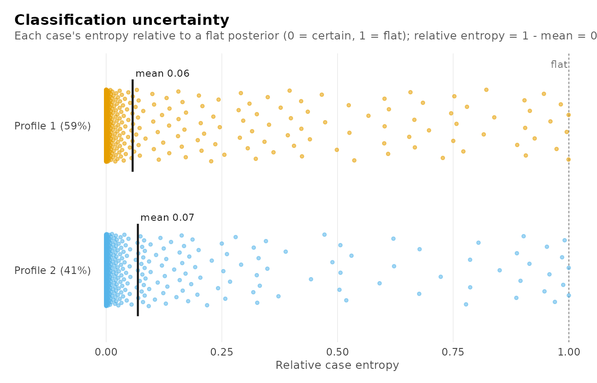
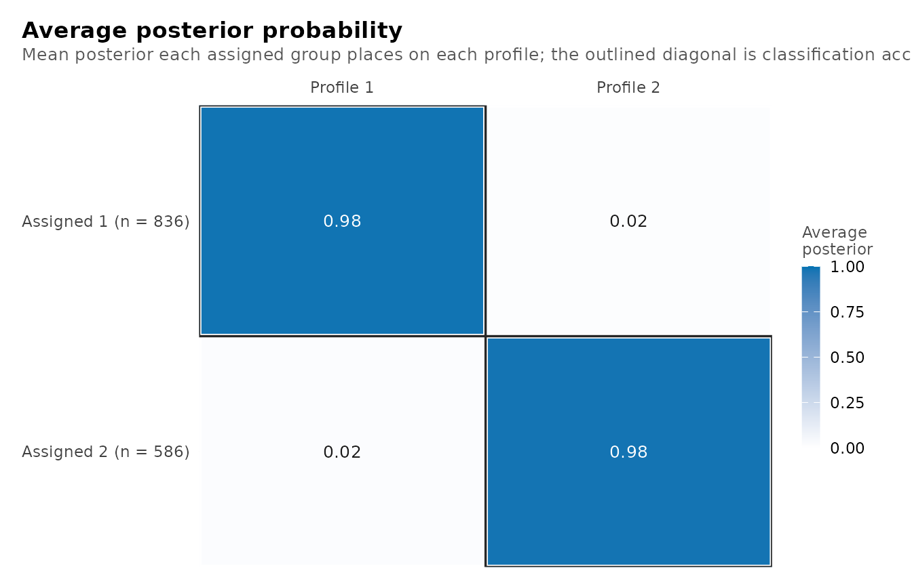
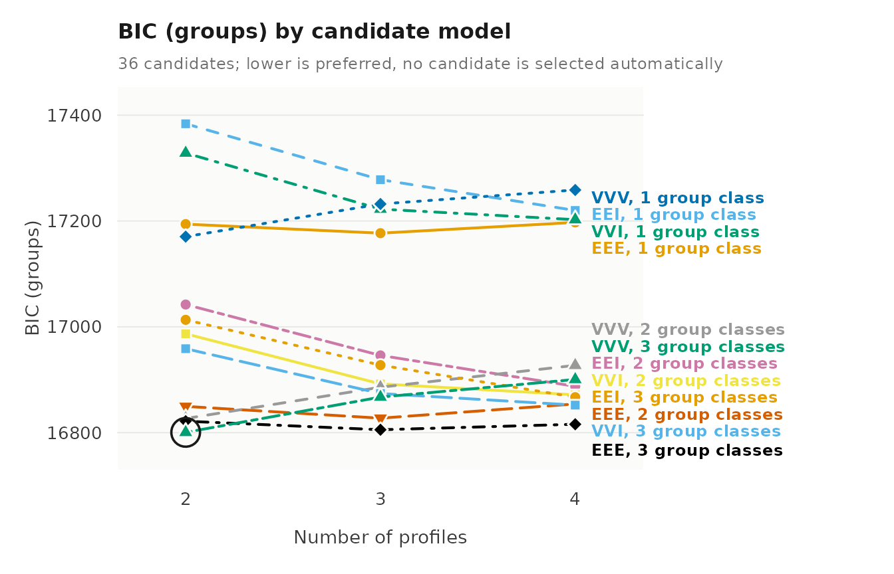

# Evaluating a multilevel latent profile model

A fitted mixture model is evaluated on four questions: whether the
estimation found a stable solution, how clearly observations and groups
are classified, whether the indicators are independent within profiles
as the model assumes, and whether a different number of profiles or
group classes fits better.

## Data

`course_engagement` has one row per course enrolment: 1,422 enrolments
from 106 students. `student` identifies the group, and five activity
measures (`browse`, `lectures`, `forum_read`, `forum_post`,
`attendance`) are the indicators, each standardized within course.

``` r

library(latents)
```

## The model to evaluate

To fit the model, we call
[`multilpa()`](https://pak.dynasite.org/latents/reference/multilpa.md)
with `vars` for the indicators, `id` for the group, `n_profiles` for the
number of profiles, `n_group_classes` for the number of group classes,
`n_starts` for the number of random EM starts, and `seed` for
reproducible starts.

``` r

fit <- multilpa(course_engagement,
                vars = c("browse", "lectures", "forum_read", "forum_post",
                         "attendance"),
                id = "student", n_profiles = 2, n_group_classes = 2,
                n_starts = 3, seed = 1)
```

## Estimation

To check convergence, we call
[`get_results()`](https://pak.dynasite.org/latents/reference/get_results.md)
with `"model"`. `converged` reports convergence of the best start,
`boundary` whether a variance reached its lower bound, and
`n_best_replicated` how many starts reached the best log likelihood.

``` r

get_results(fit, "model")
#>   n_observations n_informative n_groups n_profiles n_group_classes centering covariance_structure
#> 1           1422          1422      106          2               2      none                  VVI
#>   n_parameters n_parameters_with_measurement log_likelihood   aic bic_groups bic_individual
#> 1           23                            23          -8440 16926      16987          17047
#>   converged iterations boundary small_classes best_start n_best_replicated
#> 1      TRUE          9    FALSE         FALSE          1                 3
```

To check the individual starts, we call
[`get_results()`](https://pak.dynasite.org/latents/reference/get_results.md)
with `"starts"`.

``` r

get_results(fit, "starts")
#>   start log_likelihood converged iterations error boundary
#> 1     1          -8440      TRUE          9  <NA>    FALSE
#> 2     2          -8440      TRUE         12  <NA>    FALSE
#> 3     3          -8440      TRUE          9  <NA>    FALSE
```

To check whether other random seeds reach the same solution, we call
[`sensitivity()`](https://pak.dynasite.org/latents/reference/sensitivity.md)
with `seeds` for the seeds to try. `optimum` numbers the distinct maxima
found, and `agreement` is the share of observations assigned as in the
original fit, after matching the arbitrary profile labels.

``` r

sensitivity(fit, seeds = 1:3)
#>   seed log_likelihood converged iterations optimum best agreement
#> 1    1          -8440      TRUE          9       1 TRUE         1
#> 2    2          -8440      TRUE          9       1 TRUE         1
#> 3    3          -8440      TRUE          9       1 TRUE         1
```

## Classification

To obtain relative entropy, we call
[`get_results()`](https://pak.dynasite.org/latents/reference/get_results.md)
with `"entropy"`. It is reported for observations and for groups: 1
means every case is assigned with certainty, 0 means no separation.

``` r

get_results(fit, "entropy")
#>         level n_classes n_units entropy_sum relative_entropy
#> 1 individuals         2    1422       60.94            0.938
#> 2      groups         2     106        4.43            0.940
```

To obtain classification quality by class, we call
[`get_results()`](https://pak.dynasite.org/latents/reference/get_results.md)
with `"classification"`. `n_modal` is the number of cases assigned to
the class, `average_posterior` the mean posterior probability of those
cases, and `odds_correct_classification` compares that certainty with
the class’s size.

``` r

get_results(fit, "classification")
#>         level class n_modal proportion_modal estimated_n estimated_proportion average_posterior
#> 1 individuals     1     836            0.588       834.1                0.587             0.985
#> 2 individuals     2     586            0.412       587.9                0.413             0.982
#> 3      groups     1      71            0.670        71.5                0.675             0.992
#> 4      groups     2      35            0.330        34.5                0.325             0.969
#>   odds_correct_classification
#> 1                        46.1
#> 2                        76.4
#> 3                        59.9
#> 4                        64.8
```

To see the uncertainty, we call
[`plot()`](https://rdrr.io/r/graphics/plot.default.html) with
`what = "entropy"` for the per-case uncertainty within each profile, and
with `what = "avepp"` for the average posterior of each assigned class
across all classes.

``` r

plot(fit, what = "entropy")
```



``` r

plot(fit, what = "avepp")
```



## Local independence

The default model assumes the indicators are independent within a
profile. To test this, we call
[`get_results()`](https://pak.dynasite.org/latents/reference/get_results.md)
with `"residuals"`. `residual` is the correlation between two indicators
that the profiles leave unexplained; `by = "overall"` pools the
profiles. The p-values are approximate.

``` r

get_results(fit, "residuals", by = "overall")
#>    profile indicator_1 indicator_2     kind observed expected residual effective_n statistic df
#> 1  overall  forum_read  attendance gaussian  0.21588        0  0.21588        1422    8.2620 NA
#> 2  overall    lectures  attendance gaussian  0.19234        0  0.19234        1422    7.3369 NA
#> 3  overall      browse  attendance gaussian  0.18077        0  0.18077        1422    6.8850 NA
#> 4  overall  forum_post  attendance gaussian  0.17239        0  0.17239        1422    6.5594 NA
#> 5  overall      browse  forum_read gaussian  0.06265        0  0.06265        1422    2.3632 NA
#> 6  overall      browse  forum_post gaussian -0.02511        0 -0.02511        1422   -0.9461 NA
#> 7  overall      browse    lectures gaussian -0.02126        0 -0.02126        1422   -0.8009 NA
#> 8  overall  forum_read  forum_post gaussian  0.01986        0  0.01986        1422    0.7483 NA
#> 9  overall    lectures  forum_post gaussian  0.01710        0  0.01710        1422    0.6440 NA
#> 10 overall    lectures  forum_read gaussian  0.00193        0  0.00193        1422    0.0725 NA
#>     p_value p_adjusted
#> 1  1.43e-16   1.43e-16
#> 2  2.19e-13   2.19e-13
#> 3  5.78e-12   5.78e-12
#> 4  5.40e-11   5.40e-11
#> 5  1.81e-02   1.81e-02
#> 6  3.44e-01   3.44e-01
#> 7  4.23e-01   4.23e-01
#> 8  4.54e-01   4.54e-01
#> 9  5.20e-01   5.20e-01
#> 10 9.42e-01   9.42e-01
```

To relax the assumption, we call
[`multilpa()`](https://pak.dynasite.org/latents/reference/multilpa.md)
with `covariance_model = "full"`, which estimates the covariances
between indicators within each profile. To compare the two models, we
call
[`get_results()`](https://pak.dynasite.org/latents/reference/get_results.md)
with `"information_criteria"` on each; lower values are better.

``` r

full <- multilpa(course_engagement,
                 vars = c("browse", "lectures", "forum_read", "forum_post",
                          "attendance"),
                 id = "student", n_profiles = 2, n_group_classes = 2,
                 covariance_model = "full", n_starts = 3, seed = 1)
get_results(fit, "information_criteria")
#>   log_likelihood n_parameters   aic   kic bic_groups bic_individual sabic_groups sabic_individual
#> 1          -8440           23 16926 16952      16987          17047        16914            16974
#>   caic_groups caic_individual awe_groups awe_individual icl_groups icl_individual clc_groups
#> 1       17010           17070      17172          17404      16996          17168      16889
#>   clc_individual
#> 1          17002
get_results(full, "information_criteria")
#>   log_likelihood n_parameters   aic   kic bic_groups bic_individual sabic_groups sabic_individual
#> 1          -8313           43 16712 16758      16827          16938        16691            16802
#>   caic_groups caic_individual awe_groups awe_individual icl_groups icl_individual clc_groups
#> 1       16870           16981      17165          17564      16835          17123      16635
#>   clc_individual
#> 1          16811
get_results(full, "residuals", by = "overall")
#>    profile indicator_1 indicator_2     kind observed expected residual effective_n statistic df
#> 1  overall    lectures  attendance gaussian  0.20502  0.20502 1.76e-06        1422  6.94e-05 NA
#> 2  overall      browse  attendance gaussian  0.20383  0.20382 1.57e-06        1422  6.16e-05 NA
#> 3  overall      browse    lectures gaussian -0.01381 -0.01381 1.51e-06        1422  5.69e-05 NA
#> 4  overall  forum_post  attendance gaussian  0.18790  0.18790 1.49e-06        1422  5.82e-05 NA
#> 5  overall    lectures  forum_post gaussian  0.02007  0.02007 1.40e-06        1422  5.29e-05 NA
#> 6  overall      browse  forum_post gaussian -0.01867 -0.01867 1.24e-06        1422  4.67e-05 NA
#> 7  overall    lectures  forum_read gaussian  0.00885  0.00885 1.17e-06        1422  4.39e-05 NA
#> 8  overall  forum_read  attendance gaussian  0.24179  0.24179 7.72e-07        1422  3.09e-05 NA
#> 9  overall      browse  forum_read gaussian  0.07442  0.07442 5.60e-07        1422  2.12e-05 NA
#> 10 overall  forum_read  forum_post gaussian  0.02435  0.02435 4.90e-07        1422  1.85e-05 NA
#>    p_value p_adjusted
#> 1        1          1
#> 2        1          1
#> 3        1          1
#> 4        1          1
#> 5        1          1
#> 6        1          1
#> 7        1          1
#> 8        1          1
#> 9        1          1
#> 10       1          1
```

## Number of profiles and group classes

To compare numbers of profiles and group classes, we call
[`enumerate_classes()`](https://pak.dynasite.org/latents/reference/enumerate_classes.md)
with `n_profiles` and `n_group_classes` for the counts to cross. It
crosses the counts with four covariance structures, equal or varying
variances with and without covariances, fits every combination, and does
not choose a model.

``` r

candidates <- enumerate_classes(course_engagement,
                                vars = c("browse", "lectures", "forum_read",
                                         "forum_post", "attendance"),
                                id = "student", n_profiles = 2:4,
                                n_group_classes = 1:3, n_starts = 3, seed = 1)
as.data.frame(candidates)
#>    n_profiles n_group_classes model log_likelihood n_parameters   aic   kic bic_groups
#> 1           2               1   EEI          -8655           16 17341 17360      17384
#> 2           3               1   EEI          -8588           22 17219 17244      17278
#> 3           4               1   EEI          -8545           28 17145 17176      17220
#> 4           2               2   EEI          -8479           18 16994 17015      17042
#> 5           3               2   EEI          -8415           25 16879 16907      16946
#> 6           4               2   EEI          -8369           32 16802 16837      16888
#> 7           2               3   EEI          -8460           20 16960 16983      17013
#> 8           3               3   EEI          -8399           28 16853 16884      16928
#> 9           4               3   EEI          -8350           36 16771 16810      16867
#> 10          2               1   VVI          -8615           21 17272 17296      17328
#> 11          3               1   VVI          -8537           32 17137 17172      17222
#> 12          4               1   VVI          -8501           43 17088 17134      17203
#> 13          2               2   VVI          -8440           23 16926 16952      16987
#> 14          3               2   VVI          -8365           35 16799 16837      16892
#> 15          4               2   VVI          -8326           47 16746 16796      16872
#> 16          2               3   VVI          -8421           25 16892 16920      16959
#> 17          3               3   VVI          -8348           38 16773 16814      16874
#> 18          4               3   VVI          -8307           51 16716 16770      16852
#> 19          2               1   EEE          -8536           26 17125 17154      17194
#> 20          3               1   EEE          -8514           32 17092 17127      17177
#> 21          4               1   EEE          -8510           38 17096 17137      17197
#> 22          2               2   EEE          -8360           28 16775 16806      16850
#> 23          3               2   EEE          -8332           35 16734 16772      16827
#> 24          4               2   EEE          -8329           42 16742 16787      16854
#> 25          2               3   EEE          -8341           30 16742 16775      16822
#> 26          3               3   EEE          -8314           38 16704 16745      16806
#> 27          4               3   EEE          -8301           46 16693 16742      16816
#> 28          2               1   VVV          -8490           41 17061 17105      17170
#> 29          3               1   VVV          -8472           62 17067 17132      17232
#> 30          4               1   VVV          -8436           83 17038 17124      17259
#> 31          2               2   VVV          -8313           43 16712 16758      16827
#> 32          3               2   VVV          -8291           65 16713 16781      16886
#> 33          4               2   VVV          -8261           87 16696 16786      16927
#> 34          2               3   VVV          -8295           45 16681 16729      16801
#> 35          3               3   VVV          -8275           68 16686 16757      16867
#> 36          4               3   VVV          -8238           91 16658 16752      16901
#>    bic_individual sabic_groups sabic_individual caic_groups caic_individual awe_groups
#> 1           17425        17333            17374       17400           17441      17506
#> 2           17335        17209            17265       17300           17357      17447
#> 3           17293        17131            17204       17248           17321      17435
#> 4           17089        16985            17032       17060           17107      17189
#> 5           17011        16867            16932       16971           17036      17146
#> 6           16971        16787            16869       16920           17003      17142
#> 7           17065        16950            17002       17033           17085      17208
#> 8           17000        16839            16911       16956           17028      17188
#> 9           16961        16753            16846       16903           16997      17182
#> 10          17383        17262            17316       17349           17404      17489
#> 11          17306        17121            17204       17254           17338      17468
#> 12          17314        17067            17178       17246           17357      17532
#> 13          17047        16914            16974       17010           17070      17172
#> 14          16983        16782            16872       16927           17018      17169
#> 15          16994        16723            16844       16919           17041      17241
#> 16          17024        16880            16944       16984           17049      17193
#> 17          16973        16754            16852       16912           17011      17212
#> 18          16985        16691            16823       16903           17036      17284
#> 19          17262        17112            17179       17220           17288      17393
#> 20          17260        17076            17158       17209           17292      17422
#> 21          17296        17077            17175       17235           17334      17489
#> 22          16922        16761            16833       16878           16950      17073
#> 23          16918        16717            16807       16862           16953      17103
#> 24          16963        16722            16830       16896           17005      17184
#> 25          16900        16727            16804       16852           16930      17093
#> 26          16904        16686            16784       16844           16942      17134
#> 27          16935        16671            16789       16862           16981      17205
#> 28          17277        17041            17147       17211           17318      17485
#> 29          17393        17036            17196       17294           17455      17707
#> 30          17474        16996            17210       17342           17557      17895
#> 31          16938        16691            16802       16870           16981      17165
#> 32          17055        16681            16848       16951           17120      17392
#> 33          17153        16652            16877       17014           17240      17602
#> 34          16917        16658            16775       16846           16962      17188
#> 35          17044        16652            16828       16935           17112      17429
#> 36          17137        16613            16848       16992           17228      17634
#>    awe_individual icl_groups icl_individual clc_groups clc_individual profile_entropy group_entropy
#> 1           17755      17384          17591      17309          17475           0.916            NA
#> 2           18396      17278          18170      17175          18010           0.733            NA
#> 3           18673      17220          18386      17089          18182           0.723            NA
#> 4           17406      17052          17221      16968          17091           0.933         0.937
#> 5           18076      16954          17820      16838          17638           0.741         0.944
#> 6           18408      16897          18080      16748          17848           0.719         0.935
#> 7           17397      17055          17192      16962          17047           0.936         0.820
#> 8           18098      16973          17811      16843          17608           0.741         0.804
#> 9           18432      16906          18063      16738          17801           0.720         0.831
#> 10          17753      17328          17537      17230          17385           0.922            NA
#> 11          18345      17222          18017      17073          17785           0.772            NA
#> 12          18800      17203          18359      17002          18047           0.735            NA
#> 13          17404      16996          17168      16889          17002           0.938         0.940
#> 14          18000      16901          17640      16737          17386           0.790         0.943
#> 15          18503      16881          18021      16662          17680           0.739         0.937
#> 16          17398      17001          17142      16885          16960           0.940         0.816
#> 17          18012      16921          17622      16744          17346           0.792         0.797
#> 18          18537      16893          18014      16656          17644           0.739         0.823
#> 19          17793      17194          17526      17073          17338           0.866            NA
#> 20          18572      17177          18244      17028          18012           0.685            NA
#> 21          18881      17197          18491      17020          18215           0.697            NA
#> 22          17407      16859          17120      16728          16917           0.900         0.940
#> 23          18175      16835          17815      16672          17561           0.713         0.949
#> 24          18556      16862          18125      16667          17820           0.705         0.945
#> 25          17396      16863          17089      16723          16871           0.904         0.821
#> 26          18182      16843          17792      16666          17517           0.716         0.840
#> 27          18590      16852          18118      16638          17784           0.700         0.844
#> 28          17945      17170          17524      16979          17226           0.875            NA
#> 29          18666      17232          18030      16943          17580           0.796            NA
#> 30          18860      17259          18009      16872          17406           0.864            NA
#> 31          17564      16835          17123      16635          16811           0.906         0.942
#> 32          18218      16894          17552      16590          17080           0.841         0.948
#> 33          18808      16935          17915      16529          17284           0.807         0.947
#> 34          17558      16843          17096      16634          16770           0.909         0.816
#> 35          18279      16908          17581      16591          17088           0.828         0.824
#> 36          18772      16937          17838      16512          17178           0.822         0.845
#>    converged boundary n_best_replicated warnings error
#> 1       TRUE    FALSE                 3           <NA>
#> 2       TRUE    FALSE                 3           <NA>
#> 3       TRUE    FALSE                 3           <NA>
#> 4       TRUE    FALSE                 3           <NA>
#> 5       TRUE    FALSE                 3           <NA>
#> 6       TRUE    FALSE                 3           <NA>
#> 7       TRUE    FALSE                 3           <NA>
#> 8       TRUE    FALSE                 3           <NA>
#> 9       TRUE    FALSE                 2           <NA>
#> 10      TRUE    FALSE                 3           <NA>
#> 11      TRUE    FALSE                 3           <NA>
#> 12      TRUE    FALSE                 3           <NA>
#> 13      TRUE    FALSE                 3           <NA>
#> 14      TRUE    FALSE                 3           <NA>
#> 15      TRUE    FALSE                 3           <NA>
#> 16      TRUE    FALSE                 3           <NA>
#> 17      TRUE    FALSE                 3           <NA>
#> 18      TRUE    FALSE                 3           <NA>
#> 19      TRUE    FALSE                 3           <NA>
#> 20      TRUE    FALSE                 3           <NA>
#> 21      TRUE    FALSE                 3           <NA>
#> 22      TRUE    FALSE                 3           <NA>
#> 23      TRUE    FALSE                 3           <NA>
#> 24      TRUE    FALSE                 3           <NA>
#> 25      TRUE    FALSE                 3           <NA>
#> 26      TRUE    FALSE                 3           <NA>
#> 27      TRUE    FALSE                 1           <NA>
#> 28      TRUE    FALSE                 3           <NA>
#> 29      TRUE    FALSE                 2           <NA>
#> 30      TRUE    FALSE                 1           <NA>
#> 31      TRUE    FALSE                 3           <NA>
#> 32      TRUE    FALSE                 1           <NA>
#> 33      TRUE    FALSE                 1           <NA>
#> 34      TRUE    FALSE                 3           <NA>
#> 35      TRUE    FALSE                 2           <NA>
#> 36      TRUE    FALSE                 1           <NA>
```

To find which candidate minimizes each criterion, we call
[`get_results()`](https://pak.dynasite.org/latents/reference/get_results.md)
with `"criteria"`. Criteria that depend on a sample size are reported
with the number of groups and with the number of observations.

``` r

get_results(candidates, "criteria")
#>    criterion  convention n_profiles n_group_classes model value
#> 1        aic        <NA>          4               3   VVV 16658
#> 2        kic        <NA>          2               3   VVV 16729
#> 3        bic      groups          2               3   VVV 16801
#> 4        bic individuals          2               3   EEE 16900
#> 5      sabic      groups          4               3   VVV 16613
#> 6      sabic individuals          2               3   VVV 16775
#> 7       caic      groups          3               3   EEE 16844
#> 8       caic individuals          2               3   EEE 16930
#> 9        awe      groups          2               2   EEE 17073
#> 10       awe individuals          2               3   EEE 17396
#> 11       icl      groups          3               2   EEE 16835
#> 12       icl individuals          2               3   EEE 17089
#> 13       clc      groups          4               3   VVV 16512
#> 14       clc individuals          2               3   VVV 16770
```

To draw one criterion across the grid, we call
[`plot()`](https://rdrr.io/r/graphics/plot.default.html) with
`criterion` for its name.

``` r

plot(candidates, criterion = "bic_groups")
```



To take one candidate out of the grid as a fitted model, we call
[`candidate_fit()`](https://pak.dynasite.org/latents/reference/candidate_fit.md)
with its `n_profiles`, `n_group_classes` and `model`.

``` r

candidate_fit(candidates, n_profiles = 3, n_group_classes = 2, model = "VVI")
#> Two-level latent profile analysis: 3 profiles, 2 group classes
#> 1422 individuals in 106 groups; varying diagonal residual covariance (VVI)
#> Log likelihood: -8364.520142 | AIC: 16799.040 | BIC (groups): 16892.261
#> Converged: TRUE | iterations: 30 | best start: 3/3
#> 
#>  profile browse lectures forum_read forum_post attendance count proportion
#>        1  0.376    0.166      0.434      0.321      0.239   470      0.330
#>        2 -0.782   -0.613     -0.898     -0.765     -0.946   570      0.401
#>        3  0.704    0.709      0.806      0.744      1.116   383      0.269
#> 
#> Variances and standard errors: get_results(x, "profiles"). 
#> Every other table: get_results(x, what = ), or get_results(x, "all").
```

## Parameter uncertainty

To obtain standard errors and 95% Wald intervals, we call
[`parameter_inference()`](https://pak.dynasite.org/latents/reference/parameter_inference.md)
on the fit. With `vcov_type = "robust"`, the standard errors are
clustered on groups.

``` r

parameter_inference(fit)
#>          level       outcome          term   parameter estimate standard_error statistic   p_value
#> 1  measurement     profile_1        browse        mean    0.540         0.0271      19.9  3.37e-88
#> 2  measurement     profile_1      lectures        mean    0.427         0.0325      13.2  1.56e-39
#> 3  measurement     profile_1    forum_read        mean    0.620         0.0247      25.1 1.25e-138
#> 4  measurement     profile_1    forum_post        mean    0.530         0.0295      18.0  3.71e-72
#> 5  measurement     profile_1    attendance        mean    0.649         0.0223      29.2 8.03e-187
#> 6  measurement     profile_2        browse        mean   -0.766         0.0312     -24.5 7.17e-133
#> 7  measurement     profile_2      lectures        mean   -0.606         0.0309     -19.6  1.32e-85
#> 8  measurement     profile_2    forum_read        mean   -0.879         0.0262     -33.5 1.33e-246
#> 9  measurement     profile_2    forum_post        mean   -0.753         0.0277     -27.2 8.23e-163
#> 10 measurement     profile_2    attendance        mean   -0.921         0.0264     -34.8 6.51e-266
#> 11 measurement     profile_1        browse    variance    0.590         0.0295        NA        NA
#> 12 measurement     profile_1      lectures    variance    0.845         0.0421        NA        NA
#> 13 measurement     profile_1    forum_read    variance    0.481         0.0244        NA        NA
#> 14 measurement     profile_1    forum_post    variance    0.689         0.0348        NA        NA
#> 15 measurement     profile_1    attendance    variance    0.384         0.0196        NA        NA
#> 16 measurement     profile_2        browse    variance    0.528         0.0322        NA        NA
#> 17 measurement     profile_2      lectures    variance    0.538         0.0321        NA        NA
#> 18 measurement     profile_2    forum_read    variance    0.363         0.0228        NA        NA
#> 19 measurement     profile_2    forum_post    variance    0.421         0.0261        NA        NA
#> 20 measurement     profile_2    attendance    variance    0.374         0.0228        NA        NA
#> 21     profile     profile_1 group_class_1 probability    0.786         0.0155        NA        NA
#> 22     profile     profile_2 group_class_1 probability    0.214         0.0155        NA        NA
#> 23     profile     profile_1 group_class_2 probability    0.170         0.0221        NA        NA
#> 24     profile     profile_2 group_class_2 probability    0.830         0.0221        NA        NA
#> 25       group group_class_1          <NA> probability    0.675         0.0476        NA        NA
#> 26       group group_class_2          <NA> probability    0.325         0.0476        NA        NA
#>    p_adjusted conf_low conf_high
#> 1    3.37e-88    0.486     0.593
#> 2    1.56e-39    0.364     0.491
#> 3   1.25e-138    0.571     0.668
#> 4    3.71e-72    0.473     0.588
#> 5   8.03e-187    0.605     0.693
#> 6   7.17e-133   -0.827    -0.704
#> 7    1.32e-85   -0.667    -0.546
#> 8   1.33e-246   -0.931    -0.828
#> 9   8.23e-163   -0.807    -0.698
#> 10  6.51e-266   -0.972    -0.869
#> 11         NA    0.535     0.651
#> 12         NA    0.766     0.931
#> 13         NA    0.436     0.532
#> 14         NA    0.624     0.761
#> 15         NA    0.348     0.424
#> 16         NA    0.469     0.596
#> 17         NA    0.479     0.605
#> 18         NA    0.321     0.411
#> 19         NA    0.373     0.476
#> 20         NA    0.332     0.421
#> 21         NA    0.754     0.815
#> 22         NA    0.185     0.246
#> 23         NA    0.131     0.218
#> 24         NA    0.782     0.869
#> 25         NA    0.575     0.760
#> 26         NA    0.240     0.425
parameter_inference(fit, vcov_type = "robust")
#>          level       outcome          term   parameter estimate standard_error statistic   p_value
#> 1  measurement     profile_1        browse        mean    0.540         0.0306      17.6  1.24e-69
#> 2  measurement     profile_1      lectures        mean    0.427         0.0311      13.8  4.77e-43
#> 3  measurement     profile_1    forum_read        mean    0.620         0.0248      25.0 2.57e-138
#> 4  measurement     profile_1    forum_post        mean    0.530         0.0292      18.2  1.16e-73
#> 5  measurement     profile_1    attendance        mean    0.649         0.0235      27.6 1.53e-167
#> 6  measurement     profile_2        browse        mean   -0.766         0.0306     -25.0 4.29e-138
#> 7  measurement     profile_2      lectures        mean   -0.606         0.0355     -17.1  1.54e-65
#> 8  measurement     profile_2    forum_read        mean   -0.879         0.0267     -32.9 3.97e-237
#> 9  measurement     profile_2    forum_post        mean   -0.753         0.0274     -27.4 9.56e-166
#> 10 measurement     profile_2    attendance        mean   -0.921         0.0274     -33.6 1.57e-247
#> 11 measurement     profile_1        browse    variance    0.590         0.0278        NA        NA
#> 12 measurement     profile_1      lectures    variance    0.845         0.0451        NA        NA
#> 13 measurement     profile_1    forum_read    variance    0.481         0.0216        NA        NA
#> 14 measurement     profile_1    forum_post    variance    0.689         0.0338        NA        NA
#> 15 measurement     profile_1    attendance    variance    0.384         0.0180        NA        NA
#> 16 measurement     profile_2        browse    variance    0.528         0.0288        NA        NA
#> 17 measurement     profile_2      lectures    variance    0.538         0.0305        NA        NA
#> 18 measurement     profile_2    forum_read    variance    0.363         0.0203        NA        NA
#> 19 measurement     profile_2    forum_post    variance    0.421         0.0277        NA        NA
#> 20 measurement     profile_2    attendance    variance    0.374         0.0226        NA        NA
#> 21     profile     profile_1 group_class_1 probability    0.786         0.0230        NA        NA
#> 22     profile     profile_2 group_class_1 probability    0.214         0.0230        NA        NA
#> 23     profile     profile_1 group_class_2 probability    0.170         0.0328        NA        NA
#> 24     profile     profile_2 group_class_2 probability    0.830         0.0328        NA        NA
#> 25       group group_class_1          <NA> probability    0.675         0.0487        NA        NA
#> 26       group group_class_2          <NA> probability    0.325         0.0487        NA        NA
#>    p_adjusted conf_low conf_high
#> 1    1.24e-69    0.480     0.600
#> 2    4.77e-43    0.367     0.488
#> 3   2.57e-138    0.571     0.668
#> 4    1.16e-73    0.473     0.588
#> 5   1.53e-167    0.603     0.695
#> 6   4.29e-138   -0.826    -0.706
#> 7    1.54e-65   -0.676    -0.537
#> 8   3.97e-237   -0.932    -0.827
#> 9   9.56e-166   -0.806    -0.699
#> 10  1.57e-247   -0.974    -0.867
#> 11         NA    0.538     0.647
#> 12         NA    0.761     0.938
#> 13         NA    0.441     0.526
#> 14         NA    0.626     0.758
#> 15         NA    0.350     0.421
#> 16         NA    0.475     0.588
#> 17         NA    0.482     0.602
#> 18         NA    0.325     0.405
#> 19         NA    0.370     0.479
#> 20         NA    0.332     0.421
#> 21         NA    0.738     0.828
#> 22         NA    0.172     0.262
#> 23         NA    0.115     0.245
#> 24         NA    0.755     0.885
#> 25         NA    0.573     0.762
#> 26         NA    0.238     0.427
```

## Reference

The calls below list other evaluation functions and views. Each comment
states what the call returns.

``` r

get_results(fit, "information_criteria", format = "long")  # one row per criterion
get_results(fit, "average_posteriors")          # mean posterior by assigned class
get_results(fit, "classification_errors")       # P(assigned class | true class)
get_results(fit, "residuals")                   # residuals within each profile
get_results(candidates, "candidates")           # the full enumeration grid
summary(candidates)                             # the best candidate on each criterion
bootstrap_lrt(fit, candidate_fit(candidates, n_profiles = 3,
                                n_group_classes = 2, model = "VVI"),
              iter = 199, seed = 42)            # bootstrap test of one more class (slow)
enumerate_classes(course_engagement, vars = c("browse", "lectures"),
                  id = "student", n_profiles = 2:3,
                  model = c("VVI", "VVV"))      # crossing covariance models (slow)
confint(fit)                                    # confidence intervals
vcov(fit, vcov_type = "robust")                 # robust covariance matrix
plot(fit, what = "posteriors")                  # posterior of each assigned profile
plot(fit, what = "bars")                        # profile means with 95% intervals
diagnostics(fit)                                # all classification diagnostics
```

## Limits

- Information criteria compare the candidates fitted, not all possible
  models.
- Classification measures describe the fitted model; a misspecified
  model can still classify sharply.
- Wald intervals assume a converged fit with no variance at its bound,
  and are conditional on the chosen numbers of profiles and classes.
- Unmodelled dependence between indicators can make extra classes look
  better.
