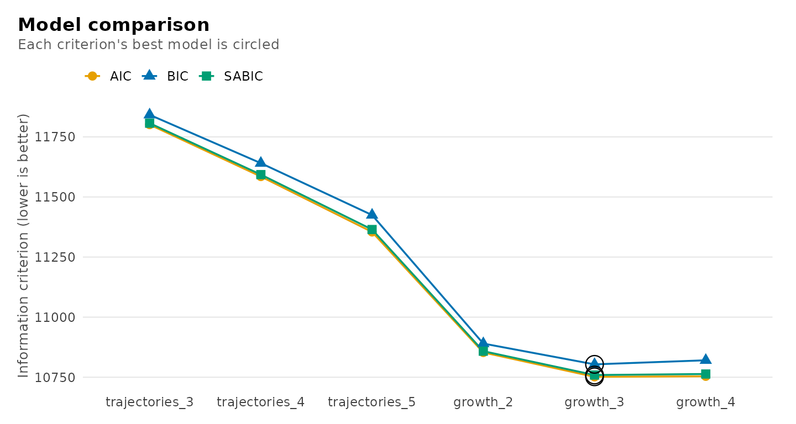
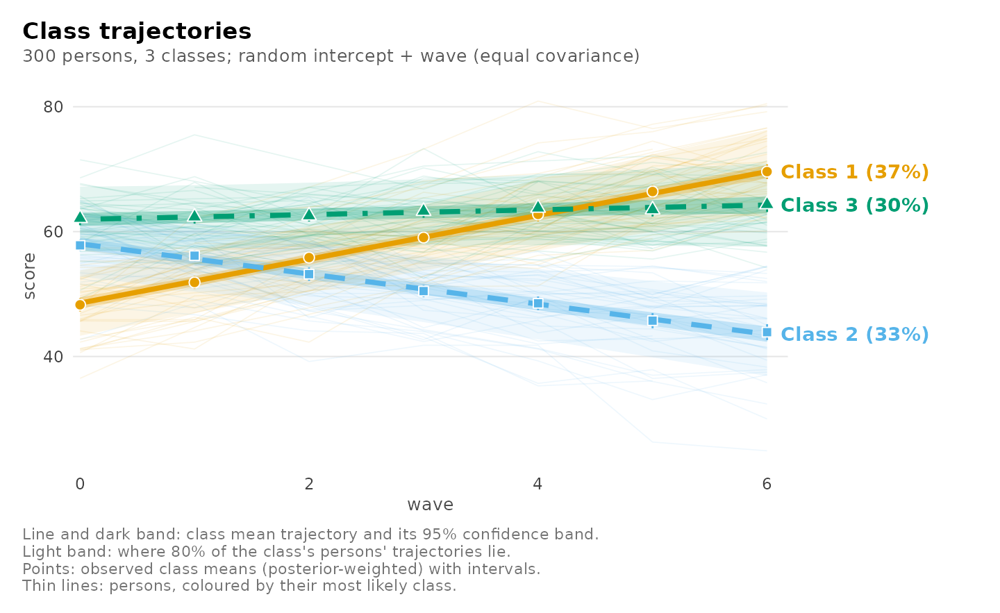
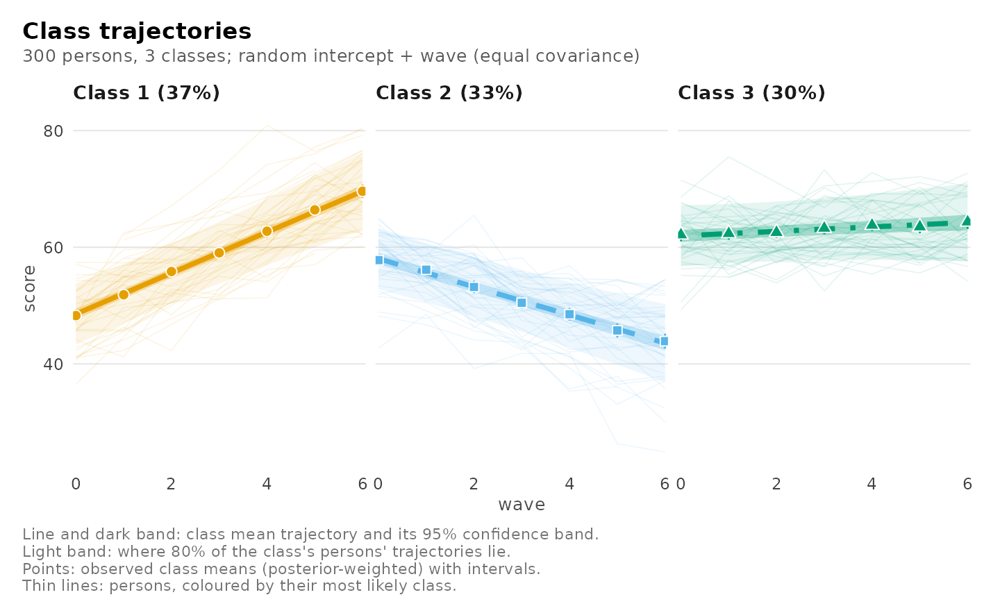
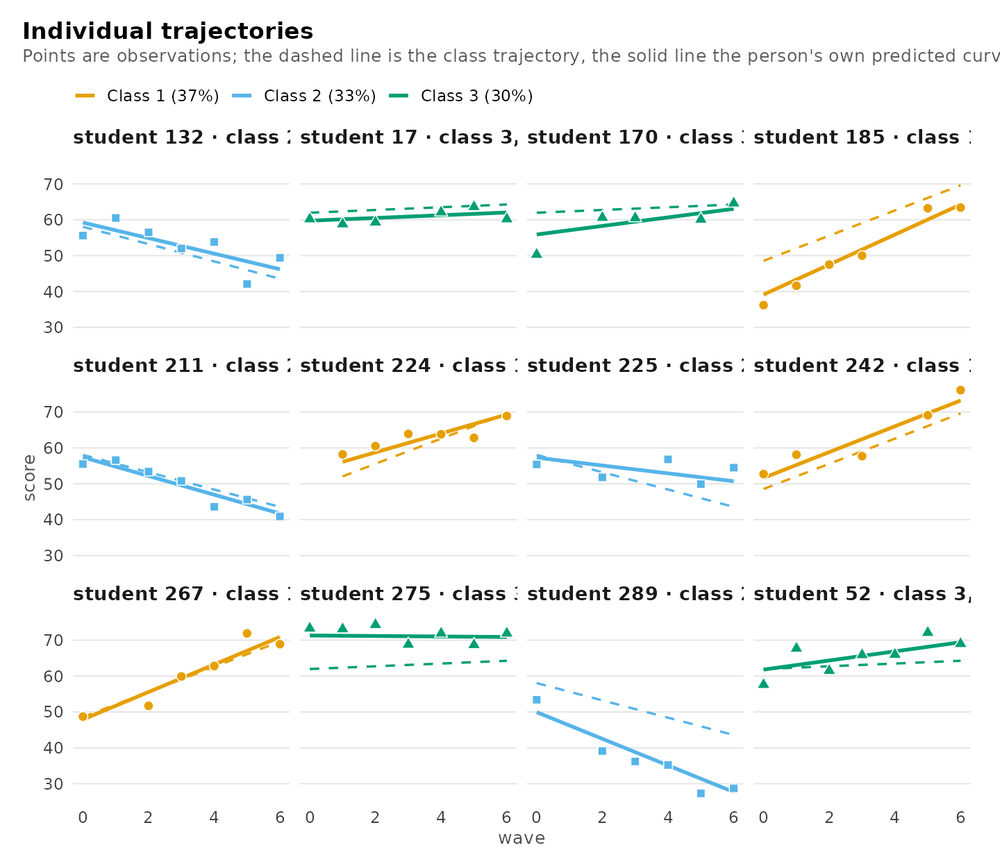
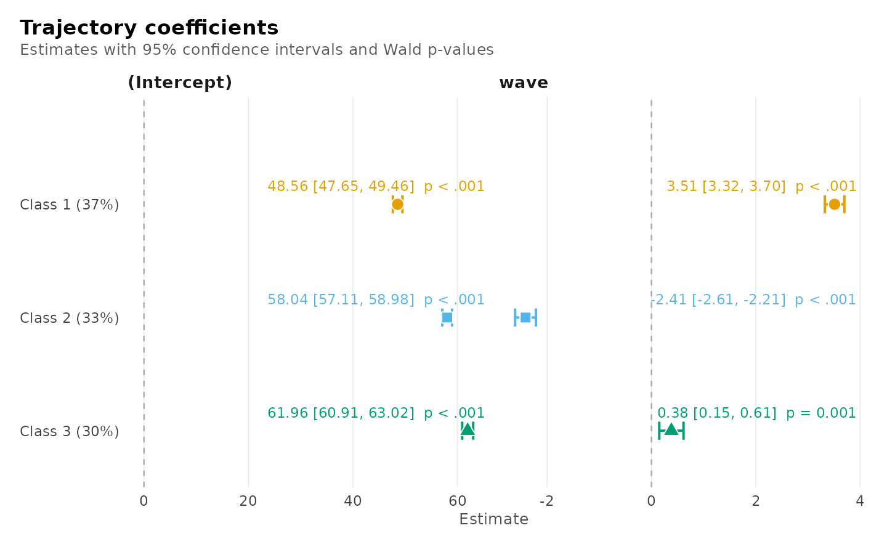
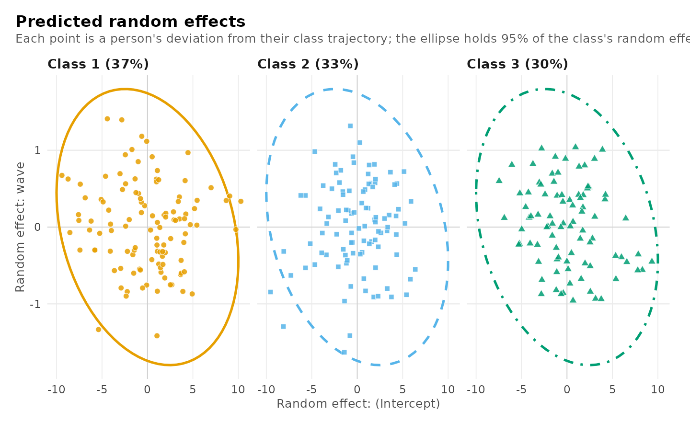
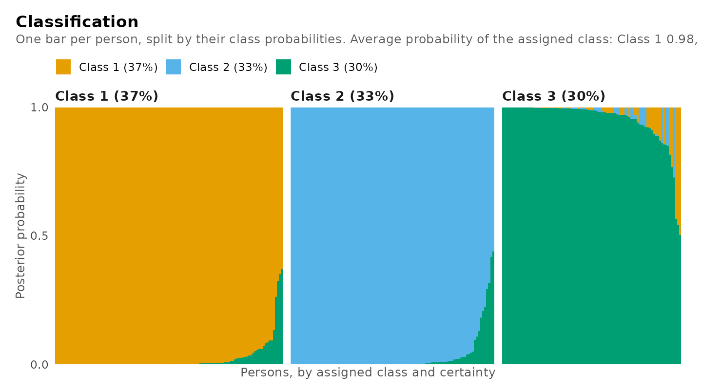
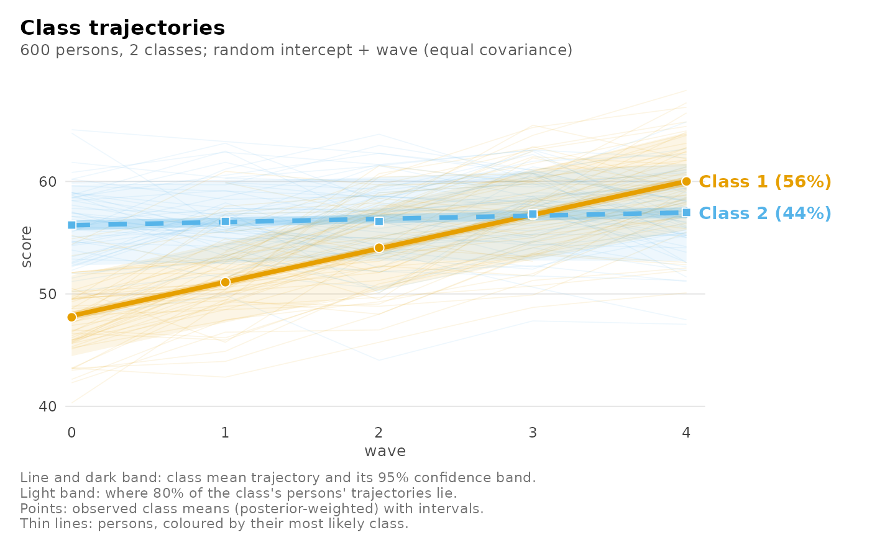
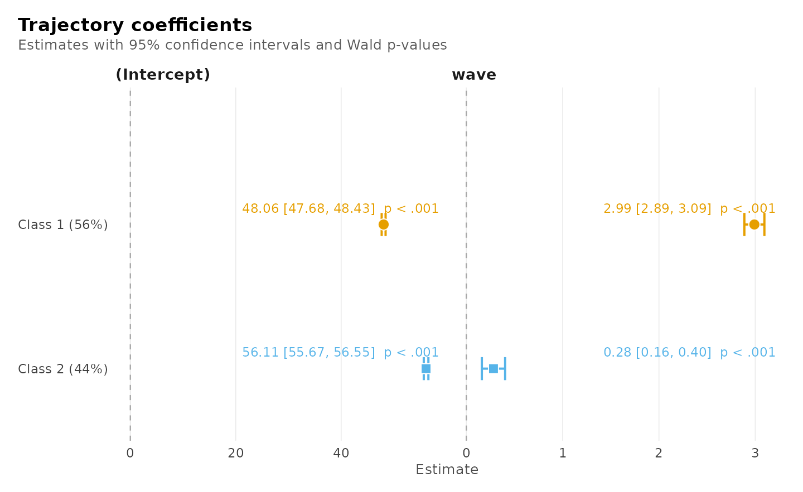
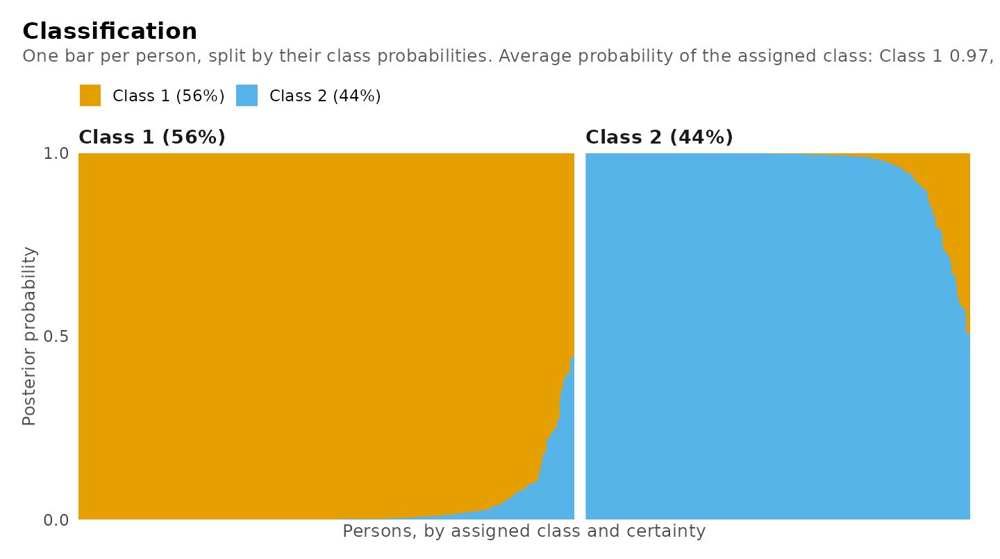

# Growth mixture models: classes of trajectories

When the same people are measured repeatedly, a single average
trajectory often hides several kinds of change: some improve, some hold
steady, some decline. A **growth model with classes** finds those kinds
from the data. This vignette is about the growth mixture model, which
lets people vary around their class trajectory, and its multilevel form
for people nested in clusters; it compares it with latent class growth
analysis, the model without that variation, which has its own article,
[Latent class growth
analysis](https://pak.dynasite.org/latents/articles/trajectory-classes.html)
(including pass/fail, count and ordered outcomes).

## Two models

- **Latent class growth analysis** (Nagin 2005) gives every class its
  own trajectory. Everyone in a class follows that trajectory exactly;
  anything else is noise.
- **The growth mixture model** (Verbeke and Lesaffre 1996; Muthén and
  Shedden
  1999. also lets people vary *around* their class trajectory: each has
        their own start and rate of change (random intercepts and
        slopes).

The difference matters. When people vary within their kind, the first
model can only express that variation by adding classes, so it tends to
find more classes than there are (Bauer and Curran 2003). The second
model separates *kinds* of change from *individual* variation.

Both are one call. Persons are the classified units, so `id` names them
and `class_level = "group"` keeps all of a person’s measurements in one
class; `random` adds the random effects.

| Role | Argument | Here |
|----|----|----|
| Outcome, measured repeatedly | left of `~` | `score` |
| Time | right of `~` | `wave` |
| Person | `id`, with `class_level = "group"` | `student` |
| Variation around the class trajectory | `random` | `"wave"`: own start and own slope |
| What predicts the class | `membership` | `"motivation"` |

## The data

`growth_scores` is simulated so the answer is known: 300 students tested
on up to seven waves, of three kinds (improving, stable, declining),
each student varying around their kind’s trajectory, with motivation
predicting the kind. About 12% of tests were missed, which these models
handle without imputation.

``` r

library(latents)
head(growth_scores)
#>   student wave score motivation trajectory
#> 1       1    0  60.2      -0.72  declining
#> 2       1    2  49.7      -0.72  declining
#> 3       1    3  49.2      -0.72  declining
#> 4       1    4  44.9      -0.72  declining
#> 5       1    5  44.4      -0.72  declining
#> 6       1    6  41.5      -0.72  declining
```

## How many classes, and which model?

Fit both models for a range of classes and compare them in one table.
`random_covariance = "equal"` gives every class the same random-effect
spread, the usual first choice.

``` r

trajectories <- function(k) {
  mixture_regression(score ~ wave, growth_scores, n_classes = k,
                     id = "student", class_level = "group",
                     n_starts = 5, seed = 1)
}
growth <- function(k) {
  mixture_regression(score ~ wave, growth_scores, n_classes = k,
                     id = "student", class_level = "group", random = "wave",
                     random_covariance = "equal", n_starts = 5, seed = 1)
}
comparison <- compare_models(
  trajectories_3 = trajectories(3), trajectories_4 = trajectories(4),
  trajectories_5 = trajectories(5),
  growth_2 = growth(2), growth_3 = growth(3), growth_4 = growth(4))
comparison
#> Model comparison
#> 
#> Model           Classes  Random             k    LogLik       BIC     ΔBIC  Weight  Entropy
#> --------------  -------  ----------------  --  --------  --------  -------  ------  -------
#> trajectories_3        3  none              11  -5889.55  11841.85  1038.25   0.000     0.92
#> trajectories_4        4  none              15  -5777.54  11640.63   837.04   0.000     0.94
#> trajectories_5        5  none              19  -5658.21  11424.79   621.20   0.000     0.94
#> growth_2              2  intercept + wave  10  -5416.53  10890.11    86.51   0.000     0.92
#> growth_3              3  intercept + wave  14  -5361.87  10803.59     0.00   1.000     0.90  <- best
#> growth_4              4  intercept + wave  18  -5358.94  10820.56    16.96   0.000     0.81
```

The growth mixture model with three classes is preferred, with nearly
all the BIC weight. The trajectory model without random effects keeps
improving as classes are added: five classes are still better than four,
though only three kinds of student exist. That is the over-extraction
described above.

``` r

plot(comparison)
```



For a test rather than a criterion,
[`enumerate_regressions()`](https://pak.dynasite.org/latents/reference/enumerate_regressions.md)
fits a range of classes and, with `bootstrap`, adds the bootstrap
likelihood-ratio test of each number of classes against one fewer
(McLachlan 1987; Nylund, Asparouhov and Muthén 2007). It refits both
models on data simulated from the smaller one, so it takes minutes; on
these data it rejects two classes in favour of three and keeps three
against four.

``` r

enumerate_regressions(score ~ wave, growth_scores, n_classes = 1:4,
                      id = "student", class_level = "group", random = "wave",
                      random_covariance = "equal", bootstrap = 99, seed = 1)
```

## The chosen model

Refit it with motivation predicting the class:

``` r

fit <- mixture_regression(score ~ wave, growth_scores, n_classes = 3,
                          id = "student", class_level = "group",
                          random = "wave", random_covariance = "equal",
                          membership = "motivation", n_starts = 5, seed = 1)
fit
#> Growth mixture model
#>   3 classes, 300 persons, 1844 observations
#>   Random intercept + wave, covariance shared across classes; residual variance by class
#>   Log likelihood -5315.44, BIC 10722.14, entropy 0.92, converged
#> 
#> Classes
#> 
#> Class    Share        95% CI  Persons  Avg. posterior  Residual SD
#> -------  -----  ------------  -------  --------------  -----------
#> Class 1   0.37  [0.33, 0.43]      112            0.98         2.75
#> Class 2   0.33  [0.28, 0.38]      100            0.97         2.95
#> Class 3   0.30  [0.24, 0.36]       88            0.95         2.78
#> 
#> Trajectory coefficients (95% CI)
#> 
#> Class    Term       Estimate          95% CI      p
#> -------  ---------  --------  --------------  -----
#> Class 1  Intercept     48.56  [47.65, 49.46]  <.001
#> Class 1  wave           3.51  [ 3.32,  3.70]  <.001
#> Class 2  Intercept     58.04  [57.11, 58.98]  <.001
#> Class 2  wave          -2.41  [-2.61, -2.21]  <.001
#> Class 3  Intercept     61.96  [60.91, 63.02]  <.001
#> Class 3  wave           0.38  [ 0.15,  0.61]   .001
#> 
#> More: get_results(x, "random"), plot(x), summary(x)
```

Every table is a data frame from
[`get_results()`](https://pak.dynasite.org/latents/reference/get_results.md);
printing shows the columns people report, while the data frame keeps
every column (standard errors, statistics, exact p-values and bounds).

``` r

get_results(fit, "random")
#> Random effects (95% CI)
#> 
#> Class        Parameter    Term              Estimate          95% CI
#> -----------  -----------  ----------------  --------  --------------
#> All classes  Variance     Intercept            16.70  [13.39, 20.83]
#> All classes  Variance     wave                  0.54  [ 0.40,  0.73]
#> All classes  SD           Intercept             4.09  [ 3.66,  4.56]
#> All classes  SD           wave                  0.73  [ 0.63,  0.85]
#> All classes  Correlation  Intercept x wave     -0.25  [-0.40, -0.08]
get_results(fit, "membership")
#> Class membership (log odds against Class 1, 95% CI)
#> 
#> Class    Term        Estimate            95% CI      p
#> -------  ----------  --------  ----------------  -----
#> Class 2  Intercept     -0.177  [-0.535,  0.180]   .331
#> Class 2  motivation    -1.758  [-2.210, -1.307]  <.001
#> Class 3  Intercept      0.020  [-0.316,  0.356]   .907
#> Class 3  motivation    -0.809  [-1.189, -0.429]  <.001
```

Students start about 4 points apart and change at rates about 0.7 points
per wave apart within each class; those who start higher tend to grow a
little more slowly (a correlation of about -0.25). More motivated
students are less likely to be in the declining class (class 2) or the
stable class (class 3) than in the improving class.

Because the data were simulated, the classes can be checked against the
truth:

``` r

get_results(fit, "recovery", data = growth_scores, truth = "trajectory")
#> Recovery of a known classification
#> 
#> Assigned  trajectory  Persons  Share of assigned
#> --------  ----------  -------  -----------------
#> Class 1   improving       110              0.982
#> Class 2   improving         0              0.000
#> Class 3   improving         5              0.057
#> Class 1   stable            2              0.018
#> Class 2   stable            3              0.030
#> Class 3   stable           83              0.943
#> Class 1   declining         0              0.000
#> Class 2   declining        97              0.970
#> Class 3   declining         0              0.000
```

## Distal outcomes

Do the classes differ on something measured once per student?
[`three_step()`](https://pak.dynasite.org/latents/reference/three_step.md)
compares class means with the bias-corrected three-step method (Vermunt
2010; Bakk and Vermunt 2016), which accounts for students being
classified with error. The trajectory model must be fitted without
`membership` for this correction, so motivation is treated here as a
distal variable of the classes from the model without it:

``` r

trajectory_classes <- mixture_regression(score ~ wave, growth_scores,
                                         n_classes = 3, id = "student",
                                         class_level = "group", random = "wave",
                                         random_covariance = "equal",
                                         n_starts = 5, seed = 1)
three_step(trajectory_classes, data = growth_scores, outcome = "motivation",
           contrast = "pairs")
#> Distal outcome: class differences (bch, 95% CI)
#> 
#> Class  vs  Difference          95% CI      p  p (BH)
#> -----  --  ----------  --------------  -----  ------
#>     2   1       -1.27  [-1.52, -1.03]  <.001   <.001
#>     3   1       -0.60  [-0.85, -0.34]  <.001   <.001
#>     3   2        0.68  [ 0.43,  0.93]  <.001   <.001
```

## Seeing the classes

The trajectory view shows each class’s mean trajectory with its
confidence band, a lighter band where 80% of that class’s students’ own
trajectories lie, and the observed class means at every wave, which
should sit on the curves.

``` r

plot(fit)
```



``` r

plot(fit, facet = TRUE)
```



Individual students, chosen across each class’s range of classification
certainty: their observations, their class trajectory (dashed) and their
own predicted trajectory (solid).

``` r

plot(fit, what = "individuals")
```



The coefficients with their intervals and p-values:

``` r

plot(fit, what = "coefficients")
```



Each student’s predicted deviation from their class trajectory, with the
model’s 95% ellipse:

``` r

plot(fit, what = "random")
```



How confidently each student is classified, one bar per student:

``` r

plot(fit, what = "classification")
```



## Students in schools

When the persons are nested in clusters – students in schools, patients
in clinics – the clusters may differ in which trajectories their persons
follow. The multilevel growth mixture model (Asparouhov and Muthén 2008;
Vermunt 2003) gives every cluster a group class, and the group class
shifts how probable each trajectory class is for its persons. `cluster`
names the clusters and `n_group_classes` their number of classes;
`group_membership` names cluster-level covariates of the group class.
The `growth_schools` data have 600 students in 40 schools of two
(simulated, hidden) types, in which most students improve or few do, and
a school support programme:

``` r

schools <- mixture_regression(score ~ wave, growth_schools, n_classes = 2,
                              id = "student", class_level = "group",
                              random = "wave", random_covariance = "equal",
                              cluster = "school", n_group_classes = 2,
                              group_membership = "programme",
                              n_starts = 4, seed = 1)
schools
#> Multilevel growth mixture model
#>   2 classes and 2 group classes; 40 clusters, 600 persons, 2780 observations
#>   Random intercept + wave, covariance shared across classes; residual variance by class
#>   Log likelihood -7019.85, BIC 14087.66, entropy 0.87, converged
#> 
#> Classes
#> 
#> Class    Share        95% CI  Persons  Avg. posterior  Residual SD
#> -------  -----  ------------  -------  --------------  -----------
#> Class 1   0.56  [0.48, 0.64]      338            0.97         2.01
#> Class 2   0.44  [0.36, 0.52]      262            0.96         2.07
#> 
#> Group classes: trajectory classes within each
#> 
#> Group class    Class    Probability     SE  Share of clusters  Clusters
#> -------------  -------  -----------  -----  -----------------  --------
#> Group class 1  Class 1        0.851  0.024              0.528        21
#> Group class 1  Class 2        0.149  0.024              0.528        21
#> Group class 2  Class 1        0.245  0.029              0.472        19
#> Group class 2  Class 2        0.755  0.029              0.472        19
#> 
#> Trajectory coefficients (95% CI)
#> 
#> Class    Term       Estimate          95% CI      p
#> -------  ---------  --------  --------------  -----
#> Class 1  Intercept     48.06  [47.68, 48.43]  <.001
#> Class 1  wave           2.99  [ 2.89,  3.09]  <.001
#> Class 2  Intercept     56.11  [55.67, 56.55]  <.001
#> Class 2  wave           0.28  [ 0.16,  0.40]  <.001
#> 
#> More: get_results(x, "random"), plot(x), summary(x)
```

The schools are the independent units: the likelihood, the standard
errors and the BIC count schools. The group classes’ composition, the
schools’ classification and the membership logits (the programme makes a
school less likely to be in the second group class):

The trajectory views read the same as for one level, and the
classification view shows how confidently each student is classified:

``` r

plot(schools)
```



``` r

plot(schools, what = "coefficients")
```



``` r

plot(schools, what = "classification")
```



``` r

get_results(schools, "group_classes")
#> Group classes: trajectory classes within each
#> 
#> Group class    Class    Probability     SE  Share of clusters  Clusters
#> -------------  -------  -----------  -----  -----------------  --------
#> Group class 1  Class 1        0.851  0.024              0.528        21
#> Group class 1  Class 2        0.149  0.024              0.528        21
#> Group class 2  Class 1        0.245  0.029              0.472        19
#> Group class 2  Class 2        0.755  0.029              0.472        19
head(get_results(schools, "clusters"))
#> Cluster group classes
#> 
#> school  Persons  Group class    Probability
#> ------  -------  -------------  -----------
#> 1            15  Group class 2         1.00
#> 2            15  Group class 2         1.00
#> 3            15  Group class 2         1.00
#> 4            15  Group class 2         1.00
#> 5            15  Group class 1         1.00
#> 6            15  Group class 2         1.00
get_results(schools, "membership")
#> Class membership (log odds against Class 1, 95% CI)
#> 
#> Class          Term                      Estimate            95% CI      p
#> -------------  ------------------------  --------  ----------------  -----
#> Group class 2  Intercept                   -0.099  [-0.917,  0.718]   .812
#> Group class 2  programme                   -2.108  [-3.458, -0.758]   .002
#> Class 2        Intercept, group class 1    -1.740  [-2.103, -1.377]  <.001
#> Class 2        Intercept, group class 2     1.128  [ 0.817,  1.438]  <.001
```

The number of group classes is compared like the number of classes, from
one (the single-level model with schools as the units) upward:

``` r

enumerate_regressions(score ~ wave, growth_schools, n_classes = 2,
                      n_group_classes = 1:3, id = "student",
                      class_level = "group", random = "wave",
                      random_covariance = "equal", cluster = "school",
                      n_starts = 3, seed = 1)
#> Mixture regression class enumeration
#> 
#>  n_classes n_group_classes log_likelihood n_parameters   bic   icl entropy smallest_share
#>          2               1          -7105           10 14246 14384  0.8345         0.4399
#>          2               2          -7029           12 14102 14212  0.8699         0.4360
#>          2               3          -7028           14 14109 14243  0.8707         0.4364
#>  converged best_bic
#>       TRUE    FALSE
#>       TRUE     TRUE
#>       TRUE    FALSE
#> 
#> One model: get_results(x, "model", n_classes = ).
```

## Choices and warnings

- **Random effects.** `random = "intercept"` lets students differ in
  level only; `random = "wave"` in level and rate of change. A formula
  such as `~ 0 + wave` gives a random slope without a random intercept.
- **The random-effect spread.** `"equal"` shares it across classes;
  `"varying"` estimates one per class; `"proportional"` shares its shape
  and lets its size differ. `random_diagonal = TRUE` makes the random
  effects uncorrelated.
- **Curved trajectories.** Use `score ~ wave + I(wave^2)` or
  `score ~ splines::ns(wave, df = 3)`.
- **A degenerate covariance.** When the data cannot support a random
  effect in some class (a variance at zero, or two random effects
  perfectly correlated), the fit warns (`latents_random_boundary`),
  reports no interval for that covariance, and marks it as a boundary in
  the tables and plots. Simplify the random effects, or drop them.

## How this was checked

The model’s likelihood equals an independently written dense-matrix
likelihood, and the analytic scores equal numerical derivatives; for the
multilevel model too, whose likelihood is checked against a dense sum
over group classes per school, which reduces to the single-level model
when the group classes coincide. Against `lcmm::hlme()` (Proust-Lima,
Philipps and Liquet 2017), on configurations with one to three classes,
shared, proportional and diagonal covariances and membership covariates,
the likelihoods agree at `hlme`’s own estimates and
[`mixture_regression()`](https://pak.dynasite.org/latents/reference/mixture_regression.md)
reaches at least `hlme`’s maximum.

## References

Asparouhov, T., & Muthén, B. (2008). Multilevel mixture models. In G. R.
Hancock & K. M. Samuelsen (Eds.), *Advances in latent variable mixture
models* (pp. 27–51). Information Age.

Bakk, Z., & Vermunt, J. K. (2016). Robustness of stepwise latent class
modeling with continuous distal outcomes. *Structural Equation
Modeling*, 23, 20–31.

Bauer, D. J., & Curran, P. J. (2003). Distributional assumptions of
growth mixture models: Implications for overextraction of latent
trajectory classes. *Psychological Methods*, 8, 338–363.

McLachlan, G. J. (1987). On bootstrapping the likelihood ratio test
statistic for the number of components in a normal mixture. *Applied
Statistics*, 36, 318–324.

Muthén, B., & Shedden, K. (1999). Finite mixture modeling with mixture
outcomes using the EM algorithm. *Biometrics*, 55, 463–469.

Nagin, D. S. (2005). *Group-based modeling of development*. Harvard
University Press.

Nylund, K. L., Asparouhov, T., & Muthén, B. O. (2007). Deciding on the
number of classes in latent class analysis and growth mixture modeling:
A Monte Carlo simulation study. *Structural Equation Modeling*, 14,
535–569.

Proust-Lima, C., Philipps, V., & Liquet, B. (2017). Estimation of
extended mixed models using latent classes and latent processes: The R
package lcmm. *Journal of Statistical Software*, 78(2), 1–56.

Vermunt, J. K. (2010). Latent class modeling with covariates: Two
improved three-step approaches. *Political Analysis*, 18, 450–469.

Vermunt, J. K. (2003). Multilevel latent class models. *Sociological
Methodology*, 33, 213–239.

Verbeke, G., & Lesaffre, E. (1996). A linear mixed-effects model with
heterogeneity in the random-effects population. *Journal of the American
Statistical Association*, 91, 217–221.
