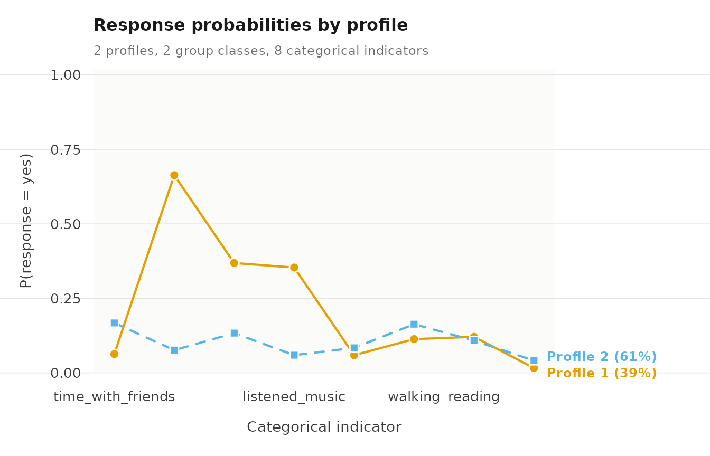
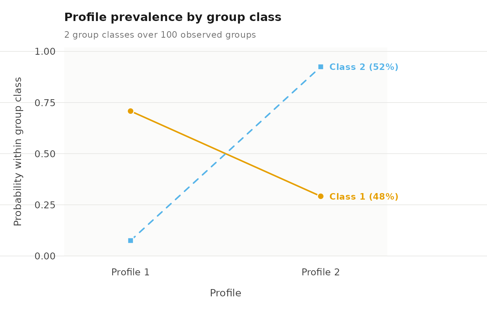

# Two-level latent class analysis

Two-level latent class analysis (LCA) is used when the indicators are
categorical: yes/no answers, ratings on a few ordered options, or
unordered choices. Like multilevel latent profile analysis, it estimates
latent classes of observations, called profiles in the output, and
latent group classes that differ in how probable each profile is for
their observations. The difference is in how a profile is described: by
the probability of each answer to each item, instead of a mean and a
variance.
[`multilca()`](https://pak.dynasite.org/latents/reference/multilca.md)
fits LCA, treating every indicator as categorical;
[`multilpa()`](https://pak.dynasite.org/latents/reference/multilpa.md)
with some indicators named in `categorical` fits a mixed model with both
kinds of indicator.

## What the package supports

- **Item types.** Binary, ordinal and nominal items share one
  parameterization: a free probability for every category in every
  profile. Numeric, integer, logical, character and factor columns are
  accepted; factor levels keep their order, other types are sorted.
- **Mixed measurement.** Continuous and categorical indicators in one
  model.
- **Missing answers.** `missing = "fiml"` uses the observed answers of
  each row.
- **Standard errors.** Observed-information and robust
  (`vcov_type = "robust"`) standard errors through
  [`parameter_inference()`](https://pak.dynasite.org/latents/reference/parameter_inference.md).
- **Model comparison.**
  [`enumerate_classes()`](https://pak.dynasite.org/latents/reference/enumerate_classes.md)
  and, for complete data,
  [`bootstrap_lrt()`](https://pak.dynasite.org/latents/reference/bootstrap_lrt.md).
- **External variables.**
  [`three_step()`](https://pak.dynasite.org/latents/reference/three_step.md)
  and [`r3step()`](https://pak.dynasite.org/latents/reference/r3step.md)
  work on a categorical fit.
- **Membership covariates.** `profile_covariates` and `group_covariates`
  work with categorical indicators; standard errors are not available
  for these fits.
- **Transitions.**
  [`lta()`](https://pak.dynasite.org/latents/reference/lta.md) accepts
  categorical indicators.
- **Bounds.** `min_probability` keeps every response probability above a
  lower bound.

## Data

`student_esm` holds experience-sampling data: 2,582 prompts from 100
university students, answered at times when the student had not been
studying. `student` identifies the group. Eight yes/no items record the
leisure activities done since the previous prompt, and four items rate
affect from 1 to 7. `day` is the study day, from 0 to 13.
[`?student_esm`](https://pak.dynasite.org/latents/reference/student_esm.md)
gives the source.

``` r

library(latents)
```

To keep the example short, we call
[`subset()`](https://rdrr.io/r/base/subset.html) with `day <= 6`, which
keeps the first week and all 100 students.

``` r

first_week <- subset(student_esm, day <= 6)
```

The eight activity items are used in several fits, so we store their
names once.

``` r

activities <- c("time_with_friends", "on_social_media", "tv_video_games",
                "listened_music", "sports", "walking", "reading",
                "part_time_job")
```

## Fitting the model

To fit the model, we call
[`multilca()`](https://pak.dynasite.org/latents/reference/multilca.md)
with `vars` for the categorical indicators, `id` for the group,
`n_profiles`, `n_group_classes`, `n_starts`, `seed`, and `tol` for a
tighter convergence tolerance, which standard errors need.

``` r

lca <- multilca(first_week, vars = activities, id = "student",
                n_profiles = 2, n_group_classes = 2, n_starts = 3,
                tol = 1e-10, seed = 1)
lca
#> Two-level latent profile analysis: 2 profiles, 2 group classes
#> 1422 individuals in 100 groups; varying diagonal residual covariance (VVI)
#> Log likelihood: -4315.734849 | AIC: 8669.470 | BIC (groups): 8718.968
#> Converged: TRUE | iterations: 299 | best start: 2/3
#> 
#>  profile         indicator category probability threshold
#>        1 time_with_friends       no      0.9368     2.696
#>        2 time_with_friends       no      0.8324     1.603
#>        1 time_with_friends      yes      0.0632        NA
#>        2 time_with_friends      yes      0.1676        NA
#>        1   on_social_media       no      0.3366    -0.679
#>        2   on_social_media       no      0.9236     2.492
#>        1   on_social_media      yes      0.6634        NA
#>        2   on_social_media      yes      0.0764        NA
#>        1    tv_video_games       no      0.6314     0.538
#>        2    tv_video_games       no      0.8665     1.870
#>        1    tv_video_games      yes      0.3686        NA
#>        2    tv_video_games      yes      0.1335        NA
#>        1    listened_music       no      0.6464     0.603
#>        2    listened_music       no      0.9406     2.762
#>        1    listened_music      yes      0.3536        NA
#>        2    listened_music      yes      0.0594        NA
#>        1            sports       no      0.9406     2.762
#>        2            sports       no      0.9159     2.388
#>        1            sports      yes      0.0594        NA
#>        2            sports      yes      0.0841        NA
#>    ... 12 more rows.  get_results(x, "responses")
#> 
#> Every other table: get_results(x, what = ), or get_results(x, "all").
```

To obtain the response probabilities, we call
[`get_results()`](https://pak.dynasite.org/latents/reference/get_results.md)
with `"responses"`. There is one row per profile, item and category;
`probability` is the chance of that answer in that profile.

``` r

get_results(lca, "responses")
#>    profile         indicator category probability threshold
#> 1        1 time_with_friends       no      0.9368     2.696
#> 2        2 time_with_friends       no      0.8324     1.603
#> 3        1 time_with_friends      yes      0.0632        NA
#> 4        2 time_with_friends      yes      0.1676        NA
#> 5        1   on_social_media       no      0.3366    -0.679
#> 6        2   on_social_media       no      0.9236     2.492
#> 7        1   on_social_media      yes      0.6634        NA
#> 8        2   on_social_media      yes      0.0764        NA
#> 9        1    tv_video_games       no      0.6314     0.538
#> 10       2    tv_video_games       no      0.8665     1.870
#> 11       1    tv_video_games      yes      0.3686        NA
#> 12       2    tv_video_games      yes      0.1335        NA
#> 13       1    listened_music       no      0.6464     0.603
#> 14       2    listened_music       no      0.9406     2.762
#> 15       1    listened_music      yes      0.3536        NA
#> 16       2    listened_music      yes      0.0594        NA
#> 17       1            sports       no      0.9406     2.762
#> 18       2            sports       no      0.9159     2.388
#> 19       1            sports      yes      0.0594        NA
#> 20       2            sports      yes      0.0841        NA
#> 21       1           walking       no      0.8865     2.056
#> 22       2           walking       no      0.8365     1.633
#> 23       1           walking      yes      0.1135        NA
#> 24       2           walking      yes      0.1635        NA
#> 25       1           reading       no      0.8790     1.983
#> 26       2           reading       no      0.8917     2.108
#> 27       1           reading      yes      0.1210        NA
#> 28       2           reading      yes      0.1083        NA
#> 29       1     part_time_job       no      0.9838     4.103
#> 30       2     part_time_job       no      0.9587     3.144
#> 31       1     part_time_job      yes      0.0162        NA
#> 32       2     part_time_job      yes      0.0413        NA
```

To see them, we call
[`plot()`](https://rdrr.io/r/graphics/plot.default.html) with
`what = "responses"`: one line per profile across the items.

``` r

plot(lca, what = "responses")
```



To obtain the profile probabilities of each group class, we call
[`get_results()`](https://pak.dynasite.org/latents/reference/get_results.md)
with `"profile_probabilities"`, and to compare the classes,
[`plot()`](https://rdrr.io/r/graphics/plot.default.html) with
`what = "probabilities"`.

``` r

get_results(lca, "profile_probabilities")
#>   group_class profile probability group_class_probability
#> 1           1       1      0.7082                   0.483
#> 2           1       2      0.2918                   0.483
#> 3           2       1      0.0752                   0.517
#> 4           2       2      0.9248                   0.517
```

``` r

plot(lca, what = "probabilities")
```



To obtain classification certainty, we call
[`get_results()`](https://pak.dynasite.org/latents/reference/get_results.md)
with `"entropy"`.

``` r

get_results(lca, "entropy")
#>         level n_classes n_units entropy_sum relative_entropy
#> 1 individuals         2    1422         411            0.583
#> 2      groups         2     100          13            0.813
```

## Mixed indicators

To combine both kinds, we call
[`multilpa()`](https://pak.dynasite.org/latents/reference/multilpa.md)
with all indicators in `vars` and only the categorical ones in
`categorical`. Here three affect ratings are continuous and the
activities categorical. `worried` is left out: about half its ratings
are 1, which can push a profile’s variance to its lower bound.

``` r

mixed <- multilpa(first_week,
                  vars = c("happy", "relaxed", "exhausted", activities),
                  categorical = activities, id = "student", n_profiles = 2,
                  n_group_classes = 2, n_starts = 3, seed = 1)
```

To obtain the means and variances of the continuous indicators, we call
[`get_results()`](https://pak.dynasite.org/latents/reference/get_results.md)
on the fit; for the answer probabilities of the categorical ones,
[`get_results()`](https://pak.dynasite.org/latents/reference/get_results.md)
with `"responses"`.

``` r

get_results(mixed)
#>   profile indicator mean variance standard_deviation
#> 1       1     happy 5.98    0.659              0.812
#> 2       1   relaxed 5.77    1.017              1.008
#> 3       1 exhausted 2.33    1.977              1.406
#> 4       2     happy 3.90    1.963              1.401
#> 5       2   relaxed 3.66    1.946              1.395
#> 6       2 exhausted 4.10    2.842              1.686
get_results(mixed, "responses")
#>    profile         indicator category probability threshold
#> 1        1 time_with_friends       no      0.8047     1.416
#> 2        2 time_with_friends       no      0.9309     2.601
#> 3        1 time_with_friends      yes      0.1953        NA
#> 4        2 time_with_friends      yes      0.0691        NA
#> 5        1   on_social_media       no      0.7656     1.184
#> 6        2   on_social_media       no      0.6381     0.567
#> 7        1   on_social_media      yes      0.2344        NA
#> 8        2   on_social_media      yes      0.3619        NA
#> 9        1    tv_video_games       no      0.8209     1.523
#> 10       2    tv_video_games       no      0.7369     1.030
#> 11       1    tv_video_games      yes      0.1791        NA
#> 12       2    tv_video_games      yes      0.2631        NA
#> 13       1    listened_music       no      0.8125     1.466
#> 14       2    listened_music       no      0.8394     1.654
#> 15       1    listened_music      yes      0.1875        NA
#> 16       2    listened_music      yes      0.1606        NA
#> 17       1            sports       no      0.9102     2.316
#> 18       2            sports       no      0.9385     2.726
#> 19       1            sports      yes      0.0898        NA
#> 20       2            sports      yes      0.0615        NA
#> 21       1           walking       no      0.8252     1.552
#> 22       2           walking       no      0.8821     2.012
#> 23       1           walking      yes      0.1748        NA
#> 24       2           walking      yes      0.1179        NA
#> 25       1           reading       no      0.9099     2.313
#> 26       2           reading       no      0.8670     1.874
#> 27       1           reading      yes      0.0901        NA
#> 28       2           reading      yes      0.1330        NA
#> 29       1     part_time_job       no      0.9640     3.288
#> 30       2     part_time_job       no      0.9721     3.549
#> 31       1     part_time_job      yes      0.0360        NA
#> 32       2     part_time_job      yes      0.0279        NA
```

## Reference

The calls below list other functions that work with categorical and
mixed models. Each comment states what the call returns.

``` r

get_results(lca, "classification")               # class sizes and average posteriors
get_results(lca, "residuals")                    # residual association within profiles
parameter_inference(lca)                         # standard errors and intervals
enumerate_classes(first_week, vars = activities, categorical = activities,
                  id = "student", n_profiles = 2:3,
                  n_group_classes = 1:2, seed = 1)  # compare numbers of classes (slow)
plot(mixed)                                      # means of the continuous indicators
plot(mixed, what = "responses")                  # answers to the categorical ones
multilca(first_week, vars = activities, id = "student", n_profiles = 2,
         n_group_classes = 2, missing = "fiml")  # incomplete answers, if any
```

## Assumptions

- Items are independent within a profile.
- Every category of every item has its own probability in each profile,
  so rare answers can push probabilities to their lower bound
  (`min_probability`).
- Categories are taken from the observed values; factor levels keep
  their order.
