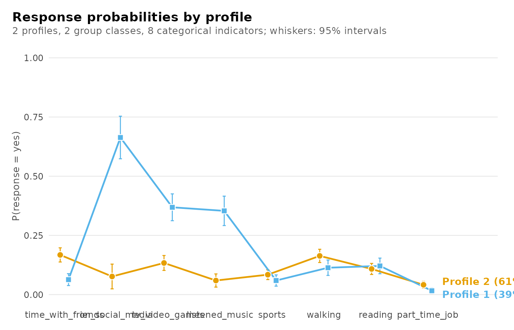
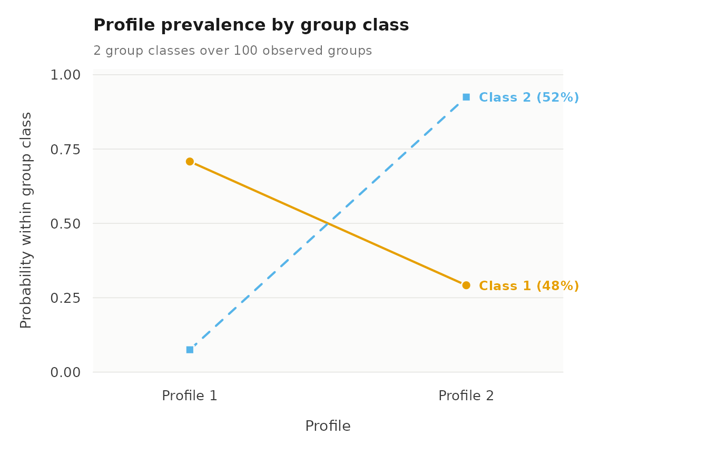

# Two-level latent class analysis

Two-level latent class analysis (LCA) is used when the indicators are
categorical: yes/no answers, ratings on a few ordered options, or
unordered choices. Like multilevel latent profile analysis, it estimates
latent classes of observations, called profiles in the output, and
latent group classes that differ in how probable each profile is for
their observations. The difference is in how a profile is described: by
the probability of each answer to each item, instead of a mean and a
variance.
[`multilca()`](https://pak.dynasite.org/latents/reference/multilca.md)
fits LCA, treating every indicator as categorical;
[`multilpa()`](https://pak.dynasite.org/latents/reference/multilpa.md)
with some indicators named in `categorical` fits a mixed model with both
kinds of indicator.

## What the package supports

- **Item types.** Binary, ordinal and nominal items share one
  parameterization: a free probability for every category in every
  profile. Numeric, integer, logical, character and factor columns are
  accepted; factor levels keep their order, other types are sorted.
  Ordered items can instead be modelled as `ordinal` (an
  adjacent-category logit with far fewer parameters), and counts as
  `count` (Poisson); see below.
- **Mixed measurement.** Continuous and categorical indicators in one
  model.
- **Missing answers.** `missing = "fiml"` uses the observed answers of
  each row.
- **Standard errors.** Observed-information and robust
  (`vcov_type = "robust"`) standard errors through
  [`parameter_inference()`](https://pak.dynasite.org/latents/reference/parameter_inference.md).
- **Model comparison.**
  [`enumerate_classes()`](https://pak.dynasite.org/latents/reference/enumerate_classes.md)
  and, for complete data,
  [`bootstrap_lrt()`](https://pak.dynasite.org/latents/reference/bootstrap_lrt.md).
- **External variables.**
  [`three_step()`](https://pak.dynasite.org/latents/reference/three_step.md)
  and [`r3step()`](https://pak.dynasite.org/latents/reference/r3step.md)
  work on a categorical fit.
- **Membership covariates.** `profile_covariates` and `group_covariates`
  work with categorical indicators, and
  [`parameter_inference()`](https://pak.dynasite.org/latents/reference/parameter_inference.md)
  reports their standard errors.
- **Transitions.**
  [`lta()`](https://pak.dynasite.org/latents/reference/lta.md) accepts
  categorical indicators.
- **Bounds.** `min_probability` keeps every response probability above a
  lower bound.

## Data

`student_esm` holds experience-sampling data: 2,582 prompts from 100
university students, answered at times when the student had not been
studying. `student` identifies the group. Eight yes/no items record the
leisure activities done since the previous prompt, and four items rate
affect from 1 to 7. `day` is the study day, from 0 to 13.
[`?student_esm`](https://pak.dynasite.org/latents/reference/student_esm.md)
gives the source.

``` r

library(latents)
```

To keep the example short, we call
[`subset()`](https://rdrr.io/r/base/subset.html) with `day <= 6`, which
keeps the first week and all 100 students.

``` r

first_week <- subset(student_esm, day <= 6)
```

The eight activity items are used in several fits, so we store their
names once.

``` r

activities <- c("time_with_friends", "on_social_media", "tv_video_games",
                "listened_music", "sports", "walking", "reading",
                "part_time_job")
```

## Fitting the model

To fit the model, we call
[`multilca()`](https://pak.dynasite.org/latents/reference/multilca.md)
with `vars` for the categorical indicators, `id` for the group,
`n_profiles`, `n_group_classes`, `n_starts`, `seed`, and `tol` for a
tighter convergence tolerance, which standard errors need.

``` r

lca <- multilca(first_week, vars = activities, id = "student",
                n_profiles = 2, n_group_classes = 2, n_starts = 3,
                tol = 1e-10, seed = 1)
lca
#> Two-level latent class analysis: 2 classes, 2 group classes
#> 1422 individuals in 100 groups; 8 categorical indicators
#> Classes are labelled profile_1, profile_2, ... in every table.
#> Log likelihood: -4315.734843 | AIC: 8669.470 | BIC (groups): 8718.968
#> Converged: TRUE | iterations: 42 | best start: 1/3
#> 
#>  profile         indicator category probability threshold
#>        1 time_with_friends       no      0.9368     2.696
#>        2 time_with_friends       no      0.8324     1.603
#>        1 time_with_friends      yes      0.0632        NA
#>        2 time_with_friends      yes      0.1676        NA
#>        1   on_social_media       no      0.3364    -0.679
#>        2   on_social_media       no      0.9235     2.491
#>        1   on_social_media      yes      0.6636        NA
#>        2   on_social_media      yes      0.0765        NA
#>        1    tv_video_games       no      0.6313     0.538
#>        2    tv_video_games       no      0.8664     1.870
#>        1    tv_video_games      yes      0.3687        NA
#>        2    tv_video_games      yes      0.1336        NA
#>        1    listened_music       no      0.6464     0.603
#>        2    listened_music       no      0.9406     2.762
#>        1    listened_music      yes      0.3536        NA
#>        2    listened_music      yes      0.0594        NA
#>        1            sports       no      0.9406     2.762
#>        2            sports       no      0.9159     2.388
#>        1            sports      yes      0.0594        NA
#>        2            sports      yes      0.0841        NA
#>    ... 12 more rows.  get_results(x, "responses")
#> 
#> Every other table: get_results(x, what = ), or get_results(x, "all").
```

To obtain the response probabilities, we call
[`get_results()`](https://pak.dynasite.org/latents/reference/get_results.md)
with `"responses"`. There is one row per profile, item and category;
`probability` is the chance of that answer in that profile.

``` r

get_results(lca, "responses")
#>    profile         indicator category probability threshold probability_standard_error
#> 1        1 time_with_friends       no      0.9368     2.696                    0.01281
#> 2        2 time_with_friends       no      0.8324     1.603                    0.01525
#> 3        1 time_with_friends      yes      0.0632        NA                    0.01281
#> 4        2 time_with_friends      yes      0.1676        NA                    0.01525
#> 5        1   on_social_media       no      0.3364    -0.679                    0.04591
#> 6        2   on_social_media       no      0.9235     2.491                    0.02663
#> 7        1   on_social_media      yes      0.6636        NA                    0.04591
#> 8        2   on_social_media      yes      0.0765        NA                    0.02663
#> 9        1    tv_video_games       no      0.6313     0.538                    0.02891
#> 10       2    tv_video_games       no      0.8664     1.870                    0.01605
#> 11       1    tv_video_games      yes      0.3687        NA                    0.02891
#> 12       2    tv_video_games      yes      0.1336        NA                    0.01605
#> 13       1    listened_music       no      0.6464     0.603                    0.03167
#> 14       2    listened_music       no      0.9406     2.762                    0.01419
#> 15       1    listened_music      yes      0.3536        NA                    0.03167
#> 16       2    listened_music      yes      0.0594        NA                    0.01419
#> 17       1            sports       no      0.9406     2.762                    0.01208
#> 18       2            sports       no      0.9159     2.388                    0.01053
#> 19       1            sports      yes      0.0594        NA                    0.01208
#> 20       2            sports      yes      0.0841        NA                    0.01053
#> 21       1           walking       no      0.8865     2.056                    0.01657
#> 22       2           walking       no      0.8365     1.633                    0.01423
#> 23       1           walking      yes      0.1135        NA                    0.01657
#> 24       2           walking      yes      0.1635        NA                    0.01423
#> 25       1           reading       no      0.8790     1.983                    0.01685
#> 26       2           reading       no      0.8917     2.108                    0.01190
#> 27       1           reading      yes      0.1210        NA                    0.01685
#> 28       2           reading      yes      0.1083        NA                    0.01190
#> 29       1     part_time_job       no      0.9838     4.103                    0.00625
#> 30       2     part_time_job       no      0.9587     3.144                    0.00730
#> 31       1     part_time_job      yes      0.0162        NA                    0.00625
#> 32       2     part_time_job      yes      0.0413        NA                    0.00730
```

To see them, we call
[`plot()`](https://rdrr.io/r/graphics/plot.default.html) with
`what = "responses"`: one line per profile across the items.

``` r

plot(lca, what = "responses")
```



For numeric categories, such as ratings from 1 to 5, a profile plot can
summarize each item’s fitted distribution on the original score scale:

``` r

plot(lca, what = "profiles")                       # probability-weighted means
plot(lca, what = "profiles", statistic = "median") # fitted medians
plot(lca, what = "profiles", statistic = "mode")   # most probable scores
```

Means assume meaningful spacing between category scores. The median is
the smallest score whose cumulative probability reaches 0.5; tied modes
use the smallest score. These summaries use fitted probabilities,
including in FIML models, rather than averages of cases assigned to each
class. They require numeric category labels and use the raw scale.
Confidence intervals are not computed, so these plots avoid the
parameter-inference calculation used by the response-probability plot.
In mixed models, `"profiles"` continues to show only continuous
indicators.

To obtain the profile probabilities of each group class, we call
[`get_results()`](https://pak.dynasite.org/latents/reference/get_results.md)
with `"profile_probabilities"`, and to compare the classes,
[`plot()`](https://rdrr.io/r/graphics/plot.default.html) with
`what = "probabilities"`.

``` r

get_results(lca, "profile_probabilities")
#>   group_class profile probability group_class_probability
#> 1           1       1      0.7080                   0.483
#> 2           1       2      0.2920                   0.483
#> 3           2       1      0.0751                   0.517
#> 4           2       2      0.9249                   0.517
```

``` r

plot(lca, what = "probabilities")
```



To obtain classification certainty, we call
[`get_results()`](https://pak.dynasite.org/latents/reference/get_results.md)
with `"entropy"`.

``` r

get_results(lca, "entropy")
#>         level n_classes n_units entropy_sum relative_entropy
#> 1 individuals         2    1422         411            0.583
#> 2      groups         2     100          13            0.813
```

## Mixed indicators

To combine both kinds, we call
[`multilpa()`](https://pak.dynasite.org/latents/reference/multilpa.md)
with all indicators in `vars` and only the categorical ones in
`categorical`. Here three affect ratings are continuous and the
activities categorical. `worried` is left out: about half its ratings
are 1, which can push a profile’s variance to its lower bound.

``` r

mixed <- multilpa(first_week,
                  vars = c("happy", "relaxed", "exhausted", activities),
                  categorical = activities, id = "student", n_profiles = 2,
                  n_group_classes = 2, n_starts = 3, seed = 1)
```

To obtain the means and variances of the continuous indicators, we call
[`get_results()`](https://pak.dynasite.org/latents/reference/get_results.md)
on the fit; for the answer probabilities of the categorical ones,
[`get_results()`](https://pak.dynasite.org/latents/reference/get_results.md)
with `"responses"`.

``` r

get_results(mixed)
#> No standard errors in this table: data must reproduce the original indicator data, including row order and names.
#>   profile indicator mean variance standard_deviation mean_standard_error variance_standard_error
#> 1       1     happy 3.90    1.963              1.401                  NA                      NA
#> 2       1   relaxed 3.66    1.946              1.395                  NA                      NA
#> 3       1 exhausted 4.10    2.842              1.686                  NA                      NA
#> 4       2     happy 5.98    0.659              0.812                  NA                      NA
#> 5       2   relaxed 5.77    1.016              1.008                  NA                      NA
#> 6       2 exhausted 2.32    1.976              1.406                  NA                      NA
get_results(mixed, "responses")
#> No standard errors in this table: data must reproduce the original indicator data, including row order and names.
#>    profile         indicator category probability threshold probability_standard_error
#> 1        1 time_with_friends       no      0.9309     2.601                         NA
#> 2        2 time_with_friends       no      0.8046     1.415                         NA
#> 3        1 time_with_friends      yes      0.0691        NA                         NA
#> 4        2 time_with_friends      yes      0.1954        NA                         NA
#> 5        1   on_social_media       no      0.6381     0.567                         NA
#> 6        2   on_social_media       no      0.7657     1.184                         NA
#> 7        1   on_social_media      yes      0.3619        NA                         NA
#> 8        2   on_social_media      yes      0.2343        NA                         NA
#> 9        1    tv_video_games       no      0.7370     1.030                         NA
#> 10       2    tv_video_games       no      0.8210     1.523                         NA
#> 11       1    tv_video_games      yes      0.2630        NA                         NA
#> 12       2    tv_video_games      yes      0.1790        NA                         NA
#> 13       1    listened_music       no      0.8394     1.654                         NA
#> 14       2    listened_music       no      0.8125     1.466                         NA
#> 15       1    listened_music      yes      0.1606        NA                         NA
#> 16       2    listened_music      yes      0.1875        NA                         NA
#> 17       1            sports       no      0.9385     2.726                         NA
#> 18       2            sports       no      0.9102     2.316                         NA
#> 19       1            sports      yes      0.0615        NA                         NA
#> 20       2            sports      yes      0.0898        NA                         NA
#> 21       1           walking       no      0.8821     2.012                         NA
#> 22       2           walking       no      0.8251     1.552                         NA
#> 23       1           walking      yes      0.1179        NA                         NA
#> 24       2           walking      yes      0.1749        NA                         NA
#> 25       1           reading       no      0.8670     1.874                         NA
#> 26       2           reading       no      0.9100     2.313                         NA
#> 27       1           reading      yes      0.1330        NA                         NA
#> 28       2           reading      yes      0.0900        NA                         NA
#> 29       1     part_time_job       no      0.9720     3.549                         NA
#> 30       2     part_time_job       no      0.9640     3.289                         NA
#> 31       1     part_time_job      yes      0.0280        NA                         NA
#> 32       2     part_time_job      yes      0.0360        NA                         NA
```

## Ordinal and count indicators

The affect ratings run from 1 to 7. As `categorical` items each would
have six free probabilities in every profile; as `ordinal` items each
has six category intercepts shared by every profile and one location per
profile, which says how far up the scale that profile sits. We pass
their names as `ordinal`.

``` r

affect <- c("happy", "relaxed", "worried", "exhausted")
ordinal <- multilpa(first_week, vars = c(affect, activities), id = "student",
                    ordinal = affect, categorical = activities, n_profiles = 2,
                    n_group_classes = 2, n_starts = 3, seed = 1)
ordinal
#> Two-level latent class analysis: 2 classes, 2 group classes
#> 1422 individuals in 100 groups; 8 categorical indicators
#> Also ordinal happy, relaxed, worried, exhausted (adjacent-category logit; get_results(x, "ordinal"))
#> Classes are labelled profile_1, profile_2, ... in every table.
#> Log likelihood: -13513.224891 | AIC: 27120.450 | BIC (groups): 27242.893
#> Converged: TRUE | iterations: 18 | best start: 3/3
#> 
#>  profile         indicator category probability threshold
#>        1 time_with_friends       no      0.7975     1.371
#>        2 time_with_friends       no      0.9301     2.588
#>        1 time_with_friends      yes      0.2025        NA
#>        2 time_with_friends      yes      0.0699        NA
#>        1   on_social_media       no      0.7848     1.294
#>        2   on_social_media       no      0.6299     0.532
#>        1   on_social_media      yes      0.2152        NA
#>        2   on_social_media      yes      0.3701        NA
#>        1    tv_video_games       no      0.8300     1.586
#>        2    tv_video_games       no      0.7342     1.016
#>        1    tv_video_games      yes      0.1700        NA
#>        2    tv_video_games      yes      0.2658        NA
#>        1    listened_music       no      0.8104     1.452
#>        2    listened_music       no      0.8397     1.656
#>        1    listened_music      yes      0.1896        NA
#>        2    listened_music      yes      0.1603        NA
#>        1            sports       no      0.9114     2.330
#>        2            sports       no      0.9362     2.686
#>        1            sports      yes      0.0886        NA
#>        2            sports      yes      0.0638        NA
#>    ... 12 more rows.  get_results(x, "responses")
#> 
#> Every other table: get_results(x, what = ), or get_results(x, "all").
```

[`get_results()`](https://pak.dynasite.org/latents/reference/get_results.md)
with `"ordinal"` gives each profile’s probability of every rating and
its location.

``` r

head(get_results(ordinal, "ordinal"), 7)
#>   profile indicator category probability location location_standard_error
#> 1       1     happy        1    2.74e-05     1.86                   0.139
#> 2       1     happy        2    2.53e-04     1.86                   0.139
#> 3       1     happy        3    3.03e-03     1.86                   0.139
#> 4       1     happy        4    2.82e-02     1.86                   0.139
#> 5       1     happy        5    2.21e-01     1.86                   0.139
#> 6       1     happy        6    4.24e-01     1.86                   0.139
#> 7       1     happy        7    3.24e-01     1.86                   0.139
```

Indicators holding counts (number of messages sent, of absences) go in
`count`: each is Poisson with one mean per profile, read with
`get_results(fit, "count_means")`. Counts more variable than a Poisson
within a profile take `count_model = "negative_binomial"`, which adds a
dispersion per profile (or one shared, `count_dispersion = "equal"`).
Both types work with membership covariates and in
[`lta()`](https://pak.dynasite.org/latents/reference/lta.md) as well.

## Reference

The calls below list other functions that work with categorical and
mixed models. Each comment states what the call returns.

``` r

get_results(lca, "classification")               # class sizes and average posteriors
get_results(lca, "residuals")                    # residual association within profiles
parameter_inference(lca)                         # standard errors and intervals
enumerate_classes(first_week, vars = activities, categorical = activities,
                  id = "student", n_profiles = 2:3,
                  n_group_classes = 1:2, seed = 1)  # compare numbers of classes (slow)
plot(mixed)                                      # means of the continuous indicators
plot(mixed, what = "responses")                  # answers to the categorical ones
multilca(first_week, vars = activities, id = "student", n_profiles = 2,
         n_group_classes = 2, missing = "fiml")  # incomplete answers, if any
```

## Assumptions

- Items are independent within a profile.
- Every category of every item has its own probability in each profile,
  so rare answers can push probabilities to their lower bound
  (`min_probability`).
- Categories are taken from the observed values; factor levels keep
  their order.
