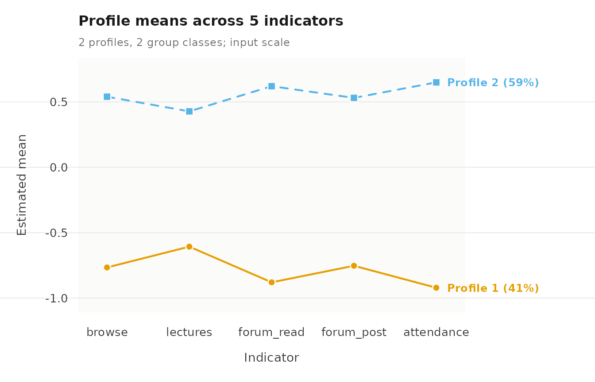
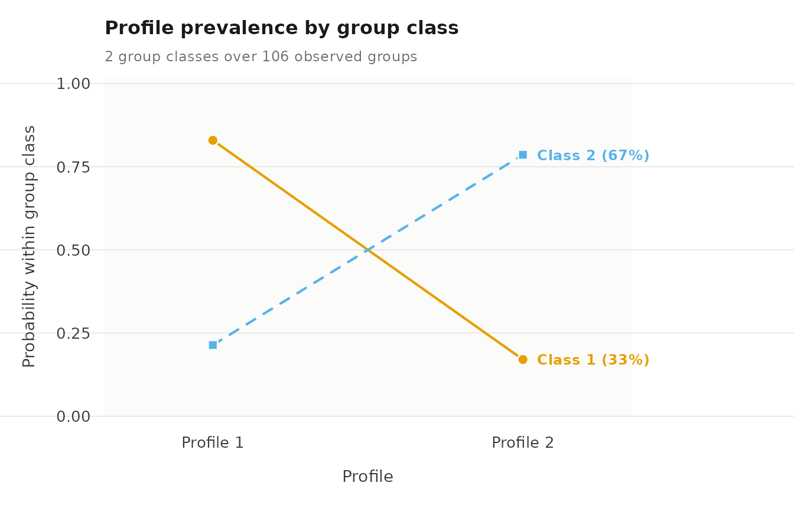

# Multilevel latent profile analysis

Multilevel latent profile analysis (MLPA) estimates latent profiles at
the observation level and, at a higher level, identifies latent group
classes that differ in how probable each profile is for their
observations. Each profile is characterized by a mean and variance for
each indicator and is defined identically across all group classes. The
group classes therefore differ only in the probabilities associated with
the profiles.

## Data

`course_engagement` has one row per course enrolment: 1,422 enrolments
from 106 students.
[`multilpa()`](https://pak.dynasite.org/latents/reference/multilpa.md)
needs two kinds of variables.

- **Group:** `student` identifies which enrolments belong to the same
  student.
- **Indicators:** five activity measures (`browse`, `lectures`,
  `forum_read`, `forum_post`, `attendance`), each standardized within
  course, so 0 is the course average.

The data are simulated, and two further variables record the structure
that generated them: `engagement` for each enrolment and `student_type`
for each student.

``` r

library(latents)
```

## Clustering within groups

To check how much each indicator varies between groups, we call
[`descriptives()`](https://pak.dynasite.org/latents/reference/descriptives.md)
with `vars` for the indicators and `id` for the group. `icc` is the
share of an indicator’s variance that lies between groups.

``` r

descriptives(course_engagement,
             vars = c("browse", "lectures", "forum_read", "forum_post",
                      "attendance"),
             id = "student")
#>     variable    n n_missing      mean    sd   min  max n_distinct n_groups    icc
#> 1     browse 1422         0 -2.81e-05 0.989 -3.14 2.49        398      106 0.1923
#> 2   lectures 1422         0 -4.22e-05 0.989 -2.91 3.22        399      106 0.0878
#> 3 forum_read 1422         0  7.03e-05 0.989 -2.73 2.81        400      106 0.2240
#> 4 forum_post 1422         0 -2.11e-05 0.989 -2.61 3.10        397      106 0.1503
#> 5 attendance 1422         0  7.74e-05 0.989 -2.45 2.41        401      106 0.2215
```

## Fit

To fit the model, we call
[`multilpa()`](https://pak.dynasite.org/latents/reference/multilpa.md)
with `vars` for the indicators, `id` for the group, `n_profiles` for the
number of profiles, `n_group_classes` for the number of group classes,
`n_starts` for the number of random EM starts, and `seed` for
reproducible starts. Printing the fit gives the profile means.

``` r

fit <- multilpa(course_engagement,
                vars = c("browse", "lectures", "forum_read", "forum_post",
                         "attendance"),
                id = "student", n_profiles = 2, n_group_classes = 2,
                n_starts = 10, seed = 1)
fit
#> Two-level latent profile analysis: 2 profiles, 2 group classes
#> 1422 individuals in 106 groups; varying diagonal residual covariance (VVI)
#> Log likelihood: -8439.816434 | AIC: 16925.633 | BIC (groups): 16986.892
#> Converged: TRUE | iterations: 8 | best start: 8/10
#> 
#>  profile browse lectures forum_read forum_post attendance count proportion
#>        1 -0.766   -0.606     -0.879     -0.753     -0.921   588      0.413
#>        2  0.540    0.427      0.620      0.531      0.649   834      0.587
#> 
#> Variances and standard errors: get_results(x, "profiles"). 
#> Every other table: get_results(x, what = ), or get_results(x, "all").
```

To check whether the starts agree, we call
[`get_results()`](https://pak.dynasite.org/latents/reference/get_results.md)
with `"starts"`. Starts that reach the same log likelihood support the
solution.

``` r

get_results(fit, "starts")
#>    start log_likelihood converged iterations error boundary
#> 1      1          -8440      TRUE         10  <NA>    FALSE
#> 2      2          -8440      TRUE         10  <NA>    FALSE
#> 3      3          -8440      TRUE         10  <NA>    FALSE
#> 4      4          -8440      TRUE         13  <NA>    FALSE
#> 5      5          -8440      TRUE         10  <NA>    FALSE
#> 6      6          -8440      TRUE         12  <NA>    FALSE
#> 7      7          -8440      TRUE         10  <NA>    FALSE
#> 8      8          -8440      TRUE          8  <NA>    FALSE
#> 9      9          -8440      TRUE         10  <NA>    FALSE
#> 10    10          -8440      TRUE          9  <NA>    FALSE
```

## Profiles

To obtain the profile means and variances, we call
[`get_results()`](https://pak.dynasite.org/latents/reference/get_results.md)
on the fit. There is one row per profile and indicator.

``` r

get_results(fit)
#>    profile  indicator   mean variance standard_deviation
#> 1        1     browse -0.766    0.528              0.727
#> 2        1   lectures -0.606    0.538              0.734
#> 3        1 forum_read -0.879    0.363              0.603
#> 4        1 forum_post -0.753    0.421              0.649
#> 5        1 attendance -0.921    0.374              0.611
#> 6        2     browse  0.540    0.590              0.768
#> 7        2   lectures  0.427    0.845              0.919
#> 8        2 forum_read  0.620    0.481              0.694
#> 9        2 forum_post  0.531    0.689              0.830
#> 10       2 attendance  0.649    0.384              0.620
```

To see the profiles, we call
[`plot()`](https://rdrr.io/r/graphics/plot.default.html) on the fit.
Each line is a profile’s mean on each indicator, and point size shows
how common the profile is.

``` r

plot(fit)
```



## Group classes

To obtain the profile probabilities of each group class, we call
[`get_results()`](https://pak.dynasite.org/latents/reference/get_results.md)
with `"profile_probabilities"`. `probability` is the chance that an
observation of a group in that class falls in each profile, and
`group_class_probability` is the share of groups in the class.

``` r

get_results(fit, "profile_probabilities")
#>   group_class profile probability group_class_probability
#> 1           1       1       0.829                   0.325
#> 2           1       2       0.171                   0.325
#> 3           2       1       0.214                   0.675
#> 4           2       2       0.786                   0.675
```

To compare the group classes, we call
[`plot()`](https://rdrr.io/r/graphics/plot.default.html) with
`what = "probabilities"`: one line per group class across the profiles.

``` r

plot(fit, what = "probabilities")
```



## Class sizes

To obtain class sizes, we call
[`get_results()`](https://pak.dynasite.org/latents/reference/get_results.md)
with `"counts"`. `effective_count` sums the posterior probabilities, so
it need not be a whole number.

``` r

get_results(fit, "counts")
#>         level class effective_count effective_proportion
#> 1 individuals     1           587.9                0.413
#> 2 individuals     2           834.1                0.587
#> 3      groups     1            34.5                0.325
#> 4      groups     2            71.5                0.675
```

## Classification

To obtain classification certainty, we call
[`get_results()`](https://pak.dynasite.org/latents/reference/get_results.md)
with `"entropy"`. Relative entropy is reported for observations and for
groups: 1 means every case is assigned with certainty, 0 means no
separation.

``` r

get_results(fit, "entropy")
#>         level n_classes n_units entropy_sum relative_entropy
#> 1 individuals         2    1422       60.94            0.938
#> 2      groups         2     106        4.44            0.940
```

To add each observation’s assigned profile and group class to the data,
we call
[`get_results()`](https://pak.dynasite.org/latents/reference/get_results.md)
with `"assignments"` and `data` for the data frame. It returns the data
in its original row order with five added columns: `profile` and
`group_class` hold the most probable classes, `uncertainty` is one minus
the posterior probability of the assigned profile, and the
`posterior_profile_` columns hold the posterior probability of each
profile. Assignment takes the most probable class, so `profile` and
`group_class` alone ignore classification uncertainty.

``` r

get_results(fit, "assignments", data = course_engagement) |> head()
#>   student course sequence browse lectures forum_read forum_post attendance previous_grade
#> 1       1     23        1   0.73    -0.08       0.30       0.67       0.72           0.54
#> 2       1     19        2   0.68     0.53      -0.02      -0.55       0.70          -0.71
#> 3       1      4        3  -1.51    -0.51      -0.91      -0.80      -0.97           1.98
#> 4       1     18        4   0.64    -1.02      -1.62      -1.20      -1.26          -1.42
#> 5       1     16        5  -0.94    -0.37      -0.71      -0.28      -1.52          -0.67
#> 6       1     29        6  -0.36    -0.46      -0.77      -0.43      -1.34          -0.40
#>   engagement student_type profile group_class uncertainty posterior_profile_1 posterior_profile_2
#> 1    engaged     wavering       2           1    4.44e-04            0.000444            1.00e+00
#> 2    engaged     wavering       2           1    1.49e-02            0.014858            9.85e-01
#> 3 disengaged     wavering       1           1    2.42e-06            0.999998            2.42e-06
#> 4 disengaged     wavering       1           1    3.86e-06            0.999996            3.86e-06
#> 5 disengaged     wavering       1           1    5.75e-06            0.999994            5.75e-06
#> 6 disengaged     wavering       1           1    2.28e-05            0.999977            2.28e-05
```

## Recovery of the known structure

To compare the fitted classes with known labels, we call
[`get_results()`](https://pak.dynasite.org/latents/reference/get_results.md)
with `"assignments"`, `data` for the data frame, and `truth` for the
columns that hold the labels. `engagement` is compared with the profiles
and `student_type` with the group classes. Class numbers are arbitrary,
so the table is read by its largest cells.

``` r

get_results(fit, "assignments", data = course_engagement,
            truth = c("engagement", "student_type"))
#>    assignment class        truth      value   n proportion
#> 1     profile     1   engagement disengaged 569     0.9726
#> 2     profile     2   engagement disengaged  16     0.0274
#> 3     profile     1   engagement    engaged  17     0.0203
#> 4     profile     2   engagement    engaged 820     0.9797
#> 5 group_class     1 student_type  committed   1     0.0161
#> 6 group_class     2 student_type  committed  61     0.9839
#> 7 group_class     1 student_type   wavering  34     0.7727
#> 8 group_class     2 student_type   wavering  10     0.2273
```

## Reference

The calls below list the other tables, functions and views available for
a fitted model. Each comment states what the call returns.

``` r

# Tables: get_results(fit, what)
get_results(fit, "all")                          # every table, as a named list
get_results(fit, "covariances")                  # within-profile residual covariances
get_results(fit, "posteriors")                   # one row per observation and profile
get_results(fit, "posteriors", format = "wide")  # one row per observation
get_results(fit, "group_posteriors")             # one row per group and group class
get_results(fit, "classification")               # class sizes and average posteriors
get_results(fit, "average_posteriors")           # mean posterior by assigned class
get_results(fit, "classification_errors")        # P(assigned class | true class)
get_results(fit, "bch_weights")                  # weights for three-step analysis
get_results(fit, "residuals")                    # residual correlations within profiles
get_results(fit, "information_criteria")         # AIC, BIC and the other criteria
get_results(fit, "model")                        # one row describing the fit
get_results(fit, "data")                         # the variables used in the fit
as.data.frame(fit)                               # the profile table

# Summaries and diagnostics
descriptives(fit)                    # indicator summaries with the ICC
descriptives(fit, by = "profile")    # the same, by assigned profile
diagnostics(fit)                     # every classification diagnostic
report(fit)                          # summary, diagnostics and plots together

# Inference and likelihood
parameter_inference(fit)             # standard errors and Wald intervals
confint(fit)                         # confidence intervals
vcov(fit)                            # covariance matrix of the estimates
logLik(fit)                          # log likelihood
AIC(fit)                             # Akaike information criterion
BIC(fit)                             # BIC with the number of groups
nobs(fit)                            # number of groups

# Plots: plot(fit, what)
plot_views()                # every view and what it shows
plot(fit, what = "bars")             # profile means with 95% intervals
plot(fit, what = "heatmap")          # means in standard deviations
plot(fit, what = "sizes")            # effective size of each profile
plot(fit, what = "entropy")          # per-case classification uncertainty
plot(fit, what = "posteriors")       # posterior of each assigned profile
plot(fit, what = "avepp")            # average posteriors, assigned by posterior class
plot(fit, what = "all")              # every view this fit supports

# Other functions
sensitivity(fit, seeds = 1:10)       # refits under several seeds
starting_values(fit)                 # parameters to start another fit
```

The evaluation vignette covers
[`enumerate_classes()`](https://pak.dynasite.org/latents/reference/enumerate_classes.md),
[`candidate_fit()`](https://pak.dynasite.org/latents/reference/candidate_fit.md)
and
[`bootstrap_lrt()`](https://pak.dynasite.org/latents/reference/bootstrap_lrt.md);
the covariates vignette covers
[`three_step()`](https://pak.dynasite.org/latents/reference/three_step.md),
[`r3step()`](https://pak.dynasite.org/latents/reference/r3step.md) and
[`fit_staged()`](https://pak.dynasite.org/latents/reference/fit_staged.md);
the transitions vignette covers
[`lta()`](https://pak.dynasite.org/latents/reference/lta.md),
[`get_tna()`](https://pak.dynasite.org/latents/reference/get_tna.md) and
[`get_group_tna()`](https://pak.dynasite.org/latents/reference/get_group_tna.md).

## All tables

To see every table at once, we call
[`summary()`](https://rdrr.io/r/base/summary.html) on the fit, with
`rows` for the number of rows shown per table.

``` r

print(summary(fit), rows = 3)
#> Multilevel LPA: 2 profiles and 2 group classes
#> Individuals: 1422; groups: 106; parameters: 23; converged: TRUE
#> Log likelihood: -8439.816434; AIC: 16925.633
#> BIC (groups): 16986.892; BIC (individuals): 17046.609
#> Best likelihood replicated in 10/10 starts (absolute tolerance 0.00844).
#> 
#> -- profiles --------------------------------------------------------
#>  profile  indicator    mean variance standard_deviation
#>        1     browse -0.7656   0.5285             0.7270
#>        1   lectures -0.6065   0.5384             0.7337
#>        1 forum_read -0.8792   0.3631             0.6026
#>    ... 7 more rows.  get_results(x, what = "profiles")
#> 
#> -- responses -------------------------------------------------------
#>    (no rows)
#> 
#> -- covariances -----------------------------------------------------
#>  profile  indicator indicator_2 covariance
#>        1     browse      browse     0.5285
#>        1   lectures      browse     0.0000
#>        1 forum_read      browse     0.0000
#>    ... 47 more rows.  get_results(x, what = "covariances")
#> 
#> -- profile_probabilities -------------------------------------------
#>  group_class profile probability group_class_probability
#>            1       1      0.8295                  0.3254
#>            1       2      0.1705                  0.3254
#>            2       1      0.2141                  0.6746
#>    ... 1 more rows.  get_results(x, what = "profile_probabilities")
#> 
#> -- counts ----------------------------------------------------------
#>        level class effective_count effective_proportion
#>  individuals     1          587.91               0.4134
#>  individuals     2          834.09               0.5866
#>       groups     1           34.48               0.3253
#>    ... 1 more rows.  get_results(x, what = "counts")
#> 
#> -- posteriors ------------------------------------------------------
#>  row group profile posterior modal
#>    1     1       1 0.0004438 FALSE
#>    2     1       1 0.0148577 FALSE
#>    3     1       1 0.9999976  TRUE
#>    ... 2841 more rows.  get_results(x, what = "posteriors")
#> 
#> -- group_posteriors ------------------------------------------------
#>  group group_size log_likelihood group_class posterior modal
#>      1         13         -61.52           1 1.000e+00  TRUE
#>      2         13         -71.94           1 1.000e+00  TRUE
#>      3         14         -76.69           1 6.032e-10 FALSE
#>    ... 209 more rows.  get_results(x, what = "group_posteriors")
#> 
#> -- assignments -----------------------------------------------------
#>  student browse lectures forum_read forum_post attendance profile group_class uncertainty
#>        1   0.73    -0.08       0.30       0.67       0.72       2           1   4.438e-04
#>        1   0.68     0.53      -0.02      -0.55       0.70       2           1   1.486e-02
#>        1  -1.51    -0.51      -0.91      -0.80      -0.97       1           1   2.420e-06
#>  posterior_profile_1 posterior_profile_2
#>            0.0004438           9.996e-01
#>            0.0148577           9.851e-01
#>            0.9999976           2.420e-06
#>    ... 1419 more rows.  get_results(x, what = "assignments")
#> 
#> -- classification --------------------------------------------------
#>        level class n_modal proportion_modal estimated_n estimated_proportion average_posterior
#>  individuals     1     586           0.4121      587.91               0.4134            0.9818
#>  individuals     2     836           0.5879      834.09               0.5866            0.9849
#>       groups     1      35           0.3302       34.48               0.3253            0.9690
#>  odds_correct_classification
#>                        76.38
#>                        46.06
#>                        64.88
#>    ... 1 more rows.  get_results(x, what = "classification")
#> 
#> -- average_posteriors ----------------------------------------------
#>        level assigned_class class n_assigned average_posterior
#>  individuals              1     1        586           0.98176
#>  individuals              1     2        586           0.01824
#>  individuals              2     1        836           0.01507
#>    ... 5 more rows.  get_results(x, what = "average_posteriors")
#> 
#> -- classification_errors -------------------------------------------
#>        level true_class assigned_class probability
#>  individuals          1              1     0.97857
#>  individuals          1              2     0.02143
#>  individuals          2              1     0.01281
#>    ... 5 more rows.  get_results(x, what = "classification_errors")
#> 
#> -- bch_weights -----------------------------------------------------
#>        level unit assigned_class class   weight
#>  individuals    1              2     1 -0.01327
#>  individuals    1              2     2  1.01327
#>  individuals    2              2     1 -0.01327
#>    ... 3053 more rows.  get_results(x, what = "bch_weights")
#> 
#> -- entropy ---------------------------------------------------------
#>        level n_classes n_units entropy_sum relative_entropy
#>  individuals         2    1422      60.944           0.9382
#>       groups         2     106       4.436           0.9396
#> 
#> -- residuals -------------------------------------------------------
#>    profile indicator_1 indicator_2     kind observed expected residual effective_n statistic df
#>  profile_2    lectures  attendance gaussian   0.2339        0   0.2339       834.1     6.871 NA
#>  profile_1  forum_read  attendance gaussian   0.2287        0   0.2287       587.9     5.631 NA
#>  profile_2  forum_read  attendance gaussian   0.2088        0   0.2088       834.1     6.109 NA
#>    p_value p_adjusted
#>  6.388e-12  6.388e-12
#>  1.795e-08  1.795e-08
#>  1.002e-09  1.002e-09
#>    ... 17 more rows.  get_results(x, what = "residuals")
#> 
#> -- information_criteria --------------------------------------------
#>  log_likelihood n_parameters   aic   kic bic_groups bic_individual sabic_groups sabic_individual
#>           -8440           23 16926 16952      16987          17047        16914            16974
#>  caic_groups caic_individual awe_groups awe_individual icl_groups icl_individual clc_groups
#>        17010           17070      17172          17404      16996          17168      16889
#>  clc_individual
#>           17002
#> 
#> -- model -----------------------------------------------------------
#>  n_observations n_informative n_groups n_profiles n_group_classes centering covariance_structure
#>            1422          1422      106          2               2      none                  VVI
#>  n_parameters n_parameters_with_measurement log_likelihood   aic bic_groups bic_individual
#>            23                            23          -8440 16926      16987          17047
#>  converged iterations boundary small_classes best_start n_best_replicated
#>       TRUE          8    FALSE         FALSE          8                10
#> 
#> -- stages ----------------------------------------------------------
#>  stage group_classes fixed log_likelihood parameters parameters_with_measurement converged
#>  joint             2  <NA>          -8440         23                          23      TRUE
#> 
#> -- starts ----------------------------------------------------------
#>  start log_likelihood converged iterations error boundary
#>      1          -8440      TRUE         10  <NA>    FALSE
#>      2          -8440      TRUE         10  <NA>    FALSE
#>      3          -8440      TRUE         10  <NA>    FALSE
#>    ... 7 more rows.  get_results(x, what = "starts")
#> 
#> -- data ------------------------------------------------------------
#>  student browse lectures forum_read forum_post attendance
#>        1   0.73    -0.08       0.30       0.67       0.72
#>        1   0.68     0.53      -0.02      -0.55       0.70
#>        1  -1.51    -0.51      -0.91      -0.80      -0.97
#>    ... 1419 more rows.  get_results(x, what = "data")
#> 
#> 19 tables above, truncated to fit. get_results(x, what = ) returns any
#> of them whole, and get_results(x, what = "all") returns every one.
```

## Assumptions

- Profiles have the same means and variances in every group class.
- Observations are independent given their group’s class, and groups are
  independent of one another.
- Indicators are independent within a profile (the default diagonal
  covariance; `covariance_model = "full"` relaxes it).
- The numbers of profiles and group classes are chosen by the analyst;
  see the evaluation vignette for comparing them.
