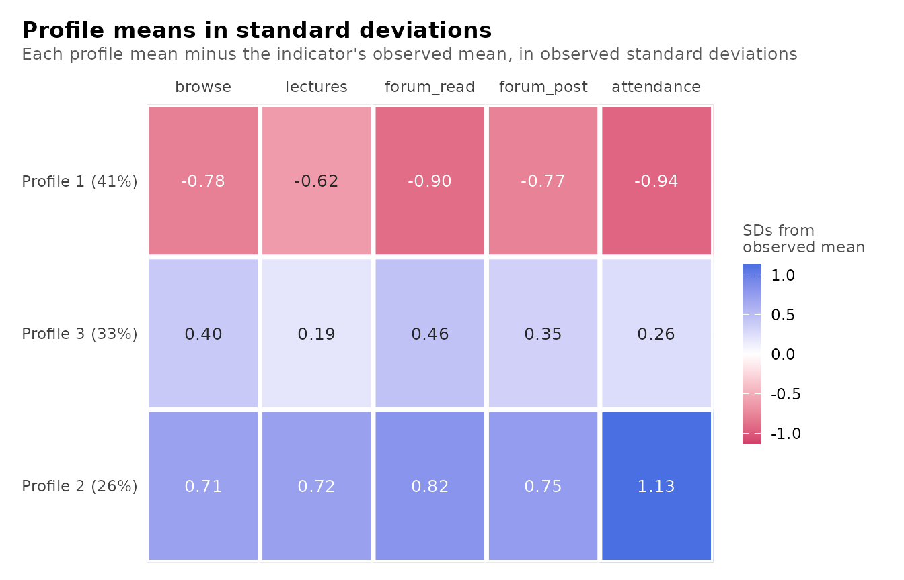
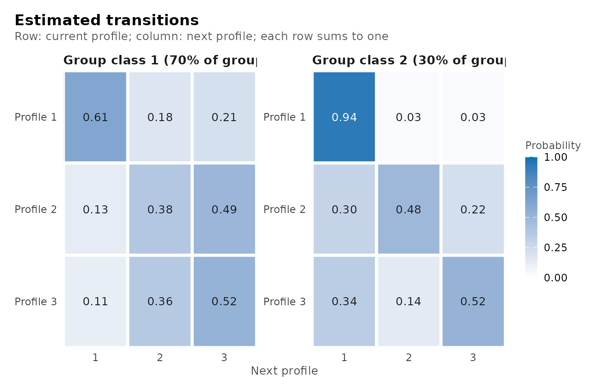
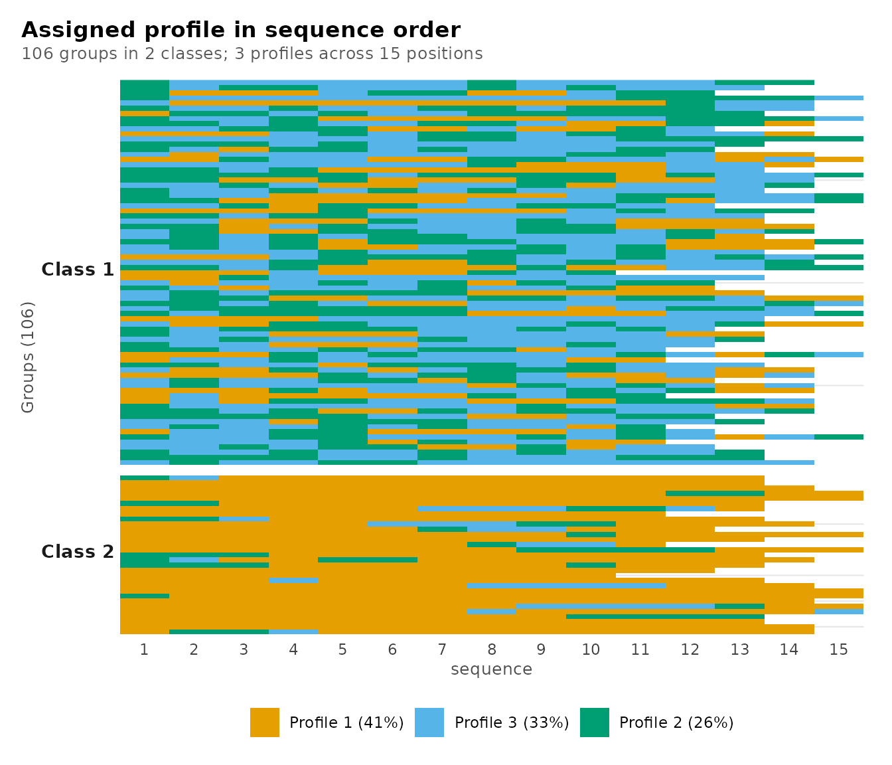
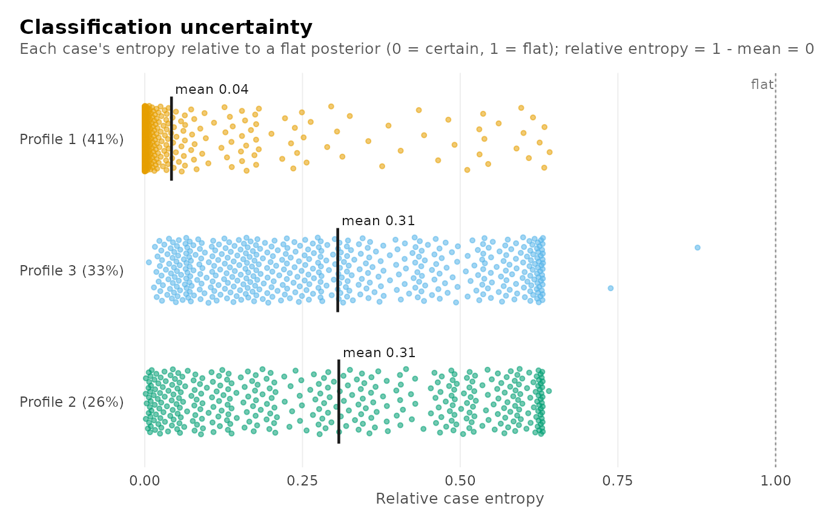
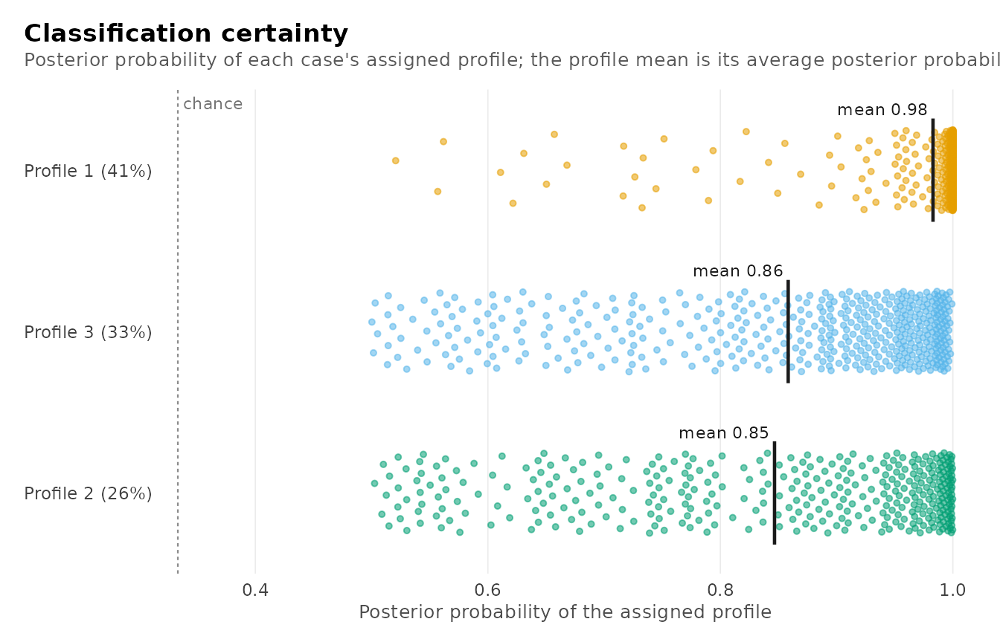
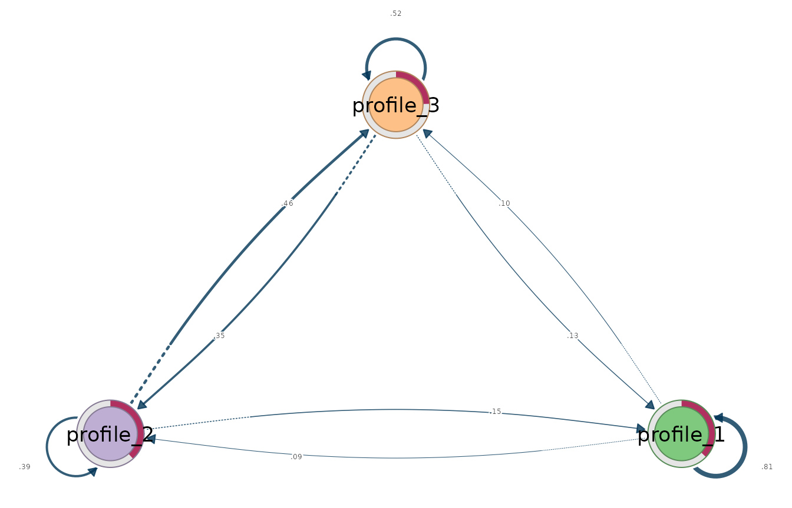
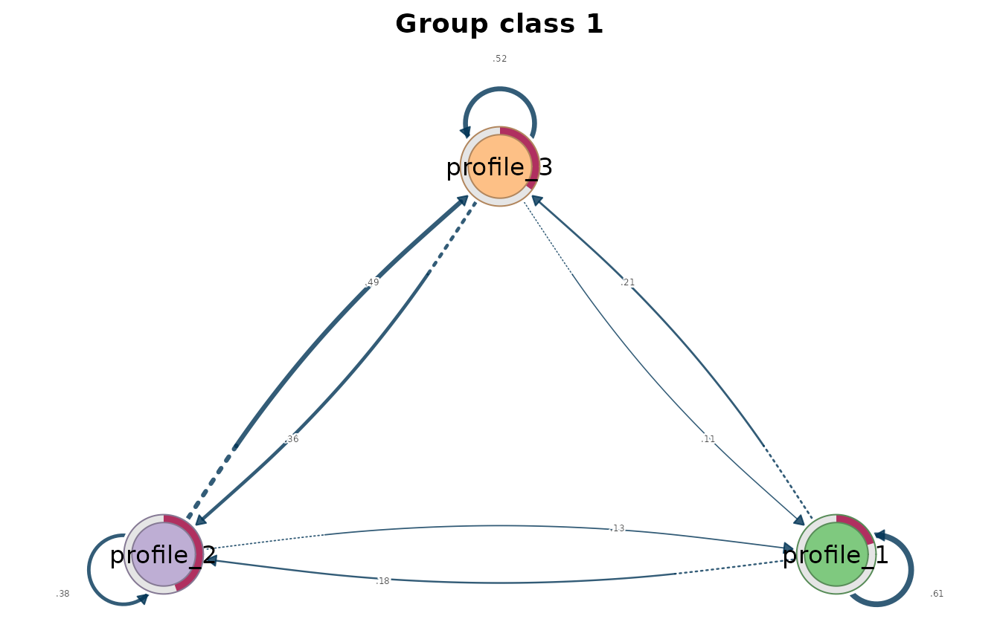
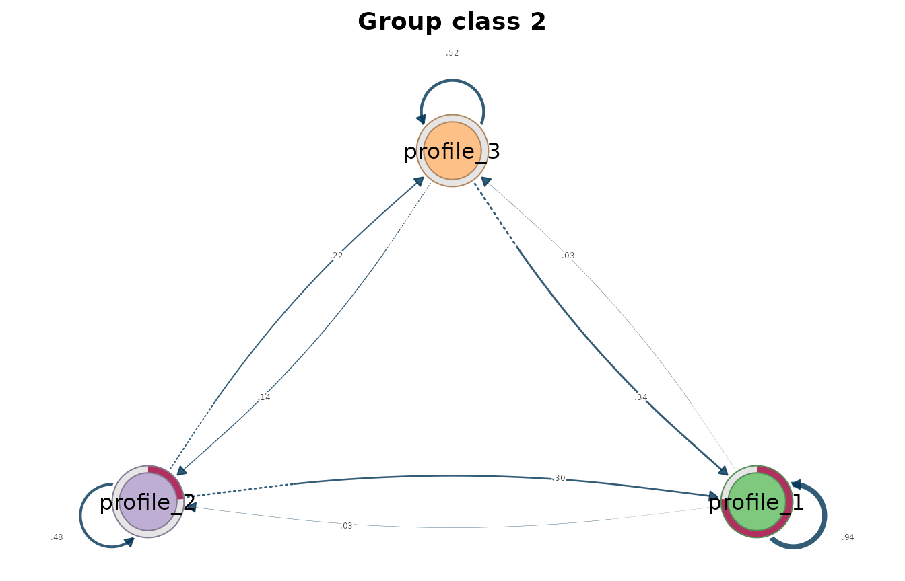

# Latent transition analysis

Latent transition analysis (LTA) estimates latent profiles at each
occasion and the probability of moving from one profile to another
between consecutive occasions. With group classes, each class has its
own starting probabilities and its own transition matrix, so classes
separate groups that change differently over time.

## Data

`course_engagement` has one row per course enrolment: 1,422 enrolments
from 106 students.
[`lta()`](https://pak.dynasite.org/latents/reference/lta.md) needs three
kinds of variables.

- **Group:** `student` identifies whose occasions belong together.
- **Occasion order:** `sequence` is the position of each course in the
  student’s history. Students can have different numbers of occasions.
- **Indicators:** five activity measures (`browse`, `lectures`,
  `forum_read`, `forum_post`, `attendance`), each standardized within
  course, so 0 is the course average.

``` r

library(latents)
```

## Fit

To fit the model, we call
[`lta()`](https://pak.dynasite.org/latents/reference/lta.md) with `vars`
for the indicators, `id` for the group, `time` for the occasion order,
`n_profiles` for the number of profiles, `n_group_classes` for the
number of group classes, `n_starts` for the number of random EM starts,
and `seed` for reproducible starts.

``` r

moves <- lta(course_engagement,
             vars = c("browse", "lectures", "forum_read", "forum_post",
                      "attendance"),
             id = "student", time = "sequence",
             n_profiles = 3, n_group_classes = 2, n_starts = 3, seed = 1)
moves
#> Latent transition model: 3 profiles, 2 group classes
#> 1422 observations in 106 groups, up to 15 occasions (unbalanced, observed grid)
#> Log likelihood: -8242.967653; 47 parameters; BIC (groups): 16705.1169
#> Converged: TRUE after 84 iterations; best of 3 starts
#> 
#>  profile browse lectures forum_read forum_post attendance count proportion
#>        1 -0.776   -0.612     -0.888     -0.761     -0.929   579      0.407
#>        2  0.705    0.711      0.806      0.746      1.122   374      0.263
#>        3  0.395    0.188      0.453      0.344      0.252   469      0.330
#> 
#> Variances and standard errors: get_results(x, "profiles"). 
#> Every other table: get_results(x, what = ), or get_results(x, "all").
```

To check whether the starts agree, we call
[`get_results()`](https://pak.dynasite.org/latents/reference/get_results.md)
with `"starts"`. Starts that reach the same log likelihood support the
solution.

``` r

get_results(moves, "starts")
#>   start log_likelihood converged iterations error
#> 1     1          -8243      TRUE         84  <NA>
#> 2     2          -8243      TRUE         91  <NA>
#> 3     3          -8243      TRUE         84  <NA>
```

## Profiles

To see the profiles, we call
[`plot()`](https://rdrr.io/r/graphics/plot.default.html) on the fit.
Each line is a profile’s mean on each indicator, and its label gives the
profile’s share of the cases.

``` r

plot(moves)
```


To compare profiles on a common scale, we call
[`plot()`](https://rdrr.io/r/graphics/plot.default.html) with
`what = "heatmap"`, which shows each mean in standard deviations from
the indicator’s overall mean.

``` r

plot(moves, what = "heatmap")
```



## Starting probabilities

To obtain the starting probabilities, we call
[`get_results()`](https://pak.dynasite.org/latents/reference/get_results.md)
with `"initial"`. `probability` is the chance of starting in each
profile, `prevalence` the expected share of all occasions in it, and
`group_class_probability` the share of groups in the class.

``` r

get_results(moves, "initial")
#>   group_class profile probability prevalence group_class_probability
#> 1           1       1    2.04e-01     0.2296                   0.699
#> 2           1       2    4.45e-01     0.3344                   0.699
#> 3           1       3    3.51e-01     0.4359                   0.699
#> 4           2       1    7.62e-01     0.8190                   0.301
#> 5           2       2    2.38e-01     0.0969                   0.301
#> 6           2       3    1.87e-05     0.0841                   0.301
```

## Transitions

To obtain the transition probabilities, we call
[`get_results()`](https://pak.dynasite.org/latents/reference/get_results.md)
with `"transitions"`. `probability` is the chance of moving from profile
`from` to profile `to` at the next occasion, and the probabilities out
of each profile sum to one. `stable` marks staying in the same profile,
`expected_count` is the expected number of such moves in the data, and
`estimated = FALSE` marks a row the data cannot inform.

``` r

get_results(moves, "transitions")
#>    group_class from to probability expected_count stable estimated group_class_probability
#> 1            1    1  1      0.6144         127.80   TRUE      TRUE                   0.699
#> 2            1    1  2      0.1763          36.67  FALSE      TRUE                   0.699
#> 3            1    1  3      0.2092          43.53  FALSE      TRUE                   0.699
#> 4            1    2  1      0.1276          38.98  FALSE      TRUE                   0.699
#> 5            1    2  2      0.3786         115.61   TRUE      TRUE                   0.699
#> 6            1    2  3      0.4938         150.81  FALSE      TRUE                   0.699
#> 7            1    3  1      0.1140          46.33  FALSE      TRUE                   0.699
#> 8            1    3  2      0.3621         147.07  FALSE      TRUE                   0.699
#> 9            1    3  3      0.5238         212.83   TRUE      TRUE                   0.699
#> 10           2    1  1      0.9385         303.35   TRUE      TRUE                   0.301
#> 11           2    1  2      0.0313          10.13  FALSE      TRUE                   0.301
#> 12           2    1  3      0.0302           9.75  FALSE      TRUE                   0.301
#> 13           2    2  1      0.2964          11.68  FALSE      TRUE                   0.301
#> 14           2    2  2      0.4823          19.01   TRUE      TRUE                   0.301
#> 15           2    2  3      0.2213           8.72  FALSE      TRUE                   0.301
#> 16           2    3  1      0.3379          11.40  FALSE      TRUE                   0.301
#> 17           2    3  2      0.1420           4.79  FALSE      TRUE                   0.301
#> 18           2    3  3      0.5200          17.54   TRUE      TRUE                   0.301
```

To draw the transition matrices, we call
[`plot()`](https://rdrr.io/r/graphics/plot.default.html) with
`what = "transitions"`: one heatmap per group class, current profile in
rows and next profile in columns.

``` r

plot(moves, what = "transitions")
```



## Sequences

To see each group’s path, we call
[`plot()`](https://rdrr.io/r/graphics/plot.default.html) with
`what = "sequences"`: one row per group, coloured by its most probable
profile at each occasion. These assignments ignore classification
uncertainty.

``` r

plot(moves, what = "sequences")
```



## Classification

To obtain classification certainty, we call
[`get_results()`](https://pak.dynasite.org/latents/reference/get_results.md)
with `"entropy"`. Relative entropy is reported for occasions and for
groups: 1 means every case is assigned with certainty, 0 means no
separation.

``` r

get_results(moves, "entropy")
#>         level n_classes n_units entropy_sum relative_entropy
#> 1 individuals         3    1422       309.8            0.802
#> 2      groups         2     106        16.3            0.778
```

To see where the uncertainty lies, we call
[`plot()`](https://rdrr.io/r/graphics/plot.default.html) with
`what = "entropy"` for the per-case uncertainty within each profile, and
with `what = "posteriors"` for the posterior probability of each case’s
assigned profile.

``` r

plot(moves, what = "entropy")
```



``` r

plot(moves, what = "posteriors")
```



## Transition networks

To analyse the transitions as networks, we call
[`get_tna()`](https://pak.dynasite.org/latents/reference/get_tna.md) for
one network pooled over group classes and
[`get_group_tna()`](https://pak.dynasite.org/latents/reference/get_group_tna.md)
for one network per class. Both return
[tna](https://cran.r-project.org/package=tna) models built from the
estimated transitions, which
[`plot()`](https://rdrr.io/r/graphics/plot.default.html) draws.

``` r

plot(get_tna(moves))
```



``` r

plot(get_group_tna(moves))
```



## Assumptions

- The next profile depends only on the current profile and the group
  class, and transition probabilities are the same at every occasion.
- Profiles have the same definition at every occasion.
- Indicators are independent within a profile (the default diagonal
  covariance; `covariance_model = "full"` relaxes it).
- Standard errors, likelihood-ratio tests and class enumeration are not
  available for this model.
