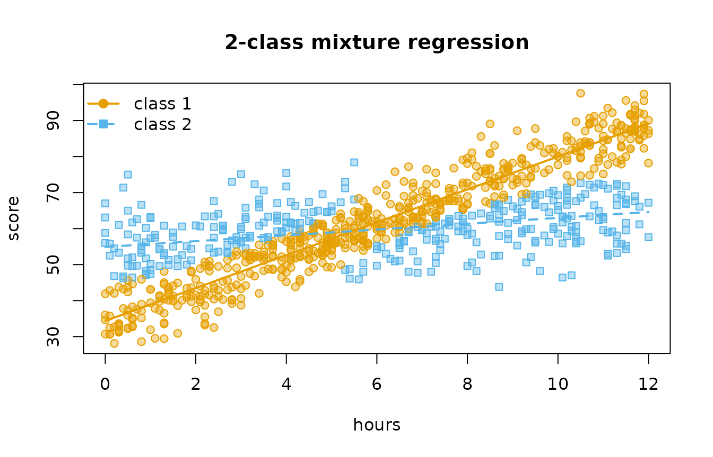
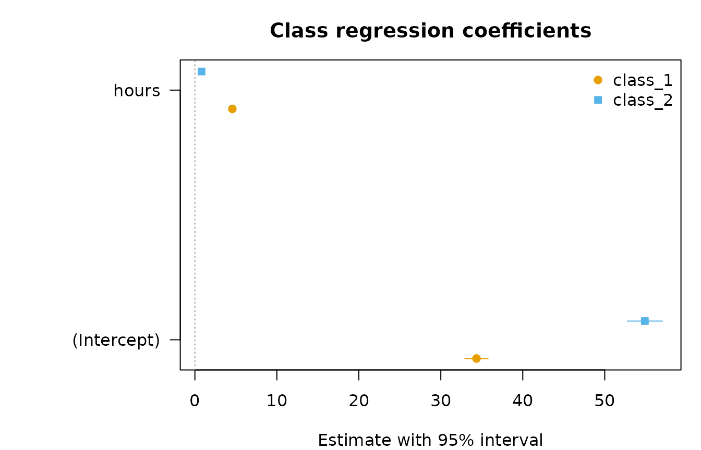
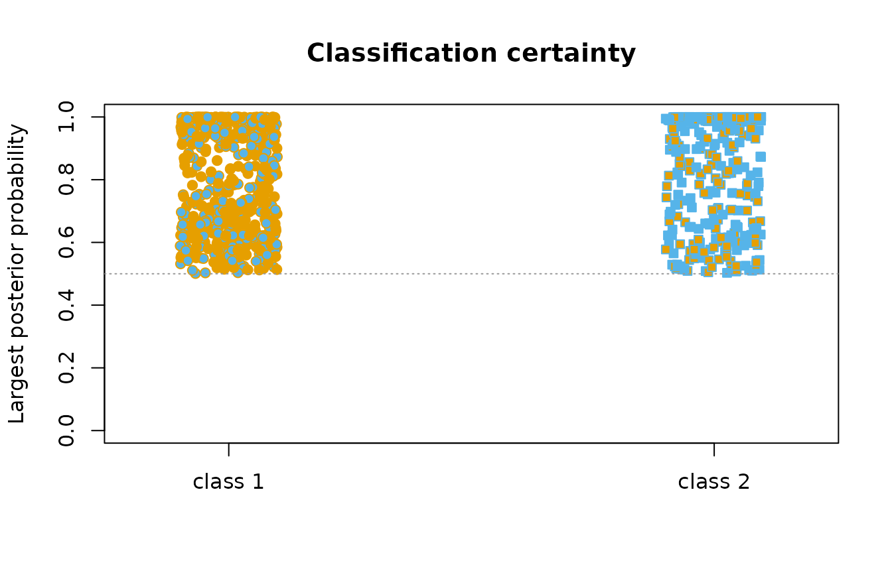

# Mixture regression

A single regression assumes that one line describes everyone. Mixture
regression drops that assumption: the data are taken to come from a
small number of latent classes, each with its own regression, and the
model estimates the regressions, how common each class is, and how
probably each observation belongs to each class — all at once. The
method goes by several names: clusterwise regression, latent class
regression, regression mixture (DeSarbo and Cron 1988; Wedel and DeSarbo
1995).

[`mixture_regression()`](https://pak.dynasite.org/latents/reference/mixture_regression.md)
fits it for continuous (`"gaussian"`), binary or binomial (`"binomial"`)
and count (`"poisson"`) outcomes, at one level or two:

| Question | Call |
|----|----|
| Do observations follow different regressions? | `mixture_regression(y ~ x, data, n_classes)` |
| Do *groups* (persons, schools) follow different regressions? | `mixture_regression(..., id = "person", class_level = "group")` |
| Do groups differ in how often their observations follow each regression? | `mixture_regression(..., id = "person", n_group_classes = 2)` |
| What predicts which class an observation (or group) is in? | `membership = ~ z`, `group_membership = ~ v` |
| Is some effect the same in every class? | `common = ~ x2` |
| How many classes? | `enumerate_regressions(..., n_classes = 1:4)` |

## The data

`study_hours` is simulated so that the truth is known. 150 students
report six weeks each. In each week a student studies with a *deep* or a
*surface* strategy, and the strategy decides how hours turn into a quiz
score: deep weeks gain about 4.5 points per hour from a base of 35,
surface weeks under a point per hour from a base of 55. Steady students
study deeply in most weeks, erratic students in few. The generating
strategy and student type are kept in the data so recovery can be
checked; the models never see them.

``` r

library(latents)
head(study_hours)
#>   student week hours sleep motivation score passed questions strategy student_type
#> 1       1    1  10.2   5.7      -0.08  67.8      0         2  surface      erratic
#> 2       1    2   2.6   6.4      -0.08  59.5      0         2  surface      erratic
#> 3       1    3  10.1   6.4      -0.08  55.9      1         2  surface      erratic
#> 4       1    4   8.7   6.7      -0.08  52.5      0         5  surface      erratic
#> 5       1    5  11.3   9.5      -0.08  89.4      0         2     deep      erratic
#> 6       1    6   5.7   6.7      -0.08  58.0      0         3  surface      erratic
```

## One class per observation

``` r

fit <- mixture_regression(score ~ hours, data = study_hours, n_classes = 2,
                          n_starts = 5, seed = 1)
fit
#> Mixture of gaussian regressions: 2 classes (one class per row)
#> score ~ hours
#> 900 rows | log likelihood -3144.0074 | BIC 6335.63 | entropy 0.443
#> Converged: TRUE | iterations: 42 | best likelihood reached by 5 of 5 completed starts (6 run)
#> 
#> Classes
#> 
#> Class    Share  Expected  Rows assigned  Avg. posterior  Residual SD
#> -------  -----  --------  -------------  --------------  -----------
#> Class 1  0.564    507.55            573           0.788         5.24
#> Class 2  0.436    392.45            327           0.829         6.89
#> 
#> Regression coefficients (95% CI)
#> 
#> Class    Term       Estimate          95% CI      p
#> -------  ---------  --------  --------------  -----
#> Class 1  Intercept     34.35  [32.94, 35.76]  <.001
#> Class 1  hours          4.57  [ 4.36,  4.77]  <.001
#> Class 2  Intercept     54.90  [52.75, 57.04]  <.001
#> Class 2  hours          0.81  [ 0.48,  1.14]  <.001
#> 
#> Every table: get_results(x, what = ), e.g. "classes", "membership", "fit", "assignments".
```

The two classes are the two strategies: a steep regression from a low
base and a flat one from a high base. Every table comes from
[`get_results()`](https://pak.dynasite.org/latents/reference/get_results.md);
the class table gives each class’s share, its residual standard
deviation and how certainly its members are assigned.

``` r

get_results(fit, "classes")
#> Classes
#> 
#> Class    Share  Expected  Rows assigned  Avg. posterior  Residual SD
#> -------  -----  --------  -------------  --------------  -----------
#> Class 1  0.564    507.55            573           0.788         5.24
#> Class 2  0.436    392.45            327           0.829         6.89
```

`get_results(fit, "assignments")` gives one row per observation. Because
these data carry the generating strategy, the recovery table
cross-tabulates the assigned classes against it:

``` r

get_results(fit, "recovery", data = study_hours, truth = "strategy")
#> Recovery of a known classification
#> 
#> assigned  strategy    n  share
#> --------  --------  ---  -----
#> class_1   deep      448   0.78
#> class_2   deep       49   0.15
#> class_1   surface   125   0.22
#> class_2   surface   278   0.85
```

``` r

plot(fit)
```



## How many classes?

[`enumerate_regressions()`](https://pak.dynasite.org/latents/reference/enumerate_regressions.md)
fits a range of class counts and returns their fit statistics in one
table, marking the minimum-BIC model.

``` r

classes <- enumerate_regressions(score ~ hours, data = study_hours,
                                 n_classes = 1:4, n_starts = 3, seed = 1)
classes
#> Mixture regression class enumeration
#> 
#>  n_classes n_group_classes log_likelihood n_parameters  bic  icl entropy smallest_share converged
#>          1               1          -3245            3 6510 6510      NA        1.00000      TRUE
#>          2               1          -3144            7 6336 7030  0.4432        0.43526      TRUE
#>          3               1          -3133           11 6341 7272  0.5292        0.07523      TRUE
#>          4               1          -3126           15 6354 7460  0.5571        0.07192      TRUE
#>  best_bic
#>     FALSE
#>      TRUE
#>     FALSE
#>     FALSE
#> 
#> One model: get_results(x, "model", n_classes = ).
```

With `bootstrap = B`, each row also gets a parametric bootstrap
likelihood-ratio test of one class fewer (McLachlan 1987): outcomes are
simulated from the smaller model, both models are refitted, and the
p-value is the share of simulated statistics at least as large as the
observed one. It is slow — `2 B` refits per row — so it is not run here.

## What predicts the class?

`membership` adds a multinomial logit for class membership. Here sleep
before the quiz makes a deep week more likely, so it should lower the
odds of the surface class:

``` r

with_sleep <- mixture_regression(score ~ hours, data = study_hours, n_classes = 2,
                                 membership = ~ sleep, n_starts = 5, seed = 1)
get_results(with_sleep, "membership")
#> Class membership (log odds, 95% CI)
#> 
#> Class    Term       Estimate          95% CI     p  Odds ratio
#> -------  ---------  --------  --------------  ----  ----------
#> Class 2  Intercept      1.56  [ 0.22,  2.89]  .023        4.74
#> Class 2  sleep         -0.26  [-0.45, -0.07]  .007        0.77
```

The coefficients are estimated jointly with the regressions — a one-step
model, not a regression on assigned classes — so classification error
does not attenuate them.

## Groups that share a class

When every row of a group belongs to the same class, pass `id` and
`class_level = "group"`. A group’s evidence for a class is the product
of its rows’ likelihoods, so classes of *students* are separated far
more sharply than classes of weeks could be. The binary `passed` outcome
in these data depends on the student’s type, not on the week:

``` r

students <- mixture_regression(passed ~ hours, data = study_hours, n_classes = 2,
                               family = "binomial", id = "student",
                               class_level = "group", membership = ~ motivation,
                               n_starts = 5, seed = 1)
students
#> Mixture of binomial regressions: 2 classes (one class per `student`)
#> passed ~ hours
#> 900 rows in 150 groups | log likelihood -540.8146 | BIC 1111.69 | entropy 0.668
#> Converged: TRUE | iterations: 16 | best likelihood reached by 6 of 6 completed starts (6 run)
#> 
#> Classes
#> 
#> Class    Share  Expected  Groups assigned  Avg. posterior
#> -------  -----  --------  ---------------  --------------
#> Class 1  0.517     77.61               78           0.903
#> Class 2  0.483     72.39               72           0.900
#> 
#> Regression coefficients (95% CI)
#> 
#> Class    Term       Estimate            95% CI      p  Odds ratio
#> -------  ---------  --------  ----------------  -----  ----------
#> Class 1  Intercept    -2.463  [-3.098, -1.827]  <.001       0.085
#> Class 1  hours         0.514  [ 0.391,  0.636]  <.001       1.671
#> Class 2  Intercept     0.070  [-0.455,  0.596]   .793       1.073
#> Class 2  hours        -0.041  [-0.122,  0.040]   .318       0.960
#> 
#> Every table: get_results(x, what = ), e.g. "classes", "membership", "fit", "assignments".
get_results(students, "membership")
#> Class membership (log odds, 95% CI)
#> 
#> Class    Term        Estimate          95% CI      p  Odds ratio
#> -------  ----------  --------  --------------  -----  ----------
#> Class 2  Intercept      -0.15  [-0.88,  0.58]   .688        0.86
#> Class 2  motivation     -1.82  [-2.78, -0.86]  <.001        0.16
```

A mixture of logistic regressions with a single binary outcome per class
assignment is not identified — any mixture of Bernoulli distributions is
a Bernoulli distribution (Follmann and Lambert 1991) — so
[`mixture_regression()`](https://pak.dynasite.org/latents/reference/mixture_regression.md)
refuses `family = "binomial"` with one trial per row unless the class is
shared by a group:

``` r

mixture_regression(passed ~ hours, data = study_hours, n_classes = 2,
                   family = "binomial")
#> Error:
#> ! A mixture of logistic regressions with one binary outcome per class assignment is not identified: a mixture of Bernoulli distributions is itself a Bernoulli distribution (Follmann and Lambert 1991). Give each class assignment several outcomes with `id` and `class_level = "group"`, or supply binomial counts as `cbind(successes, failures)`.
```

## Two levels: groups that differ in their mix

The deep/surface strategy changes from week to week, but steady and
erratic students use the strategies in different proportions. That is a
two-level mixture (Vermunt 2003): rows keep their own regression class,
and a latent *group class* shifts the class probabilities of all rows in
its groups.

``` r

two_level <- mixture_regression(score ~ hours, data = study_hours, n_classes = 2,
                                id = "student", n_group_classes = 2,
                                membership = ~ sleep, group_membership = ~ motivation,
                                n_starts = 5, seed = 1)
summary(two_level)
#> Model fit
#> 
#> Family          gaussian
#> Nesting         two-level
#> Classes         2
#> Group classes   2
#> Observations    900
#> Groups          150
#> Parameters      11
#> Log likelihood  -3091.78
#> AIC             6205.56
#> BIC             6238.68
#> SABIC           6203.86
#> ICL             6785.00
#> Entropy         0.562
#> Smallest class  42.1%
#> Converged       yes
#> 
#> Regression coefficients (95% CI)
#> 
#> Class    Term       Estimate          95% CI      p
#> -------  ---------  --------  --------------  -----
#> Class 1  Intercept     34.63  [33.43, 35.83]  <.001
#> Class 1  hours          4.52  [ 4.36,  4.69]  <.001
#> Class 2  Intercept     55.34  [53.56, 57.12]  <.001
#> Class 2  hours          0.72  [ 0.45,  0.99]  <.001
#> 
#> Classes
#> 
#> Class    Share  Expected  Groups assigned  Avg. posterior  Residual SD
#> -------  -----  --------  ---------------  --------------  -----------
#> Class 1  0.579    521.40              532           0.873         5.28
#> Class 2  0.421    378.60              368           0.845         6.79
#> 
#> Class membership (log odds, 95% CI)
#> 
#> Model        Class          Term                       Estimate          95% CI      p  Odds ratio
#> -----------  -------------  -------------------------  --------  --------------  -----  ----------
#> group_class  Group class 2  Intercept                     -0.13  [-1.02,  0.77]   .783        0.88
#> group_class  Group class 2  motivation                    -1.87  [-2.80, -0.93]  <.001        0.15
#> class        Class 2        Intercept x group_class_1      1.34  [-0.52,  3.20]   .157        3.84
#> class        Class 2        Intercept x group_class_2      4.25  [ 2.17,  6.33]  <.001       70.05
#> class        Class 2        sleep                         -0.47  [-0.74, -0.20]  <.001        0.63
#> 
#> Group classes
#> 
#> Group class    Class    Probability  Group share  Groups assigned
#> -------------  -------  -----------  -----------  ---------------
#> Group class 1  Class 1        0.861        0.513               76
#> Group class 1  Class 2        0.139        0.513               76
#> Group class 2  Class 1        0.282        0.487               74
#> Group class 2  Class 2        0.718        0.487               74
```

The `group_classes` table is the heart of it: within each group class,
the probability of each regression class. The group-class membership
model shows motivation separating the two kinds of student, and the
class model shows the week-level effect of sleep.

``` r

get_results(two_level, "recovery", data = study_hours,
            truth = "student_type", by = "group_class")
#> Recovery of a known classification
#> 
#> assigned       student_type   n  share
#> -------------  ------------  --  -----
#> group_class_1  steady        69  0.908
#> group_class_2  steady         8  0.108
#> group_class_1  erratic        7  0.092
#> group_class_2  erratic       66  0.892
```

## Counts, shared effects and equal variances

The Poisson family takes counts, and
[`offset()`](https://rdrr.io/r/stats/offset.html) terms for exposure.
`common` names predictors whose coefficient is the same in every class;
for the Gaussian family `variance = "equal"` shares one residual
standard deviation.

``` r

asked <- mixture_regression(questions ~ hours + sleep, data = study_hours, n_classes = 2,
                            family = "poisson", common = ~ sleep, n_starts = 5, seed = 1)
get_results(asked, "coefficients")
#> Regression coefficients (95% CI)
#> 
#> Class        Term       Estimate            95% CI      p  Rate ratio
#> -----------  ---------  --------  ----------------  -----  ----------
#> Class 1      Intercept     0.558  [ 0.243,  0.873]  <.001        1.75
#> Class 1      hours         0.104  [ 0.083,  0.125]  <.001        1.11
#> Class 2      Intercept     1.508  [ 1.020,  1.996]  <.001        4.52
#> Class 2      hours        -0.110  [-0.197, -0.022]   .014        0.90
#> All classes  sleep        -0.019  [-0.061,  0.022]   .361        0.98
```

`exp_estimate` is the rate ratio of each coefficient.

## Uncertainty

Standard errors come from the observed information by default. Scores
are analytic (the posterior expectation of the complete-data score), and
the information is their numerical derivative. `vcov_type = "robust"`
gives the sandwich estimator, clustered on the independent unit — the
row, or the group when `id` defines one, including a single-level fit
given `id`.

``` r

get_results(fit, "coefficients", vcov_type = "robust")
#> Regression coefficients (95% CI)
#> 
#> Class    Term       Estimate          95% CI      p
#> -------  ---------  --------  --------------  -----
#> Class 1  Intercept     34.35  [32.77, 35.94]  <.001
#> Class 1  hours          4.57  [ 4.34,  4.79]  <.001
#> Class 2  Intercept     54.90  [52.71, 57.08]  <.001
#> Class 2  hours          0.81  [ 0.46,  1.15]  <.001
plot(fit, what = "coefficients")
```



`p_adjusted` applies the Benjamini-Hochberg correction across the
slopes.

## Prediction and simulation

[`predict()`](https://rdrr.io/r/stats/predict.html) gives the
class-averaged mean (`"response"`), every class’s mean
(`"class_response"`), or — when the outcome is present — the posterior
class probabilities of new rows (`"posterior"`).
[`simulate()`](https://rdrr.io/r/stats/simulate.html) draws new outcomes
from the fitted model, which is what the bootstrap test uses.

``` r

new_weeks <- data.frame(hours = c(1, 6, 11))
predict(fit, new_weeks, type = "class_response")
#>   row   class prior fitted
#> 1   1 class_1 0.564   38.9
#> 2   2 class_1 0.564   61.7
#> 3   3 class_1 0.564   84.6
#> 4   1 class_2 0.436   55.7
#> 5   2 class_2 0.436   59.7
#> 6   3 class_2 0.436   63.8
```

## Checking a solution

Mixture likelihoods have local maxima.
[`mixture_regression()`](https://pak.dynasite.org/latents/reference/mixture_regression.md)
starts EM from the residuals of a pooled regression and from `n_starts`
random partitions, and the `starts` table shows how many starts reached
the best likelihood. A solution reached by one start only deserves more
starts.

``` r

get_results(fit, "starts")
#> Starts
#> 
#> start  kind       log_likelihood  converged  iterations  stage      degenerate  selected
#> -----  ---------  --------------  ---------  ----------  ---------  ----------  --------
#>     1  residuals        -3144.01        yes          49  completed          no        no
#>     2  random           -3144.01        yes          47  completed          no        no
#>     3  random           -3144.01         no          50  screened           no        no
#>     4  random           -3144.01        yes          42  completed          no       yes
#>     5  random           -3144.01        yes          46  completed          no        no
#>     6  random           -3144.01        yes          43  completed          no        no
plot(fit, what = "posteriors")
```



## How this compares with other software

The single-level and group-level models match `flexmix` (Leisch 2004):
the same likelihood at the same parameters, and the same binomial and
Poisson estimates. `flexmix` divides the Gaussian residual sum of
squares by `n - p`, so its Gaussian estimates are not quite the
maximum-likelihood ones and
[`mixture_regression()`](https://pak.dynasite.org/latents/reference/mixture_regression.md)
reaches a slightly higher likelihood. `flexmix` has no two-level model,
no analytic standard errors (it refits with
[`optim()`](https://rdrr.io/r/stats/optim.html)), and no bootstrap
likelihood-ratio test.

## References

DeSarbo, W. S., & Cron, W. L. (1988). A maximum likelihood methodology
for clusterwise linear regression. *Journal of Classification*, 5,
249–282.

Follmann, D. A., & Lambert, D. (1991). Identifiability of finite
mixtures of logistic regression models. *Journal of Statistical Planning
and Inference*, 27, 375–381.

Leisch, F. (2004). FlexMix: A general framework for finite mixture
models and latent class regression in R. *Journal of Statistical
Software*, 11(8).

McLachlan, G. J. (1987). On bootstrapping the likelihood ratio test
statistic for the number of components in a normal mixture. *Applied
Statistics*, 36, 318–324.

Vermunt, J. K. (2003). Multilevel latent class models. *Sociological
Methodology*, 33, 213–239.

Wedel, M., & DeSarbo, W. S. (1995). A mixture likelihood approach for
generalized linear models. *Journal of Classification*, 12, 21–55.
