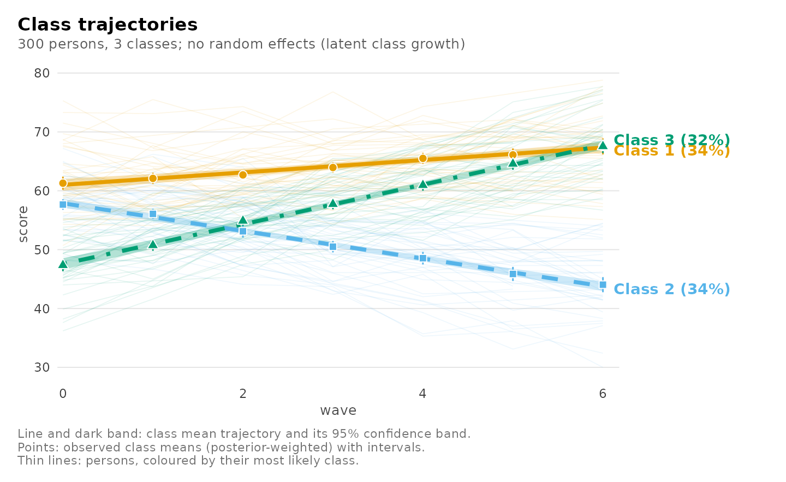
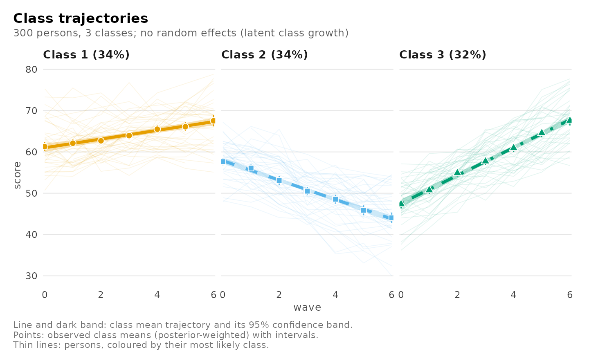
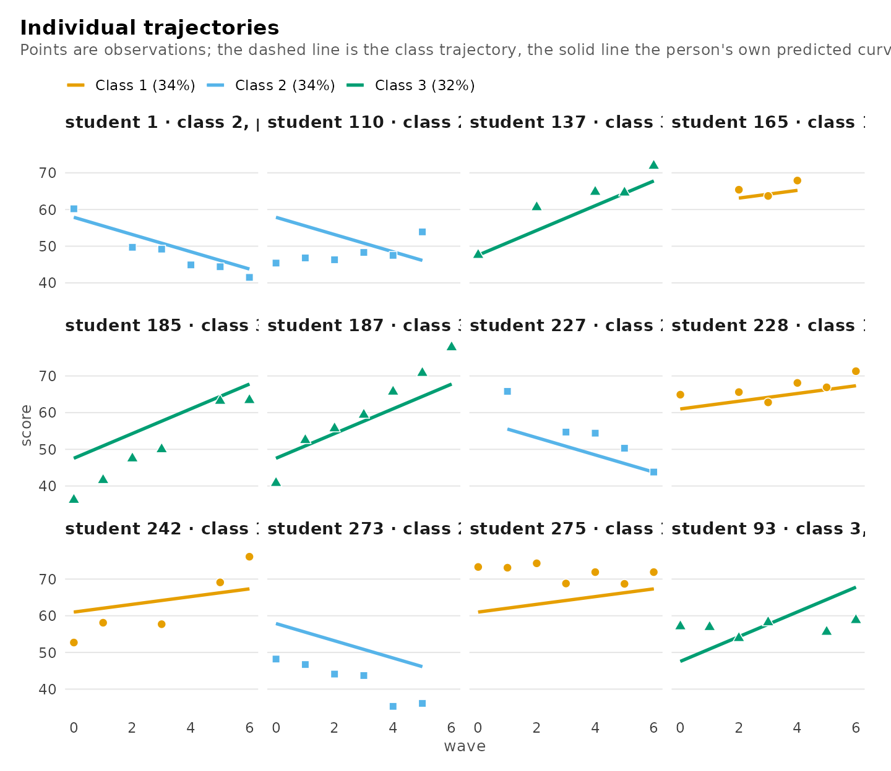
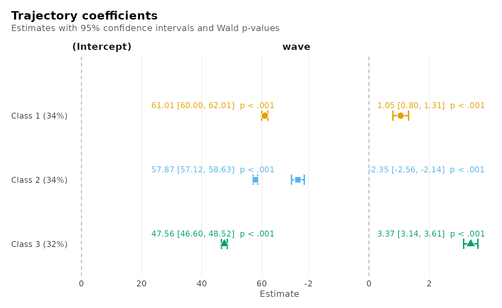
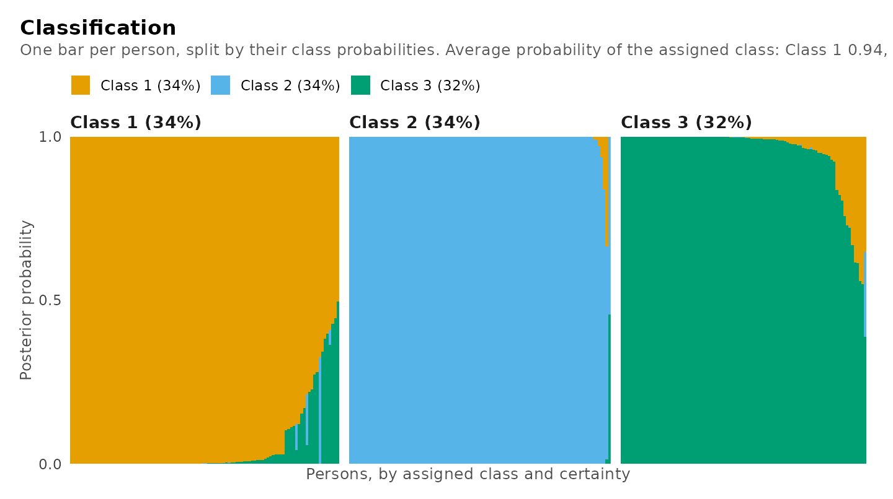
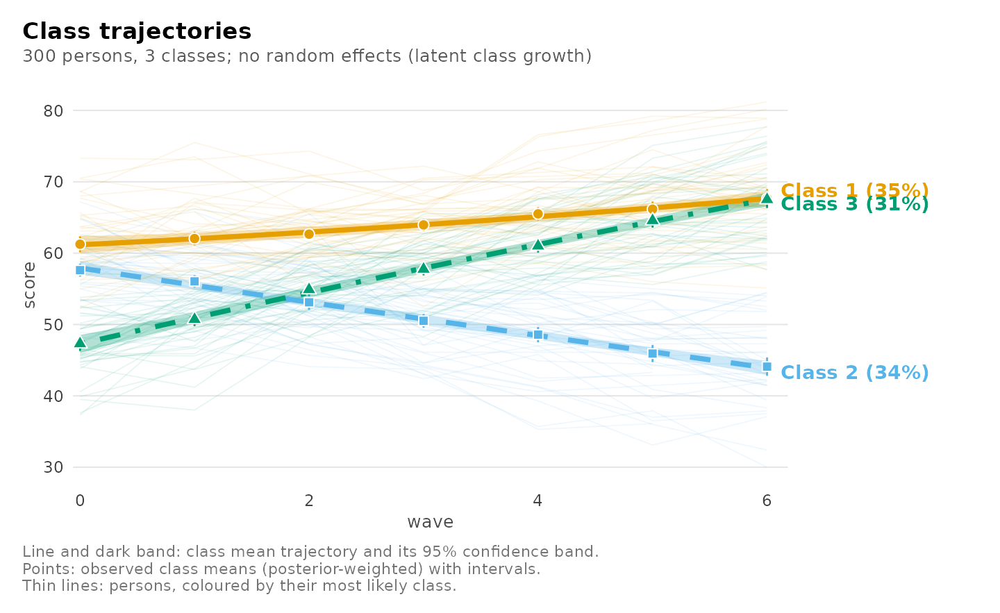
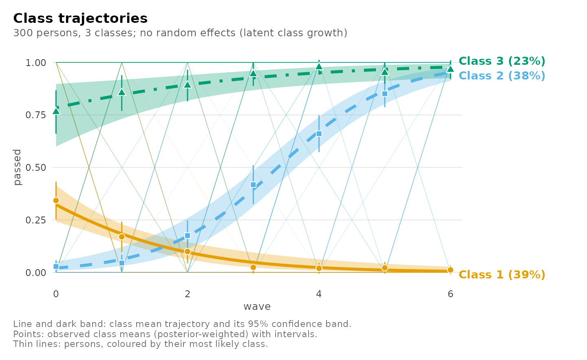
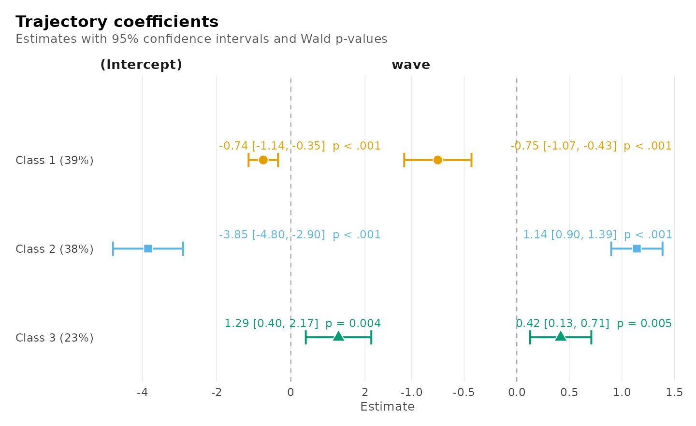
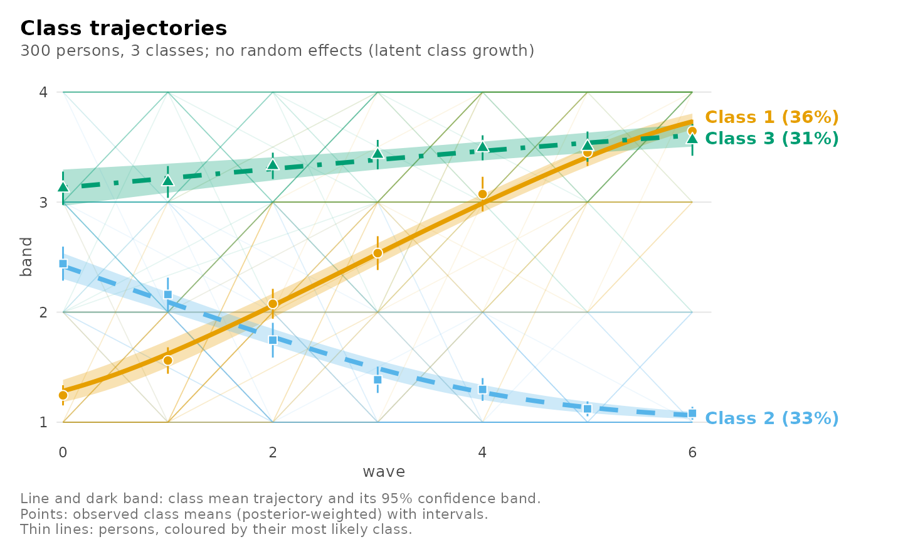
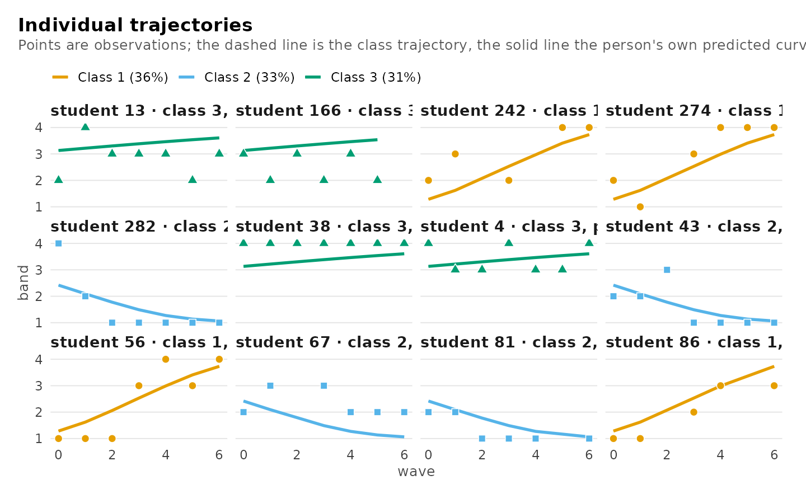

# Latent class growth analysis: classes of trajectories

When the same people are measured repeatedly, **latent class growth
analysis** (Nagin 2005; also called group-based trajectory modelling)
finds a small number of classes, each with its own trajectory, and
assigns every person to the class whose trajectory they follow. Everyone
in a class is assumed to follow that trajectory exactly; what remains is
noise.

That assumption is its strength and its limit:

- **Strength.** The model is simple, fast and fits any outcome the
  regression mixture fits: continuous scores, pass/fail, counts, ordered
  ratings.
- **Limit.** People of the same kind rarely follow one curve exactly.
  When they vary around it, the model can only express that by adding
  classes, so it tends to find more classes than there are kinds (Bauer
  and Curran 2003). The growth mixture model adds random effects for
  that variation; it is the subject of
  [`vignette("growth-mixture")`](https://pak.dynasite.org/latents/articles/growth-mixture.md).

A useful habit is to fit both and compare them
([`compare_models()`](https://pak.dynasite.org/latents/reference/compare_models.md)),
as the growth-mixture vignette does.

| Role | Argument | Here |
|----|----|----|
| Outcome, measured repeatedly | left of `~` | `score` |
| Time (any shape) | right of `~` | `wave`, `wave + I(wave^2)` |
| Person | `id`, with `class_level = "group"` | `student` |
| Kind of outcome | `family` | `"gaussian"`, `"binomial"`, `"poisson"`, `"negative_binomial"`, `"ordinal"` |
| What predicts the class | `membership` | `"motivation"` |

## The data

`growth_scores` is simulated so the answer is known: 300 students tested
on up to seven waves, of three kinds (improving, stable, declining),
each student varying a little around their kind’s trajectory, with
motivation predicting the kind. Missed tests (about 12%) need no
imputation.

``` r

library(latents)
head(growth_scores)
#>   student wave score motivation trajectory
#> 1       1    0  60.2      -0.72  declining
#> 2       1    2  49.7      -0.72  declining
#> 3       1    3  49.2      -0.72  declining
#> 4       1    4  44.9      -0.72  declining
#> 5       1    5  44.4      -0.72  declining
#> 6       1    6  41.5      -0.72  declining
```

## Fitting and choosing the number of classes

Persons are the classified units, so `id` names them and
`class_level = "group"` keeps all of a person’s measurements in one
class.

``` r

enumerate_regressions(score ~ wave, growth_scores, n_classes = 1:5,
                      id = "student", class_level = "group",
                      n_starts = 5, seed = 1)
#> Mixture regression class enumeration
#> 
#>  n_classes n_group_classes log_likelihood n_parameters   bic   icl entropy smallest_share
#>          1               1          -6629            3 13276 13276      NA         1.0000
#>          2               1          -6080            7 12199 12210  0.9725         0.3263
#>          3               1          -5890           11 11842 11897  0.9156         0.3179
#>          4               1          -5778           15 11641 11689  0.9419         0.1376
#>          5               1          -5658           19 11425 11487  0.9359         0.1248
#>  converged best_bic
#>       TRUE    FALSE
#>       TRUE    FALSE
#>       TRUE    FALSE
#>       TRUE    FALSE
#>       TRUE     TRUE
#> 
#> One model: get_results(x, "model", n_classes = ).
```

The BIC keeps falling up to five classes, although only three kinds of
student generated the data: the students’ own spread around their kind’s
trajectory is being absorbed by extra classes. With these data the
growth mixture model, which models that spread, picks three. Here, to
keep the three kinds, the three-class model is read:

``` r

fit <- mixture_regression(score ~ wave, growth_scores, n_classes = 3,
                          id = "student", class_level = "group",
                          membership = "motivation", n_starts = 5, seed = 1)
fit
#> Mixture of gaussian regressions: 3 classes (one class per `student`)
#> score ~ wave
#> 1844 rows in 300 groups | log likelihood -5848.9652 | BIC 11772.08 | entropy 0.917
#> Converged: TRUE | iterations: 23 | best likelihood reached by 6 of 6 completed starts (6 run)
#> 
#> Classes
#> 
#> Class    Share  Expected  Groups assigned  Avg. posterior  Residual SD
#> -------  -----  --------  ---------------  --------------  -----------
#> Class 1  0.345    103.41              104           0.944         5.16
#> Class 2  0.336    100.81              101           0.989         5.16
#> Class 3  0.319     95.78               95           0.949         4.71
#> 
#> Regression coefficients (95% CI)
#> 
#> Class    Term       Estimate          95% CI      p
#> -------  ---------  --------  --------------  -----
#> Class 1  Intercept     61.01  [60.00, 62.01]  <.001
#> Class 1  wave           1.05  [ 0.80,  1.31]  <.001
#> Class 2  Intercept     57.87  [57.12, 58.63]  <.001
#> Class 2  wave          -2.35  [-2.56, -2.14]  <.001
#> Class 3  Intercept     47.56  [46.60, 48.52]  <.001
#> Class 3  wave           3.37  [ 3.14,  3.61]  <.001
#> 
#> Every table: get_results(x, what = ), e.g. "classes", "membership", "fit", "assignments".
```

Every table is a data frame from
[`get_results()`](https://pak.dynasite.org/latents/reference/get_results.md):

``` r

get_results(fit, "classes")
#> Classes
#> 
#> Class    Share  Expected  Groups assigned  Avg. posterior  Residual SD
#> -------  -----  --------  ---------------  --------------  -----------
#> Class 1  0.345    103.41              104           0.944         5.16
#> Class 2  0.336    100.81              101           0.989         5.16
#> Class 3  0.319     95.78               95           0.949         4.71
get_results(fit, "membership")
#> Class membership (log odds, 95% CI)
#> 
#> Class    Term        Estimate          95% CI      p  Odds ratio
#> -------  ----------  --------  --------------  -----  ----------
#> Class 2  Intercept      -0.28  [-0.62,  0.06]   .110        0.76
#> Class 2  motivation     -1.01  [-1.39, -0.62]  <.001        0.36
#> Class 3  Intercept      -0.30  [-0.68,  0.09]   .128        0.74
#> Class 3  motivation      0.62  [ 0.26,  0.99]  <.001        1.87
get_results(fit, "recovery", data = growth_scores, truth = "trajectory")
#> Recovery of a known classification
#> 
#> Assigned  trajectory  Groups  Share of assigned
#> --------  ----------  ------  -----------------
#> Class 1   improving       26              0.250
#> Class 2   improving        1              0.010
#> Class 3   improving       88              0.926
#> Class 1   stable          77              0.740
#> Class 2   stable           4              0.040
#> Class 3   stable           7              0.074
#> Class 1   declining        1              0.010
#> Class 2   declining       96              0.950
#> Class 3   declining        0              0.000
```

## Seeing the classes

Every view of a trajectory fit is one
[`plot()`](https://rdrr.io/r/graphics/plot.default.html) call. Each
class’s trajectory with its confidence band, the band within which 80%
of its students’ observations lie, and the observed class means:

``` r

plot(fit)
```



The same with one panel per class:

``` r

plot(fit, facet = TRUE)
```



Individual students, chosen across each class’s range of classification
certainty: their observations and their class trajectory.

``` r

plot(fit, what = "individuals")
```



The coefficients with their intervals and p-values:

``` r

plot(fit, what = "coefficients")
```



How confidently each student is classified, one bar per student:

``` r

plot(fit, what = "classification")
```



## Curved trajectories

Any formula works. A quadratic lets each class bend; compare it with the
straight model fitted the same way (without `membership`):

``` r

straight <- mixture_regression(score ~ wave, growth_scores, n_classes = 3,
                               id = "student", class_level = "group",
                               n_starts = 5, seed = 1)
curved <- mixture_regression(score ~ wave + I(wave^2), growth_scores,
                             n_classes = 3, id = "student", class_level = "group",
                             n_starts = 5, seed = 1)
compare_models(straight = straight, curved = curved)
#> Model comparison
#> 
#> Model     Classes  Random   k    LogLik       BIC   ΔBIC  Weight  Entropy
#> --------  -------  ------  --  --------  --------  -----  ------  -------
#> straight        3  none    11  -5889.55  11841.85   0.00   1.000     0.92  <- best
#> curved          3  none    14  -5888.78  11857.41  15.56   0.000     0.92
```

These trajectories were generated straight, so the BIC does not reward
the curvature.

``` r

plot(curved)
```



## Outcomes that are not scores

This is where latent class growth analysis is needed: random effects for
a binary, count or ordered outcome need numerical integration, which the
growth mixture model does not do, so trajectories of such outcomes are
fitted here.

**Pass or fail.** Whether each test reached 60 points, with a logistic
trajectory per class:

``` r

passing <- transform(growth_scores, passed = as.integer(score >= 60))
pass_fit <- mixture_regression(passed ~ wave, passing, n_classes = 3,
                               family = "binomial", id = "student",
                               class_level = "group", n_starts = 5, seed = 1)
get_results(pass_fit, "coefficients")
#> Regression coefficients (95% CI)
#> 
#> Class    Term       Estimate          95% CI      p  Odds ratio
#> -------  ---------  --------  --------------  -----  ----------
#> Class 1  Intercept     -0.74  [-1.14, -0.35]  <.001       0.476
#> Class 1  wave          -0.75  [-1.07, -0.43]  <.001       0.472
#> Class 2  Intercept     -3.85  [-4.80, -2.90]  <.001       0.021
#> Class 2  wave           1.14  [ 0.90,  1.39]  <.001       3.132
#> Class 3  Intercept      1.29  [ 0.40,  2.17]   .004       3.619
#> Class 3  wave           0.42  [ 0.13,  0.71]   .005       1.519
```

Each class’s probability of passing over the waves, and the
coefficients:

``` r

plot(pass_fit)
```



``` r

plot(pass_fit, what = "coefficients")
```



**Ordered bands.** The score in four ordered bands, with a
cumulative-logit (proportional odds) trajectory per class (McCullagh
1980): each class has its own thresholds between the bands and its own
slope over the waves.

``` r

banded <- transform(growth_scores,
                    band = cut(score, c(-Inf, 52, 58, 64, Inf),
                               labels = c("low", "middle", "high", "top"),
                               ordered_result = TRUE))
band_fit <- mixture_regression(band ~ wave, banded, n_classes = 3,
                               family = "ordinal", id = "student",
                               class_level = "group", n_starts = 5, seed = 1)
get_results(band_fit, "coefficients")
#> Regression coefficients (95% CI)
#> 
#> Class    Term                   Estimate             95% CI      p  Odds ratio
#> -------  ---------------------  --------  -----------------  -----  ----------
#> Class 1  Threshold low|middle      1.107  [  0.663,  1.550]  <.001            
#> Class 1  Threshold middle|high     3.396  [  2.781,  4.010]  <.001            
#> Class 1  Threshold high|top        5.848  [  5.079,  6.617]  <.001            
#> Class 1  wave                      1.168  [  1.012,  1.323]  <.001        3.21
#> Class 2  Threshold low|middle     -2.115  [ -2.484, -1.745]  <.001            
#> Class 2  Threshold middle|high     0.100  [ -0.205,  0.404]   .520            
#> Class 2  Threshold high|top        2.913  [  2.195,  3.630]  <.001            
#> Class 2  wave                     -0.822  [ -0.951, -0.692]  <.001        0.44
#> Class 3  Threshold low|middle     -6.249  [-13.843,  1.345]   .107            
#> Class 3  Threshold middle|high    -1.538  [ -2.106, -0.971]  <.001            
#> Class 3  Threshold high|top        0.802  [  0.403,  1.202]  <.001            
#> Class 3  wave                      0.241  [  0.137,  0.346]  <.001        1.27
```

The plot shows each class’s expected band (1 = low to 4 = top), and the
students’ own bands over the waves:

``` r

plot(band_fit)
```



``` r

plot(band_fit, what = "individuals")
```



Counts work the same way with `family = "poisson"`, or
`family = "negative_binomial"` when the counts are more spread out than
a Poisson allows.

## Distal outcomes

Do the classes differ on something measured once per person?
[`three_step()`](https://pak.dynasite.org/latents/reference/three_step.md)
compares class means with the bias-corrected three-step method (Vermunt
2010; Bakk and Vermunt 2016), which accounts for persons being
classified with error. The trajectory model must be fitted without
`membership` for this correction:

``` r

three_step(straight, data = growth_scores, outcome = "motivation",
           contrast = "pairs")
#> Distal outcome: class differences (bch, 95% CI)
#> 
#> Class  vs  Difference        95% CI      p  p (BH)
#> -----  --  ----------  ------------  -----  ------
#>     2   1        0.71  [0.46, 0.96]  <.001   <.001
#>     3   1        1.22  [0.96, 1.48]  <.001   <.001
#>     3   2        0.51  [0.24, 0.79]  <.001   <.001
```

## Choices and warnings

- **Latent class growth analysis or a growth mixture model?** If persons
  of the same kind vary around their trajectory – they almost always do
  for scores – fit the growth mixture model too and compare them with
  [`compare_models()`](https://pak.dynasite.org/latents/reference/compare_models.md);
  prefer it when it fits better. Use latent class growth analysis for
  non-Gaussian outcomes, for a first look, and when within-class
  variation is not plausible.
- **Number of classes.** Read the BIC with the over-extraction above in
  mind; the bootstrap likelihood-ratio test
  (`enumerate_regressions(bootstrap =)`) is the stronger evidence.
- **Starts.** Use several (`n_starts`), and check that the best
  likelihood is reached more than once (the fit reports how many times).

## References

Bakk, Z., & Vermunt, J. K. (2016). Robustness of stepwise latent class
modeling with continuous distal outcomes. *Structural Equation
Modeling*, 23, 20–31.

Bauer, D. J., & Curran, P. J. (2003). Distributional assumptions of
growth mixture models: Implications for overextraction of latent
trajectory classes. *Psychological Methods*, 8, 338–363.

McCullagh, P. (1980). Regression models for ordinal data. *Journal of
the Royal Statistical Society B*, 42, 109–142.

Nagin, D. S. (2005). *Group-based modeling of development*. Harvard
University Press.

Vermunt, J. K. (2010). Latent class modeling with covariates: Two
improved three-step approaches. *Political Analysis*, 18, 450–469.
