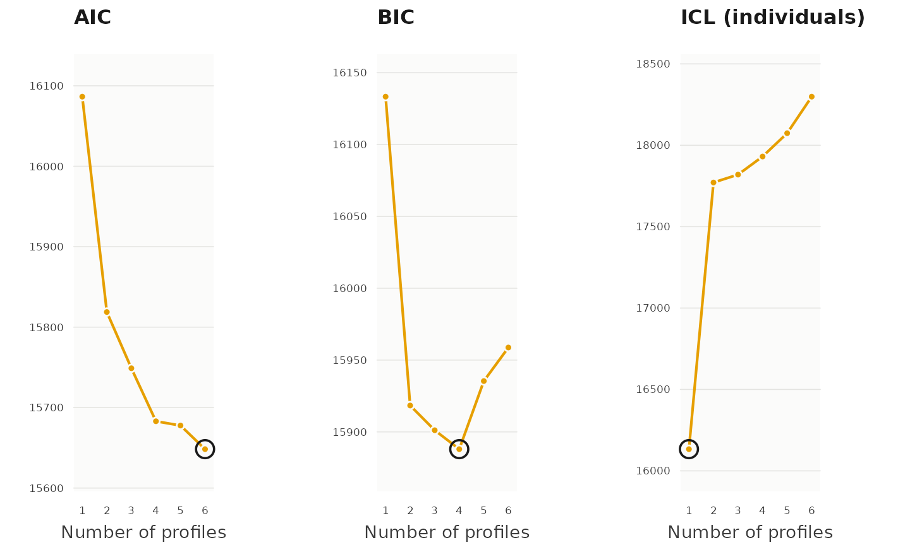
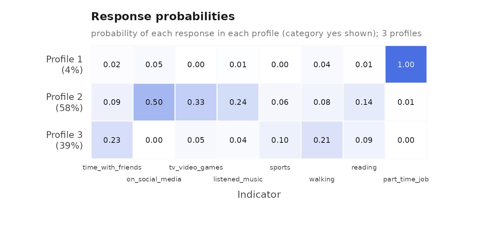
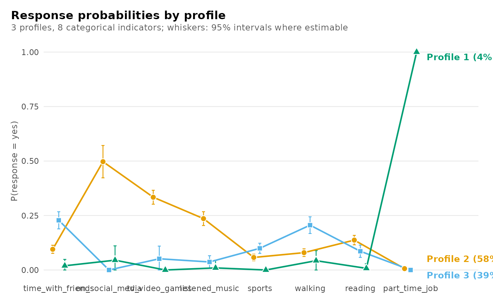
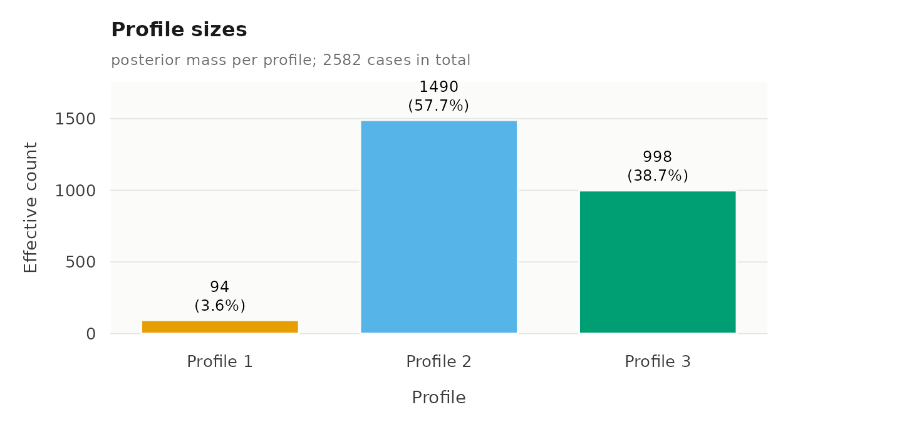
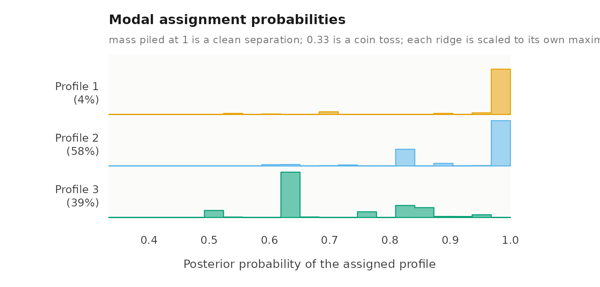
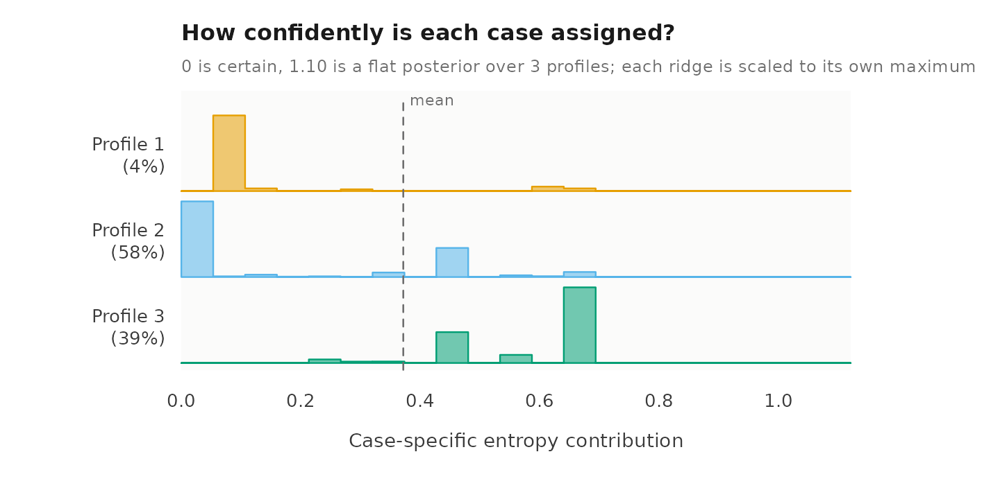
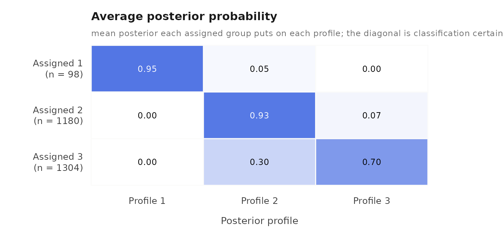

# Latent class analysis: a complete workflow

Latent class analysis (LCA) is a mixture model for categorical
indicators. It assumes that the observations come from a small number of
unobserved classes, and that within each class the indicators are
independent, each with its own response probabilities. This vignette
presents a complete single-level analysis: description of the data,
selection of the number of classes, estimation, interpretation,
evaluation of the classification, and the relation of the classes to a
distal outcome. The final section extends the model to two levels. In
the output of this package the classes of observations are labelled
`profile_1`, `profile_2`, and so on.

``` r

library(latents)
set.seed(1)
```

The estimation uses random starting values, so the seed is set once to
make the results reproducible.

## Data

The `student_esm` data contain 2,582 experience-sampling reports from
university students. At each report a student indicated whether they had
been engaged in each of eight activities, and rated how happy, relaxed,
worried and exhausted they felt. The aim of the analysis is to identify
typical combinations of activities.

``` r

activities <- c("time_with_friends", "on_social_media", "tv_video_games",
                "listened_music", "sports", "walking", "reading",
                "part_time_job")
descriptives(student_esm, activities)
#>            variable    n n_missing mean sd min max n_distinct
#> 1 time_with_friends 2582         0   NA NA  NA  NA          2
#> 2   on_social_media 2582         0   NA NA  NA  NA          2
#> 3    tv_video_games 2582         0   NA NA  NA  NA          2
#> 4    listened_music 2582         0   NA NA  NA  NA          2
#> 5            sports 2582         0   NA NA  NA  NA          2
#> 6           walking 2582         0   NA NA  NA  NA          2
#> 7           reading 2582         0   NA NA  NA  NA          2
#> 8     part_time_job 2582         0   NA NA  NA  NA          2
```

The reports are nested in students. The first part of this vignette
treats each report as an independent observation, which corresponds to
the conventional single-level model. The nesting is taken into account
in the final section.

## Selecting the number of classes

[`enumerate_lca()`](https://pak.dynasite.org/latents/reference/enumerate_lca.md)
estimates models with one to six classes and returns the results in one
table.

``` r

models <- enumerate_lca(student_esm, activities, n_classes = 1:6)
plot(models)
```



``` r

summary(models)
#> Class enumeration: 6 candidates, 6 converged, 0 failed to fit
#> 4 distinct candidate(s) are minimal under some criterion.
#> No candidate is selected automatically. Choose one convention and keep it.
#> The candidates table shows 9 of its 26 columns; get_results(x, what = "candidates") returns all of them.
#> 
#> -- candidates ------------------------------------------------------
#>  n_profiles log_likelihood n_parameters   aic   bic icl_individual profile_entropy
#>           1          -8035            8 16086 16133          16133              NA
#>           2          -7892           17 15819 15918          17771          0.4823
#>           3          -7848           26 15749 15901          17820          0.6618
#>           4          -7807           35 15683 15888          17931          0.7146
#>           5          -7795           44 15678 15935          18074          0.7427
#>           6          -7771           53 15648 15959          18299          0.7471
#>  converged boundary
#>       TRUE    FALSE
#>       TRUE    FALSE
#>       TRUE    FALSE
#>       TRUE    FALSE
#>       TRUE    FALSE
#>       TRUE    FALSE
#> 
#> -- criteria --------------------------------------------------------
#>  criterion  convention n_profiles n_group_classes model value
#>        aic        <NA>          6               1  <NA> 15648
#>        kic        <NA>          6               1  <NA> 15704
#>        bic      groups          4               1  <NA> 15888
#>        bic individuals          4               1  <NA> 15888
#>      sabic      groups          4               1  <NA> 15777
#>      sabic individuals          4               1  <NA> 15777
#>       caic      groups          4               1  <NA> 15923
#>       caic individuals          4               1  <NA> 15923
#>        awe      groups          2               1  <NA> 16103
#>        awe individuals          1               1  <NA> 16220
#>    ... 4 more rows.  get_results(x, what = "criteria")
#> 
#> 2 tables above, truncated to fit. get_results(x, what = ) returns any
#> of them whole, and get_results(x, what = "all") returns every one.
```

The BIC is lowest for four classes, 13.2 points below the three-class
model. The fourth class, however, contains 1.3% of the reports (about
32), which describe many activities at once; a class of this size is
poorly supported, and the ICL, which penalizes classification
uncertainty, is lower for three classes than for four. The ICL is lowest
for one class, which has no uncertainty to penalize, and among the
models with more than one class it is lowest for two; the two-class
solution, however, has a relative entropy below 0.5 and therefore
separates the reports poorly. The three-class model is retained.

## Estimation

[`lca()`](https://pak.dynasite.org/latents/reference/lca.md) fits a
single-level latent class model.

``` r

fit <- lca(student_esm, activities, n_classes = 3)
fit
#> Latent class analysis: 3 classes
#> 2582 observations; 8 categorical indicators
#> Classes are labelled profile_1, profile_2, ... in every table.
#> Log likelihood: -7848.453002 | AIC: 15748.906 | BIC: 15901.170
#> Converged: TRUE | iterations: 45 | best start: 7/10
#> 
#>  profile         indicator category probability threshold
#>        1 time_with_friends       no    9.81e-01    3.9264
#>        2 time_with_friends       no    9.05e-01    2.2542
#>        3 time_with_friends       no    7.72e-01    1.2195
#>        1 time_with_friends      yes    1.93e-02        NA
#>        2 time_with_friends      yes    9.50e-02        NA
#>        3 time_with_friends      yes    2.28e-01        NA
#>        1   on_social_media       no    9.55e-01    3.0545
#>        2   on_social_media       no    5.03e-01    0.0114
#>        3   on_social_media       no    1.00e+00   13.0106
#>        1   on_social_media      yes    4.50e-02        NA
#>        2   on_social_media      yes    4.97e-01        NA
#>        3   on_social_media      yes    2.24e-06        NA
#>        1    tv_video_games       no    1.00e+00   23.0259
#>        2    tv_video_games       no    6.66e-01    0.6905
#>        3    tv_video_games       no    9.48e-01    2.9130
#>        1    tv_video_games      yes    1.00e-10        NA
#>        2    tv_video_games      yes    3.34e-01        NA
#>        3    tv_video_games      yes    5.15e-02        NA
#>        1    listened_music       no    9.90e-01    4.6459
#>        2    listened_music       no    7.64e-01    1.1759
#>    ... 28 more rows.  get_results(x, "responses")
#> 
#> Every other table: get_results(x, what = ), or get_results(x, "all").
```

## Interpretation of the classes

The heatmap shows, for each class, the estimated probability that the
activity was reported.

``` r

plot(fit, what = "heatmap")
```



The largest class, comprising 58% of the reports, is characterized by
screen-based activities: social media, television and video games, and
music. The smallest class, 4% of the reports, consists almost entirely
of reports of working at a part-time job. The third class, 39% of the
reports, has elevated probabilities of spending time with friends,
walking and sport, and a probability of social media use close to zero.
The same probabilities are shown below as profiles across the
activities, with 95% confidence intervals where the probability is not
on its boundary.

``` r

plot(fit, what = "responses")
```



The probabilities with their standard errors. Several are estimated at
zero or one; a standard error is not defined on the boundary of the
parameter space, so those are held at their bound and have none.

``` r

head(get_results(fit, "responses"), 8)
#>   profile         indicator category probability threshold probability_standard_error
#> 1       1 time_with_friends       no      0.9807    3.9264                    0.01497
#> 2       2 time_with_friends       no      0.9050    2.2542                    0.00945
#> 3       3 time_with_friends       no      0.7720    1.2195                    0.02004
#> 4       1 time_with_friends      yes      0.0193        NA                    0.01497
#> 5       2 time_with_friends      yes      0.0950        NA                    0.00945
#> 6       3 time_with_friends      yes      0.2280        NA                    0.02004
#> 7       1   on_social_media       no      0.9550    3.0545                    0.03353
#> 8       2   on_social_media       no      0.5029    0.0114                    0.03785
```

## Classification quality

[`diagnostics()`](https://pak.dynasite.org/latents/reference/diagnostics.md)
reports the classification measures and draws the four classification
plots: the effective size of each class, the distribution of the
posterior probability of each report’s assigned class, each report’s
contribution to the classification entropy, and the average posterior
probability matrix, which shows which classes are confused with which.

``` r

diagnostics(fit)
```



    #> Classification quality: 3 profiles
    #> 
    #>   Relative entropy     individuals 0.662
    #>   Smallest class       individuals 93.6 (3.6%)
    #>   Lowest avg posterior individuals 0.705
    #>   Largest residual     0.237  (on_social_media, walking; profile_1)
    #> 
    #> Tables: get_results(x, what = "entropy" | "classification" | 
    #>         "average_posteriors" | "residuals" | "all"). plot(x) draws them.

The relative entropy of 0.66 indicates a moderately clear
classification.

## Classes and a distal outcome

[`three_step()`](https://pak.dynasite.org/latents/reference/three_step.md)
estimates the mean of an outcome within each class. It uses the BCH
method, which weights each observation by its posterior class
probabilities and corrects for classification error (Bolck, Croon and
Hagenaars, 2004). The outcome here is the happiness rating.

``` r

happiness <- three_step(fit, student_esm, outcome = "happy")
happiness
#>         level method class estimate standard_error conf_low conf_high effective_n
#> 1 individuals    bch     1     4.53         0.1555     4.22      4.83        88.8
#> 2 individuals    bch     2     4.63         0.0510     4.53      4.73       957.7
#> 3 individuals    bch     3     5.30         0.0683     5.16      5.43       548.8
```

Happiness is highest in the class of reports away from screens (5.30 on
the seven-point scale), and lower in the screen-based class (4.63) and
the work class (4.53).

## Extension to two levels

Each student contributes many reports, so the reports are not
independent. When the student identifier is supplied as `id`,
[`multilca()`](https://pak.dynasite.org/latents/reference/multilca.md)
estimates a two-level model: the classes of reports are retained, and
the students are in addition grouped into latent classes that differ in
the proportion of their reports belonging to each class.

``` r

two_level <- multilca(student_esm, activities, id = "student",
                      n_profiles = 3, n_group_classes = 2)
get_results(two_level, "profile_probabilities")
#>   group_class profile probability group_class_probability
#> 1           1       1      0.7290                    0.64
#> 2           1       2      0.2495                    0.64
#> 3           1       3      0.0215                    0.64
#> 4           2       1      0.1059                    0.36
#> 5           2       2      0.2256                    0.36
#> 6           2       3      0.6685                    0.36
```

The two-level model is presented in detail in
[`vignette("lca")`](https://pak.dynasite.org/latents/articles/lca.md).

## References

Bolck, A., Croon, M., & Hagenaars, J. (2004). Estimating latent
structure models with categorical variables: One-step versus three-step
estimators. *Political Analysis*, 12(1), 3–27.
