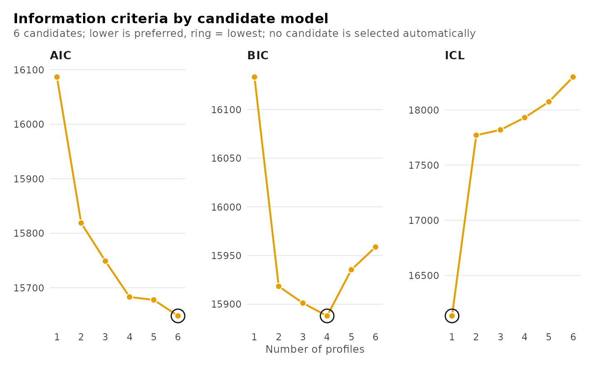
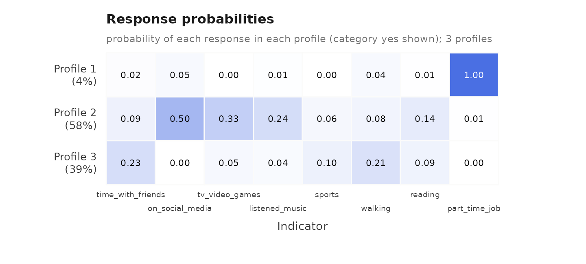
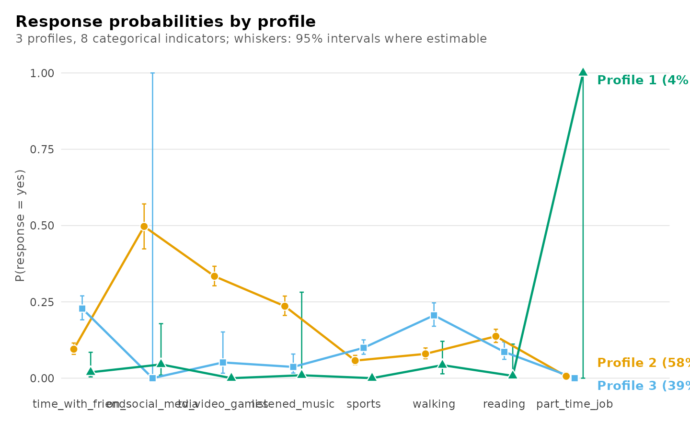
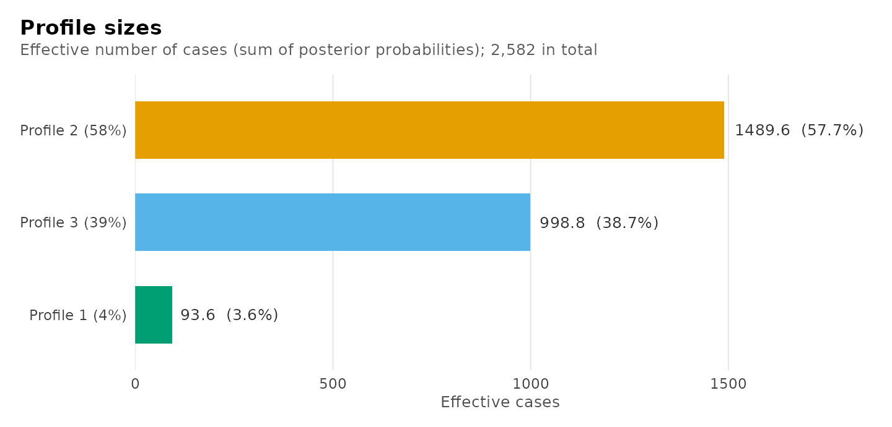
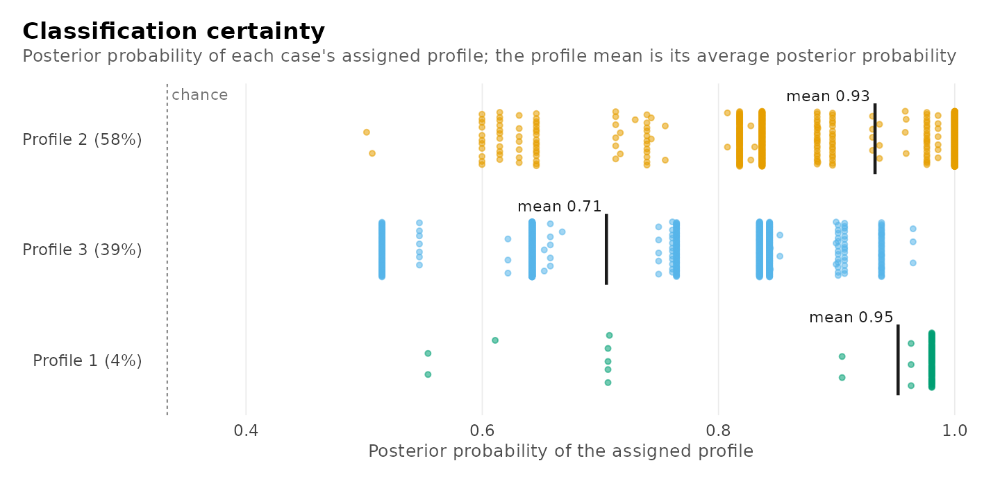
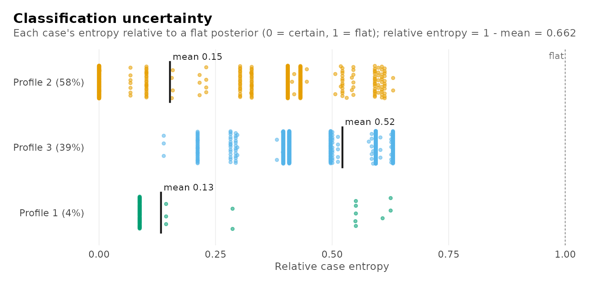
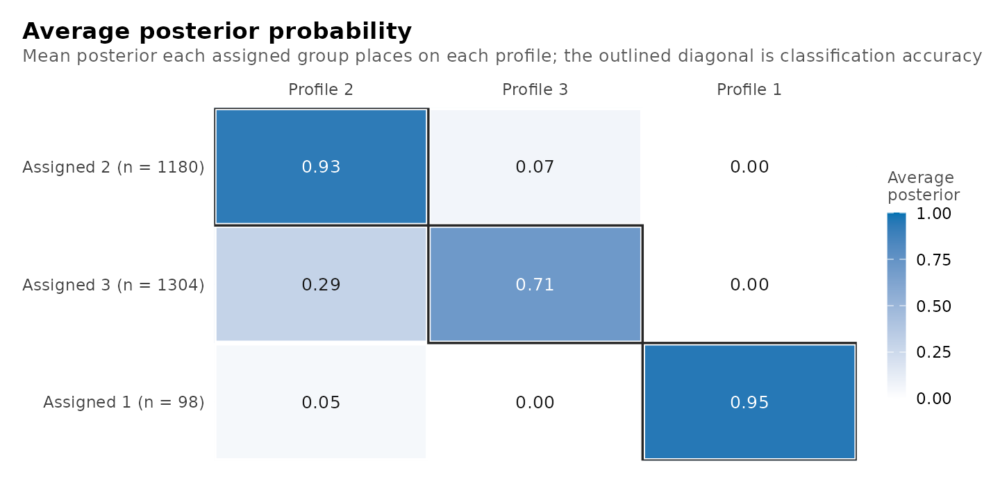

# Latent class analysis: a complete workflow

Latent class analysis (LCA) is a mixture model for categorical
indicators. It assumes that the observations come from a small number of
unobserved classes, and that within each class the indicators are
independent, each with its own response probabilities. This vignette
presents a complete single-level analysis: description of the data,
selection of the number of classes, estimation, interpretation,
evaluation of the classification, and the relation of the classes to a
distal outcome. The final section extends the model to two levels. In
the output of this package the classes of observations are labelled
`profile_1`, `profile_2`, and so on.

``` r

library(latents)
set.seed(1)
```

The estimation uses random starting values, so the seed is set once to
make the results reproducible.

## Data

The `student_esm` data contain 2,582 experience-sampling reports from
university students. At each report a student indicated whether they had
been engaged in each of eight activities, and rated how happy, relaxed,
worried and exhausted they felt. The aim of the analysis is to identify
typical combinations of activities.

``` r

activities <- c("time_with_friends", "on_social_media", "tv_video_games",
                "listened_music", "sports", "walking", "reading",
                "part_time_job")
descriptives(student_esm, activities)
#>            variable    n n_missing mean sd min max n_distinct
#> 1 time_with_friends 2582         0   NA NA  NA  NA          2
#> 2   on_social_media 2582         0   NA NA  NA  NA          2
#> 3    tv_video_games 2582         0   NA NA  NA  NA          2
#> 4    listened_music 2582         0   NA NA  NA  NA          2
#> 5            sports 2582         0   NA NA  NA  NA          2
#> 6           walking 2582         0   NA NA  NA  NA          2
#> 7           reading 2582         0   NA NA  NA  NA          2
#> 8     part_time_job 2582         0   NA NA  NA  NA          2
```

The reports are nested in students. The first part of this vignette
treats each report as an independent observation, which corresponds to
the conventional single-level model. The nesting is taken into account
in the final section.

## Selecting the number of classes

[`enumerate_lca()`](https://pak.dynasite.org/latents/reference/enumerate_lca.md)
estimates models with one to six classes and returns the results in one
table.

``` r

models <- enumerate_lca(student_esm, activities, n_classes = 1:6)
plot_enumeration(models)
```



``` r

summary(models)
#> Class enumeration: 6 candidates, 6 converged, 0 failed to fit
#> 3 distinct candidate(s) are minimal under some criterion.
#> No candidate is selected automatically. Choose one convention and keep it.
#> 
#> ! 2 of 6 candidates reached their best log likelihood from one start only
#>     (classes4, classes5); refit those you consider with more starts.
#> ! 5 candidates have a class with average posterior below 0.8 (classes2,
#>     classes3, classes4, classes5, classes6).
#> 
#> -- lowest value of each criterion --------------------------------
#>  criterion  convention candidate value
#>        aic        <NA>  classes6 15648
#>        kic        <NA>  classes6 15704
#>        bic      groups  classes4 15888
#>        bic individuals  classes4 15888
#>      sabic      groups  classes4 15777
#>      sabic individuals  classes4 15777
#>       caic      groups  classes4 15923
#>       caic individuals  classes4 15923
#>        awe      groups  classes1 16220
#>        awe individuals  classes1 16220
#>        icl      groups  classes1 16133
#>        icl individuals  classes1 16133
#>        clc      groups  classes1 16070
#>        clc individuals  classes1 16070
#> 
#> -- knees of bic_groups ----------------------------------------
#>   direction           line knee_candidate knee_without_largest stable
#>    profiles  1 group class       classes2             classes2   TRUE
#>  parameters all candidates       classes2             classes2   TRUE
#> 
#> Tables: get_candidates(x), get_best(x), get_deltas(x), get_knees(x),
#>         get_tree(x), get_classification(x), get_entropy(x), get_checks(x).
#> Plots:  plot_criteria(x), plot_deltas(x), plot_avepp(x), plot_tree(x), plot_all(x).
```

The BIC is lowest for four classes, 13.2 points below the three-class
model. The fourth class, however, contains 1.3% of the reports (about
32), which describe many activities at once; a class of this size is
poorly supported, and the ICL, which penalizes classification
uncertainty, is lower for three classes than for four. The ICL is lowest
for one class, which has no uncertainty to penalize, and among the
models with more than one class it is lowest for two; the two-class
solution, however, has a relative entropy below 0.5 and therefore
separates the reports poorly. The three-class model is retained.

## Estimation

[`lca()`](https://pak.dynasite.org/latents/reference/lca.md) fits a
single-level latent class model.

``` r

fit <- lca(student_esm, activities, n_classes = 3)
fit
#> Latent class analysis: 3 classes
#> 2582 observations; 8 categorical indicators
#> Classes are labelled profile_1, profile_2, ... in every table.
#> Log likelihood: -7848.453248 | AIC: 15748.906 | BIC: 15901.171
#> Converged: TRUE | iterations: 39 | best log likelihood reached by 2 of 10 starts (10 converged)
#> 
#> Class sizes   profile_1 3.6% (94)   profile_2 57.7% (1490)   profile_3 38.7% (999)
#> 
#> Response probabilities
#>          indicator category profile_1 profile_2 profile_3
#>  time_with_friends       no     0.981     0.905     0.772
#>  time_with_friends      yes     0.019     0.095     0.228
#>    on_social_media       no     0.955     0.503     1.000
#>    on_social_media      yes     0.045     0.497     0.000
#>     tv_video_games       no     1.000     0.666     0.948
#>     tv_video_games      yes     0.000     0.334     0.052
#>     listened_music       no     0.990     0.764     0.963
#>     listened_music      yes     0.010     0.236     0.037
#>             sports       no     1.000     0.942     0.901
#>             sports      yes     0.000     0.058     0.099
#>            walking       no     0.957     0.920     0.794
#>            walking      yes     0.043     0.080     0.206
#>            reading       no     0.992     0.863     0.914
#>            reading      yes     0.008     0.137     0.086
#>      part_time_job       no     0.000     0.994     1.000
#>      part_time_job      yes     1.000     0.006     0.000
#> 
#> Thresholds and standard errors: get_results(x, "responses").
#> Every other table: get_results(x, what = ), or get_results(x, "all").
```

## Interpretation of the classes

The heatmap shows, for each class, the estimated probability that the
activity was reported.

``` r

plot_profiles(fit, what = "heatmap")
```



The largest class, comprising 58% of the reports, is characterized by
screen-based activities: social media, television and video games, and
music. The smallest class, 4% of the reports, consists almost entirely
of reports of working at a part-time job. The third class, 39% of the
reports, has elevated probabilities of spending time with friends,
walking and sport, and a probability of social media use close to zero.
The same probabilities are shown below as profiles across the
activities, with 95% confidence intervals where the probability is not
on its boundary.

``` r

plot_responses(fit)
#> Warning: The fitted likelihood still carries a score worth 1.6% of a standard error;
#> refit with a tighter `tol` before using Wald inference.
```



The probabilities with their standard errors. Several are estimated at
zero or one; a standard error is not defined on the boundary of the
parameter space, so those are held at their bound and have none.

``` r

head(get_results(fit, "responses"), 8)
#> Warning: The fitted likelihood still carries a score worth 1.6% of a standard error;
#> refit with a tighter `tol` before using Wald inference.
#>   profile         indicator category probability threshold probability_standard_error
#> 1       1 time_with_friends       no      0.9807    3.9263                    0.01497
#> 2       2 time_with_friends       no      0.9050    2.2543                    0.00945
#> 3       3 time_with_friends       no      0.7720    1.2198                    0.02004
#> 4       1 time_with_friends      yes      0.0193        NA                    0.01497
#> 5       2 time_with_friends      yes      0.0950        NA                    0.00945
#> 6       3 time_with_friends      yes      0.2280        NA                    0.02004
#> 7       1   on_social_media       no      0.9550    3.0547                    0.03352
#> 8       2   on_social_media       no      0.5027    0.0108                    0.03788
```

## Classification quality

[`diagnostics()`](https://pak.dynasite.org/latents/reference/diagnostics.md)
reports the classification measures and draws the four classification
plots: the effective size of each class, the distribution of the
posterior probability of each report’s assigned class, each report’s
contribution to the classification entropy, and the average posterior
probability matrix, which shows which classes are confused with which.

``` r

diagnostics(fit)
```



    #> Diagnostics: Latent class analysis, 3 classes
    #> 2 checks need attention: estimates at a bound; pairs dependent within a class
    #> 
    #> Estimation
    #>   ok     best start converged                                yes                      
    #>   info   best log likelihood reached by                      2 of 10 starts           
    #>   ok     starts failed or unfinished                         0 of 10                  
    #>   check  estimates at a bound                                yes                      
    #>          a variance, probability, count mean or dispersion is at a numerical bound; ordinary Wald inference may be unavailable
    #> 
    #> Class size
    #>   info   smallest class                         individuals  3.6% (n = 94, class 1)   
    #>   info   modal vs estimated proportions         individuals  largest gap 0.120        
    #>   ok     classes with no assigned unit          individuals  0 of 3                   
    #> 
    #> Classification
    #>   info   relative entropy                       individuals  0.662                    
    #>   info   lowest average posterior               individuals  0.705 (class 3)          
    #>   info   lowest odds of correct classification  individuals  3.8 (class 3)            
    #> 
    #> Local independence
    #>   check  pairs dependent within a class                      4 of 84 tested pairs     BH-adjusted p < 0.05
    #>          smallest adjusted p: listened_music x walking in profile_2, residual 0.110, adjusted p 0.0019
    #> 
    #> Information
    #>   info   log likelihood, parameters, BIC                     -7848.45, 26, 15901.17   
    #> 
    #> Every check with its reference: get_results(x, "checks"). Other tables: get_results(x, what = ).

The relative entropy of 0.66 indicates a moderately clear
classification.

## Local dependence

The latent class model assumes that the activities are independent
within each class. The bivariate residual of a pair of activities
compares their observed co-occurrence within a class with the
co-occurrence the model implies, and a large value indicates a
dependence the classes do not explain. The p-value refers this Pearson
statistic to a chi-square distribution that ignores the estimation of
the model’s table, which makes it very conservative: in simulated data
from a correctly specified latent class model it rejected 0.25% of pairs
per class, and 0.08% pooled, at a nominal 5%. `p_adjusted` is corrected
across all the pairs by Benjamini-Hochberg. A pair that passes the
filter below is therefore strong evidence of dependence, but a pair that
does not pass it is not evidence of independence.

``` r

subset(get_results(fit, "residuals"), p_adjusted < 0.01)
#>     profile    indicator_1 indicator_2        kind observed expected residual effective_n
#> 3 profile_2 listened_music     walking categorical     0.11 4.24e-17     0.11        1490
#>   statistic df  p_value p_adjusted
#> 3        18  1 2.23e-05    0.00187
```

The largest residual is that of listening to music and walking in class
2 (18). `local_dependence` names pairs of categorical indicators that
are modelled jointly within each class: the pair then has its own joint
distribution in every class, and the other activities remain independent
given the class.

``` r

dependent <- lca(student_esm, activities, n_classes = 3,
                 local_dependence = "listened_music:walking")
get_results(dependent, "local_dependence")
#>                      pair        kind profile         item_1 category_1  item_2
#> 1  listened_music:walking categorical       1 listened_music         no walking
#> 2  listened_music:walking categorical       1 listened_music         no walking
#> 3  listened_music:walking categorical       1 listened_music        yes walking
#> 4  listened_music:walking categorical       1 listened_music        yes walking
#> 5  listened_music:walking categorical       2 listened_music         no walking
#> 6  listened_music:walking categorical       2 listened_music         no walking
#> 7  listened_music:walking categorical       2 listened_music        yes walking
#> 8  listened_music:walking categorical       2 listened_music        yes walking
#> 9  listened_music:walking categorical       3 listened_music         no walking
#> 10 listened_music:walking categorical       3 listened_music         no walking
#> 11 listened_music:walking categorical       3 listened_music        yes walking
#> 12 listened_music:walking categorical       3 listened_music        yes walking
#>    category_2 probability independent    ratio covariance correlation
#> 1          no    7.66e-01    0.761730 1.01e+00         NA          NA
#> 2         yes    2.18e-01    0.222601 9.79e-01         NA          NA
#> 3          no    7.49e-03    0.012125 6.18e-01         NA          NA
#> 4         yes    8.18e-03    0.003543 2.31e+00         NA          NA
#> 5          no    9.37e-01    0.937446 9.99e-01         NA          NA
#> 6         yes    4.75e-02    0.046722 1.02e+00         NA          NA
#> 7          no    1.58e-02    0.015080 1.05e+00         NA          NA
#> 8         yes    1.00e-10    0.000752 1.33e-07         NA          NA
#> 9          no    7.20e-01    0.703997 1.02e+00         NA          NA
#> 10        yes    3.81e-02    0.053593 7.10e-01         NA          NA
#> 11         no    2.10e-01    0.225262 9.31e-01         NA          NA
#> 12        yes    3.27e-02    0.017148 1.91e+00         NA          NA
```

The table gives each class’s joint probabilities of the pair beside the
products of its marginal probabilities, which are the probabilities
under independence, and their ratio. The two models describe the same
data and are compared with
[`compare_models()`](https://pak.dynasite.org/latents/reference/compare_models.md).

``` r

compare_models(independent = fit, dependent = dependent)
#> Model comparison
#> 
#> Model        Classes   k    LogLik       BIC  ΔBIC  Weight       ICL  Entropy  Min AvePP  < 0.8
#> -----------  -------  --  --------  --------  ----  ------  --------  -------  ---------  -----
#> independent        3  26  -7848.45  15901.17  0.00   0.561  17820.27     0.66       0.71      1
#> dependent          3  29  -7836.91  15901.66  0.49   0.439  17816.33     0.66       0.70      1
```

The joint model raises the log likelihood by 11.5 at the cost of 3
parameters, and BIC is lower for the independent model. The dependence
is present in the data, and the three classes describe the activities
about as well without modelling it.

## Classes and a distal outcome

[`three_step()`](https://pak.dynasite.org/latents/reference/three_step.md)
estimates the mean of an outcome within each class. It uses the BCH
method, which applies the inverse estimated classification-error matrix
to modal class assignments (Bolck, Croon and Hagenaars, 2004). These
corrected weights can be negative; posterior-probability weighting is
the separate `method = "proportional"` option. The outcome here is the
happiness rating.

``` r

happiness <- three_step(fit, student_esm, outcome = "happy")
happiness
#> Distal outcome by class (bch, 95% CI)
#> 
#> Class  Mean        95% CI     SE  Effective n
#> -----  ----  ------------  -----  -----------
#>     1  4.53  [4.22, 4.83]  0.156        88.80
#>     2  4.63  [4.53, 4.73]  0.051       957.30
#>     3  5.30  [5.16, 5.43]  0.068       549.14
```

Happiness is highest in the class of reports away from screens (5.30 on
the seven-point scale), and lower in the screen-based class (4.63) and
the work class (4.53).

## Extension to two levels

Each student contributes many reports, so the reports are not
independent. When the student identifier is supplied as `id`,
[`multilca()`](https://pak.dynasite.org/latents/reference/multilca.md)
estimates a two-level model: the classes of reports are retained, and
the students are in addition grouped into latent classes that differ in
the proportion of their reports belonging to each class.

``` r

two_level <- multilca(student_esm, activities, id = "student",
                      n_profiles = 3, n_group_classes = 2)
get_results(two_level, "profile_probabilities")
#>   group_class profile probability group_class_probability
#> 1           1       1      0.2264                    0.36
#> 2           1       2      0.1052                    0.36
#> 3           1       3      0.6685                    0.36
#> 4           2       1      0.2513                    0.64
#> 5           2       2      0.7271                    0.64
#> 6           2       3      0.0216                    0.64
```

The two-level model is presented in detail in
[`vignette("lca")`](https://pak.dynasite.org/latents/articles/lca.md).

## References

Bolck, A., Croon, M., & Hagenaars, J. (2004). Estimating latent
structure models with categorical variables: One-step versus three-step
estimators. *Political Analysis*, 12(1), 3–27.
