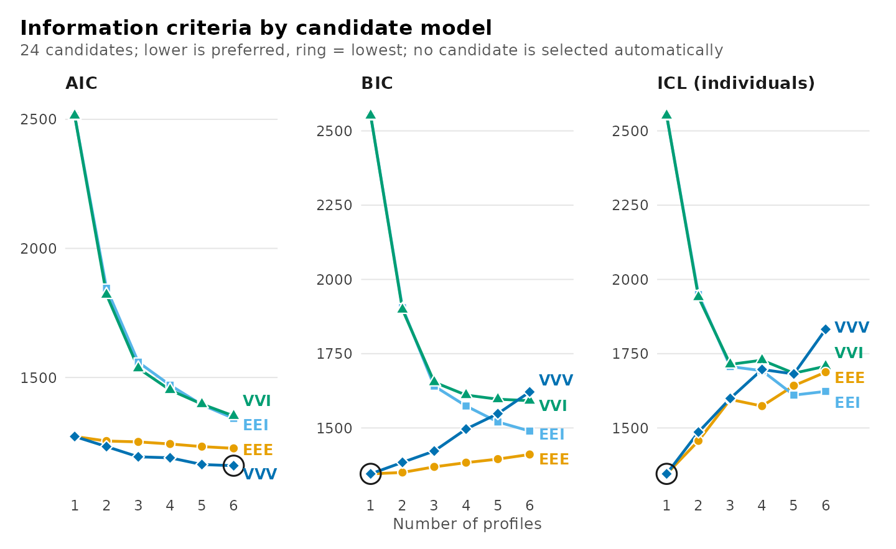
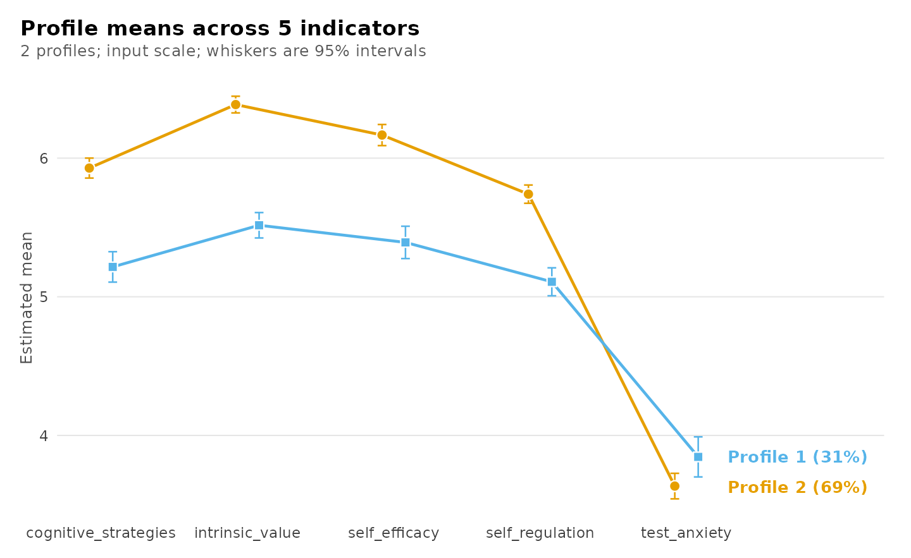
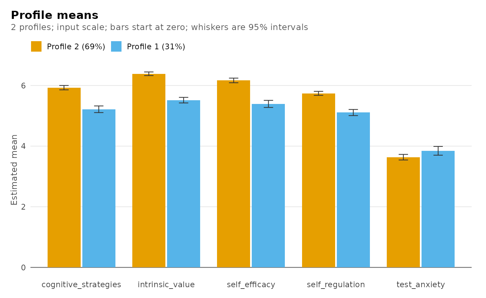
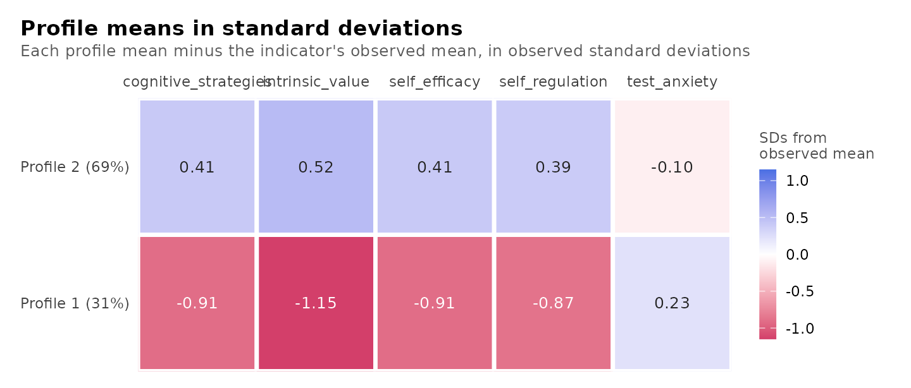
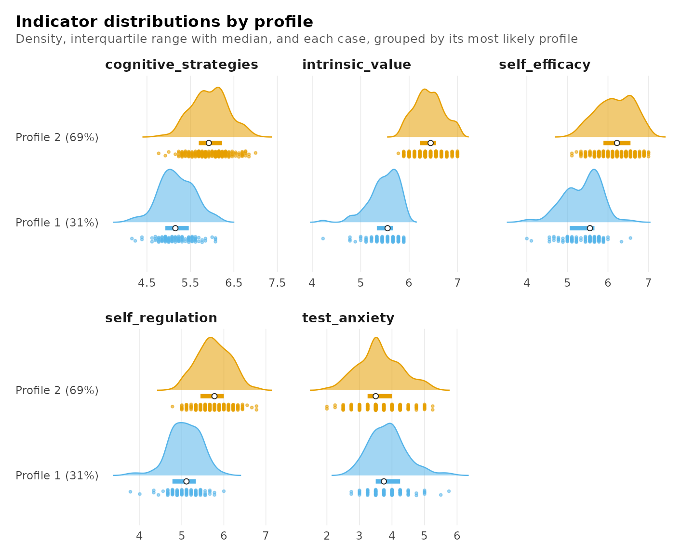
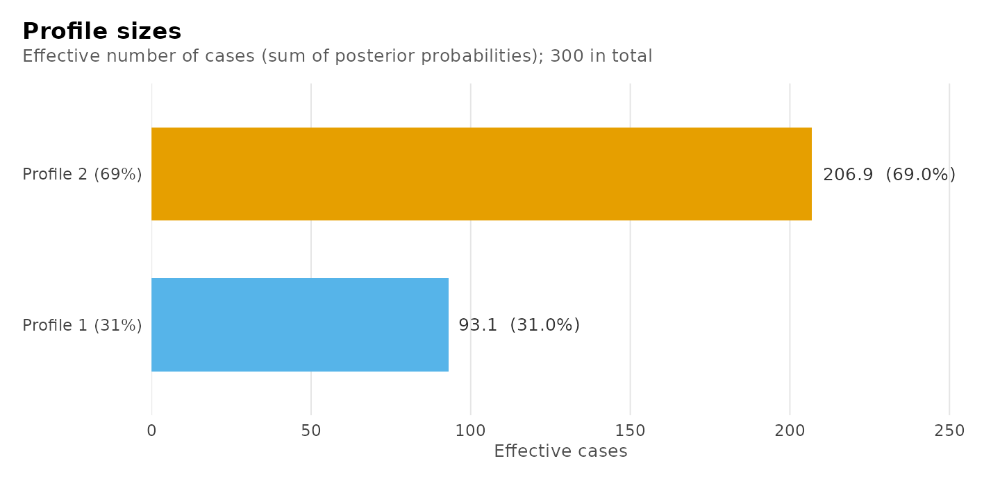
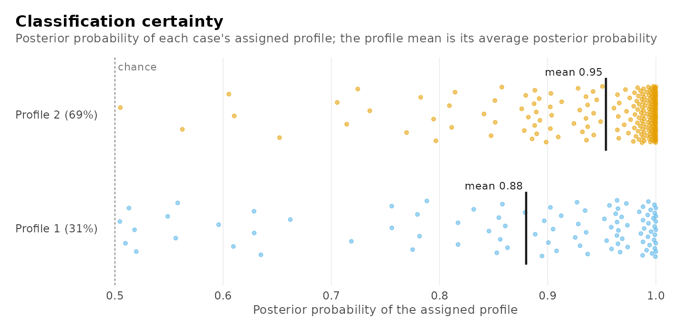
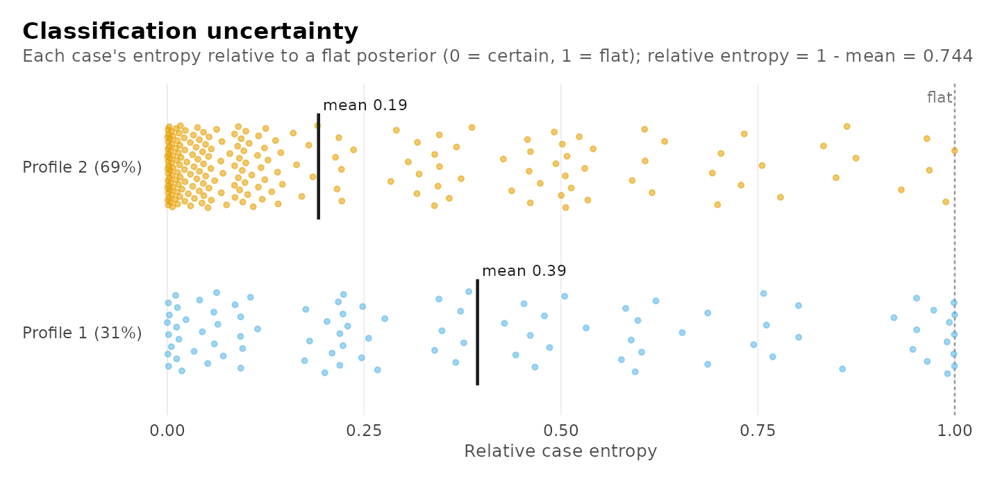
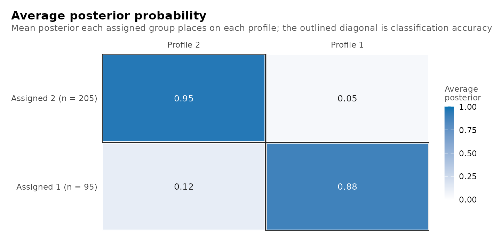

# Latent profile analysis: a complete workflow

Latent profile analysis (LPA) is a mixture model for continuous
indicators. It assumes that the observations come from a small number of
unobserved subpopulations, called profiles, each with its own mean on
every indicator. This vignette presents a complete analysis: description
of the data, selection of the covariance structure and the number of
profiles, estimation, interpretation, and evaluation of the
classification.

``` r

library(latents)
set.seed(1)
```

The estimation uses random starting values, so the seed is set once to
make the results reproducible.

## Data

The `srl` data contain the scores of 300 respondents on five constructs
of the Motivated Strategies for Learning Questionnaire: cognitive
strategy use, intrinsic value, self-efficacy, self-regulation, and test
anxiety. Each score is the mean of the construct’s items on a scale from
1 to 7. The responses were generated by a large language model (GPT) in
a study of how such models answer psychological surveys; they serve here
as a well-structured example and are not evidence about students.

``` r

indicators <- c("cognitive_strategies", "intrinsic_value", "self_efficacy",
                "self_regulation", "test_anxiety")
descriptives(srl, indicators)
#>               variable   n n_missing mean    sd  min  max n_distinct
#> 1 cognitive_strategies 300         0 5.71 0.541 4.15 7.00         34
#> 2      intrinsic_value 300         0 6.12 0.523 4.22 7.00         22
#> 3        self_efficacy 300         0 5.93 0.587 4.00 7.00         25
#> 4      self_regulation 300         0 5.54 0.500 3.78 6.78         25
#> 5         test_anxiety 300         0 3.70 0.644 2.00 5.75         16
```

## Selecting the covariance structure and the number of profiles

A latent profile model must specify, besides the number of profiles, how
the indicators vary within a profile: whether the variances are equal
across profiles or differ between them, and whether the indicators are
allowed to covary within a profile. The four combinations are named by
the volume, shape and orientation of each profile’s covariance matrix,
each equal (`E`) or varying (`V`) across profiles, with `I` for no
covariances (Celeux and Govaert, 1995): `EEI` has equal variances and no
covariances, `VVI` varying variances and no covariances, `EEE` one
covariance matrix shared by all profiles, and `VVV` a covariance matrix
for each profile.
[`enumerate_lpa()`](https://pak.dynasite.org/latents/reference/enumerate_lpa.md)
estimates these four structures with every number of profiles requested.

``` r

models <- enumerate_lpa(srl, indicators, n_profiles = 1:6)
plot(models)
```



The choice of structure matters here because four of the five constructs
are strongly correlated. The structures without covariances (`EEI`,
`VVI`) can reproduce these correlations only by adding profiles, and
their BIC continues to fall up to six profiles. The structures with
covariances account for the correlations directly, and reach far lower
BIC values with one or two profiles. The `EEE` structure attains the
lowest values; its candidates are:

``` r

summary(enumerate_lpa(srl, indicators, n_profiles = 1:6, model = "EEE"))
#> Class enumeration: 6 candidates, 6 converged, 0 failed to fit
#> 2 distinct candidate(s) are minimal under some criterion.
#> No candidate is selected automatically. Choose one convention and keep it.
#> The candidates table shows 9 of its 26 columns; get_results(x, what = "candidates") returns all of them.
#> 
#> -- candidates ------------------------------------------------------
#>  n_profiles log_likelihood n_parameters  aic  bic icl_individual profile_entropy
#>           1         -615.7           20 1271 1345           1345              NA
#>           2         -600.9           26 1254 1350           1457          0.7440
#>           3         -593.1           32 1250 1369           1609          0.6347
#>           4         -583.2           38 1242 1383           1574          0.7710
#>           5         -572.1           44 1232 1395           1642          0.7440
#>           6         -562.8           50 1226 1411           1688          0.7422
#>  converged boundary
#>       TRUE    FALSE
#>       TRUE    FALSE
#>       TRUE    FALSE
#>       TRUE    FALSE
#>       TRUE    FALSE
#>       TRUE    FALSE
#> 
#> -- criteria --------------------------------------------------------
#>  criterion  convention n_profiles n_group_classes model value
#>        aic        <NA>          6               1   EEE  1226
#>        kic        <NA>          6               1   EEE  1279
#>        bic      groups          1               1   EEE  1345
#>        bic individuals          1               1   EEE  1345
#>      sabic      groups          6               1   EEE  1252
#>      sabic individuals          6               1   EEE  1252
#>       caic      groups          1               1   EEE  1365
#>       caic individuals          1               1   EEE  1365
#>        awe      groups          1               1   EEE  1520
#>        awe individuals          1               1   EEE  1520
#>    ... 4 more rows.  get_results(x, what = "criteria")
#> 
#> 2 tables above, truncated to fit. get_results(x, what = ) returns any
#> of them whole, and get_results(x, what = "all") returns every one.
```

The BIC is lowest for one profile, and the two-profile model is 4.7
points higher; the information criteria therefore do not decide between
one and two profiles. The parametric bootstrap likelihood ratio test
compares the two models directly.

``` r

one <- lpa(srl, indicators, n_profiles = 1, model = "EEE")
fit <- lpa(srl, indicators, n_profiles = 2, model = "EEE")
lrt <- bootstrap_lrt(one, fit)
lrt
#> Parametric bootstrap likelihood-ratio comparison
#> Null: 1 profile; alternative: 2 profiles
#> Observed statistic: 29.518785
#> p-value: 0.005 (Monte Carlo SE 0.00499) from 199 of 199 valid replicates
```

The test rejects the one-profile model (p = 0.005), and the two-profile
model with the `EEE` structure is retained.

## Estimation

[`lpa()`](https://pak.dynasite.org/latents/reference/lpa.md) fits a
single-level latent profile model. The fitted model:

``` r

fit
#> Latent profile analysis: 2 profiles
#> 300 observations; equal full residual covariance (EEE)
#> Log likelihood: -600.924999 | AIC: 1253.850 | BIC: 1350.148
#> Converged: TRUE | iterations: 18 | best start: 1/10
#> 
#>  profile cognitive_strategies intrinsic_value self_efficacy self_regulation test_anxiety
#>        1                 5.22            5.52          5.39            5.11         3.85
#>        2                 5.93            6.39          6.17            5.74         3.63
#>  count proportion
#>   93.1       0.31
#>  206.9       0.69
#> 
#> Variances and standard errors: get_results(x, "profiles"). 
#> Every other table: get_results(x, what = ), or get_results(x, "all").
```

## Interpretation of the profiles

The profile plot shows the estimated mean of each profile on each
indicator with its 95% confidence interval.

``` r

plot(fit)
```



The larger profile, comprising 69% of the respondents, has higher means
on cognitive strategy use, intrinsic value, self-efficacy and
self-regulation than the smaller profile, comprising 31%. The two
profiles differ little in test anxiety. The profiles can be described as
high and moderate self-regulated learning. The estimates with their
standard errors:

``` r

get_results(fit, "profiles")
#>    profile            indicator mean variance standard_deviation mean_standard_error
#> 1        1 cognitive_strategies 5.22    0.183              0.427              0.0559
#> 2        1      intrinsic_value 5.52    0.110              0.332              0.0467
#> 3        1        self_efficacy 5.39    0.215              0.464              0.0595
#> 4        1      self_regulation 5.11    0.164              0.405              0.0514
#> 5        1         test_anxiety 3.85    0.404              0.636              0.0737
#> 6        2 cognitive_strategies 5.93    0.183              0.427              0.0368
#> 7        2      intrinsic_value 6.39    0.110              0.332              0.0307
#> 8        2        self_efficacy 6.17    0.215              0.464              0.0389
#> 9        2      self_regulation 5.74    0.164              0.405              0.0336
#> 10       2         test_anxiety 3.63    0.404              0.636              0.0470
#>    variance_standard_error
#> 1                   0.0202
#> 2                   0.0130
#> 3                   0.0223
#> 4                   0.0166
#> 5                   0.0333
#> 6                   0.0202
#> 7                   0.0130
#> 8                   0.0223
#> 9                   0.0166
#> 10                  0.0333
```

The same means as bars with their confidence intervals:

``` r

plot(fit, what = "bars")
```



The heatmap expresses each mean as a distance from the indicator’s grand
mean in standard deviations, which makes the differences comparable
across indicators:

``` r

plot(fit, what = "heatmap")
```



The means summarize distributions. The raincloud plot shows, for the
respondents assigned to each profile, the density of each indicator, a
bar from its first to its third quartile with the median marked, and the
individual scores. It shows how much the profiles overlap on each
indicator: they are well separated on intrinsic value and self-efficacy,
and overlap almost completely on test anxiety.

``` r

plot(fit, what = "raincloud")
```



## Classification quality

The usefulness of a profile solution depends on how accurately the
observations can be assigned to the profiles.
[`diagnostics()`](https://pak.dynasite.org/latents/reference/diagnostics.md)
reports the relative entropy, the size of the smallest profile, the
average posterior probabilities, and the largest residual correlation
within a profile, and draws the four classification plots: the effective
size of each profile (the sum of the posterior probabilities of
belonging to it), the distribution of the posterior probability of each
respondent’s assigned profile, each respondent’s contribution to the
classification entropy, and the average posterior probability matrix, in
which each row contains the respondents assigned to one profile and each
column the average posterior probability they place on each profile.

``` r

diagnostics(fit)
```



    #> Classification quality: 2 profiles
    #> 
    #>   Relative entropy     individuals 0.744
    #>   Smallest class       individuals 93.1 (31.0%)
    #>   Lowest avg posterior individuals 0.880
    #>   Largest residual     0.103  (self_efficacy, self_regulation; profile_1)
    #> 
    #> Tables: get_results(x, what = "entropy" | "classification" | 
    #>         "average_posteriors" | "residuals" | "all"). plot(x) draws them.

A relative entropy of 0.74 and average posterior probabilities of at
least 0.88 indicate an acceptable classification.

## Posterior assignments

`get_results(fit, "assignments")` returns each respondent with the
assigned profile, the posterior probability of every profile, and the
classification uncertainty, in the row order of the data.

``` r

head(get_results(fit, "assignments"))
#>   cognitive_strategies intrinsic_value self_efficacy self_regulation test_anxiety profile
#> 1                 5.31            5.67          5.78            5.33         4.00       1
#> 2                 5.85            6.44          6.00            5.78         4.00       2
#> 3                 6.62            6.67          6.22            6.33         3.25       2
#> 4                 5.69            6.56          6.33            5.56         4.50       2
#> 5                 4.38            5.56          4.89            4.78         4.00       1
#> 6                 4.85            5.44          5.67            5.11         3.50       1
#>   uncertainty posterior_profile_1 posterior_profile_2
#> 1    0.154287            0.845713               0.154
#> 2    0.008309            0.008309               0.992
#> 3    0.005427            0.005427               0.995
#> 4    0.000982            0.000982               0.999
#> 5    0.281467            0.718533               0.281
#> 6    0.103158            0.896842               0.103
```

## Stability across starting values

The likelihood of a mixture model can have several local maxima.
[`sensitivity()`](https://pak.dynasite.org/latents/reference/sensitivity.md)
re-estimates the model with different random seeds and reports the
maximum reached by each run and the proportion of respondents assigned
to the same profile as in the reported solution.

``` r

sensitivity(fit)
#>    seed log_likelihood converged iterations optimum best agreement
#> 1     1           -601      TRUE         18       1 TRUE         1
#> 2     2           -601      TRUE         18       1 TRUE         1
#> 3     3           -601      TRUE         18       1 TRUE         1
#> 4     4           -601      TRUE         18       1 TRUE         1
#> 5     5           -601      TRUE         18       1 TRUE         1
#> 6     6           -601      TRUE         18       1 TRUE         1
#> 7     7           -601      TRUE         18       1 TRUE         1
#> 8     8           -601      TRUE         18       1 TRUE         1
#> 9     9           -601      TRUE         18       1 TRUE         1
#> 10   10           -601      TRUE         18       1 TRUE         1
```

## Further analyses

The profiles can be related to covariates with
[`r3step()`](https://pak.dynasite.org/latents/reference/r3step.md) and
to distal outcomes with
[`three_step()`](https://pak.dynasite.org/latents/reference/three_step.md),
both of which correct for classification error. When the observations
are nested in groups,
[`multilpa()`](https://pak.dynasite.org/latents/reference/multilpa.md)
estimates the two-level model, in which the groups are in addition
grouped into latent classes, and
[`enumerate_classes()`](https://pak.dynasite.org/latents/reference/enumerate_classes.md)
compares its numbers of profiles and group classes; both are presented
in
[`vignette("lpa")`](https://pak.dynasite.org/latents/articles/lpa.md).
The ten other covariance structures, which constrain the shape and
orientation separately, are estimated with
`enumerate_lpa(model = "all")`.

## References

Celeux, G., & Govaert, G. (1995). Gaussian parsimonious clustering
models. *Pattern Recognition*, 28(5), 781–793.
